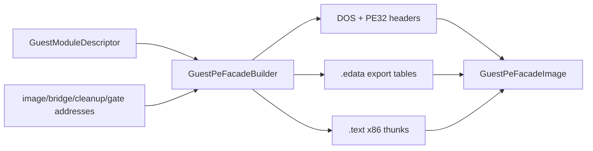

# 작업 342: 게스트 PE32 export facade builder / Task 342: Guest PE32 export facade builder

## 목표 / Objective

작업 341의 `GuestModuleDescriptor`를 실제 guest-visible PE32 DLL file image로 변환하는 플랫폼 중립 `GuestPeFacadeBuilder`를 구현합니다. 생성물은 원본 자산이나 host DLL이 아니라 re2DJ가 process memory에 mapping할 합성 facade이며, DOS/NT header, export directory, 읽기 전용 `.edata`, 실행 가능한 `.text` thunk를 포함합니다.

*Implement a platform-neutral `GuestPeFacadeBuilder` that converts the Task 341 `GuestModuleDescriptor` into a real guest-visible PE32 DLL file image. The result is neither an original asset nor a host DLL; it is a synthetic facade for re2DJ to map into process memory, containing DOS/NT headers, an export directory, read-only `.edata`, and executable `.text` thunks.*



## 입력과 결과 / Inputs and result

`GuestPeFacadeBuildOptions`는 preferred image base, 기존 import bridge 주소, bridge가 기록한 stdcall cleanup byte count 주소와 descriptor 순서에 대응하는 export gate 주소를 받습니다. 모든 값은 host pointer가 아닌 32비트 `GuestAddress`입니다. export gate 수는 descriptor export 수와 정확히 같아야 하고 0 주소는 허용하지 않습니다.

*`GuestPeFacadeBuildOptions` receives the preferred image base, the existing import-bridge address, the address of the stdcall-cleanup byte count written by that bridge, and export-gate addresses in descriptor order. Every value is a 32-bit `GuestAddress`, never a host pointer. The export-gate count must exactly match the descriptor export count, and zero addresses are invalid.*

`GuestPeFacadeImage`는 file-layout bytes, preferred base, `SizeOfImage`, descriptor 순서의 thunk RVA와 facade가 실제 PE EAT에 배정한 ordinal을 소유합니다. stage 343은 이 결과를 mapping한 뒤 `base + thunk_rva`를 `GuestModuleMapping`에 전달합니다. 작업 342는 host memory allocation이나 page protection 변경을 수행하지 않습니다.

*`GuestPeFacadeImage` owns file-layout bytes, the preferred base, `SizeOfImage`, thunk RVAs in descriptor order, and the ordinals actually assigned in the PE EAT. Stage 343 will map this result and pass `base + thunk_rva` into `GuestModuleMapping`. Task 342 performs no host-memory allocation or page-protection changes.*

## PE32 배치 / PE32 layout

- i386 PE32 DLL, section alignment `0x1000`, file alignment `0x200`을 사용합니다.
- header는 `0x200` file bytes 안에 DOS header, `PE\0\0`, COFF header, 224-byte PE32 optional header와 두 section header를 둡니다.
- `.edata`는 export directory, EAT, name pointer table, name ordinal table, module name과 export name을 가지며 read-only initialized-data 특성을 사용합니다.
- `.text`는 descriptor 순서대로 19-byte x86 thunk를 가지며 execute/read code 특성을 사용합니다.
- export data와 thunk raw size는 file alignment로, section RVA와 `SizeOfImage`는 section alignment로 올림합니다. 모든 산술은 overflow와 32비트 범위를 검증합니다.
- relocation/import/entry-point directory는 만들지 않습니다. 절대 bridge·cleanup 주소를 포함하므로 stage 343은 facade를 preferred base에 mapping해야 합니다.

*The image is an i386 PE32 DLL with `0x1000` section alignment and `0x200` file alignment. Its `0x200`-byte header contains the DOS header, `PE\0\0`, COFF header, a 224-byte PE32 optional header, and two section headers. Read-only initialized-data `.edata` contains the export directory, EAT, name-pointer table, name-ordinal table, module name, and export names; execute/read code `.text` contains one 19-byte x86 thunk per descriptor export. Raw sizes and virtual layout are aligned independently with checked 32-bit arithmetic. There is no relocation, import, or entry-point directory, so stage 343 must map the absolute-address-bearing facade at its preferred base.*

## ordinal과 이름 / Ordinals and names

descriptor의 명시적 nonzero ordinal은 그대로 유지합니다. ordinal이 없는 export에는 사용되지 않은 가장 낮은 1 이상 ordinal을 descriptor 순서대로 배정합니다. EAT `Base`는 최솟값이고 `NumberOfFunctions`는 최저~최고 ordinal 범위를 덮으며 gap은 0 RVA로 남깁니다. named export의 pointer/ordinal table은 PE loader의 binary search 계약에 맞춰 bytewise 오름차순으로 정렬하지만 EAT와 thunk 결과는 descriptor 순서를 별도로 보존합니다. embedded NUL, 중복 이름/ordinal, 16비트 ordinal 공간 초과는 거절합니다.

*Explicit nonzero descriptor ordinals are preserved. Exports without an ordinal receive the lowest unused positive ordinal in descriptor order. EAT `Base` is the minimum assigned value, `NumberOfFunctions` spans the minimum through maximum ordinal, and gaps contain zero RVAs. Named-export pointer and ordinal tables are sorted bytewise for the PE loader's binary-search contract, while EAT and result thunk metadata independently preserve descriptor correspondence. Embedded NULs, duplicate names/ordinals, and exhaustion of the 16-bit ordinal space are rejected.*

## thunk 계약 / Thunk contract

각 thunk는 기존 Linux i386 native import bridge와 같은 19-byte sequence를 생성합니다.

```text
push export_gate
call bridge
pop ecx
add esp, dword ptr [cleanup_address]
jmp ecx
```

`call` displacement는 preferred image base와 thunk RVA에서 계산합니다. facade builder는 API 의미나 stack cleanup 값을 결정하지 않습니다. gate가 참조하는 `GuestExportDescriptor`의 handler·calling convention·argument count를 stage 343의 dispatcher 연결이 사용하며, bridge가 반환한 cleanup 값만 thunk가 적용합니다.

*Each thunk emits the same 19-byte sequence as the existing Linux i386 native import bridge: push the export gate, call the bridge, recover the original return address, add the bridge-provided cleanup count to ESP, and jump to the return address. The call displacement is computed from the preferred image base and thunk RVA. The builder does not decide API semantics or cleanup size; stage 343 connects the gate to the descriptor's handler/calling-convention/argument-count metadata, and the thunk only applies the cleanup value produced by the bridge.*

## 검증 / Validation

단위 테스트는 `ReadPeImageInfo`로 PE32/i386/DLL header와 section 특성을 확인하고, 테스트 전용 독립 little-endian parser로 export directory, EAT, 정렬된 name pointer/ordinal table, sparse ordinal gap, 문자열, thunk RVA와 19-byte opcode/immediate를 확인합니다. invalid descriptor/options와 output transactional failure도 검사합니다. Windows x86/x64와 Linux x86/x64 warnings-as-errors build 및 CTest를 실행합니다.

*Unit tests use `ReadPeImageInfo` for PE32/i386/DLL headers and section characteristics, then a test-only independent little-endian parser for the export directory, EAT, sorted name-pointer/ordinal tables, sparse-ordinal gaps, strings, thunk RVAs, and 19-byte opcodes/immediates. Invalid descriptors/options and transactional output failure are also covered. Run warnings-as-errors builds and CTest on Windows x86/x64 and Linux x86/x64.*
