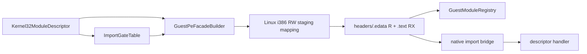

# 작업 343: kernel32 모듈과 Linux i386 facade mapping / Task 343: kernel32 module and Linux i386 facade mapping

## 목표 / Objective

실제 실행에서 확인된 `kernel32` export 네 개를 전용 공용 descriptor로 선언하고, 작업 342의 합성 PE32 facade를 Linux i386 process에 실제 mapping하여 기존 native import bridge로 실행합니다. 이 단계는 facade의 guest-visible module identity와 실행 경계를 확정하지만, 기존 진단 resolver의 pseudo handle과 API별 lookup은 작업 344에서 이관합니다.

*Declare the four `kernel32` exports confirmed by real execution in a dedicated shared descriptor, map the synthetic PE32 facade from Task 342 into the Linux i386 process, and execute it through the existing native import bridge. This stage establishes the facade's guest-visible module identity and execution boundary; Task 344 migrates the existing diagnostic resolver's pseudo handle and per-API lookup.*

## kernel32 descriptor / kernel32 descriptor

`kernel32_module.h/.cpp`는 canonical name `kernel32.dll`, alias `kernel32`와 아래 export를 descriptor 순서로 선언합니다.

*`kernel32_module.h/.cpp` declares canonical name `kernel32.dll`, alias `kernel32`, and the following exports in descriptor order.*

| Export | ABI | 인자 / Arguments | 이번 단계의 반환 / Return in this stage |
|---|---:|---:|---|
| `GetModuleHandleA` | stdcall | 1 | resolver adapter 전까지 null failure / null failure until resolver adapter |
| `GetProcAddress` | stdcall | 2 | resolver adapter 전까지 null failure / null failure until resolver adapter |
| `GetVersion` | stdcall | 0 | 기존 진단값 `0` / existing diagnostic value `0` |
| `CreateFileA` | stdcall | 7 | 기존 진단값 `INVALID_HANDLE_VALUE` / existing diagnostic `INVALID_HANDLE_VALUE` |

null 반환은 성공 stub이 아니라 아직 module/string lookup context가 연결되지 않은 명시적 실패입니다. 작업 344가 registry와 guest string reader를 resolver adapter에 연결합니다. `CreateFileA`는 파일이나 장치를 열지 않으며 guest handle/VFS 의미는 별도 후속 작업입니다.

*The null returns are explicit failures while module/string lookup context is not connected, not success stubs. Task 344 connects the registry and guest-string reader to the resolver adapter. `CreateFileA` opens no file or device; guest-handle/VFS semantics remain a separate follow-up.*

## Linux i386 module set / Linux i386 module set

내부 `NativeGuestModuleSet`은 descriptor export를 기존 `ImportGateTable`에 bind하고 같은 gate 주소를 facade thunk immediate에 기록합니다. 별도 `native_guest_module_image` mapper는 64 KiB 정렬 후보 주소를 순서대로 시험하여 facade를 기존 mapping과 충돌하지 않는 exact address에만 둡니다. hint가 다른 주소로 만족되면 즉시 해제하고 다음 후보를 시도합니다.

*Internal `NativeGuestModuleSet` binds descriptor exports into the existing `ImportGateTable` and writes those same gate addresses into facade-thunk immediates. A dedicated `native_guest_module_image` mapper tries 64-KiB-aligned candidate addresses in order and accepts only an exact address that does not collide with an existing mapping. A mapping satisfied at a different hint address is immediately released before trying the next candidate.*

mapping은 처음에 read/write로만 만들고 header와 section raw bytes를 복사합니다. staging이 끝나면 전체 image를 read-only로 바꾸고 executable section만 read/execute로 다시 보호합니다. writable·executable 상태는 어느 단계에서도 만들지 않습니다. 생성 facade가 writable section을 요구하거나 page alignment 계약을 만족하지 않으면 등록 전에 실패합니다.

*The mapping starts read/write only and receives header and section raw bytes. After staging, the whole image becomes read-only and executable sections are reprotected read/execute. No stage creates writable-and-executable memory. Registration fails before commit if the generated facade requests a writable section or violates page-alignment requirements.*

mapping이 성공하면 `base`, `SizeOfImage`, `base + thunk RVA` 목록을 `GuestModuleRegistry`에 한 번에 등록합니다. gate table도 staging copy를 사용하여 build, mapping, registry 등록 중 하나라도 실패하면 caller 상태를 바꾸지 않습니다. module set 수명 동안 registry와 mapping을 함께 유지하고 destructor에서 mapping을 해제합니다.

*After mapping succeeds, `base`, `SizeOfImage`, and the `base + thunk RVA` list are registered atomically in `GuestModuleRegistry`. The gate table is also staged in a copy so build, mapping, or registry failure leaves caller state unchanged. The module set keeps registry and mappings alive together and releases mappings in its destructor.*

## bridge dispatch / Bridge dispatch

bridge event의 gate address를 module-set binding에서 찾고, descriptor의 argument count만큼 bounded stack word를 복사하여 `ImportCall`을 만듭니다. handler 결과의 EAX/EDX를 bridge result에 복사하고 stdcall이면 `argument_count * 4`, cdecl이면 0을 cleanup byte count로 반환합니다. 알 수 없는 gate, stack 범위 밖 인자 또는 handler 실패는 처리하지 않은 event로 남깁니다.

*The module set finds a bridge event's gate address in its bindings and copies only the descriptor-declared number of bounded stack words into an `ImportCall`. It copies handler EAX/EDX into the bridge result and returns `argument_count * 4` cleanup bytes for stdcall or zero for cdecl. Unknown gates, out-of-range stack arguments, and handler failures remain unhandled events.*

## 검증 / Validation

- 공용 단위 테스트는 module 이름/alias, 네 export 순서·ABI·인자 수와 현재 failure/diagnostic 반환을 확인합니다.
- Linux i386 runtime probe는 facade를 실제 mapping하고 registry base와 export thunk 범위를 확인한 뒤 `GetVersion`과 7-argument `CreateFileA`를 facade 주소로 직접 호출합니다.
- runtime probe는 `/proc/self/maps`에서 header/`.edata`가 read-only, `.text`가 read/execute이며 어느 facade page에도 write+execute가 함께 없음을 확인합니다.
- Windows x86/x64와 Linux x86/x64 공용 build·unit test를 유지하고 Linux i386 runtime probe를 CTest로 실행합니다.

*Shared unit tests verify module name/alias, four-export order, ABI, argument counts, and current failure/diagnostic returns. A Linux i386 runtime probe maps the facade for real, checks the registry base and export-thunk ranges, then directly calls `GetVersion` and seven-argument `CreateFileA` through facade addresses. The probe checks `/proc/self/maps` for read-only headers/`.edata`, read/execute `.text`, and no facade page that is both writable and executable. Windows x86/x64 and Linux x86/x64 shared builds and unit tests remain green, with the Linux i386 runtime probe executed through CTest.*

## 제외 범위 / Out of scope

- `native_create_file_observation.cpp`의 `0x7F000001` 제거와 실제 resolver 이관
- static IAT와 dynamic `GetProcAddress`의 facade address 동일성 검증
- 실제 4th CHD 회귀 실행
- guest handle, VFS, device open 의미
- Linux x64 trampoline 또는 Windows adapter

*Out of scope: removing `0x7F000001` from `native_create_file_observation.cpp` and migrating the real resolver; proving static-IAT/dynamic-`GetProcAddress` facade-address identity; running the real 4th CHD regression; guest-handle/VFS/device-open semantics; and Linux x64 or Windows adapters.*
