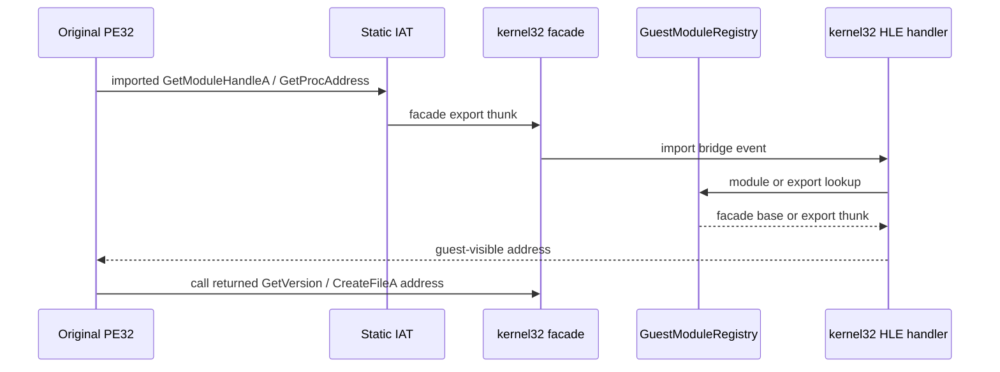

# 작업 344: 게스트 모듈 resolver 합류 설계 / Task 344: Guest module resolver convergence design

## 결정 / Decision

Linux i386 원본 실행 진단에서 `kernel32`의 정적 import와 동적 `GetProcAddress` 결과를 작업 343의 동일한 PE32 facade로 합류시킵니다. `0x7F000001` pseudo handle과 별도 dynamic thunk는 제거하며, `GetModuleHandleA`는 facade image base를, `GetProcAddress`는 `GuestModuleRegistry`에 등록된 export thunk 주소를 반환합니다.

*Converge the static `kernel32` imports and dynamic `GetProcAddress` results in the Linux i386 original-execution diagnostic on the same PE32 facade from Task 343. Remove the `0x7F000001` pseudo handle and separate dynamic thunks; `GetModuleHandleA` returns the facade image base, while `GetProcAddress` returns the export-thunk address registered in `GuestModuleRegistry`.*

## 공용 호출 문맥 / Shared call context

`kernel32_module.cpp`가 Linux 메모리 배치나 host pointer를 직접 알지 않도록 `ImportCall`에 선택적인 `ImportCallServices` 경계를 둡니다. 이 경계는 bounded guest 문자열 읽기와 module/export 조회만 제공합니다. 일반 `ImportDispatcher`처럼 service를 제공하지 않는 호출은 기존처럼 resolver 실패값 0을 반환합니다.

*Add an optional `ImportCallServices` boundary to `ImportCall` so `kernel32_module.cpp` does not know Linux memory layout or host pointers. The boundary exposes only bounded guest-string reads and module/export lookup. Calls without services, including the general `ImportDispatcher`, keep returning the existing resolver failure value zero.*

Linux i386 adapter는 main image와 guest stack으로 검증된 범위에서만 문자열을 읽고, 조회는 `GuestModuleRegistry`로 전달합니다. 이름 pointer 대신 상위 word가 0인 값은 Win32 `GetProcAddress` ordinal 입력으로 해석합니다. 확인되지 않은 module/export는 0을 반환합니다.

*The Linux i386 adapter reads strings only from validated main-image or guest-stack ranges and forwards lookup to `GuestModuleRegistry`. A value whose upper word is zero is interpreted as the Win32 ordinal form of `GetProcAddress`. Unknown modules and exports return zero.*

## 정적 import 재결합 / Static import rebinding

`NativePeSession`은 원본 image를 먼저 mapping한 뒤 facade를 mapping하고, 기존 import parser가 확인한 IAT slot 중 registry에 존재하는 항목을 facade export thunk로 다시 씁니다. 따라서 facade가 없는 import는 기존 process-local thunk를 유지하면서, 등록된 `kernel32` export만 정적·동적 경로가 동일 주소를 사용합니다. 재결합 실패는 원래 thunk로 조용히 후퇴하지 않고 실행 준비 실패로 처리합니다.

*After mapping the original image, `NativePeSession` maps the facade and rewrites parsed IAT slots that exist in the registry to facade export thunks. Imports without a facade retain their existing process-local thunks, while registered `kernel32` exports use one address for static and dynamic paths. A rebinding error fails preparation instead of silently falling back to the original thunk.*

### 구현에서 바꾼 것 — 재결합 주체 / Changed during implementation — who rebinds

설계는 `NativePeSession`이 facade를 mapping하고 재결합까지 수행하도록 썼다. 구현에서는 `RunConfiguredNativePeInProcess`에 session 준비 직후 호출되는 `NativePeSessionSetup` 콜백을 두고, 진단 쪽이 facade 등록과 재결합을 수행하도록 바꿨다.

근거는 두 가지다. `NativePeSession`은 facade를 모르는 범용 PE32 session이며, 여기에 `kernel32` 정책을 넣으면 facade를 쓰지 않는 기존 helper 경로까지 그 정책을 지고 간다. 그리고 어떤 module을 등록할지는 진단마다 다르므로, 결정 지점을 호출자에 두는 편이 module 확장에 맞는다.

대가로 `NativePeSession`이 `mutable_gates()`와 `mutable_import_thunks()`를 노출한다. 준비 단계에서만 쓰이는 경계이며, 콜백이 실패를 반환하면 설계대로 실행 준비 자체가 실패하고 원래 thunk로 후퇴하지 않는다.

*The design had `NativePeSession` map the facade and rebind. The implementation instead adds a `NativePeSessionSetup` callback to `RunConfiguredNativePeInProcess`, invoked right after the session is prepared, and the diagnostic performs facade registration and rebinding.*

*Two reasons. `NativePeSession` is a general PE32 session that knows nothing about facades, and putting `kernel32` policy inside it would make the existing helper paths that use no facade carry that policy too. Which modules to register also differs per diagnostic, so keeping the decision in the caller suits module expansion.*

*The cost is that `NativePeSession` exposes `mutable_gates()` and `mutable_import_thunks()`. Both are preparation-time boundaries, and a callback that returns failure still fails execution preparation rather than falling back to the original thunk, as the design requires.*
## 관찰 경계 / Observation boundary

`native_create_file_observation.cpp`는 resolver 정책을 소유하지 않습니다. 이 파일은 registry에서 얻은 `CreateFileA` gate만 관찰하여 일곱 인자와 caller return address를 기록하고, 기존과 같이 복귀 지점의 `INT3`에서 실행을 제한합니다. 실제 4th CHD에서는 다음을 함께 확인합니다.

*`native_create_file_observation.cpp` no longer owns resolver policy. It observes only the registry-derived `CreateFileA` gate, records the seven arguments and caller return address, and bounds execution at the return-site `INT3` as before. The real 4th CHD regression confirms all of the following together:*

- `GetModuleHandleA("kernel32")` 결과가 실제 facade base입니다.
- `GetProcAddress`의 `GetVersion` 및 `CreateFileA` 결과가 registry export 주소와 같습니다.
- 정적 IAT 재결합 주소와 같은 export의 동적 조회 주소가 같습니다.
- `CreateFileA("\\\\.\\NTICE", ...)`가 7개 인자 `__stdcall` cleanup으로 복귀합니다.

*The module handle is the real facade base; both dynamic export results equal their registry entries; static rebinding and dynamic lookup share the same export address; and `CreateFileA("\\\\.\\NTICE", ...)` returns with seven-argument `__stdcall` cleanup.*

## 디렉터리 배치 / Directory placement

작업 343에서 추가된 facade mapper, module set, probe는 Linux i386에서만 컴파일되고 x86 호출 규약을 직접 실행하므로 `src/platform/linux/x86/`으로 옮깁니다. 기존 Linux platform 전체 재배치는 별도 TODO로 유지합니다.

*Move the facade mapper, module set, and probe added in Task 343 to `src/platform/linux/x86/` because they compile only for Linux i386 and directly execute the x86 calling convention. The broader migration of existing Linux platform files remains a separate TODO.*

## 범위 밖 / Out of scope

`CreateFileA`의 실제 guest handle/VFS 의미, 다른 DLL facade, Linux x64 compatibility-mode trampoline, Windows WoW64 adapter는 이번 작업에 포함하지 않습니다.

*Actual guest-handle/VFS semantics for `CreateFileA`, other DLL facades, the Linux x64 compatibility-mode trampoline, and the Windows WoW64 adapter are outside this task.*
