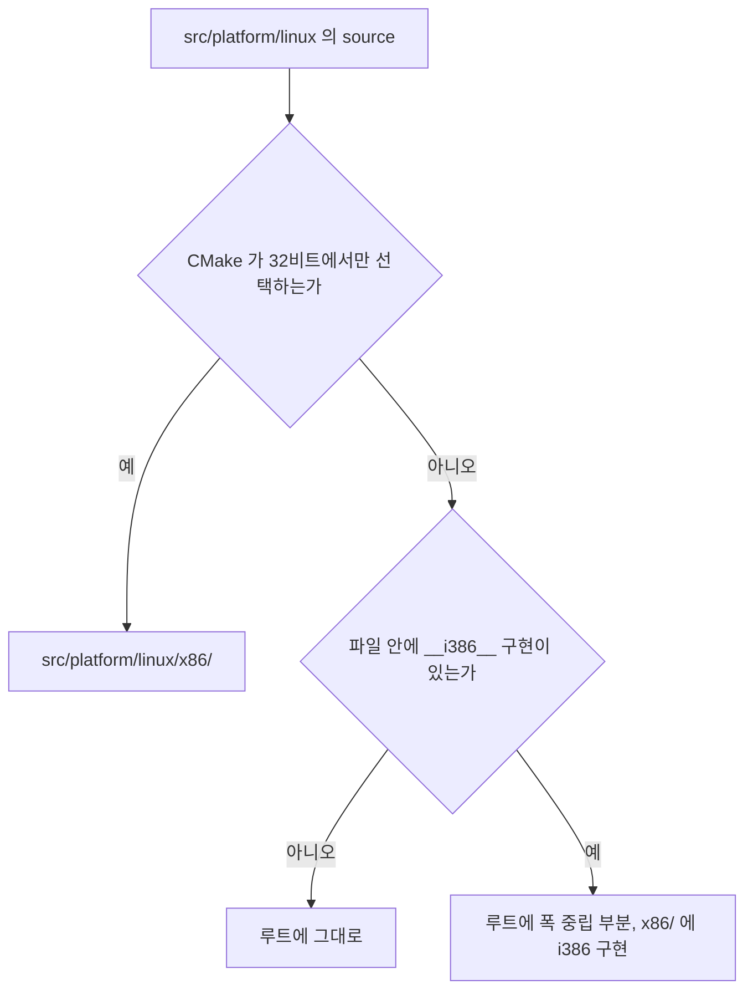

# 작업 345 설계 — Linux 플랫폼 비트 폭 분리 / Task 345 design — Splitting the Linux platform tree by bit width

선행: [작업 347 플랫폼 비트 폭 디렉터리 규칙](20260921-347-platform-architecture-directories.md)

## 결정 / Decision

작업 347이 정의한 규칙을 `src/platform/linux/`에 적용한다. i386 host에서만 컴파일되는 구현을 `src/platform/linux/x86/`로 옮기고, x86·x64 양쪽에서 빌드되는 코드만 루트에 남긴다. 작업 344가 facade mapper·module set·probe 셋을 먼저 옮겨 둔 상태이므로 이번 작업이 나머지를 맞춘다.

*Apply the Task 347 rule to `src/platform/linux/`: move implementations compiled only for an i386 host into `src/platform/linux/x86/`, leaving only code that builds on both widths at the root. Task 344 already moved the facade mapper, module set, and probe, so this task brings the rest in line.*

## 분류 근거 — CMake가 정한다 / Classification basis — CMake decides it

규칙은 "CMake가 한 비트 폭에서만 source를 선택하면 하위 디렉터리 대상"이라고 정한다. 따라서 파일을 읽고 판단하는 대신 CMake의 선택 조건을 근거로 삼는다. 이 방식은 사람의 인상이 아니라 빌드가 실제로 하는 일을 따른다.

Linux source가 놓인 가드는 둘뿐이다.

* `CMAKE_SIZEOF_VOID_P EQUAL 4` — 제품 host가 32비트일 때만.
* `RE2DJ_BUILD_LINUX_NATIVE_HELPER` — i386 helper 빌드. `CMakeLists.txt`가 Linux·32비트가 아니면 `FATAL_ERROR`로 거부하므로 이 역시 i386 전용이다.

둘 중 하나에만 속하면 `x86/` 대상이고, 어느 가드에도 없으면 루트에 남는다.

*The rule makes CMake's selection the criterion, so classification follows what the build actually does rather than a reading of each file. Linux sources sit under only two guards: `CMAKE_SIZEOF_VOID_P EQUAL 4`, and `RE2DJ_BUILD_LINUX_NATIVE_HELPER`, which `CMakeLists.txt` rejects with `FATAL_ERROR` unless the build is Linux and 32-bit. A file under either guard is i386-only and moves; a file under neither stays.*

## 이동 대상 / What moves

| 파일 | 근거 |
| --- | --- |
| `native_dynamic_thunk.cpp/.h` | 32비트 가드 |
| `native_fault_observation.cpp/.h` | 32비트 가드 |
| `native_import_bridge.cpp/.h` | 32비트 가드, helper 빌드 |
| `native_import_thunks.cpp/.h` | 32비트 가드, helper 빌드 |
| `native_in_process_probe.cpp` | 32비트 가드 |
| `native_in_process_runner.cpp/.h` | 32비트 가드 |
| `native_pe_image.cpp/.h` | 32비트 가드, helper 빌드 |
| `native_pe_session.cpp/.h` | 32비트 가드, helper 빌드 |
| `native_process_bootstrap.cpp/.h` | 32비트 가드, helper 빌드 |
| `native_ipc_helper.cpp`, `native_ipc_helper_main.cpp/.h` | helper 빌드 전용 |

## 루트에 남는 것 / What stays

| 파일 | 근거 |
| --- | --- |
| `native_helper_backend.cpp` | 두 폭 모두에서 빌드. x64 host가 i386 helper를 구동하는 경계다 |
| `native_ipc_host_probe.cpp` | 두 폭 모두 |
| `native_ipc_capability_rejection_helper.cpp` | 두 폭 모두 |
| `native_create_file_observation.cpp` | 두 폭 모두. 아래 참조 |
| `original_runner.cpp` | 두 폭 모두. 아래 참조 |

## 파일 안의 `#if`를 어떻게 다루는가 / Handling in-file `#if`

`native_create_file_observation.cpp`(413줄, `__i386__` 3건)와 `original_runner.cpp`(538줄, 5건)는 두 폭 모두에서 컴파일되지만 본문이 `__i386__`로 갈린다. 규칙은 "한 파일 안의 대규모 `#if`로 두 구현을 섞지 않는다"고 한다.

그러나 이 두 파일의 `#if`는 두 구현을 섞는 형태가 아니라 **x64에서 기능 미지원을 반환하는 짧은 대체 경로**다. 즉 루트에 남아야 할 공개 진입점 하나와, i386에서만 의미가 있는 본문 하나로 되어 있다.

이번 작업은 이 둘을 **분리하지 않는다.** 분리하면 공개 선언과 구현 사이에 adapter 계층이 하나 더 생기는데, 그 경계는 Linux x64 compatibility-mode trampoline이 생길 때 실제 필요에 맞춰 정하는 편이 낫다. 지금 미리 나누면 근거 없는 모양을 먼저 고정하게 된다. 두 파일은 루트에 남기고, 분리는 x64 경로가 생길 때 그 작업에서 한다.

*Both files compile on either width while their bodies branch on `__i386__`, and the rule warns against mixing two implementations behind large `#if` blocks. These blocks are not two implementations, though: they are a short unsupported-path return for x64 behind one public entry point that must stay at the root. This task therefore does not split them. Splitting now would add an adapter layer whose boundary is better decided when the Linux x64 compatibility-mode trampoline actually exists; fixing that shape in advance would be guesswork. They stay at the root and are split by the task that introduces the x64 path.*

## 포함 경로 / Include paths

옮긴 파일끼리의 참조는 `x86/` 안에서 상대 경로를 유지한다. 루트에 남은 파일이 옮긴 헤더를 참조하면 `x86/` 접두사를 붙인다. 작업 344가 `native_create_file_observation.cpp`에서 `"x86/native_guest_module_set.h"`를 이미 그렇게 쓰고 있으므로 같은 형태를 따른다.

`include/re2dj/platform/linux/`의 두 공개 헤더는 옮기지 않는다. `native_helper_backend.h`와 `original_runner.h`는 두 폭 모두에서 포함되는 인터페이스이며, 규칙이 "비트 폭 공용 인터페이스와 adapter 선언은 상위 `<os>/`에 둔다"고 정한 그대로다.

*References among moved files keep relative paths inside `x86/`. A file that stays at the root and includes a moved header gains the `x86/` prefix, following the form Task 344 already uses. The two public headers under `include/re2dj/platform/linux/` do not move: they are interfaces included on both widths, exactly what the rule keeps in the parent directory.*

## 범위 밖 / Out of scope

`src/platform/windows/`는 이번 작업에 넣지 않는다. CMake가 참조하는 Windows platform source 34개가 **전부** Win32 x86 전용이므로, 규칙을 그대로 적용하면 루트가 비고 트리 전체가 한 단계 내려간다. 그것이 옳은 결과인지, 아니면 일부가 x64 host에서도 빌드될 폭 중립 코드인지는 파일 단위 판단이 필요하고 58개 파일에 걸친다. Linux와 성격이 다른 문제이므로 별도 작업으로 둔다.

동작 변경, 기능 추가, `#if` 분리, Windows x64 host 확장은 포함하지 않는다.

*`src/platform/windows/` is excluded. All 34 Windows platform sources CMake references are Win32 x86-only, so applying the rule literally empties the root and moves the whole tree down one level. Whether that is the right outcome, or whether some of it is width-neutral code that a future x64 host would also build, needs a per-file judgment across 58 files. That is a different problem from Linux and belongs to its own task. No behavior change, no new features, no `#if` splitting, and no Windows x64 host expansion.*
