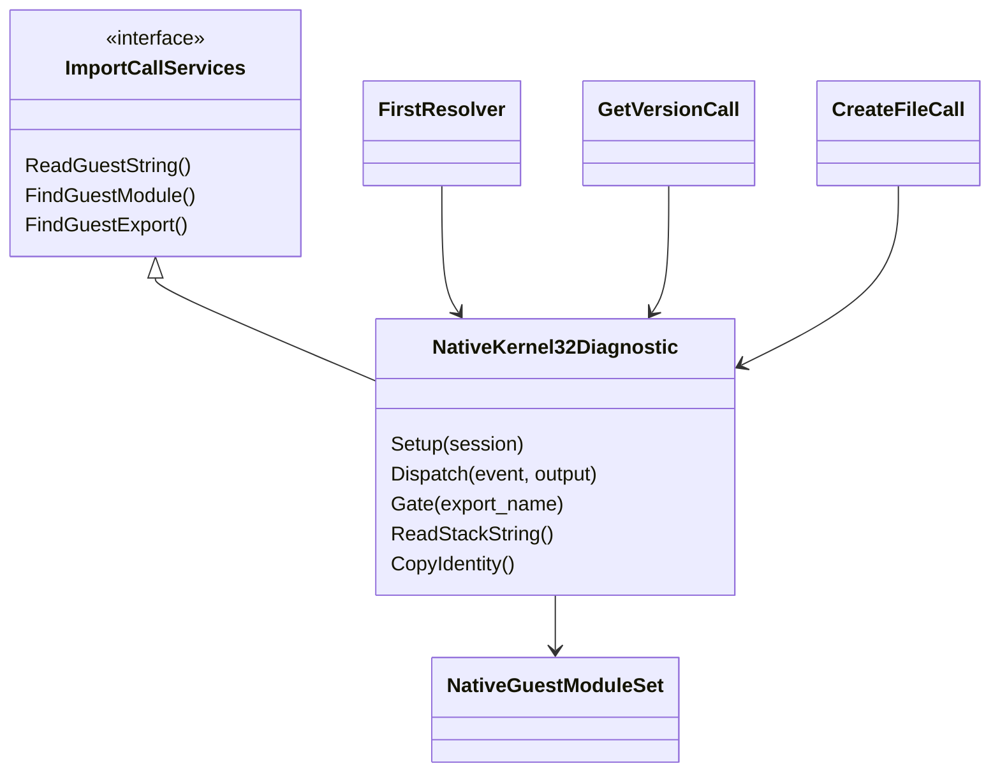
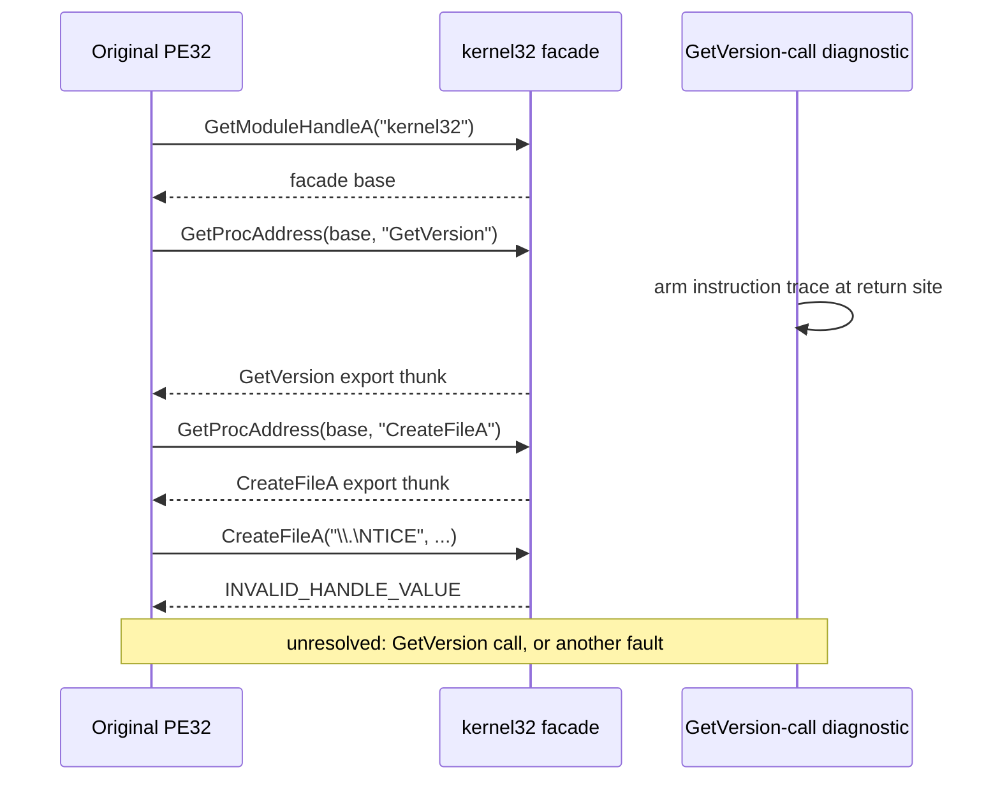

# 작업 348: 앞선 resolver 진단의 facade 합류 설계 / Task 348: Early resolver diagnostics convergence design

선행: [작업 344 설계](20260922-344-guest-module-resolver-convergence.md), [작업 344 작업 로그](../work-logs/20260922-344-guest-module-resolver-convergence.md)

## 결정 / Decision

`original_runner.cpp`의 두 진단 `RunOriginalInProcessFirstResolver`(`--linux-in-process-first-resolver`)와 `RunOriginalInProcessGetVersionCall`(`--linux-in-process-getversion-call`)을 작업 344의 `CreateFileA` 진단과 같은 `kernel32` PE32 facade와 `GuestModuleRegistry` 경로로 옮깁니다. 두 진단에서 `0x7F000001` pseudo handle, 첫 `"kernel32"` 인자를 가진 임의 gate에 응답하던 분기, 진단 전용 `GetVersion` dynamic thunk(`0xF1000001`)를 제거합니다.

*Move the two diagnostics in `original_runner.cpp`, `RunOriginalInProcessFirstResolver` (`--linux-in-process-first-resolver`) and `RunOriginalInProcessGetVersionCall` (`--linux-in-process-getversion-call`), onto the same `kernel32` PE32 facade and `GuestModuleRegistry` path that Task 344 gave the `CreateFileA` diagnostic. Remove from both the `0x7F000001` pseudo handle, the branch that answered any gate whose first argument was `"kernel32"`, and the diagnostic-only `GetVersion` dynamic thunk (`0xF1000001`).*

진단은 resolver 정책을 소유하지 않습니다. 모든 gate는 facade module set이 처리하고, 각 진단은 자기가 제한할 gate 하나만 골라 caller 복귀 지점에 `INT3`를 둡니다.

*Diagnostics no longer own resolver policy. The facade module set handles every gate, and each diagnostic picks only the one gate it bounds and places an `INT3` at that caller's return site.*

## 공용 진단 문맥 추출 / Extracting the shared diagnostic context

작업 344의 `CreateFileContext`는 세 가지를 한 구조체에 담고 있습니다. `ImportCallServices` 구현(bounded guest 문자열, module/export 조회), session 준비 콜백(facade 등록과 정적 IAT 재결합), 그리고 identity 관측(registry 값, 게스트가 받은 값, 정적 slot 되읽기)입니다. 세 진단이 이 전부를 똑같이 필요로 하므로, 이를 `src/platform/linux/x86/native_kernel32_diagnostic.{h,cpp}`의 `NativeKernel32Diagnostic`으로 추출합니다. 각 진단 파일에는 자기 경계를 판정하는 handler와 결과 변환만 남습니다.

*Task 344's `CreateFileContext` bundles three things in one struct: the `ImportCallServices` implementation (bounded guest strings, module/export lookup), the session setup callback (facade registration and static IAT rebinding), and identity observation (registry values, guest-received values, static-slot read-back). All three diagnostics need exactly this, so extract it as `NativeKernel32Diagnostic` in `src/platform/linux/x86/native_kernel32_diagnostic.{h,cpp}`. Each diagnostic file keeps only the handler that decides its own boundary and the result conversion.*

`x86/`에 두는 이유는 host 32비트 pointer로 guest 주소를 직접 역참조하고, `CMAKE_SIZEOF_VOID_P EQUAL 4`에서만 빌드되는 `native_guest_module_set`에 의존하기 때문입니다. 게스트 PE32를 다룬다는 이유가 아닙니다.

*It belongs under `x86/` because it dereferences guest addresses directly as host 32-bit pointers and depends on `native_guest_module_set`, which builds only under `CMAKE_SIZEOF_VOID_P EQUAL 4` — not because it handles guest PE32 data.*

## 진단별 경계 / Per-diagnostic boundaries

| 진단 | 이전 | 이후 |
| --- | --- | --- |
| first resolver | `"kernel32"` 인자에 `0x7F000001`, `GetProcAddress(…, "GetVersion")`에 EAX=1을 돌려주고 그 복귀 지점에서 제한 | `GetProcAddress` facade gate에서 이름이 `GetVersion`인 첫 호출의 복귀 지점에 `INT3`. 반환값은 registry가 준 실제 export thunk |
| GetVersion call | 같은 pseudo handle, `GetVersion`에 진단 전용 dynamic thunk. `CreateFileA` 요청은 처리하지 않아 0 반환 | `GetProcAddress(…, "GetVersion")` 복귀 지점에서 instruction trace를 켜고, `GetVersion` facade gate의 첫 호출 복귀 지점에서 제한 |
| CreateFileA call | 작업 344 경로 | 동작 불변. 공용 문맥으로 옮김 |

*First resolver: previously answered the `"kernel32"` argument with `0x7F000001` and `GetProcAddress(…, "GetVersion")` with EAX=1, then bounded at that return site. Now it places an `INT3` at the return site of the first `GetProcAddress` facade-gate call whose name is `GetVersion`, and the returned value is the real export thunk from the registry.*

*GetVersion call: previously used the same pseudo handle and a diagnostic-only dynamic thunk for `GetVersion`, and returned zero for the unhandled `CreateFileA` request. Now it arms the instruction trace at the `GetProcAddress(…, "GetVersion")` return site and bounds at the return site of the first call through the `GetVersion` facade gate.*

*CreateFileA call: behavior unchanged; moved onto the shared context.*

### GetVersion call 진단의 의미 변화 / Semantic change in the GetVersion-call diagnostic

작업 338은 이 진단의 null read가 처리되지 않은 `CreateFileA` resolver 요청의 0 반환에서 비롯됨을 확인했습니다. facade는 이제 `CreateFileA`를 해석하므로, 게스트는 그 null read를 지나 `CreateFileA("\\.\NTICE")`를 호출하고 facade가 돌려준 `INVALID_HANDLE_VALUE`로 계속 진행합니다. 그 이후 `GetVersion`을 호출하는지, 다른 fault로 멈추는지는 **미확정**이며 이 작업의 실제 4th CHD 실행으로 관측합니다. 설계는 결과를 미리 가정하지 않습니다.

*Task 338 established that this diagnostic's null read came from the zero returned for the unhandled `CreateFileA` resolver request. The facade now resolves `CreateFileA`, so the guest passes that null read, calls `CreateFileA("\\.\NTICE")`, and continues with the facade's `INVALID_HANDLE_VALUE`. Whether it then calls `GetVersion` or stops at another fault is **unresolved** and is observed by this task's real 4th CHD run. The design assumes neither outcome.*

기존 `unhandled_dynamic_request` 필드는 `CreateFileA`라는 고정 문자열을 기록했습니다. 이 의미를 "registry가 해석하지 못한 첫 `GetProcAddress` 요청"으로 일반화하고, 이름 요청은 이름을, ordinal 요청은 `#<n>`을 기록합니다. 그리고 facade에 없는 정적 import gate가 호출되면 bridge가 EAX=0, cleanup 0으로 조용히 복귀하므로, 그 첫 gate의 `module!name`을 `unhandled_import`로 따로 기록합니다. 두 값 모두 관측된 것만 기록하고, 없으면 비워 둡니다.

*The existing `unhandled_dynamic_request` field recorded the fixed string `CreateFileA`. Generalize it to "the first `GetProcAddress` request the registry could not resolve", recording the name for a by-name request and `#<n>` for an ordinal. And because the bridge silently returns EAX=0 with zero cleanup when a static import gate outside the facade is called, record that first gate's `module!name` separately as `unhandled_import`. Both are recorded only when observed and are otherwise empty.*

## identity 결과의 공용화 / Sharing the identity result

작업 344는 identity 필드를 `OriginalCreateFileObservation` 안에 두었습니다. 세 진단이 모두 같은 identity를 보고하도록 이 필드들을 새 `OriginalResolverIdentity`로 옮기고 `OriginalRunResult::resolver_identity`에 둡니다. 게스트가 받은 값은 여전히 resolver가 실제로 반환할 때만 기록하고 준비 단계에서 미리 채우지 않습니다. CLI는 세 진단 모두 같은 identity 출력을 사용합니다.

*Task 344 kept the identity fields inside `OriginalCreateFileObservation`. Move them into a new `OriginalResolverIdentity` held at `OriginalRunResult::resolver_identity` so all three diagnostics report the same identity. Guest-received values are still recorded only when the resolver actually returns them and are never pre-seeded. The CLI prints the same identity block for all three.*

`registry_get_version`도 함께 노출합니다. 작업 344는 이를 준비 단계에서 얻었지만 결과로 내보내지 않았습니다.

*Also expose `registry_get_version`, which Task 344 captured during preparation but never reported.*

## 구현에서 더한 것 — trace와 진단 INT3의 충돌 / Added during implementation — trace versus diagnostic INT3

GetVersion-call 진단이 처음으로 `GetVersion` 호출에 실제로 도달하자, 진단이 복귀 지점에 둔 `INT3`가 SIGTRAP 경계가 되지 못하고 guest가 복귀 주소 +2에서 SIGSEGV로 멈췄다. 원인은 이렇다. import bridge는 handler가 돌아온 뒤 `ResumeNativeInstructionTrace`로 같은 복귀 지점에 trace breakpoint를 다시 건다. 이때 이미 진단이 써 둔 `0xCC`를 "원래 바이트"로 저장한다. 복귀하면 trace가 그 `0xCC`를 되돌려 쓰고 single-step을 시작하며, 두 번째로 실행되는 `0xCC`는 trace frame으로 소비된다. 그 결과 실행이 명령 경계를 벗어나 계속된다. 이전 경로는 `GetVersion` 호출 전에 멈췄으므로 이 상호작용이 드러난 적이 없었다.

`StopNativeInstructionTrace()`를 추가했다. frame 한도 도달과 같은 방식으로 trace를 끝내되 그때까지의 frame은 보존하고, 걸려 있는 trace breakpoint가 있으면 원래 바이트를 되돌린다. 진단은 `GetVersion` gate에서 `INT3`를 두기 전에 이를 호출한다. 이 규칙은 trace와 자체 `INT3`를 함께 쓰는 모든 진단에 적용된다.

*When the GetVersion-call diagnostic first actually reached the `GetVersion` call, the `INT3` it placed at the return site did not become a SIGTRAP boundary; the guest instead stopped with SIGSEGV at return+2. The import bridge calls `ResumeNativeInstructionTrace` after the handler returns, re-arming a trace breakpoint at the same return site and saving the diagnostic's `0xCC` as the "original byte". On return the trace writes that `0xCC` back and starts single-stepping, and the second execution of `0xCC` is consumed as a trace frame, so execution runs on off the instruction boundary. The earlier path stopped before any `GetVersion` call, so this interaction never surfaced.*

*Added `StopNativeInstructionTrace()`. It ends the trace the way reaching the frame limit does, keeping the frames collected so far and restoring the original byte of any pending trace breakpoint. The diagnostic calls it before placing its `INT3` at the `GetVersion` gate. The rule applies to any diagnostic that combines the trace with its own `INT3`.*

같은 작업에서 두 가지를 더했다. `kGetVersionCalled` 경계에서도 instruction trace를 출력해 호출에 이르는 경로를 증거로 남기고, 경계 판정 실패 메시지에 `interrupted`, `resolved`, `called`, 복귀 주소, signal, EIP, exit code를 담았다.

*Two further additions: the CLI now prints the instruction trace at the `kGetVersionCalled` boundary as well, preserving the path to the call as evidence, and the boundary-failure message now carries `interrupted`, `resolved`, `called`, the return address, signal, EIP, and exit code.*

## 범위 밖 / Out of scope

* `GetVersion` handler의 OS 버전 의미. 현재 handler는 0을 반환하며, 이 진단은 호출 여부와 ABI만 제한합니다.
* facade에 없는 정적 import의 HLE. 이 작업은 첫 미처리 gate를 기록할 뿐 처리하지 않습니다.
* `RunOriginalInProcessFirstImport`. 이 진단은 첫 import의 caller 복귀 ABI만 보며 resolver identity를 쓰지 않습니다.

*Out of scope: `GetVersion` OS-version semantics (the handler returns zero; this diagnostic bounds only the call and its ABI); HLE for static imports outside the facade (this task records the first unhandled gate without handling it); and `RunOriginalInProcessFirstImport`, which observes only first-import caller-return ABI and uses no resolver identity.*

## 검증 전략 / Verification strategy

* Windows x86 Debug, Linux i386(`linux-x86-debug`), Linux x64(`linux-x64-debug`) 빌드와 단위 테스트.
* Linux i386 `re2dj_linux_native_guest_module_probe`와 `re2dj_linux_native_in_process_probe` 종료 코드 0.
* 실제 4th CHD(읽기 전용)로 세 진단을 실행합니다.
  * `--linux-in-process-createfile-call`: 작업 344와 같은 identity(`0x6f000000`, `0x6f002039`, `0x6f002026`)와 `\\.\NTICE` 경계가 재현되는지.
  * `--linux-in-process-first-resolver`: 기존 caller 복귀 `0x00af0b99`, SIGTRAP EIP `0x00af0b9a`가 유지되고, 게스트가 받은 `GetVersion` 주소가 registry 값과 일치하는지.
  * `--linux-in-process-getversion-call`: 도달한 경계, fault context, instruction trace, 미처리 요청을 관측한 그대로 기록합니다.
* 결과를 `docs/analysis/ez2dj4th-linux-inprocess-first-import.md`에 확인됨/미확정으로 구분해 반영합니다.

*Verification: Windows x86 Debug, Linux i386 (`linux-x86-debug`), and Linux x64 (`linux-x64-debug`) builds and unit tests; Linux i386 `re2dj_linux_native_guest_module_probe` and `re2dj_linux_native_in_process_probe` exit zero; and all three diagnostics run against the read-only real 4th CHD. The CreateFileA diagnostic must reproduce Task 344's identity (`0x6f000000`, `0x6f002039`, `0x6f002026`) and the `\\.\NTICE` boundary. The first-resolver diagnostic must keep caller return `0x00af0b99` and SIGTRAP EIP `0x00af0b9a`, with the guest-received `GetVersion` address matching the registry. The GetVersion-call diagnostic's boundary, fault context, instruction trace, and unhandled requests are recorded exactly as observed. Results go into `docs/analysis/ez2dj4th-linux-inprocess-first-import.md`, separated into confirmed and unresolved.*
