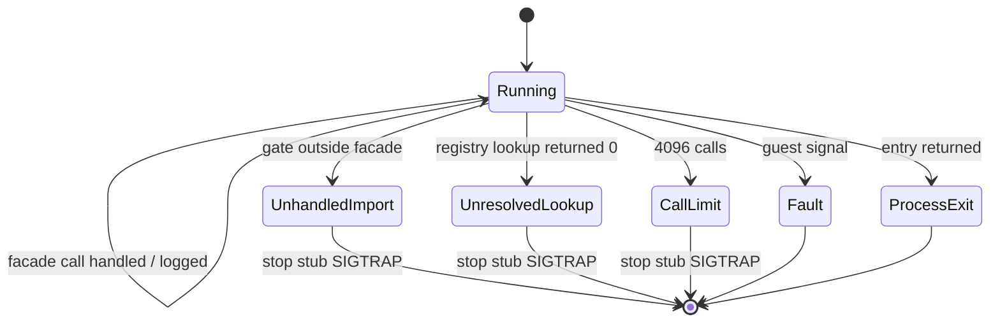

# 작업 349: Linux i386 in-process 연속 실행 진단 설계 / Task 349: Linux i386 in-process continuation diagnostic design

선행: [작업 348 설계](20260923-348-early-resolver-diagnostics-convergence.md), [작업 348 작업 로그](../work-logs/20260923-348-early-resolver-diagnostics-convergence.md)

## 결정 / Decision

API 하나마다 전용 진단을 만드는 대신, 원본을 `kernel32` facade 위에서 **처음으로 처리할 수 없는 지점까지** 계속 실행하고 그 사이의 API 호출을 순서대로 기록하는 진단 `--linux-in-process-continue`를 추가합니다. 멈추는 조건은 네 가지입니다.

*Instead of a dedicated diagnostic per API, add `--linux-in-process-continue`, which runs the original on the `kernel32` facade **until the first point it cannot handle** and records the API calls along the way in order. It stops on one of four conditions.*

| 경계 | 조건 |
| --- | --- |
| `kContinuationUnhandledImport` | facade에 없는 정적 import gate가 호출됨 |
| `kContinuationUnresolvedLookup` | `GetProcAddress`가 0을 반환함(module handle이 0인 경우 포함) |
| `kContinuationFault` | 진단이 둔 정지 지점이 아닌 guest fault |
| `kContinuationCallLimit` | API 호출이 4096회에 도달함 |

*Boundaries: `kContinuationUnhandledImport` when a static import gate outside the facade is called; `kContinuationUnresolvedLookup` when `GetProcAddress` returns zero, including for a null module handle; `kContinuationFault` for a guest fault other than the diagnostic's own stop point; `kContinuationCallLimit` when API calls reach 4096.*

guest entry가 정상 반환하면 기존 `kProcessExit`로 보고합니다. 이 결과는 다음에 구현할 HLE 경계를 실제 실행에서 직접 가리킵니다.

*If the guest entry returns normally, the existing `kProcessExit` is reported. The result points directly, from a real run, at the next HLE boundary to implement.*

## 정지 방식 — 복귀 slot 재지정 / Stopping — redirecting the return slot

기존 진단은 caller 복귀 지점의 guest 코드에 `0xCC`를 썼습니다. 연속 실행에서는 멈출 caller가 image 밖(보호 코드가 할당한 페이지 등)에 있을 수 있고, guest 코드 쓰기는 무결성 검사에 걸릴 수 있습니다. 그래서 guest 코드를 건드리지 않고, **guest stack의 복귀 slot을 host가 소유한 `INT3` stub 주소로 바꿉니다.**

*Earlier diagnostics wrote `0xCC` into guest code at the caller's return site. In a continuation run the caller may sit outside the image, for example on pages the protection code allocated, and writing guest code can trip integrity checks. So guest code is left untouched and **the return slot on the guest stack is redirected to a host-owned `INT3` stub.***

import thunk와 facade thunk는 모두 `push gate; call bridge; pop ecx; add esp, [cleanup]; jmp ecx` 형태입니다. 복귀 주소를 guest stack slot에서 `pop`하므로, handler가 slot을 stub 주소로 바꾸면 cleanup이 끝난 뒤 곧바로 stub으로 이동합니다. stub은 한 페이지를 RW로 할당해 `0xCC`를 쓴 뒤 RX로 바꾸므로 W+X 상태가 없습니다. SIGTRAP EIP가 `stub + 1`이면 진단 자신의 정지이고, 원래 복귀 주소는 따로 보관해 보고합니다.

*Both import thunks and facade thunks have the shape `push gate; call bridge; pop ecx; add esp, [cleanup]; jmp ecx`. The return address is popped from the guest stack slot, so once the handler rewrites the slot to the stub address, execution moves to the stub right after cleanup. The stub page is allocated RW, filled with `0xCC`, then switched to RX, so no W+X state exists. A SIGTRAP at `stub + 1` is the diagnostic's own stop; the original return address is kept and reported separately.*

stub과 복귀 slot 재지정은 `NativeKernel32Diagnostic`에 둡니다. 이 방식은 instruction trace를 쓰지 않으므로 작업 348의 trace·`INT3` 충돌도 생기지 않습니다.

*The stub and return-slot redirection live in `NativeKernel32Diagnostic`. This approach uses no instruction trace, so Task 348's trace-versus-`INT3` conflict does not arise.*

## 호출 기록 / Call log

각 호출에 대해 순번, `module!name`, 원래 caller 복귀 주소, 반환 EAX, 처리 여부를 기록합니다. facade export이면 descriptor의 인자 수만큼(최대 7개) 인자를 기록하고, 알려진 ANSI 문자열 인자(`GetModuleHandleA` 첫 인자, 이름 형식 `GetProcAddress`의 둘째 인자, `CreateFileA` 첫 인자)는 bounded하게 문자열로 읽습니다. facade 밖 import는 인자 수를 모르므로 인자를 해석하지 않습니다. 기록은 최대 256건이며 넘치면 총 호출 수와 잘림 여부만 유지합니다.

*For each call, record the sequence number, `module!name`, original caller return address, returned EAX, and whether it was handled. For facade exports, record as many arguments as the descriptor declares (up to seven) and read known ANSI string arguments boundedly: `GetModuleHandleA`'s first, by-name `GetProcAddress`'s second, and `CreateFileA`'s first. Imports outside the facade have unknown argument counts, so their arguments are not interpreted. The log keeps at most 256 entries; beyond that only the total call count and a truncation flag are kept.*

`GetModuleHandleA`에서 registry가 module을 찾지 못한 경우도 `unhandled_dynamic_request`에 기록하도록 `NativeKernel32Diagnostic`을 넓힙니다(기록만 하며, 경계는 아래 "구현에서 바꾼 것" 참조). 기록 문자열은 `GetProcAddress(<name>)`, `GetProcAddress(#<n>)`, `GetModuleHandleA(<name>)` 형식으로 통일합니다.

*Widen `NativeKernel32Diagnostic` so that `GetModuleHandleA` failing to find a module is also recorded in `unhandled_dynamic_request`, unifying the text as `GetProcAddress(<name>)`, `GetProcAddress(#<n>)`, or `GetModuleHandleA(<name>)`.*

### 구현에서 바꾼 것 — module 조회 실패는 멈추지 않음 / Changed during implementation — a failed module lookup does not stop

처음 구현은 `GetModuleHandleA` 실패에서도 멈췄고, 실제 4th CHD는 두 번째 호출 `GetModuleHandleA("user32")`에서 곧바로 멈췄다. 그런데 이전 진단들에서 게스트는 이 0을 받고도 계속 진행했다. NULL은 Win32에서 정상적으로 나올 수 있는 반환값이기도 하다. 그래서 module 조회 실패는 호출 기록과 `unhandled_dynamic_request`에만 남기고 멈추지 않는다. 대신 `GetProcAddress`가 0을 반환하면 멈춘다. 이 조건은 NULL module handle로 호출된 경우도 잡는다. 기존 counter는 이 경우를 놓쳤다. handler가 services를 부르기 전에 0을 반환하기 때문이다.

*The first implementation also stopped on a failed `GetModuleHandleA`, and the real 4th CHD stopped immediately at the second call, `GetModuleHandleA("user32")`. Yet in the earlier diagnostics the guest received that zero and kept going, and NULL is a legitimate Win32 result. A failed module lookup is therefore only recorded in the call log and `unhandled_dynamic_request` and does not stop the run. Instead the run stops when `GetProcAddress` returns zero, which also covers a call with a NULL module handle; the earlier counter missed that case because the handler returns zero before calling the services.*

**확인됨.** 4th EXE는 `USER32.dll`을 정적 import한다([import surface 분석](../analysis/ez2dj-import-surface.md)). 따라서 실제 Windows라면 `GetModuleHandleA("user32")`는 NULL이 아닌 값을 돌려줄 것이다. 이 차이는 알려진 불일치로 기록해 둔다.

*Confirmed: the 4th EXE statically imports `USER32.dll` ([import surface analysis](../analysis/ez2dj-import-surface.md)), so real Windows would return a non-NULL `GetModuleHandleA("user32")`. This divergence is recorded as known.*

## GetVersion 반환값 / GetVersion return value

`GetVersion` handler는 지금 0을 반환합니다. 0은 어떤 Windows 버전과도 맞지 않는 값입니다. 이를 `0x23F00206`(major 6, minor 2, build 9200, NT 계열)으로 바꿉니다. Windows 8.1 이후 OS는 호환성 manifest가 없는 실행 파일에 이 값을 돌려줍니다([Microsoft 문서](https://learn.microsoft.com/en-us/windows/win32/api/sysinfoapi/nf-sysinfoapi-getversion)). 원본 EXE에는 그런 manifest가 없을 것으로 봅니다. 작업 118·125에서 `\\.\NTICE`, `\\.\FEnteDev` 경계가 확인된 Windows host 실행도 같은 조건이었을 것입니다.

*The `GetVersion` handler currently returns zero, which matches no Windows version. Change it to `0x23F00206` (major 6, minor 2, build 9200, NT family). Windows 8.1 and later return this value to executables without a compatibility manifest ([Microsoft documentation](https://learn.microsoft.com/en-us/windows/win32/api/sysinfoapi/nf-sysinfoapi-getversion)). The original EXE is expected to carry no such manifest, and the Windows-host runs that confirmed the `\\.\NTICE` and `\\.\FEnteDev` boundaries in Tasks 118 and 125 would have run under the same condition.*

**추정.** 원본 EXE에 manifest가 없다는 것과 Windows host 실행이 이 값을 받았다는 것은 모두 추정입니다. 이 작업은 둘 다 확인하지 않습니다. 원래 캐비닛 OS의 값은 **미확정**입니다. 이 값은 관측된 Windows host 경로와 조건을 맞추는 기본값일 뿐입니다.

*Inferred: both the absence of a manifest in the original EXE and the Windows-host runs receiving this value are inferences this task does not verify. The original cabinet OS's value is **unresolved**; this is a default chosen to match the conditions of the observed Windows-host path.*

값이 분기에 영향을 주는지 알아보려고, 검증에서 연속 실행을 두 번 합니다. 한 번은 이 값으로, 한 번은 0을 돌려주는 임시 로컬 빌드로 실행하고 호출 순서를 비교합니다. 임시 빌드는 커밋하지 않습니다.

*To see whether the value drives a branch, verification runs the continuation twice, once with this value and once with a temporary local build returning zero, and compares the call sequences. The temporary build is not committed.*

## 범위 밖 / Out of scope

* API 호출 없이 도는 무한 루프는 이 진단이 제한하지 않습니다. 필요하면 외부 `timeout`으로 끊으며, 그 경우 결과는 출력되지 않습니다.
* 새 HLE 구현. 이 작업은 다음 경계를 찾을 뿐 처리하지 않습니다.
* 기존 세 resolver 진단의 정지 방식 변경.

*Out of scope: infinite loops with no API calls (use an external `timeout`, in which case no result is printed); new HLE implementations (this task finds the next boundary without handling it); and changing how the three existing resolver diagnostics stop.*

## 검증 전략 / Verification strategy

* Windows x86, Linux i386, Linux x64 빌드와 단위 테스트. `kernel32` 단위 테스트는 새 `GetVersion` 값을 확인합니다.
* Linux i386 probe 두 개 종료 코드 0.
* 실제 4th CHD에서 기존 네 진단이 이전 경계를 유지하는지 확인합니다. `GetVersion` 값이 바뀌므로 CreateFileA 진단의 `\\.\NTICE` 도달 여부는 특히 다시 확인합니다.
* 실제 4th CHD `--linux-in-process-continue`의 경계와 호출 순서를 기록하고, `GetVersion`=0 임시 빌드와 비교합니다.
* 결과를 analysis에 확인됨/추정/미확정으로 나눠 반영합니다.

*Verification: Windows x86, Linux i386, and Linux x64 builds and unit tests, with the `kernel32` test checking the new `GetVersion` value; both Linux i386 probes exit zero; the four existing diagnostics keep their boundaries on the real 4th CHD, re-checking in particular that the CreateFileA diagnostic still reaches `\\.\NTICE` now that `GetVersion` changed; the real 4th CHD `--linux-in-process-continue` boundary and call sequence are recorded and compared against the `GetVersion`=0 temporary build; and results go into analysis, separated into confirmed, inferred, and unresolved.*
