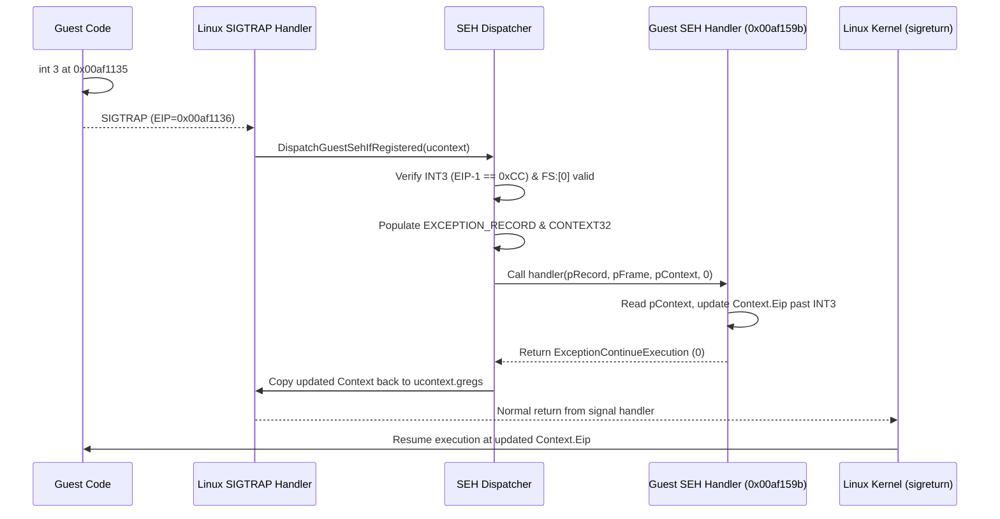

# 작업 351: Linux i386 게스트 INT3 Win32 SEH 디스패치 설계 / Task 351: Linux i386 guest INT3 Win32 SEH dispatch design

선행: [작업 350 설계](20260923-350-guest-seh-chain-observation.md), [작업 350 작업 로그](../work-logs/20260923-350-guest-seh-chain-observation.md), [분석 문서](../analysis/ez2dj4th-linux-inprocess-first-import.md)

## 결정 / Decision

작업 350에서 확인된 게스트 SEH 핸들러(`0x00af159b`)로 게스트 자체 `INT3`(`0x00af1135`, SoftICE 검사)를 전달하고 실행을 재개하는 Win32 SEH 디스패치 경로를 `NativeProcessBootstrap`에 추가합니다.

*Add a Win32 SEH dispatch path to `NativeProcessBootstrap` that delivers the guest's own `INT3` (`0x00af1135`, SoftICE check) to the guest SEH handler (`0x00af159b`) confirmed in Task 350 and resumes execution.*



---

## 1. Win32 x86 SEH 구조체 정의 / Win32 x86 SEH Structure Definitions

게스트 ABI와 일치하는 독립적인 Win32 데이터 구조체를 `src/platform/linux/x86/guest_seh_types.h`에 정의합니다. Wine 등의 외부 코드를 복사하지 않고 Win32 x86 표준 사양을 직접 정의합니다.

1. **`Win32ExceptionRecord32` (80바이트)**:
   - `exception_code`: `0x80000003` (`EXCEPTION_BREAKPOINT`)
   - `exception_flags`: `0` (`EXCEPTION_CONTINUABLE`)
   - `exception_record`: `0`
   - `exception_address`: `fault_eip - 1` (즉 `0x00af1135`)
   - `number_parameters`: `0`
   - `exception_information[15]`: `0`
2. **`Win32Context32` (716바이트 = `0x2CC`)**:
   - `context_flags`: `0x00010007` (`CONTEXT_FULL`: CONTROL | INTEGER | SEGMENTS)
   - `dr0` ~ `dr7`: 0
   - `float_save` (112바이트): 0
   - 세그먼트 레지스터: `seg_gs`, `seg_fs`(게스트 `fs_selector`), `seg_es`, `seg_ds`, `seg_cs`, `seg_ss`
   - 정수 레지스터: `edi`, `esi`, `ebx`, `edx`, `ecx`, `eax`
   - 제어 레지스터: `ebp`, `eip`(`fault_eip - 1`), `eflags`, `esp`
   - `extended_registers[512]`: 0
3. **`Win32ExceptionRegistrationRecord32`**:
   - `next`: `std::uint32_t`
   - `handler`: `std::uint32_t`

*Define standalone Win32 data structures matching the guest ABI in `src/platform/linux/x86/guest_seh_types.h` directly from standard Win32 specifications without importing external codebase code.*

---

## 2. SEH 디스패치 절차 / SEH Dispatch Procedure

`GuestSignalHandler`에서 `signal_number == SIGTRAP`을 수신했을 때:

1. **조건 검증**:
   - 진단이 둔 정지용 stub(`stop_stub`)이 아닌 게스트 이미지 내부의 주소인가?
   - `context->uc_mcontext.gregs[REG_EIP]` 직전 바이트(`EIP - 1`)가 `0xCC`(`INT3`)인가?
   - 게스트 TEB의 `FS:[0]`이 `0xFFFFFFFF`가 아니며, 유효한 게스트 스택 범위 내인가?
2. **문맥 구성**:
   - 게스트 스택(또는 디스패처 내부 버퍼)에 `Win32ExceptionRecord32`와 `Win32Context32`를 구성합니다.
   - `ucontext->uc_mcontext.gregs`로부터 레지스터 값들을 복사하며, `context.eip`는 `INT3` 명령어 주소인 `fault_eip - 1`로 설정합니다.
3. **게스트 핸들러 호출**:
   - 게스트 핸들러 시그니처:
     ```c
     std::uint32_t (*handler)(const Win32ExceptionRecord32* record,
                              const Win32ExceptionRegistrationRecord32* frame,
                              Win32Context32* context,
                              void* dispatcher_context);
     ```
   - 게스트 스택을 사용하거나 안전한 호스트 스택에서 게스트 `%fs`가 활성화된 상태로 cdecl 호출을 수행합니다.
4. **반환값 평가**:
   - 반환값이 `0` (`kExceptionContinueExecution`):
     - 핸들러가 조정한 `Win32Context32`의 레지스터(`eip`, `esp`, `eax`, `ebx`, `ecx`, `edx`, `esi`, `edi`, `ebp`, `eflags`)를 `context->uc_mcontext.gregs`에 반영합니다.
     - SEH 디스패치 통계(카운트, 마지막 핸들러, 재개 EIP)를 기록합니다.
     - 시그널 핸들러에서 일반 반환(`return;`)하여 리눅스 커널이 복귀 EIP로 게스트를 재개하도록 합니다.
   - 반환값이 `0`이 아닌 경우:
     - 처리되지 않은 예외이므로 기존대로 `siglongjmp`를 통해 fault로 보고하고 정지합니다.

*When `GuestSignalHandler` receives `SIGTRAP`: verify that it is an `INT3` in guest code and a valid SEH frame exists in `FS:[0]`; populate `EXCEPTION_RECORD` and `CONTEXT32`; invoke the guest handler via cdecl; if it returns `ExceptionContinueExecution` (0), copy modified registers back to `ucontext.gregs` and return normally so the kernel resumes guest execution.*

---

## 3. 연속 실행 진단 연동 / Integration with Continuation Diagnostic

`--linux-in-process-continue` 진단에서:
- SEH 디스패치 발생 시 호출 카운트와 구분하여 SEH 이벤트(핸들러 주소, 재개 EIP)를 관찰할 수 있도록 지원합니다.
- SEH 재개 후 게스트가 다음 14번째 이상의 API를 호출하거나 다음 멈춤 경계에 도달하는지 추적합니다.

*In `--linux-in-process-continue`, record SEH dispatch events (handler address, resumed EIP) and continue tracking API calls 14 and beyond.*

---

## 확인됨 / 추정 / 미확정 / Confirmed, Inferred, Unresolved

* **확인됨**: 게스트 TEB `FS:[0]`에 등록된 핸들러는 `0x00af159b`이며, 첫 명령어는 `mov eax, [esp+0x0c]`로 세 번째 인자인 `PCONTEXT ContextRecord`를 로드한다.
* **추정**: 핸들러는 `ContextRecord->Eip`를 `INT3` 다음 명령으로 수정하고 `ExceptionContinueExecution`(`0`)을 반환할 것이다.
* **미확정**: 핸들러가 수정한 실제 복귀 EIP와, 복귀 후 실행되는 후속 보호 코드 및 API 호출 순서는 디스패치를 구현하여 직접 관측하기 전까지는 미확정이다.

* *Confirmed: The handler registered in `FS:[0]` is `0x00af159b`, and its first instruction is `mov eax, [esp+0x0c]`, loading `PCONTEXT ContextRecord`.*
* *Inferred: The handler will advance `ContextRecord->Eip` past the `INT3` and return `ExceptionContinueExecution` (0).*
* *Unresolved: The actual resumed EIP and subsequent protection code / API calls remain unresolved until observed via implementation.*
