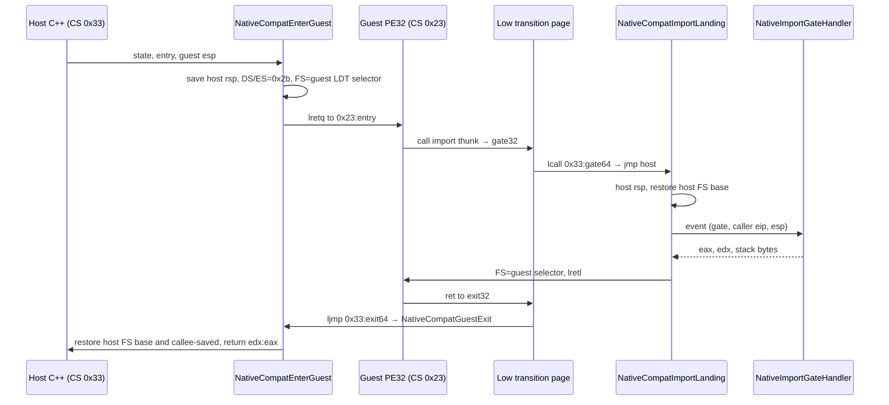
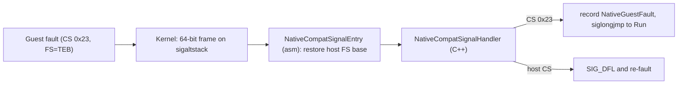

# 작업 353 설계 — Linux x64 compatibility-mode adapter / Task 353 design — Linux x64 compatibility-mode adapter

선행: [작업 340 게스트 PE 호환 모듈 설계](20260921-340-guest-pe-compatibility-modules.md) 7단계, [작업 345 Linux 플랫폼 비트 폭 분리](20260922-345-linux-platform-width-split.md)

*Prerequisites: stage 7 of the [Task 340 guest PE compatibility-module design](20260921-340-guest-pe-compatibility-modules.md) and the [Task 345 Linux platform width split](20260922-345-linux-platform-width-split.md).*

## 결정 / Decision

Linux x64 제품은 원본 PE32를 **같은 x86-64 프로세스 안에서** 직접 실행한다. CPU의 compatibility mode를 쓴다. 64비트 host 코드는 Linux x86-64가 제공하는 32비트 사용자 코드 selector `0x23`으로 far transition해서 게스트에 들어가고, 게스트는 import 경계에서 64비트 selector `0x33`으로 far call해서 host로 돌아온다. i386 helper IPC 경로는 제품 경로로 확장하지 않고 진단 fallback으로만 유지한다(2026-09-24 사용자 결정).

*The Linux x64 product runs the original PE32 directly **inside the same x86-64 process** using the CPU's compatibility mode. 64-bit host code enters the guest with a far transition to the 32-bit user code selector `0x23` that Linux x86-64 provides, and the guest returns to the host at import boundaries with a far call to the 64-bit selector `0x33`. The i386 helper IPC path is not extended into the product path; it remains a diagnostic fallback only (user decision, 2026-09-24).*

이 결정은 [설계 307](20260918-307-linux-x86-x64-wsl.md)의 "두 host 모두 별도 i386 helper"와 [KB: 64비트 호스트의 32비트 게스트](../kb/x86-32-guest-on-64-bit-host.md)의 Linux 결론을 대체한다. 근거는 다음과 같다. x86 in-process 경로가 이미 facade(`kernel32`/`user32`), 동적 resolver, 게스트 SEH 디스패치를 거쳐 실제 4th CHD의 `#0016`까지 도달했다. 같은 thread 안에서 동기적으로 import를 처리하는 구조를 x64에서도 유지하면 그 코드와 `NativeImportGateHandler` 계약을 그대로 재사용할 수 있다. IPC 경로로 가면 import마다 왕복이 생기고 진단 코드가 두 갈래로 나뉜다.

*This supersedes the "separate i386 helper on both hosts" structure of [design 307](20260918-307-linux-x86-x64-wsl.md) and the Linux conclusion of the [KB on 32-bit guests on 64-bit hosts](../kb/x86-32-guest-on-64-bit-host.md). The x86 in-process path already reaches `#0016` on the real 4th CHD through the facades (`kernel32`/`user32`), the dynamic resolver, and guest SEH dispatch. Keeping synchronous same-thread import handling on x64 lets that code and the `NativeImportGateHandler` contract be reused unchanged; the IPC path would add a round trip per import and fork the diagnostics in two.*

## 핵심 문제 / Core problems

| 문제 / Problem | 결정 / Decision | 확인 상태 / Status |
| --- | --- | --- |
| 64→32 진입 / 64→32 entry | guest stack으로 바꾼 뒤 `pushq $0x23; pushq entry; lretq` | WSL 5.15에서 probe로 확인 예정 / to be confirmed by the probe on WSL 5.15 |
| 32→64 복귀 / 32→64 return | 32비트 stub의 `ljmp`/`lcall $0x33, landing`. host는 32비트 operand `lretl`로 게스트에 돌아간다 / `ljmp`/`lcall $0x33, landing` from a 32-bit stub; the host returns with a 32-bit-operand `lretl` | 위와 같음 / as above |
| far 주소 폭 / Far-pointer width | `ptr16:32`는 32비트 offset만 담는다. 그래서 전환 stub을 4 GiB 미만에 runtime으로 생성한다. 64비트 landing은 `movabs; jmp *%r11`로 PIE host 코드에 들어간다 / `ptr16:32` holds only a 32-bit offset, so transition stubs are generated at runtime below 4 GiB, and the 64-bit landing enters PIE host code with `movabs; jmp *%r11` | 설계 / design |
| FS 충돌 / FS conflict | glibc TLS와 stack protector(`%fs:0x28`)와 게스트 TEB가 모두 FS를 쓴다. 게스트 FS는 `modify_ldt` LDT descriptor로 만든다(selector `(index<<3)\|7`, base는 TEB). host로 돌아오는 모든 경로에서 **첫 C 코드 전에** host FS base를 복원한다 / glibc TLS, the stack protector (`%fs:0x28`), and the guest TEB all use FS. Guest FS is an LDT descriptor from `modify_ldt` (selector `(index<<3)\|7`, base = TEB); every path back to the host restores the host FS base **before any C code** | 설계 / design |
| FS base 복원 / FS base restore | `AT_HWCAP2`에 `HWCAP2_FSGSBASE`가 있으면 `wrfsbase`, 없으면 `arch_prctl(ARCH_SET_FS)` syscall을 쓴다. 두 경로 모두 probe로 검증한다 / `wrfsbase` when `AT_HWCAP2` reports `HWCAP2_FSGSBASE`, else an `arch_prctl(ARCH_SET_FS)` syscall; the probe exercises both | 설계 / design |
| host 상태 / Host state | FS를 바꾼 뒤에는 `thread_local`을 쓸 수 없다. host `rsp`, host FS base, 게스트 FS selector, import cleanup byte 수는 4 GiB 미만의 전환 data page에 둔다 / `thread_local` is unusable once FS is switched; host `rsp`, host FS base, guest FS selector, and the import cleanup byte count live in a transition data page below 4 GiB | 설계 / design |
| signal | kernel은 64비트 frame으로 handler를 부르지만 FS는 복원하지 않는다. asm signal entry가 host FS base를 먼저 복원한 뒤 C handler로 넘긴다. C handler는 `REG_CSGSFS`의 CS가 `0x23`일 때만 게스트 fault로 기록하고 `siglongjmp`한다 / The kernel invokes the handler with a 64-bit frame but does not restore FS. An asm signal entry restores the host FS base first, then hands off to the C handler, which records a guest fault only when the CS in `REG_CSGSFS` is `0x23` and then `siglongjmp`s | 설계 / design |
| 4 GiB 미만 메모리 / Memory below 4 GiB | guest stack, TEB/PEB, 전환 page를 `MAP_FIXED_NOREPLACE` hint 탐색으로 `0x10000000`–`0xF0000000`의 위에서부터 할당한다. 실패는 오류로 반환한다 / The guest stack, TEB/PEB, and transition pages are allocated top-down in `0x10000000`–`0xF0000000` by `MAP_FIXED_NOREPLACE` hint search; failure is reported as an error | 설계 / design |
| 미지원 커널 / Unsupported kernels | `modify_ldt` 비활성, `ia32_emulation=0` 등으로 `0x23` 전환이 불가능한 커널이 있다. 초기화 때 시험 전환이 fault하거나 실패하면 "compatibility mode unavailable"로 거절한다 / Some kernels cannot use `0x23` (`modify_ldt` disabled, `ia32_emulation=0`, and so on); a trial transition at initialization rejects them as "compatibility mode unavailable" when it faults or fails | **미확정**: 해당 커널에서 실행하지 않음 / **unresolved**: not run on such kernels |

## 구조 / Structure

signal 경로는 다음과 같다.

*The signal path:*

## 코드 배치 / Code layout

AGENTS.md 비트 폭 규칙에 따라 x86-64 host에서만 성립하는 코드는 `src/platform/linux/x64/`에 둔다.

*Following the AGENTS.md width rule, code valid only on an x86-64 host goes under `src/platform/linux/x64/`.*

| 파일 / File | 책임 / Responsibility |
| --- | --- |
| `x64/native_compat_mode.h/.cpp` | `NativeCompatModeRuntime`: 저주소 할당, LDT FS, TEB/PEB, 전환 page 생성·patch, signal 설치, 시험 전환, `Run` / low allocation, LDT FS, TEB/PEB, transition-page generation and patching, signal installation, trial transition, `Run` |
| `x64/native_compat_mode_transition.h/.cpp` | top-level `__asm__`만 담는다. 복사용 32비트·64비트 blob, host routine(enter, exit, import landing, FS 복원, signal entry) / top-level `__asm__` only: the copied 32/64-bit blob and host routines (enter, exit, import landing, FS restore, signal entry) |
| `x64/native_compat_mode_probe.cpp` | 합성 기계어 probe와 CTest 등록 / synthetic machine-code probe, registered with CTest |
| `native_import_gate.h` (루트 / root) | x86 bridge에서 추출한 폭 중립 `NativeImportGateEvent`/`Result`/`Handler` / width-neutral `NativeImportGateEvent`/`Result`/`Handler` extracted from the x86 bridge |
| `native_guest_fault.h` (루트 / root) | x86 bootstrap에서 추출한 폭 중립 `NativeGuestFault` / width-neutral `NativeGuestFault` extracted from the x86 bootstrap |

`.S` 대신 top-level `__asm__`을 쓰므로 CMake에 ASM language를 켜지 않는다. 기존 x86 코드의 naked asm 관례와도 맞다.

*Top-level `__asm__` instead of a `.S` file avoids enabling the CMake ASM language and matches the existing x86 naked-asm convention.*

import thunk는 x86과 같은 형태(`push gate; call bridge; pop ecx; add esp,[cleanup]; jmp ecx`)를 유지한다. x64에서는 `bridge`가 전환 page의 `gate32`이고 `cleanup`이 전환 data page의 필드다. `gate32`는 1개 인자의 stdcall 함수처럼 동작한다(`lcall` 뒤 `ret $4`). 그래서 2단계에서 thunk 생성기를 폭 중립으로 만들 때 주소 두 개만 인자로 바꾸면 된다.

*Import thunks keep the x86 shape (`push gate; call bridge; pop ecx; add esp,[cleanup]; jmp ecx`). On x64, `bridge` is the transition page's `gate32` and `cleanup` is a field of the transition data page. `gate32` behaves like a one-argument stdcall function (`lcall`, then `ret $4`), so making the thunk emitter width-neutral in stage 2 only changes those two address arguments.*

## 제약 / Constraints

- 1단계는 **단일 thread, 비재진입**이다. import handler 안에서 게스트를 다시 호출하는 중첩 전환(callback, SEH handler 호출)은 host `rsp` 저장 슬롯을 덮어쓴다. 이 문제는 4단계에서 slot stack으로 바꿔 해결한다.
  *Stage 1 is **single-threaded and non-reentrant**. A nested transition that re-enters the guest from inside an import handler (callbacks, SEH handler calls) would overwrite the saved host `rsp` slot; stage 4 replaces it with a slot stack.*
- compatibility mode에서 64비트 mode로 돌아오면 범용 레지스터의 상위 32비트와 `r8`–`r15`는 정의되지 않는다(Intel SDM Vol. 1 §3.4.1.1). landing은 `movl %esp, %esp`로 zero-extend하고, host callee-saved 레지스터는 host stack에서 복원한다.
  *After returning from compatibility mode to 64-bit mode, the upper 32 bits of general-purpose registers and `r8`–`r15` are undefined (Intel SDM Vol. 1 §3.4.1.1). The landing zero-extends with `movl %esp, %esp`, and host callee-saved registers are restored from the host stack.*
- x87 control word, MXCSR, direction flag는 게스트와 host가 공유한다. landing은 `cld`만 보장하고, x87/SSE 상태 격리는 범위 밖이다.
  *The x87 control word, MXCSR, and direction flag are shared between guest and host. The landings guarantee only `cld`; x87/SSE state isolation is out of scope.*

## 단계 / Stages

1. **(이번 작업) 전환 runtime과 합성 probe.** 진입·복귀, FS/TEB, import 콜백, fault 포착, host TLS 보존을 `fsgsbase` 경로와 `arch_prctl` 경로 모두에서 검증한다.
   ***(This task) Transition runtime and synthetic probe.** Validate entry/return, FS/TEB, import callbacks, fault capture, and host TLS preservation on both the `fsgsbase` and `arch_prctl` paths.*
2. **PE session·import thunk·runner.** `NativePeSession`, import thunk 생성기, `NativeInProcessRunner`에서 저주소 할당과 bridge 주소를 인자로 받게 하고, 폭 중립 부분을 루트로 옮긴다. x86과 같은 합성 PE fixture로 검증한다.
   ***PE session, import thunks, runner.** Parameterize low allocation and bridge addresses in `NativePeSession`, the thunk emitter, and `NativeInProcessRunner`, moving width-neutral parts to the root; validate with the same synthetic PE fixtures as x86.*
   완료: [작업 354](20260924-354-linux-x64-pe-session.md). / Done: [Task 354](20260924-354-linux-x64-pe-session.md).
3. **facade와 kernel32 진단.** facade module mapping과 `NativeKernel32Diagnostic`을 연결하고, 설계 345가 미뤄 둔 `original_runner.cpp`의 `#if` 분리를 한다. 2026-09-24 사용자 결정으로 SEH 디스패치를 분리했으므로, 실제 4th CHD의 완료 경계는 게스트 자신의 `INT3`(API 13개 뒤)다. 완료: [작업 355](20260924-355-linux-x64-facade-diagnostics.md).
   ***Facades and kernel32 diagnostics.** Connect facade mapping and `NativeKernel32Diagnostic`, performing the `original_runner.cpp` `#if` split deferred by design 345. With SEH dispatch split out by the user's 2026-09-24 decision, the real-4th-CHD completion boundary is the guest's own `INT3` after 13 APIs. Done: [Task 355](20260924-355-linux-x64-facade-diagnostics.md).*
4. **게스트 SEH 디스패치와 instruction trace.** signal context에서 32비트 handler를 중첩 호출하고, host `rsp` slot stack을 도입한다. signal handler가 게스트로 복귀할 수 있게 되면 같은 기반으로 x64 instruction trace도 만든다. 완료 기준은 실제 4th CHD가 x64에서 x86과 같은 `#0016`에 도달하는 것이다.
   ***Guest SEH dispatch and instruction trace.** Call the 32-bit handler from signal context as a nested transition, introducing a host `rsp` slot stack; once the signal handler can return into the guest, build the x64 instruction trace on the same foundation. Completion is the real 4th CHD reaching the same `#0016` on x64 as on x86.*
   완료: [작업 356](20260924-356-linux-x64-guest-seh-trace.md). / Done: [Task 356](20260924-356-linux-x64-guest-seh-trace.md).

각 단계는 별도 작업 단위(설계 갱신·작업 지시·구현·검증·로그·커밋)로 끝낸다.

*Each stage completes as its own task unit (design update, work order, implementation, validation, log, commit).*

## 검증 전략 / Validation strategy

`re2dj_linux_compat_mode_probe`(CTest 등록)가 합성 32비트 기계어로 다음을 확인한다. 원본 자산은 쓰지 않는다.

*`re2dj_linux_compat_mode_probe` (registered with CTest) checks the following with synthetic 32-bit machine code and no original assets:*

1. `mov eax, imm32; ret`의 반환값. 복귀 뒤 host `thread_local`, `errno`, FS base가 진입 전과 같다.
   *The return value of `mov eax, imm32; ret`; after return the host `thread_local`, `errno`, and FS base match their pre-entry values.*
2. `fs:[0x18]`이 TEB self와 같고, `fs:[0]`이 `0xFFFFFFFF`다.
   *`fs:[0x18]` equals the TEB self pointer and `fs:[0]` is `0xFFFFFFFF`.*
3. stdcall import 두 번(41→42, 42→43/`edx`=1)이 handler를 거친다. 게스트 `esp`가 균형을 이루고, event의 caller `eip`·`esp`가 맞는다.
   *Two stdcall imports (41→42, 42→43 with `edx`=1) go through the handler, the guest `esp` balances, and the event's caller `eip`/`esp` are correct.*
4. `ud2`는 SIGILL과 게스트 레지스터로 기록되고, 그 직후 1번이 다시 성공한다.
   *`ud2` is recorded as SIGILL with guest registers, and check 1 succeeds again immediately afterwards.*
5. `int3`는 SIGTRAP과 `eip = int3 + 1`로 기록된다.
   *`int3` is recorded as SIGTRAP with `eip = int3 + 1`.*
6. 게스트가 `ebx`/`esi`/`edi`/`ebp`를 덮어써도 host callee-saved 레지스터(`rbx`, `rbp`, `r12`–`r15`)가 보존된다.
   *Host callee-saved registers (`rbx`, `rbp`, `r12`–`r15`) survive a guest that overwrites `ebx`/`esi`/`edi`/`ebp`.*
7. 1~6을 `fsgsbase` 경로와 강제 `arch_prctl` 경로에서 모두 실행한다.
   *Checks 1–6 run on both the `fsgsbase` path and a forced `arch_prctl` path.*

Linux x86 debug·helper preset도 빌드하고 기존 probe를 실행한다. 두 헤더 추출이 회귀를 만들지 않았는지 확인하기 위해서다.

*The Linux x86 debug and helper presets are also built and their existing probes run, confirming that the two header extractions do not regress.*

## 범위 밖 / Out of scope

PE image·facade의 x64 실행, CLI 연결, SEH 디스패치, 다중 thread, x87/SSE 상태 격리, Windows adapter, 실제 CHD 실행은 이번 범위에 넣지 않는다(2~4단계에서 다룬다).

*PE-image and facade execution on x64, CLI wiring, SEH dispatch, multiple threads, x87/SSE state isolation, the Windows adapter, and real-CHD runs are out of scope (stages 2–4).*

## 출처 / Sources

- [Intel 64 and IA-32 Architectures Software Developer's Manuals](https://www.intel.com/content/www/us/en/developer/articles/technical/intel-sdm.html) — compatibility mode, far `CALL`/`RET`/`JMP`, IA-32e segment loading
- [Linux `arch/x86/include/asm/segment.h`](https://github.com/torvalds/linux/blob/master/arch/x86/include/asm/segment.h) — `__USER32_CS`, `__USER_CS`, `__USER_DS`
- [modify_ldt(2)](https://man7.org/linux/man-pages/man2/modify_ldt.2.html), [arch_prctl(2)](https://man7.org/linux/man-pages/man2/arch_prctl.2.html)
- [Linux kernel: Using FS and GS segments in user space applications](https://docs.kernel.org/arch/x86/x86_64/fsgs.html)
