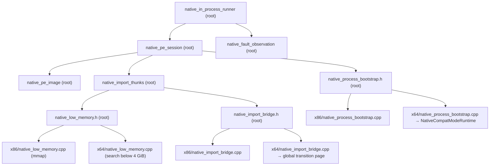

# 작업 354 설계 — Linux x64 PE session과 in-process runner / Task 354 design — Linux x64 PE session and in-process runner

선행: [작업 353 설계](20260924-353-linux-x64-compat-mode-adapter.md) 2단계, [작업 353 작업 로그](../work-logs/20260924-353-linux-x64-compat-mode-adapter.md)

*Prerequisites: stage 2 of the [Task 353 design](20260924-353-linux-x64-compat-mode-adapter.md) and the [Task 353 work log](../work-logs/20260924-353-linux-x64-compat-mode-adapter.md).*

## 결정 / Decision

x86에서 원본 PE32를 실행하는 경로(`NativePeSession` → `NativeInProcessRunner`)를 x64에서도 같은 코드로 쓴다. 이미 폭 중립인 부분은 `src/platform/linux/` 루트로 옮긴다. host 폭에 묶인 두 경계, 곧 **process bootstrap**과 **import bridge**만 같은 선언 아래에서 `x86/`과 `x64/`에 따로 구현한다.

*The x86 path that runs the original PE32 (`NativePeSession` → `NativeInProcessRunner`) is reused unchanged on x64. Parts that are already width-neutral move to the `src/platform/linux/` root. Only the two host-width boundaries — the **process bootstrap** and the **import bridge** — keep one declaration with separate implementations under `x86/` and `x64/`.*

## 분류 / Classification

| 파일 / File | 위치 / Location | 근거 / Rationale |
| --- | --- | --- |
| `native_pe_image`, `native_pe_session`, `native_fault_observation`, `native_in_process_runner` | 루트 / root | host 포인터를 32비트 게스트 주소로만 다루고, 두 폭에서 컴파일된다 / handle host pointers only as 32-bit guest addresses and compile on both widths |
| `native_import_thunks` | 루트 / root | thunk 영역을 `MapNativeLowMemory`로 받는다. bridge·cleanup 주소가 32비트를 넘으면 거절한다 / takes its region from `MapNativeLowMemory` and rejects bridge/cleanup addresses above 32 bits |
| `native_process_bootstrap.h`, `native_import_bridge.h`, `native_low_memory.h` | 루트 선언 / root declaration | 두 폭이 같은 계약을 구현한다 / both widths implement the same contract |
| instruction trace (`ArmNativeInstructionTrace` 등 / etc.) | `x86/native_instruction_trace.h` | i386 bootstrap의 single-step 구현에만 존재한다 / exists only in the i386 bootstrap's single-step implementation |
| `native_dynamic_thunk`, facade module image·set, kernel32 진단 / diagnostic | `x86/` 유지 / stays | 3단계에서 x64로 연결한다 / connected to x64 in stage 3 |

## x64 구현 / x64 implementation

- **전역 전환 page.** 작업 353에서는 전환 code·data page를 runtime마다 만들었다. 이번 작업에서 프로세스 전역으로 바꾸고, 처음 필요할 때 만든다. import thunk와 이후의 facade thunk가 bridge 주소를 바이트열에 굳히기 때문에, 그 주소는 bootstrap 초기화 순서와 무관하게 먼저 알 수 있어야 한다. 전역 page는 프로세스가 끝날 때까지 유지한다. 게스트 FS selector와 FS base 복원 방식은 `Run`마다 state에 다시 쓴다.
  ***Global transition page.** Task 353 created the transition code and data pages per runtime; they become process-global and are created on first use, because import thunks (and later facade thunks) bake the bridge address into their bytes, so it must be known independently of bootstrap initialization order. The global pages live for the process lifetime. The guest FS selector and FS restore method are written into the state on each `Run`.*
- **bridge API.** `x64/native_import_bridge.cpp`가 루트 `native_import_bridge.h`를 구현한다. `NativeImportGateBridgeAddress()`는 전역 `gate32`, `NativeImportGateCleanupAddress()`는 전역 state의 cleanup 필드 주소다. `ConfigureNativeImportGateHandler`로 설정한 handler는 `Run` 호출에 handler가 없을 때 쓰인다.
  ***Bridge API.** `x64/native_import_bridge.cpp` implements the root `native_import_bridge.h`: `NativeImportGateBridgeAddress()` is the global `gate32`, and `NativeImportGateCleanupAddress()` is the address of the global state's cleanup field. The handler set with `ConfigureNativeImportGateHandler` is used when a `Run` call supplies none.*
- **bootstrap.** `x64/native_process_bootstrap.cpp`는 `NativeCompatModeRuntime`을 감싼다. entry는 인자 없이, TLS callback은 x86 `CallGuestTls`와 같은 `(image_base, 1, 0)` 인자로 실행한다. SEH 디스패치는 4단계 범위라 SEH 관련 카운터는 0이다.
  ***Bootstrap.** `x64/native_process_bootstrap.cpp` wraps `NativeCompatModeRuntime`. Entry runs with no arguments and TLS callbacks with `(image_base, 1, 0)`, matching the x86 `CallGuestTls`. SEH dispatch belongs to stage 4, so the SEH counters stay zero.*
- **저주소 할당.** 작업 353의 `MapNativeLowMemory`를 `x64/native_low_memory.cpp`로 옮긴다. i386 구현(`x86/native_low_memory.cpp`)은 일반 `mmap`을 쓴다. i386 주소 공간은 전부 4 GiB 미만이므로 기존 thunk 배치 동작이 바뀌지 않는다.
  ***Low allocation.** Task 353's `MapNativeLowMemory` moves to `x64/native_low_memory.cpp`; the i386 implementation (`x86/native_low_memory.cpp`) uses plain `mmap`, since the whole i386 address space is below 4 GiB, so existing thunk placement is unchanged.*

## 검증 / Validation

`re2dj_linux_native_in_process_probe`의 x64판(`x64/native_in_process_probe.cpp`)이 x86 probe와 같은 합성 PE32 fixture(`windows/native_ipc_host_probe.cpp`의 `MakeSyntheticPe32`)로 다음을 확인한다. CTest에도 등록한다.

*An x64 build of `re2dj_linux_native_in_process_probe` (`x64/native_in_process_probe.cpp`) uses the same synthetic PE32 fixture as the x86 probe (`MakeSyntheticPe32` from `windows/native_ipc_host_probe.cpp`) and is registered with CTest. It checks:*

1. `0x11000000`으로 재배치된 image, TLS callback의 FS self·TEB stack 범위 검사, 이름·ordinal import 두 번, exit code 51.
   *The image relocated to `0x11000000`, the TLS callback's FS-self and TEB stack-bound checks, two imports (by name and by ordinal), and exit code 51.*
2. entry+8을 `ud2`로 바꾼 image가 SIGILL을 entry+8에서 보고하고, fault observation의 `fs_base`가 0이 아니며 SEH frame이 `0xFFFFFFFF`다.
   *An image with `ud2` at entry+8 reports SIGILL at entry+8, with a non-zero fault-observation `fs_base` and an SEH frame of `0xFFFFFFFF`.*
3. 같은 프로세스에서 1을 다시 실행해도 성공한다(전역 전환 page와 bootstrap 재생성).
   *Check 1 succeeds again in the same process (global transition page reused, bootstrap recreated).*

x86 쪽은 기존 probe(`re2dj_linux_native_in_process_probe`, `re2dj_linux_native_guest_module_probe`)와 helper build로 파일 이동 회귀를 확인한다.

*On x86, the existing probes (`re2dj_linux_native_in_process_probe`, `re2dj_linux_native_guest_module_probe`) and the helper build confirm that the file moves do not regress.*

## 범위 밖 / Out of scope

facade·dynamic thunk·kernel32 진단의 x64 연결, `original_runner.cpp`의 CLI 분기, SEH 디스패치, instruction trace의 x64 구현은 이번 범위에 넣지 않는다.

*Out of scope: connecting facades, dynamic thunks, and the kernel32 diagnostic on x64; the CLI branches in `original_runner.cpp`; SEH dispatch; and an x64 instruction trace.*
