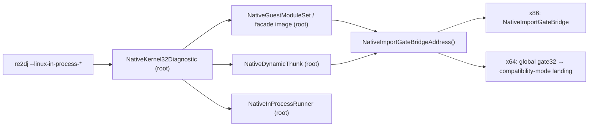

# 작업 355 설계 — Linux x64 facade와 in-process 진단 연결 / Task 355 design — Linux x64 facades and in-process diagnostics

선행: [작업 353 설계](20260924-353-linux-x64-compat-mode-adapter.md) 3단계, [작업 354 작업 로그](../work-logs/20260924-354-linux-x64-pe-session.md)

*Prerequisites: stage 3 of the [Task 353 design](20260924-353-linux-x64-compat-mode-adapter.md) and the [Task 354 work log](../work-logs/20260924-354-linux-x64-pe-session.md).*

## 결정 / Decision

x86에서 쓰던 facade module(`kernel32`/`user32`), dynamic thunk, `NativeKernel32Diagnostic`을 두 폭 공용으로 만들어 x64 CLI의 in-process 진단에 연결한다. **게스트 SEH 디스패치는 이번 단계에 넣지 않는다**(2026-09-24 사용자 결정). 따라서 x64의 완료 경계는 x86 작업 349와 같은 게스트 자신의 `INT3`다. SEH 디스패치 뒤의 `#0014`–`#0016`은 4단계에서 맞춘다.

*The facade modules (`kernel32`/`user32`), dynamic thunks, and `NativeKernel32Diagnostic` used on x86 become shared by both widths and are wired into the x64 CLI's in-process diagnostics. **Guest SEH dispatch is not part of this stage** (user decision, 2026-09-24), so the x64 completion boundary is the guest's own `INT3`, the same boundary x86 reached in Task 349. `#0014`–`#0016`, which follow SEH dispatch, are matched in stage 4.*

## 분류 / Classification

| 대상 / Item | 조치 / Action | 근거 / Rationale |
| --- | --- | --- |
| `native_guest_module_image`, `native_guest_module_set`, `native_kernel32_diagnostic`, `native_dynamic_thunk` | `x86/`에서 루트로 이동 / move from `x86/` to the root | 게스트 주소를 32비트 값으로만 다루고 bridge 주소는 공용 API로 얻는다 / handle guest addresses only as 32-bit values and obtain the bridge through the shared API |
| dynamic thunk, 진단 stop stub의 할당 / allocation of dynamic thunks and the diagnostic stop stub | `mmap(nullptr)` → `MapNativeLowMemory` | x64에서는 `mmap(nullptr)`가 4 GiB 위를 돌려준다 / on x64 `mmap(nullptr)` returns addresses above 4 GiB |
| facade image mapping | 변경 없음 / unchanged | 이미 `0x6F000000`부터 고정 base 후보를 탐색한다 / already probes fixed base candidates from `0x6F000000` |
| `--linux-in-process-first-import`, `-first-resolver`, `-createfile-call`, `-continue` | `#if defined(__i386__)` 제거 / remove the guards | 모두 공용 runner와 진단만 쓴다 / all use only the shared runner and diagnostic |
| `--linux-in-process-getversion-call` | `x86/`와 `x64/`의 `native_getversion_observation.cpp`로 분리 / split into per-width `native_getversion_observation.cpp` | instruction trace(TF single-step)를 쓴다. x64에서 trace를 구현하려면 signal handler가 게스트로 복귀할 수 있어야 하고, 이는 SEH 디스패치와 같은 기반이라 4단계 이후로 둔다. x64 구현은 이유를 담은 명시적 오류를 반환한다 / uses the instruction trace (TF single-step); an x64 trace needs the signal handler to return into the guest, the same foundation as SEH dispatch, so it follows stage 4, and the x64 implementation returns an explicit error stating why |
| `x86/native_guest_module_probe.cpp` | `x86/` 유지 / stays | i386 host 코드에서 facade thunk를 직접 호출한다 / calls facade thunks directly from i386 host code |

설계 345가 미뤄 둔 `original_runner.cpp`의 `#if` 분리는 이것으로 끝난다. 남는 폭별 차이는 파일 단위 구현(`x86/`·`x64/`)으로만 표현한다.

*This completes the `original_runner.cpp` `#if` split that design 345 deferred; the remaining width differences are expressed only as per-file implementations under `x86/` and `x64/`.*

## 검증 / Validation

1. **합성 facade 검사(CTest).** x64 `re2dj_linux_native_in_process_probe`에 검사를 추가한다. `kernel32` facade를 `NativeGuestModuleSet`으로 mapping하고, 32비트 게스트 코드가 facade의 `GetVersion` export thunk를 호출하게 한다. 반환값이 `kKernel32GuestVersion`이고 thunk 주소가 facade image 안에 있는지 확인한다. `NativeDynamicThunk`를 거친 호출도 같은 방식으로 확인한다.
   ***Synthetic facade check (CTest).** Extend the x64 `re2dj_linux_native_in_process_probe`: map the `kernel32` facade with `NativeGuestModuleSet`, have 32-bit guest code call the facade's `GetVersion` export thunk, and confirm the return is `kKernel32GuestVersion` and the thunk lies inside the facade image; check a call through a `NativeDynamicThunk` the same way.*
2. **실제 4th CHD(x64, 읽기 전용).** 결과를 x86 작업 348·349의 관찰과 비교한다.
   ***Real 4th CHD (x64, read-only).** Compare against the x86 observations of Tasks 348 and 349:*
   - `--linux-in-process-first-import`: return `0x00ae028a`, SIGTRAP `0x00ae028b`
   - `--linux-in-process-first-resolver`: return `0x00af0b99`, `GetVersion` `0x6f002026`
   - `--linux-in-process-createfile-call`: `\\.\NTICE`, return `0x00aeffbc`, identity `0x6f000000`/`0x6f002039`/`0x6f002026`
   - `--linux-in-process-continue`: `#0001`–`#0013`이 x86과 같고, 게스트 `INT3` `0x00af1135`에서 SIGTRAP(`eip` `0x00af1136`)으로 멈추며 fault observation이 SEH frame을 보고한다. stack 위치에 따라 달라지는 인자(예: `CreateFileA` 경로 문자열 포인터)는 비교에서 뺀다.
     *`#0001`–`#0013` match x86, the run stops with SIGTRAP (`eip` `0x00af1136`) at the guest `INT3` `0x00af1135`, and fault observation reports the SEH frame. Arguments that depend on stack placement (such as the `CreateFileA` path-string pointer) are excluded from the comparison.*
   - `--linux-in-process-getversion-call`: 명시적 미지원 오류 / explicit unsupported error
3. **x86 회귀.** 같은 다섯 진단과 기존 probe·helper 스크립트의 결과가 작업 354와 같아야 한다.
   ***x86 regression.** The same five diagnostics, the existing probes, and the helper script match Task 354.*

## 범위 밖 / Out of scope

x64 게스트 SEH 디스패치, x64 instruction trace, 새 Win32 export 추가는 이번 범위에 넣지 않는다.

*Out of scope: x64 guest SEH dispatch, an x64 instruction trace, and new Win32 exports.*
