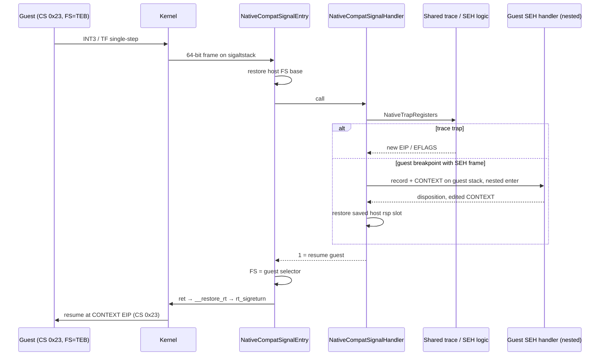

# 작업 356 설계 — Linux x64 게스트 SEH 디스패치와 instruction trace / Task 356 design — Linux x64 guest SEH dispatch and instruction trace

선행: [작업 353 설계](20260924-353-linux-x64-compat-mode-adapter.md) 4단계, [작업 355 작업 로그](../work-logs/20260924-355-linux-x64-facade-diagnostics.md), [작업 351 x86 SEH 디스패치](20260923-351-linux-guest-seh-dispatch.md)

*Prerequisites: stage 4 of the [Task 353 design](20260924-353-linux-x64-compat-mode-adapter.md), the [Task 355 work log](../work-logs/20260924-355-linux-x64-facade-diagnostics.md), and [Task 351's x86 SEH dispatch](20260923-351-linux-guest-seh-dispatch.md).*

## 결정 / Decision

x64 signal handler가 **게스트로 복귀**할 수 있게 한다. 그 위에 작업 351의 게스트 SEH 디스패치와 i386 instruction trace를 올린다. 두 기능의 판단 로직(INT3 인식, SEH frame 검증, `EXCEPTION_RECORD`/`CONTEXT` 구성, trace 상태기계)은 두 폭 공용 코드로 옮긴다. 각 폭의 signal handler는 `ucontext`와 공용 레지스터 형태 사이의 변환과 handler 호출 방식만 맡는다.

*Let the x64 signal handler **return into the guest**, and build Task 351's guest SEH dispatch and the i386 instruction trace on top. The decision logic of both features — recognizing an `INT3`, validating the SEH frame, building `EXCEPTION_RECORD`/`CONTEXT`, and the trace state machine — moves to code shared by both widths; each width's signal handler only converts between `ucontext` and the shared register form and decides how the handler is called.*

## 게스트 복귀 / Returning into the guest

signal 전달과 sigreturn은 FS를 바꾸지 않는다. 그래서 x64 asm signal entry는 이제 C handler를 **호출**하고 반환값을 본다. 반환값이 1이면 게스트 FS selector를 다시 적재한 뒤 glibc `__restore_rt`로 돌아간다. `__restore_rt`는 `rt_sigreturn` syscall만 하고 TLS를 쓰지 않는다. kernel은 `ucontext`의 CS `0x23`과 SS를 복원해서 compatibility mode로 게스트를 재개한다. 반환값이 0이면 host 문맥으로 돌아간다(host fault의 기본 동작 재발생).

*Signal delivery and sigreturn leave FS untouched, so the x64 asm signal entry now **calls** the C handler and inspects its result. A result of 1 reloads the guest FS selector and returns to glibc's `__restore_rt`, which only issues `rt_sigreturn` without touching TLS; the kernel restores CS `0x23` and SS from `ucontext` and resumes the guest in compatibility mode. A result of 0 returns to a host context (re-raising a host fault's default action).*

## 중첩 전환 / Nested transition

SEH handler는 게스트 코드이므로 compatibility mode에서 실행해야 한다. signal handler 안에서 `NativeCompatEnterGuest`를 다시 부르면 전환 state의 host `rsp` 슬롯이 signal stack의 값으로 덮인다. 호출 전에 그 슬롯을 저장하고 돌아온 뒤 복원한다. 이것이 작업 353 설계가 말한 "slot stack"의 최소 형태다. 호출이 중첩될 때마다 C 코드 한 층이 값 하나를 보관하므로 따로 배열을 두지 않는다.

*The SEH handler is guest code and must run in compatibility mode. Calling `NativeCompatEnterGuest` again inside the signal handler overwrites the transition state's host `rsp` slot with a signal-stack value, so the slot is saved before the call and restored after it — the minimal form of the "slot stack" in the Task 353 design; each nesting level's C frame keeps one value, so no separate array is needed.*

`EXCEPTION_RECORD`와 `CONTEXT`는 게스트가 읽고 써야 하므로 중단된 ESP 아래 게스트 stack에 둔다. Windows의 사용자 모드 예외 디스패치도 같은 곳에 둔다. 인자 `(record, frame, context, 0)`와 `exit32` 복귀 주소를 그 아래에 둔다. handler가 `ExceptionContinueExecution`(0)을 돌려주면 수정된 `CONTEXT`를 `ucontext`에 반영한다. 그 밖의 반환값이면 x86과 같이 fault로 보고한다.

*`EXCEPTION_RECORD` and `CONTEXT` must be guest-readable and writable, so they go on the guest stack below the interrupted ESP, where Windows' user-mode exception dispatch also places them; the arguments `(record, frame, context, 0)` and the `exit32` return address go below them. `ExceptionContinueExecution` (0) applies the edited `CONTEXT` to `ucontext`; any other disposition is reported as a fault, as on x86.*

## 공용화 / Sharing

| 대상 / Item | 위치 / Location |
| --- | --- |
| `NativeTrapRegisters`(EIP·ESP·범용·EFLAGS·segment) | `native_guest_fault.h` |
| SEH 타입, `PrepareNativeGuestBreakpointDispatch`, `ApplyNativeGuestSehContext` | `native_guest_seh.h/.cpp` (`x86/guest_seh_types.h`에서 이동, cdecl 함수 타입은 x86 bootstrap에 남김 / moved from `x86/guest_seh_types.h`; the cdecl function type stays in the x86 bootstrap) |
| trace 선언과 상태기계 `HandleNativeInstructionTraceTrap` / trace declarations and state machine | `native_instruction_trace.h/.cpp` (x86 bootstrap에서 추출 / extracted from the x86 bootstrap) |
| GetVersion 진단 / diagnostic | `native_getversion_observation.cpp` (루트로 돌아옴. x64 미지원 stub 삭제 / back at the root; the x64 unsupported stub is removed) |

x64 import landing도 x86 bridge처럼 handler 뒤에 `ResumeNativeInstructionTrace(caller return)`를 부른다. single-step은 게스트가 image 밖(import thunk)으로 나가는 첫 명령에서 멈춘다. 그 명령은 아직 CS `0x23`이므로 host 코드가 TF를 받는 일은 없다.

*The x64 import landing calls `ResumeNativeInstructionTrace(caller return)` after the handler, as the x86 bridge does. Single-stepping pauses at the first instruction outside the image (the import thunk), which still runs in CS `0x23`, so host code never receives TF.*

## 검증 / Validation

1. `re2dj_linux_compat_mode_probe`에 합성 SEH 검사를 추가한다. 게스트가 SEH frame을 등록하고 `INT3`를 실행한다. handler가 `CONTEXT`의 EIP와 EAX를 고친다. 게스트는 고친 값으로 재개해서 frame을 해제하고 반환한다. `fsgsbase`와 `arch_prctl` 두 경로에서 모두 확인한다.
   *Add a synthetic SEH check to `re2dj_linux_compat_mode_probe`: the guest registers an SEH frame and executes `INT3`, the handler edits `CONTEXT` EIP and EAX, and the guest resumes with those values, unregisters the frame, and returns — on both the `fsgsbase` and `arch_prctl` paths.*
2. x64 `re2dj_linux_native_in_process_probe`에 x86 probe의 instruction trace 검사를 옮긴다. 기대값은 첫 import 복귀에서 trace가 시작되고, frame 1개, entry+8의 SIGILL이다.
   *Port the x86 probe's instruction-trace check to the x64 `re2dj_linux_native_in_process_probe`: tracing starts at the first import return, records one frame, and ends in SIGILL at entry+8.*
3. 실제 4th CHD(x64): `--linux-in-process-continue`가 x86과 같이 API 16개, SEH handler `0x00af159b`, resume `0x00af11af`, `#0016 GetProcAddress(ExitProcess)`에 도달한다. `--linux-in-process-getversion-call`은 x86과 같은 경계와 trace를 기록한다.
   *Real 4th CHD (x64): `--linux-in-process-continue` reaches 16 APIs, SEH handler `0x00af159b`, resume `0x00af11af`, and `#0016 GetProcAddress(ExitProcess)` as on x86, and `--linux-in-process-getversion-call` records the same boundary and trace as x86.*
4. x86 회귀: 공용화한 trace와 SEH 코드로 기존 probe(trace 포함), helper 스크립트, 실제 CHD 다섯 진단이 작업 355와 같아야 한다.
   *x86 regression: with the shared trace and SEH code, the existing probes (including the trace), the helper script, and the five real-CHD diagnostics match Task 355.*

## 제약 / Constraints

- SEH handler 실행 중 SIGTRAP은 signal mask로 막혀 있다. handler 안에서 다시 `INT3`가 나면 kernel이 프로세스를 끝낸다. x86과 같은 제약이다.
  *SIGTRAP is masked while the SEH handler runs; another `INT3` inside the handler terminates the process, the same limit as x86.*
- `CONTEXT`의 debug register와 x87/SSE 영역은 x86과 같이 반영하지 않는다.
  *The `CONTEXT` debug registers and x87/SSE areas are not applied, as on x86.*
- unwind(`ExceptionContinueSearch` 이후의 frame 순회), 중첩 예외는 두 폭 모두 범위 밖이다.
  *Unwinding (walking frames after `ExceptionContinueSearch`) and nested exceptions are out of scope on both widths.*
