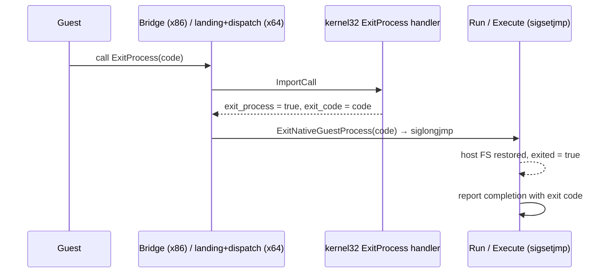

# 작업 358 설계 — `kernel32!ExitProcess`와 게스트 종료 경계 / Task 358 design — `kernel32!ExitProcess` and the guest exit boundary

선행: [작업 352 작업 로그](../work-logs/20260923-352-user32-facade-module.md), [작업 357 작업 로그](../work-logs/20260924-357-linux-default-in-process-run.md)

## 배경 / Background

실제 4th CHD의 in-process 실행은 두 host 폭 모두 `#0016 GetProcAddress(kernel32, "ExitProcess")`에서 미해석 lookup으로 멈춘다([분석](../analysis/ez2dj4th-linux-inprocess-first-import.md)). `ExitProcess`는 4th의 정적 import에 없어서 동적 해석으로만 얻는다. 다음 경계를 보려면 facade가 이 export를 제공해야 한다.

*On the real 4th CHD, the in-process run stops on both host widths with an unresolved lookup at `#0016 GetProcAddress(kernel32, "ExitProcess")` ([analysis](../analysis/ez2dj4th-linux-inprocess-first-import.md)). `ExitProcess` is not a 4th static import and is obtained only by dynamic resolution, so the facade must provide it to reach the next boundary.*

`ExitProcess`는 호출자에게 돌아가지 않는다. 그런데 현재 HLE handler 계약인 `ImportReturn`은 `eax`/`edx`만 돌려줄 수 있어서, "이 호출은 게스트로 돌아가지 않는다"를 표현할 방법이 없다.

*`ExitProcess` never returns to its caller, yet the current HLE handler contract, `ImportReturn`, can return only `eax`/`edx` and has no way to say that a call does not return to the guest.*

## 결정 / Decision

1. **플랫폼 중립 계약.** `ImportReturn`에 `exit_process`와 `exit_code`를 추가한다. 의미는 "이 호출은 게스트로 돌아가지 않고, 게스트 프로세스가 `exit_code`로 끝난다"다. 이 요청을 어떻게 끝낼지는 각 실행 backend가 정한다.
   ***Platform-neutral contract.** Add `exit_process` and `exit_code` to `ImportReturn`, meaning "this call does not return to the guest; the guest process ends with `exit_code`". Each execution backend decides how to end it.*
2. **`kernel32!ExitProcess`.** `ExitProcess(UINT uExitCode)`는 stdcall, 인자 1개다. 인자를 `exit_code`로 넘긴다. 공식 시그니처: [ExitProcess (Microsoft Learn)](https://learn.microsoft.com/windows/win32/api/processthreadsapi/nf-processthreadsapi-exitprocess).
   ***`kernel32!ExitProcess`.** `ExitProcess(UINT uExitCode)`, stdcall with one argument, passes the argument as `exit_code` ([Microsoft Learn](https://learn.microsoft.com/windows/win32/api/processthreadsapi/nf-processthreadsapi-exitprocess)).*
3. **IPC dispatcher.** `ImportDispatcher`는 `exit_process`를 기존 `ImportCompletionAction::kStop`으로 바꾼다. helper에서도 게스트가 이 호출 뒤로 진행하지 않는다.
   ***IPC dispatcher.** `ImportDispatcher` maps `exit_process` to the existing `ImportCompletionAction::kStop`, so the guest does not continue past the call in the helper either.*
4. **Linux in-process.** `NativeImportGateResult`도 같은 두 필드를 가진다. `NativeGuestModuleSet`은 이를 그대로 전달한다. 두 폭의 bridge는 handler가 `exit_process`를 돌려주면 게스트로 돌아가지 않고 `ExitNativeGuestProcess(exit_code)`로 실행을 끝낸다. 이것은 진행 중인 `Run`의 `sigsetjmp` 지점으로 `siglongjmp`하는 방식이다. bootstrap은 이 종료를 entry 반환과 같이 **정상 완료**로 보고하고 `GuestProcessExited()`/`GuestExitCode()`로 알린다. TLS callback 중에 종료되면 나머지 callback과 entry를 실행하지 않는다.
   ***Linux in-process.** `NativeImportGateResult` carries the same two fields, and `NativeGuestModuleSet` passes them through. When a handler returns `exit_process`, both widths' bridges end the run with `ExitNativeGuestProcess(exit_code)` instead of returning to the guest, by `siglongjmp`ing to the current `Run`'s `sigsetjmp`. The bootstrap reports this as a **normal completion**, like an entry return, exposed through `GuestProcessExited()`/`GuestExitCode()`. An exit during a TLS callback skips the remaining callbacks and the entry.*
   - x86: bridge는 guest stack 위에서 실행되는 host 코드다. glibc i386 TLS는 GS를 쓰므로 bridge 안에서 `siglongjmp`해도 된다. `Execute`의 복귀 경로가 host FS를 복원한다.
     *x86: the bridge is host code running on the guest stack; glibc's i386 TLS uses GS, so `siglongjmp` from the bridge is safe, and `Execute`'s return path restores the host FS.*
   - x64: import landing은 이미 host FS base와 host stack을 복원한 상태에서 C++ dispatch를 부른다. dispatch에서 `siglongjmp`하면 asm frame만 버려진다.
     *x64: the import landing calls the C++ dispatch after restoring the host FS base and host stack, so a `siglongjmp` from the dispatch abandons only asm frames.*
5. **진단 출력.** continuation은 이 종료를 `kProcessExit`로 보고한다. `continuation_stop_detail`에 `ExitProcess(<code>)`를 기록하고, CLI는 이를 continuation 경계로 출력한다.
   ***Diagnostic output.** The continuation reports the exit as `kProcessExit` with `ExitProcess(<code>)` in `continuation_stop_detail`, and the CLI prints it as a continuation boundary.*

## 검증 / Validation

- 단위 테스트: `kernel32` descriptor에 `ExitProcess`(stdcall, 인자 1)가 있다. handler는 `exit_process`와 인자 값을 돌려준다.
  *Unit tests: the `kernel32` descriptor has `ExitProcess` (stdcall, one argument), and the handler returns `exit_process` with the argument value.*
- 합성 probe(두 폭): 첫 import가 `exit_process`(코드 7)를 돌려주면 실행이 fault 없이 완료된다. exit code 7, import 호출 1회. 같은 프로세스에서 이어지는 정상 실행도 여전히 exit 51로 끝난다.
  *Synthetic probes (both widths): when the first import returns `exit_process` (code 7), the run completes without a fault with exit code 7 after one import call, and a following normal run in the same process still exits with 51.*
- 실제 4th CHD(두 폭): `#0016`이 facade 주소를 받는다. 그 뒤 새 경계를 기록하고, 확인됨/추정/미확정으로 나눠 분석 문서에 남긴다.
  *Real 4th CHD (both widths): `#0016` receives a facade address; record the new boundary that follows, split into confirmed/inferred/unresolved in the analysis.*
- helper 스크립트: IPC 경로에 회귀가 없어야 한다.
  *Helper script: no regression on the IPC path.*
