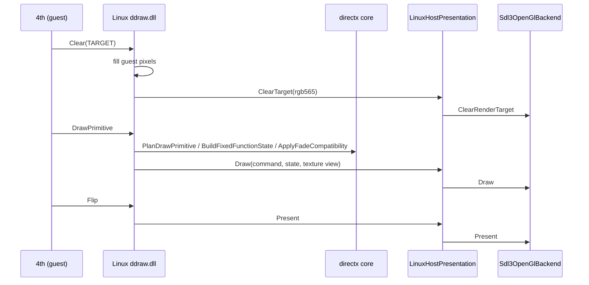

# 작업 391 설계 — DirectX 5단계: 그리기와 Linux 창 표시 / Task 391 design — DirectX phase 5: drawing and the Linux window

선행: [작업 382 설계](20260926-382-directx-device.md), [작업 389 설계](20260926-389-surface-dc-and-stretchdibits.md), [작업 390 설계](20260926-390-main-loop-input-and-messages.md)

## 배경 / Background

작업 390 뒤 Linux 실행은 첫 프레임의 `IDirect3DDevice7::Clear`에서 멈췄다. 4th의 프레임은 다음 순서다.

1. `BeginScene`, render state 몇 개
2. `Clear(0, NULL, TARGET|ZBUFFER, 0, 1.0, 0)`
3. `SetTexture(0, texture)`, `DrawPrimitive(TRIANGLESTRIP, D3DFVF_TLVERTEX, v, 4, 0)`
4. `EndScene`, 주 표면의 `Flip(NULL, DDFLIP_WAIT)`

Windows facade는 이 명령을 SDL3/OpenGL 공용 backend(`Sdl3OpenGlBackend`)로 그린다. 명령을 backend 상태로 바꾸는 규칙(그릴 수 있는 draw의 판정, fixed-function 상태, DX7 viewport 변환, fade 호환, clear 색)은 Windows facade 안에만 있었다.

*After Task 390 a Linux run stopped at the first frame's `IDirect3DDevice7::Clear`. The 4th's frame runs:*

1. *`BeginScene` and a few render states*
2. *`Clear(0, NULL, TARGET|ZBUFFER, 0, 1.0, 0)`*
3. *`SetTexture(0, texture)` and `DrawPrimitive(TRIANGLESTRIP, D3DFVF_TLVERTEX, v, 4, 0)`*
4. *`EndScene` and `Flip(NULL, DDFLIP_WAIT)` on the primary*

*The Windows facade draws these through the shared SDL3/OpenGL backend (`Sdl3OpenGlBackend`). The rules that turn the commands into backend state — which draws can be drawn, the fixed-function state, the DX7 viewport transform, fade compatibility, and the clear color — lived only inside the Windows facade.*

## 결정 / Decisions

1. **그리기 규칙은 core로.** `re2dj/directx/direct3d_draw.h`가 규칙을 갖고, Windows facade와 Linux `ddraw.dll`이 함께 쓴다.
   - `PlanDrawPrimitive`: triangle strip(3개 이상), triangle list, line list(온전한 primitive만)와 `D3DFVF_TLVERTEX`/`VERTEX`/`LVERTEX`만 그린다. 나머지는 `DDERR_UNSUPPORTED`다.
   - `BuildFixedFunctionState`: 장치의 render/texture stage state를 backend 상태로 바꾼다. backend가 모르는 상태는 오류다.
   - `BuildTransformState`: 장치의 행렬과 DX7 viewport로 변환을 만든다. viewport가 없으면 오류다.
   - `ApplyFadeCompatibility`: blending 없이 그린 화면 전체의 검은 사각형을 fade로 보고 섞는다. Windows facade가 해 온 그대로다.
   - `Rgb565FromD3dColor`: clear 색의 5-6-5 값.

   `re2dj_directx`는 이제 `re2dj_legacy_graphics`에 의존한다. 이 library는 폭 중립이고 Windows 파일을 참조하지 않는다.

   ***Drawing rules move to the core.** `re2dj/directx/direct3d_draw.h` holds them, shared by the Windows facade and Linux's `ddraw.dll`:*
   - *`PlanDrawPrimitive`: only triangle strips (3+ vertices), triangle lists and line lists (whole primitives), of `D3DFVF_TLVERTEX`/`VERTEX`/`LVERTEX`, are drawn; anything else is `DDERR_UNSUPPORTED`.*
   - *`BuildFixedFunctionState`: a device's render and texture stage states as backend state; a state the backend does not model is an error.*
   - *`BuildTransformState`: the transform from the device's matrices and its DX7 viewport; no viewport is an error.*
   - *`ApplyFadeCompatibility`: a full-screen black quad drawn without blending is treated as a fade and blended, as the Windows facade always has.*
   - *`Rgb565FromD3dColor`: a clear color's 5-6-5 value.*

   *`re2dj_directx` now depends on `re2dj_legacy_graphics`, which is width-neutral and references no Windows file.*
2. **host 표시 계약.** `HostPresentation`에 `SetRetainBetweenFrames`, `ClearTarget`, `Draw`, `Present`, `DiscardTexture`를 더한다. Linux(`LinuxHostPresentation`)는 guest 창을 보일 때 만든 `Sdl3OpenGlBackend`로 넘긴다. Windows와 같은 backend다.
   ***The host presentation contract.** `HostPresentation` gains `SetRetainBetweenFrames`, `ClearTarget`, `Draw`, `Present`, and `DiscardTexture`. Linux (`LinuxHostPresentation`) passes them to the `Sdl3OpenGlBackend` it made when it showed the guest window — the same backend as Windows.*
3. **표시되는 표면.** DirectDraw 객체는 guest가 표시하는 표면(`presentation_surface`)을 기억한다. 장치를 만들거나 `SetRenderTarget`을 부르면 그 render target이 된다. 표면 계획이 프레임 사이 보존(`retains_frames`, 뒤 버퍼가 있는 주 표면)을 요구하면 host에도 알린다.
   ***The presented surface.** The DirectDraw object remembers the surface the guest presents from (`presentation_surface`): the render target of the device when it is made or given `SetRenderTarget`. When the surface plan asks for frames to be retained (`retains_frames`, a primary with a back buffer) the host is told too.*
4. **`Clear`.** 표시되는 표면 전체를 `D3DCLEAR_TARGET`으로 지우면, guest 표면의 pixel을 그 색으로 채우고 host target도 그 색으로 지운다. 채우기는 한 번의 guest 쓰기다. 그 밖의 clear(사각형, depth만)는 그려지는 것을 바꾸지 않는다. 결과는 어느 쪽이든 `D3D_OK`로, Windows facade와 같다.
   ***`Clear`.** Clearing the whole presented surface with `D3DCLEAR_TARGET` fills the guest surface's pixels with the color, in one guest write, and clears the host target to it. Any other clear (rectangles, depth only) changes nothing drawn. Either way the result is `D3D_OK`, as on the Windows facade.*
5. **텍스처.** 표면은 host에서 쓰는 이름을 갖는다.
   - `identity`: 표면마다 하나이고 process 동안 겹치지 않는다.
   - `revision`: guest가 pixel을 바꾸면(`ReleaseDC`, 채우기) 올라간다.
   - revision이 바뀐 뒤 처음 그릴 때만 guest pixel을 host로 복사한다. backend도 같은 revision이면 다시 올리지 않는다.
   - 텍스처로 그린 표면이 사라지면 host 텍스처를 버린다(`DiscardTexture`). host 표시는 guest process보다 오래 산다.

   ***Textures.** Surfaces carry names for the host:*
   - *`identity`, unique per surface for the life of the process.*
   - *`revision`, which moves whenever the guest changes the pixels (`ReleaseDC`, a fill).*
   - *Guest pixels are copied to the host only on the first draw after the revision moves, and the backend does not re-upload the same revision.*
   - *When a surface that was drawn as a texture goes away, its host texture is discarded (`DiscardTexture`). The host presentation outlives the guest process.*
6. **`DrawPrimitive`.** 계획 → guest vertex 읽기 → decode → stage 0 텍스처 → 상태 → fade → host `Draw` 순이다. 크기는 표시 모드의 크기다. 오류는 Windows facade와 같다.
   - 계획 밖의 draw나 vertex 포인터가 null이면 `DDERR_UNSUPPORTED`.
   - decode되지 않는 vertex는 `DDERR_INVALIDPARAMS`.
   - backend가 거절한 상태나 draw는 `DDERR_GENERIC`.

   ***`DrawPrimitive`.** Plan → read the guest vertices → decode → the stage 0 texture → state → fade → the host's `Draw`, at the display mode's size. Errors match the Windows facade:*
   - *A draw outside the plan, or a null vertex pointer, is `DDERR_UNSUPPORTED`.*
   - *Vertices that do not decode are `DDERR_INVALIDPARAMS`.*
   - *A state or draw the backend refuses is `DDERR_GENERIC`.*
7. **`SetTexture`.** stage 0만 받는다. 다른 stage는 `DDERR_UNSUPPORTED`다. 텍스처가 아닌 표면은 `DDERR_INVALIDOBJECT`다. null은 stage를 비운다. 장치는 텍스처의 참조를 갖는다.
   ***`SetTexture`.** Stage 0 only; another stage is `DDERR_UNSUPPORTED`. A surface that is not a texture is `DDERR_INVALIDOBJECT`, and null clears the stage. The device holds a reference to the texture.*
8. **`Flip`.** 뒤 버퍼가 붙은 표면만 flip한다. 그 밖은 `DDERR_NOTFLIPPABLE`(`0x88760246`, SDK 값을 static_assert로 확인)이다. flip은 host `Present`다.
   ***`Flip`.** Only a surface with an attached back buffer flips; anything else is `DDERR_NOTFLIPPABLE` (`0x88760246`, checked against the SDK by static_assert). A flip is the host's `Present`.*

## 범위 밖 / Out of scope

- `IDirectDraw7::EnumSurfaces`: 이번 실행이 멈추는 곳이다. 다음 작업이다. / *`IDirectDraw7::EnumSurfaces`, where the run now stops: the next task.*
- `Lock`, `Blt`, `BltFast`, stage 1 이상의 텍스처, `DrawIndexedPrimitive`. / *`Lock`, `Blt`, `BltFast`, textures above stage 0, and `DrawIndexedPrimitive`.*
- Linux 창 제목의 FPS 표시와 창 크기 정책. / *The FPS in the Linux window title, and the window size policy.*
- DirectX 6 facade(`IDirect3D3`)의 공용화. / *Sharing the DirectX 6 facade (`IDirect3D3`).*
