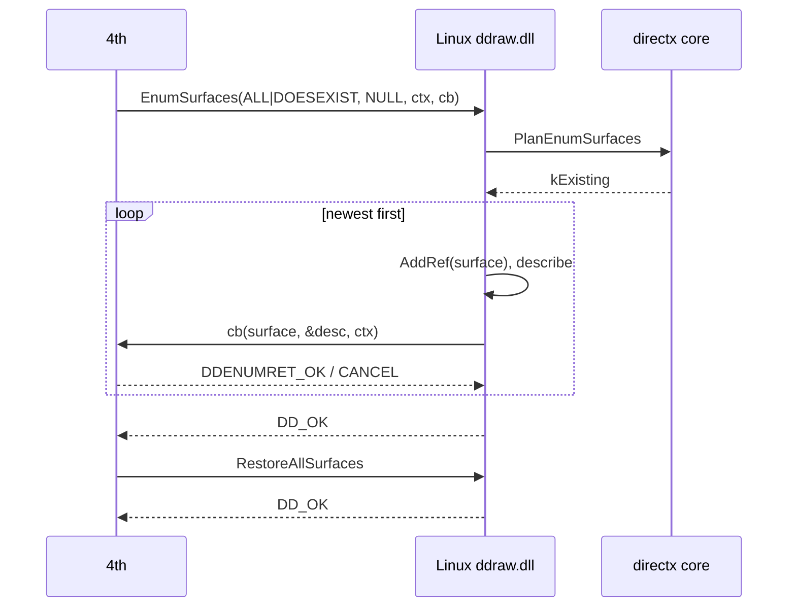

# 작업 392 설계 — 표면 점검: EnumSurfaces와 RestoreAllSurfaces / Task 392 design — the surface sweep: EnumSurfaces and RestoreAllSurfaces

선행: [작업 381 설계](20260926-381-directx-surfaces.md), [작업 391 설계](20260926-391-directx-drawing.md)

## 배경 / Background

작업 391 뒤 Linux 실행은 약 490프레임을 그린 다음 `IDirectDraw7::EnumSurfaces(this, 0x11, NULL, ctx, 0x00401f9b)`에서 멈췄다. `0x11`은 `DDENUMSURFACES_ALL | DDENUMSURFACES_DOESEXIST`로, 존재하는 모든 표면을 열거하라는 뜻이다. 게임은 이어서 `RestoreAllSurfaces`를 부른다. 화면 전환 전에 표면을 점검하고 복구하는 흐름이다.

Windows facade는 표면을 잃지 않는다며 아무것도 열거하지 않았다. 그래서 실제 동작을 32비트 측정 프로그램으로 확인했다(Windows 11, `DDSCL_NORMAL`, 주 표면·offscreen·텍스처·mipmap 2단계).

*After Task 391 a Linux run drew about 490 frames, then stopped at `IDirectDraw7::EnumSurfaces(this, 0x11, NULL, ctx, 0x00401f9b)`. `0x11` is `DDENUMSURFACES_ALL | DDENUMSURFACES_DOESEXIST`, asking for every existing surface. The game then calls `RestoreAllSurfaces`: it checks and restores its surfaces before a screen change.*

*The Windows facade enumerated nothing, on the grounds that it never loses a surface. The real behaviour was therefore measured with a 32-bit program (Windows 11, `DDSCL_NORMAL`, a primary, an offscreen plain surface, a texture, and a two-level mipmap).*

### 측정 / Measurements

- **열거 대상과 순서.** 존재하는 표면이 모두 나온다. 붙은 표면(mipmap 하위 단계)도 포함된다. 순서는 최신 것부터다. 해제된 표면은 나오지 않는다.
- **참조.** 콜백에 넘기기 전에 표면마다 AddRef한다. 이 참조는 콜백의 것이다. 콜백이 놓지 않으면 참조 수가 그만큼 남는다.
- **설명.** 124바이트 `DDSURFACEDESC2`다. `GetSurfaceDesc`와 바이트까지 같다. 예외는 `DDSCL_NORMAL` 주 표면으로, pitch가 0이다(`GetSurfaceDesc`는 15360). 포인터는 호출마다 같다.
- **context**는 그대로 넘어간다.
- **`DDENUMRET_CANCEL`(0)**은 열거를 멈춘다. 결과는 어느 경우든 `DD_OK`다.
- **거절.** 다음은 모두 `DDERR_INVALIDPARAMS`(`0x80070057`)이고 콜백을 부르지 않는다.
  - 콜백이 null
  - flags `0x10`, `0x01`, `0`
  - 설명 없는 `MATCH|DOESEXIST`
  - `ALL|MATCH|DOESEXIST`
  - `ALL|CANBECREATED`
  - 알 수 없는 bit(`0x111`)
- **last error**는 바뀌지 않는다.
- **`RestoreAllSurfaces`**는 잃은 표면이 없으면 `DD_OK`이고, last error는 그대로다.

*Measurements:*

- ***Which surfaces, in what order.** Every existing surface, attached ones (mipmap sublevels) included, newest first. Released surfaces are not listed.*
- ***References.** Each surface is AddRef'd before the callback, which owns that reference; if the callback keeps it, the count stays raised.*
- ***The description.** A 124-byte `DDSURFACEDESC2`, byte for byte what `GetSurfaceDesc` gives, except that a `DDSCL_NORMAL` primary shows pitch 0 (`GetSurfaceDesc` says 15360). The pointer is the same on every call.*
- ***The context** is passed through.*
- ***`DDENUMRET_CANCEL` (0)** stops the list; the result is `DD_OK` either way.*
- ***Refusals.** All of these are `DDERR_INVALIDPARAMS` (`0x80070057`) and call nothing:*
  - *a null callback*
  - *flags `0x10`, `0x01`, or `0`*
  - *`MATCH|DOESEXIST` without a description*
  - *`ALL|MATCH|DOESEXIST`*
  - *`ALL|CANBECREATED`*
  - *an unknown bit (`0x111`)*
- ***The last error** is left alone.*
- ***`RestoreAllSurfaces`** with nothing lost is `DD_OK`, leaving the last error alone.*

## 결정 / Decisions

1. **플래그 규칙은 core로.** `directdraw_surface.h`의 `PlanEnumSurfaces`가 판정한다. 결과는 세 가지다.
   - 존재하는 표면 열거
   - 거절(`DDERR_INVALIDPARAMS`)
   - 모델 밖: 설명과 함께 쓰는 `MATCH`/`NOMATCH` 검색. Linux에서는 불리면 멈춘다.

   `DDENUMSURFACES_*` 값은 SDK와 static_assert로 맞춘다.

   ***The flag rules move to the core.** `directdraw_surface.h`'s `PlanEnumSurfaces` decides between three outcomes:*
   - *listing the existing surfaces*
   - *a refusal (`DDERR_INVALIDPARAMS`)*
   - *unmodelled: the `MATCH`/`NOMATCH` searches with a description, which stop on Linux*

   *The `DDENUMSURFACES_*` values are checked against the SDK by static_assert.*
2. **Linux 열거.** DirectDraw 객체의 표면을 최신 것부터 나열한다. 표면의 identity(만든 순서로 커짐)로 정렬한다.
   - 목록은 먼저 떠 둔다. 그래서 콜백이 표면을 놓아도 순회가 흐트러지지 않는다. 이미 사라진 표면은 건너뛴다.
   - 표면마다 AddRef한다. 설명은 `GetSurfaceDesc`와 같다. 이 모델에는 `DDSCL_NORMAL` 주 표면이 없으므로 pitch 0 예외는 해당하지 않는다.
   - 설명은 호출 동안만 guest 메모리에 둔다. 측정에서 포인터가 매번 같았다는 점은 모델링하지 않는다. 4th의 콜백은 포인터를 저장하지 않는다.

   ***Listing on Linux.** A DirectDraw object's surfaces are listed newest first, ordered by their identity, which grows as surfaces are made.*
   - *The list is taken first, so a callback that releases a surface does not disturb the walk; one already gone is skipped.*
   - *Each surface is AddRef'd and described as `GetSurfaceDesc` describes it. The model has no `DDSCL_NORMAL` primary, so the pitch-0 exception does not apply.*
   - *The description lives in guest memory for the length of the call. That the measured pointer was the same each time is not modelled; the 4th's callback keeps no pointer.*
3. **`RestoreAllSurfaces`.** facade 표면은 잃지 않으므로 Linux도 `DD_OK`다. Windows facade와 같다.
   ***`RestoreAllSurfaces`.** Facade surfaces are never lost, so Linux answers `DD_OK`, as the Windows facade does.*
4. **Windows facade.** 플래그는 core로 판정해서, 잘못된 flags는 이제 `DDERR_INVALIDPARAMS`다. 유효한 열거는 여전히 아무것도 나열하지 않는다. facade가 표면 목록을 갖고 있지 않기 때문이다(DX6 facade를 DX7로 감싼 구조). 측정과 다른 이 부분은 TODO에 남긴다.
   ***The Windows facade.** Its flags go through the core, so bad flags are now `DDERR_INVALIDPARAMS`. A valid sweep still lists nothing, because the facade keeps no list of its surfaces (the DX6 facade wrapped as DX7). This departure from the measurements is left in the TODO.*

## 범위 밖 / Out of scope

- `MATCH`/`NOMATCH` 검색, `CANBECREATED`. / *The `MATCH`/`NOMATCH` searches and `CANBECREATED`.*
- 표면 손실(`DDERR_SURFACELOST`)과 `Restore`. / *Surface loss (`DDERR_SURFACELOST`) and `Restore`.*
- Windows facade의 실제 표면 열거. / *Listing real surfaces in the Windows facade.*
- `kernel32!GetCurrentDirectoryA`: 이번 실행이 멈추는 곳이다. 다음 작업이다. / *`kernel32!GetCurrentDirectoryA`, where the run now stops: the next task.*
