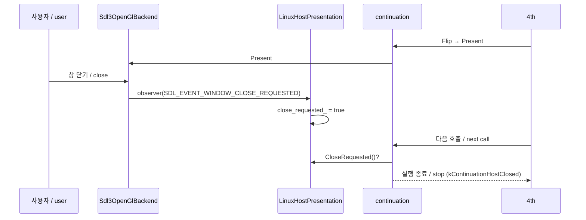

# 작업 395 설계 — 창을 닫을 때까지 실행 / Task 395 design — running until the window is closed

선행: [작업 394 설계](20260927-394-file-type.md)

## 배경 / Background

작업 394 뒤 Linux 실행은 Amuse World 로고 장면을 그리다 호출 32,768번에서 끝났다. 이 한도는 continuation 진단이 무한히 돌지 않도록 둔 것이다. 이제 게임이 모델 밖 API 없이 계속 도는 단계가 되었으므로, 이 한도가 제품 실행을 끝내고 있다. 사용자가 직접 실행했을 때도 게임이 도중에 종료되었다.

Windows 제품에는 호출 한도가 없다. host 창을 닫으면(`HandleHostClose`) 프로세스를 끝낸다.

*After Task 394 a Linux run ended at 32,768 calls while drawing the Amuse World logo scene. That limit kept continuation diagnostics from running forever. Now that the game keeps going without reaching an unmodelled API, it was ending the product run, and a user's own run ended midway.*

*The Windows product has no call limit; closing the host window (`HandleHostClose`) ends the process.*

## 결정 / Decisions

1. **한도는 선택 사항.** `OriginalRunEnvironment::call_limit`의 기본값은 0(한도 없음)이다. CLI `--call-limit <n>`은 진단과 회귀 실행에서만 쓴다. 회귀 스크립트는 전처럼 32,768을 넘긴다.
   ***The limit is optional.** `OriginalRunEnvironment::call_limit` defaults to 0 (no limit), and the CLI's `--call-limit <n>` is for diagnostic and regression runs only. The regression scripts pass 32,768 as before.*
2. **창 닫기.** Windows와 같이, host 창을 닫으면 실행을 끝낸다.
   - `Sdl3OpenGlBackend`에 이벤트 관찰자(`SetEventObserver`)를 더했다. `Present`가 큐에서 꺼낸 이벤트를 관찰자에 넘기고, 관찰자가 없으면 전처럼 버린다. Windows host는 자기 window procedure를 쓰므로 관찰자를 두지 않는다.
   - `LinuxHostPresentation`은 `SDL_EVENT_QUIT`와 `SDL_EVENT_WINDOW_CLOSE_REQUESTED`를 보고 닫기 요청을 기억한다. 이 값은 `HostPresentation::CloseRequested()`로 드러난다.
   - continuation은 호출마다 이 값을 보고 새 경계 `kContinuationHostClosed`로 멈춘다. 결과는 정상 종료(exit 0)다.
   - 이벤트는 guest가 flip할 때만 처리된다. 그래서 flip 없이 오래 도는 구간에서는 닫기가 그만큼 늦게 반영된다.

   ***Closing the window.** As on Windows, closing the host window ends the run:*
   - *`Sdl3OpenGlBackend` gains an event observer (`SetEventObserver`). `Present` hands it each event it takes from the queue; without one they are dropped as before. The Windows host has its own window procedure and sets none.*
   - *`LinuxHostPresentation` notes `SDL_EVENT_QUIT` and `SDL_EVENT_WINDOW_CLOSE_REQUESTED` as a close request, exposed as `HostPresentation::CloseRequested()`.*
   - *The continuation checks it after every call and stops at the new boundary `kContinuationHostClosed`, a normal exit (exit 0).*
   - *Events are handled only when the guest flips, so during a long stretch without a flip a close takes effect that much later.*
3. **API 기록 크기.** 한도가 없으면 기록 파일이 끝없이 커진다(프레임당 약 10KB). 그래서 처음 32,768번까지만 모두 기록하고, 그 뒤로는 안내 한 줄만 남긴다. 멈추기 직전의 마지막 128번은 전처럼 결과와 함께 주 로그에 보고된다.
   ***API log size.** Without a limit the log file would grow without end (about 10 KB per frame), so only the first 32,768 calls are recorded in full, followed by one note line. The last 128 calls before a stop are reported with the result in the main log as before.*

## 범위 밖 / Out of scope

- 창 크기, 배율 단축키, 전체 화면, 제목의 FPS: 다음 작업이다. / *Window size, scale shortcuts, fullscreen, and the FPS in the title: the next task.*
- guest에 `WM_CLOSE`를 보내 게임이 스스로 끝내게 하는 것. Windows도 프로세스를 바로 끝낸다. / *Sending `WM_CLOSE` to the guest so that it ends itself; Windows too ends the process directly.*
