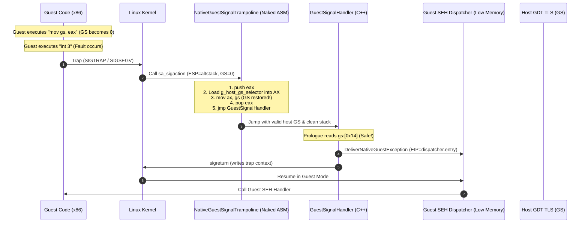

# 게스트 예외 디스패치와 Linux x86 호스트 GS 복원 / Guest Exception Dispatch and Linux x86 Host GS Restoration

## 개요 / Overview

이 문서는 Linux 환경에서 `ez2dj1st` 등 보호 코드가 있는 게임 실행 시 게스트 예외를 게스트 SEH 체인으로 전달하는 일반 디스패치 구조와, 32비트 Linux(x86/i386) 환경에서 게스트가 `%gs` 세그먼트 레지스터를 수정한 뒤 발생하는 coredump 크래시를 방지하기 위한 호스트 GS 복원 메커니즘을 정의한다.

*This document defines the general guest exception dispatch architecture that passes guest exceptions to the guest SEH chain on Linux (for targets with protection stubs such as `ez2dj1st`), and the host GS restoration mechanism that prevents coredump crashes on 32-bit Linux (x86/i386) caused by guest modifications to the `%gs` segment register.*

---

## 문제 분석 / Problem Analysis

### 1. 게스트 SEH 체인 전달 필요성 / Need for Guest SEH Chain Delivery

`ez2dj1st`의 `.protect` 스텁 코드는 시작 직후 자체적인 SEH 프레임을 TEB(`fs:[0]`)에 등록하고, 곧바로 의도적인 예외(INT3 / SIGTRAP)를 발생시켜 SEH 핸들러를 통해 복호화 및 실행을 이어간다.
이 예외를 호스트가 단순히 에러로 처리하지 않고 게스트의 SEH 등록 체인을 따라 디스패치해야 게임이 정상 시작 단계로 진입할 수 있다.

*The `.protect` stub of `ez2dj1st` registers its own SEH frame in TEB (`fs:[0]`) right after entry and deliberately triggers an exception (INT3 / SIGTRAP) to continue decryption and execution through the SEH handler. The host must dispatch this exception down the guest SEH chain rather than treating it as a fatal host error so the game can proceed to its normal startup stage.*

### 2. Linux x86 coredump 원인 / Root Cause of Linux x86 Coredump

Linux x64에서는 호환 모드(compatibility mode) 전환 시 64비트 호스트 레지스터와 세그먼트(FS/GS)가 분리되어 정상 동작한다.
반면 Linux x86(32비트 i386) 환경에서는 호스트와 게스트가 동일한 32비트 모드 및 레지스터 세트를 공유한다.

1. **Glibc TLS 및 Stack Protector의 `%gs` 의존성**:
   - 32비트 x86 Linux glibc에서 스레드 로컬 스토리지(TLS) 및 스택 카나리(`__stack_chk_fail`)는 `%gs` 세그먼트 레지스터(`%gs:0x14`)에 위치한다.
   - GCC로 컴파일된 모든 C/C++ 함수는 프롤로그에서 `mov %gs:0x14, %eax`를 실행하여 스택 가드를 설정한다.

2. **게스트의 `%gs` 오염**:
   - Win32 x86 ABI에서 `%gs`는 사용되지 않으며 보통 NULL(0)이다.
   - `ez2dj1st`의 보호 스텁은 난독화 및 안티 디버깅을 위해 다수의 `mov gs, ...` 및 `pop gs` 명령을 실행하여 `%gs`를 0 또는 무효한 값으로 변경한다.

3. **시그널 전달 시 커널의 `%gs` 보존**:
   - 게스트가 `%gs = 0`인 상태에서 INT3/SIGTRAP 또는 기타 fault를 발생시키면, 리눅스 커널은 유저 시그널 핸들러(`GuestSignalHandler`)를 호출한다.
   - 커널은 CS, DS, ES, SS만 유저 기본 셀렉터로 복원하고, **FS와 GS는 유저가 쓰던 값을 그대로 유지**한다.
   - 따라서 `GuestSignalHandler` 진입 시점에 `%gs`는 `0`이다.

4. **프롤로그에서의 세그폴트 및 Coredump**:
   - `GuestSignalHandler`가 C++ 함수이므로 진입하자마자 컴파일러 프롤로그의 `mov %gs:0x14, %eax`가 실행된다.
   - `%gs`가 0이므로 즉시 #GP/#PF(SIGSEGV, Signal 11)가 발생한다.
   - 시그널 핸들러 내부에서 발생한 중첩 fault이고 GS가 파괴되어 있으므로 복구할 수 없어 커널이 프로세스를 coredump로 강제 종료한다.

5. **Import Gate 및 Callback 복귀 시의 위험**:
   - 게스트가 thunk를 통해 호스트의 HLE import gate(`NativeImportGateBridge`)를 호출할 때도 `%gs`가 0이면 진입 프롤로그에서 즉시 세그폴트가 발생한다.
   - 호스트가 게스트 진입점이나 콜백(`CallGuestEntry`, `CallGuestTls`, `CallGuestStdcallWords`)을 호출하고 복귀할 때도 게스트가 오염시킨 `%gs` 때문에 호스트 C++ 코드로 돌아온 직후 크래시가 발생할 수 있다.

---

## 구조 설계 / Architectural Design

### 1. 호스트 GS 셀렉터 보존 (`g_host_gs_selector`)

- 전역 변수 `g_host_gs_selector`를 일반 데이터 세그먼트(DS/BSS)에 정의한다.
- TLS에 두지 않으므로 `%gs`가 0이어도 DS 기반 주소 지정으로 안전하게 읽을 수 있다.
- 프로세스 시작 시점(정적 초기화) 및 `NativeProcessBootstrap::Impl::Initialize` 시점에 현재 호스트의 `%gs` 값을 읽어 저장한다.

### 2. 시그널 핸들러 트램펄린 (`NativeGuestSignalTrampoline`)

- `sa_sigaction`에 등록되는 진입점을 순수 어셈블리(naked function)로 작성한다.
- 함수 프롤로그나 스택 카나리 확인 없이 다음을 수행한다:
  1. `pushl %eax` (레지스터 임시 보존)
  2. PC-relative 주소 지정을 통해 `g_host_gs_selector`를 읽어 `%ax`에 로드
  3. `movw %ax, %gs` (호스트 GS 즉시 복원)
  4. `popl %eax` (레지스터 복원)
  5. `jmp GuestSignalHandler` (C++ 시그널 핸들러로 tail call)
- `GuestSignalHandler`로 진입할 때 스택 인자(`signal_number`, `signal_info`, `context_pointer`)는 원형 그대로 보존되며, `%gs`는 안전한 호스트 TLS 셀렉터가 된다.
- 핸들러가 반환되면 커널의 `sys_rt_sigreturn`이 `context->uc_mcontext.gregs[REG_GS]`를 통해 게스트가 사용하던 GS를 복원하여 게스트로 복귀한다.

### 3. Import Gate 트램펄린 (`NativeImportGateBridge`)

- 게스트가 thunk를 통해 Win32 HLE API를 호출할 때:
  1. 스택 프레임을 설정하고 게스트의 `%gs`를 스택에 보존.
  2. `g_host_gs_selector`를 `%gs`에 로드하여 호스트 TLS를 활성화.
  3. C++ 구현 함수(`NativeImportGateBridgeImpl`)를 호출 (`gate_address` 전달).
  4. 64비트 반환값(`edx:eax`)을 보존한 상태에서 스택에 저장해 둔 게스트 GS를 `%gs`로 복원.
  5. `ret $4` (stdcall)로 게스트 thunk로 복귀.

### 4. 호스트 -> 게스트 호출 복귀 후 GS 복원

- `CallGuestEntry`, `CallGuestTls`, `CallGuestStdcallWords`:
  - 게스트 함수 `call *...` 직후, 반환값 레지스터(EAX 등)를 보존하면서 `g_host_gs_selector`를 `%gs`에 즉시 로드한다.
  - C++ 호출자로 복귀할 때 항상 호스트 GS가 활성화된 상태를 보장한다.
- `NativeProcessBootstrap::Impl::Execute`:
  - `sigsetjmp` 복귀 지점 및 일반 복귀 지점에서 호스트 GS를 다시 한 번 확인 복원한다.

### 5. 게스트 예외 디스패처 및 RtlUnwind (작업 404 공통)

- 저주소 메모리에 배치된 `kDispatcherCode`를 통해 게스트 TEB(`fs:[0]`)의 SEH 등록 체인을 탐색하고 핸들러를 호출한다.
- 핸들러가 `ExceptionContinueExecution`을 반환하면 CONTEXT의 레지스터를 복원하여 게스트 예외 발생 다음 코드로 안전하게 재개한다.
- `kernel32!RtlUnwind`를 HLE로 구현하여 예외 처리 중 상위 SEH 프레임 해제 및 복귀를 지원한다.

---

## 검증 계획 / Verification Plan

1. **단위 테스트**:
   - `build/linux-x86-debug` 및 `build/linux-x64-debug`에서 `re2dj_unit_tests` 전체 통과.
2. **Linux x86 ez2dj1st 실행 검증**:
   - `./build/linux-x86-debug/bin/re2dj --run ez2dj1st --call-limit 50` 실행 시 coredump가 완전히 해소되고, x64와 동일하게 첫 예외를 SEH로 디스패치하여 API 호출(50개 한도)까지 정상 진행됨을 확인.
3. **Linux x64 및 ez2dj4th 무회귀 검증**:
   - x64 빌드 및 4th 타깃 실행이 기존과 동일하게 정상 동작함을 확인.
