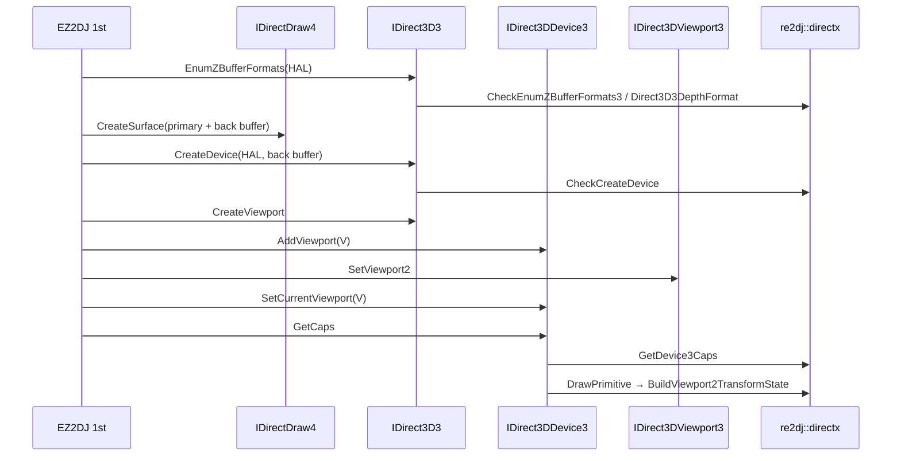

# 작업 416 설계 — DX6 장치·표면·viewport를 한 묶음으로 / Task 416 design — the DX6 device, surfaces, and viewport in one batch

선행: [작업 415 설계](20260928-415-dx6-find-device.md)

## 배경 / Background

작업 415 뒤 Linux의 EZ2DJ 1st는 `IDirect3D3::EnumZBufferFormats`에서 멈췄다. 이어지는 DX6 초기화 호출은 여러 개다. 사용자는 API를 하나씩 따로 작업하지 말고, DirectDraw·Direct3D 계열이 아닌 미구현 API가 나올 때까지 한 번에 이어서 추가하라고 지시했다. 이번 묶음에서 1st가 거친 DX6 호출은 다음과 같다.

- `IDirect3D3::EnumZBufferFormats`
- `IDirectDraw4::CreateSurface`, `IDirectDrawSurface4::GetAttachedSurface`
- `IDirect3D3::CreateDevice`, `IDirect3D3::CreateViewport`
- `IDirect3DDevice3::AddViewport`, `IDirect3DViewport3::SetViewport2`, `IDirect3DDevice3::SetCurrentViewport`
- `IDirect3DDevice3::EnumTextureFormats`, `IDirect3DDevice3::GetCaps`

*After Task 415, EZ2DJ 1st on Linux stopped at `IDirect3D3::EnumZBufferFormats`, and several more DX6 initialisation calls follow. The user asked for these to be added in one run, until an unimplemented API outside DirectDraw and Direct3D appears, instead of one API per task. The DX6 calls 1st went through in this batch are listed above.*

## 결정 / Decisions

1. **공용 core로 옮긴 규칙.** Windows DX6 facade가 안에서 만들던 답 세 가지를 `re2dj::directx`로 옮긴다. Windows facade와 Linux 모듈이 같은 함수를 쓴다.
   - `CheckEnumZBufferFormats3`: HAL 장치만 열거한다.
   - `Direct3D3DepthFormat`: mask 없는 16비트 Z 형식 하나.
   - `Direct3D3HardwareDescription` / `GetDevice3Caps(hw, sw)`: 하드웨어 설명이 없거나 크기가 틀리면 `DDERR_INVALIDPARAMS`다. 그 밖에는 하드웨어 설명을 채운다. 소프트웨어 설명은 주어졌을 때 크기를 확인한 뒤 0으로 채우고 크기만 적는다. 소프트웨어 설명의 크기가 틀리면 `DDERR_INVALIDPARAMS`지만 하드웨어 설명은 이미 채워져 있다. `FindDevice`도 같은 하드웨어 설명을 쓴다.
   - `BuildViewport2TransformState`: viewport 객체의 `D3DVIEWPORT2`(clip 부피 포함)로 변환 상태를 만든다. DirectX 7의 장치 viewport 대신 쓴다.

   *Three answers the Windows DX6 facade built inline move to `re2dj::directx`, used by both the Windows facade and the Linux module:*
   - *`CheckEnumZBufferFormats3` enumerates the HAL device only.*
   - *`Direct3D3DepthFormat` is one 16-bit Z format with no mask.*
   - *`Direct3D3HardwareDescription` / `GetDevice3Caps(hw, sw)`: a missing or wrongly sized hardware description is `DDERR_INVALIDPARAMS`; otherwise it is filled. A software description, when given, is size-checked, then zeroed with only its size set. A wrongly sized software description is `DDERR_INVALIDPARAMS`, with the hardware one already filled. `FindDevice` uses the same hardware description.*
   - *`BuildViewport2TransformState` builds the transform from a viewport object's `D3DVIEWPORT2`, clip volume included, in place of DirectX 7's device viewport.*
2. **ABI.** `D3dViewport2`(44바이트)와 IID 두 개(`IDirectDrawSurface4`, `IDirect3DViewport3`)를 `abi.h`에 둔다. Windows `directx_abi_windows.h`에서 SDK와 크기·오프셋을 맞춘다.
   *`D3dViewport2` (44 bytes) and two IIDs (`IDirectDrawSurface4`, `IDirect3DViewport3`) go in `abi.h`; the Windows `directx_abi_windows.h` checks size and offsets against the SDK.*
3. **표면은 DX7 구현을 공유한다.** `IDirectDrawSurface4`는 `IDirectDrawSurface7`의 앞 45개 method와 순서가 같다. 그래서 같은 handler 표의 앞부분을 vtable로 쓴다. 표면 상태에는 `directx6` 표시를 두고, `QueryInterface`가 자기 IID로 이것만 구분한다. `IDirectDraw4::CreateSurface`와 `IDirectDraw7::CreateSurface`는 `CreateSurfaceOf`를 공유한다.
   *Surfaces share the DX7 implementation. `IDirectDrawSurface4` is `IDirectDrawSurface7`'s first 45 methods in the same order, so its vtable is the front of the same handler table. The surface state carries a `directx6` flag that only `QueryInterface`'s own IID depends on. `IDirectDraw4::CreateSurface` and `IDirectDraw7::CreateSurface` share `CreateSurfaceOf`.*
4. **장치도 DX7 상태를 공유한다.** `IDirect3D3::CreateDevice`는 facade와 같은 순서로 인자를 확인한다: out·대상 없음·aggregation은 `DDERR_INVALIDPARAMS`, out 초기화, 모르는 class나 표면이 아닌 대상은 `DDERR_INVALIDOBJECT`, 그다음 core의 장치 규칙. 장치 객체는 DX7 장치와 같은 `DeviceState`를 쓰고 `IDirect3DDevice3` vtable(42개)을 단다. 인자가 같은 method(`BeginScene`, `SetRenderState`, `SetTransform`, `DrawPrimitive`, texture stage 등)는 DX7 handler를 그대로 쓴다.
   *The device shares the DX7 state as well. `IDirect3D3::CreateDevice` checks in the facade's order: no out pointer, no target, or aggregation is `DDERR_INVALIDPARAMS`; the out pointer is cleared; an unknown class or a non-surface target is `DDERR_INVALIDOBJECT`; then the core's device rules. The device uses DX7's `DeviceState` with an `IDirect3DDevice3` vtable (42 methods); methods with the same arguments (`BeginScene`, `SetRenderState`, `SetTransform`, `DrawPrimitive`, texture stages, …) reuse the DX7 handlers.*
5. **Viewport는 facade 규칙대로.** `IDirect3DViewport3`(21개 method)는 `D3DVIEWPORT2` 하나를 들고, Get/SetViewport2는 크기가 44가 아니면 `DDERR_INVALIDPARAMS`다. 장치는 AddViewport로 붙인 viewport 하나와 SetCurrentViewport로 정한 현재 viewport를 참조를 잡고 보관한다. 두 번째 AddViewport는 `DDERR_INVALIDPARAMS`, 다른 viewport의 DeleteViewport는 `DDERR_NOTFOUND`, 현재 viewport가 없을 때 GetCurrentViewport는 `DDERR_NOTFOUND`다. 현재 viewport가 있으면 그리기 변환은 `BuildViewport2TransformState`를 쓴다.
   *Viewports follow the facade. `IDirect3DViewport3` (21 methods) holds one `D3DVIEWPORT2`; Get/SetViewport2 refuse any size but 44 with `DDERR_INVALIDPARAMS`. The device holds a reference to the one viewport AddViewport attached and to the one SetCurrentViewport made current. A second AddViewport is `DDERR_INVALIDPARAMS`, DeleteViewport of another viewport is `DDERR_NOTFOUND`, and GetCurrentViewport with none is `DDERR_NOTFOUND`. With a current viewport, draws transform through `BuildViewport2TransformState`.*
6. **모델하지 않은 method는 멈춘다.** 1st가 부르지 않은 나머지 DX6 method는 `UnimplementedExport`로 둔다.
   *Unmodelled methods stop. The DX6 methods 1st does not call stay `UnimplementedExport`.*

## 흐름 / Flow

## 범위 밖 / Out of scope

- `kernel32!CreateThread`: DirectX 계열이 아니므로 이번 묶음이 여기서 끝난다.
  *`kernel32!CreateThread` is not DirectX, so the batch ends there.*
- DX6 texture(`IDirect3DTexture2`)와 vertex buffer, DX6 장치의 `QueryInterface`.
  *DX6 textures (`IDirect3DTexture2`), vertex buffers, and the DX6 device's `QueryInterface`.*
