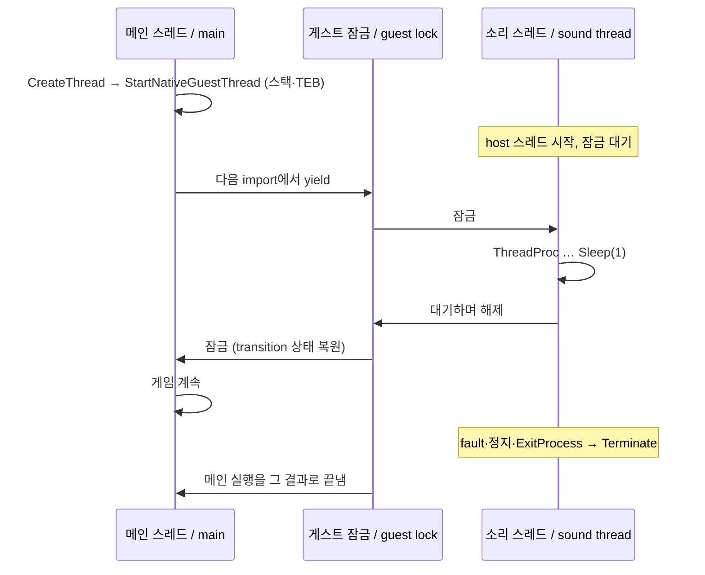

# 작업 417 설계 — Linux 게스트 스레드 / Task 417 design — guest threads on Linux

선행: [작업 416 설계](20260928-416-dx6-device-and-viewport.md)

## 배경 / Background

작업 416 뒤 Linux의 EZ2DJ 1st는 `kernel32!CreateThread`에서 멈췄다. 복호화된 이미지(`--image-dump`)를 보면 1st는 DirectSound 버퍼를 만든 직후 `0x41df20`을 스레드로 띄우고 `SetThreadPriority(h, 1)`을 부른다. 이 스레드는 소리 스트리밍 루프다. 전역 플래그 두 개를 보고, 버퍼를 채울 때가 되면 채운 뒤 `Sleep(6)`을 부르고, 아니면 `Sleep(1)`을 부른다. 끝낼 때는 메인 스레드가 플래그를 내리고 `WaitForSingleObject(h, 5000)`으로 기다린다. 시간이 지나면 `TerminateThread`를 부른다.

지금까지 Linux 실행은 게스트 스레드가 하나라는 전제로 되어 있었다. 스택·TEB·FS가 하나뿐이고, 실행 상태(sigjmp·fault 기록)가 전역이며, x64 transition page의 host 상태도 하나다. HLE도 스레드 ID가 상수였고, 다른 스레드가 가진 critical section이나 막히는 대기는 멈췄다.

*After Task 416, EZ2DJ 1st on Linux stopped at `kernel32!CreateThread`. The decrypted image (`--image-dump`) shows that, right after creating its DirectSound buffer, 1st starts `0x41df20` as a thread and calls `SetThreadPriority(h, 1)`. That thread is a sound-streaming loop: it checks two global flags, fills the buffer when due and calls `Sleep(6)`, and otherwise calls `Sleep(1)`. To end it, the main thread clears a flag and waits with `WaitForSingleObject(h, 5000)`, calling `TerminateThread` when the wait times out.*

*Until now a Linux run assumed one guest thread: one stack, TEB, and FS; global run state (sigjmp, fault record); one set of host state in the x64 transition page. The HLE had a constant thread ID and stopped at a critical section another thread owned or at a blocking wait.*

## Windows 측정 / Windows measurements

Windows 11에서 32비트 probe로 측정했다(`scratchpad/thread417`).

- `CreateThread`는 핸들을 돌려주고 `*lpThreadId`에 ID를 쓴다. `lpThreadId`는 NULL이어도 된다. 성공해도 last error는 바꾸지 않는다.
- 새 스레드는 last error 0으로 시작한다. TEB+0x24(ClientId의 스레드)에 자기 ID가 있다.
- 스레드가 실행 중일 때 `WaitForSingleObject(h, 0)`은 `WAIT_TIMEOUT`이고 `GetExitCodeThread`는 259(`STILL_ACTIVE`)다. 끝나면 `WAIT_OBJECT_0`이고 ThreadProc의 반환값을 준다.
- `SetThreadPriority`는 -15, -2..2, 15만 받는다. 3이나 99는 0과 `ERROR_INVALID_PARAMETER`(87)다. 잘못된 핸들이나 NULL은 0과 `ERROR_INVALID_HANDLE`(6)이다. 끝난 스레드의 핸들과 `GetCurrentThread`의 pseudo-handle은 받는다. `GetThreadPriority`는 설정한 값을 돌려준다.
- `CloseHandle`을 두 번 하면 두 번째는 0과 6이다.

*Measured with a 32-bit probe on Windows 11 (`scratchpad/thread417`):*
- *`CreateThread` returns a handle and writes the ID to `*lpThreadId`, which may be NULL; success leaves the last error alone.*
- *The new thread starts with last error 0, and TEB+0x24 (ClientId's thread) holds its ID.*
- *While the thread runs, `WaitForSingleObject(h, 0)` is `WAIT_TIMEOUT` and `GetExitCodeThread` gives 259 (`STILL_ACTIVE`); once it ends, `WAIT_OBJECT_0` and the ThreadProc's return value.*
- *`SetThreadPriority` takes only -15, -2..2, and 15; 3 or 99 give 0 with `ERROR_INVALID_PARAMETER` (87), and a bad or NULL handle 0 with `ERROR_INVALID_HANDLE` (6). A finished thread's handle and the `GetCurrentThread` pseudo-handle are accepted. `GetThreadPriority` returns the value set.*
- *A second `CloseHandle` of the same handle gives 0 and 6.*

## 결정 / Decisions

1. **스레드마다 host 스레드, 실행은 잠금 하나로.** 게스트 스레드마다 host 스레드를 하나씩 둔다. 게스트 코드와 import 처리(HLE)는 게스트 잠금을 가진 스레드 하나만 실행한다(`native_guest_threads.h`). facade 상태(`GuestProcess`, COM 객체, 파일, 장치)는 스레드 안전하지 않은데, 이렇게 하면 그대로 둘 수 있다. 잠금은 import 안에서만 넘어간다.
   - 스레드가 기다릴 때: `Sleep`, 막히는 대기(`WaitMilliseconds`).
   - import가 시작될 때: 다른 스레드가 잠금을 기다리고 있으면 먼저 실행하게 한다(`YieldNativeGuestThread`, 두 폭의 bridge).

   대기 순서는 FIFO라서 넘긴 스레드는 기다리던 스레드 뒤로 선다. import 없이 도는 게스트 코드가 다른 스레드를 막는 점은 Windows의 선점형 스케줄링과 다르다. 1st의 두 스레드는 모두 import를 자주 부른다.

   *One host thread per guest thread, and one lock for execution. Only the thread holding the guest lock runs guest code or import handling (`native_guest_threads.h`), so the facade's state (`GuestProcess`, COM objects, files, devices) can stay non-thread-safe. The lock changes hands only inside an import: when a thread waits (`Sleep`, a blocking wait, `WaitMilliseconds`), and as an import starts while another thread waits for the lock (`YieldNativeGuestThread`, in both widths' bridges). Waiters queue FIFO, so the thread that gave the lock up queues behind them. Guest code spinning without imports keeps the others out, unlike Windows' preemptive scheduling; both of 1st's threads call imports often.*

2. **스레드별 실행 상태.**
   - 두 폭: sigjmp와 fault·exit 기록을 `thread_local`로 둔다. 새 스레드는 1 MiB 게스트 스택(guard page 포함), TEB 한 page(PEB는 공유), alternate signal stack을 받는다.
   - x86: 새 스레드는 메인 스레드와 같은 TLS 항목 번호로 `set_thread_area`를 불러 자기 TEB를 base로 둔다. 항목은 스레드마다 있으므로 FS 선택자 값이 같다. import thunk가 읽는 cleanup 워드는 thunk에 주소가 박혀 있다. 그래서 `thread_local`에서 공유 전역으로 바꾼다. 잠금을 가진 스레드만 쓰고 읽는다.
   - x64: 스레드마다 runtime `Impl`(스택, TEB, LDT 항목, 예외 dispatcher)을 둔다. LDT는 프로세스 공용이라 스레드마다 항목이 따로 있고 FS 선택자도 다르다. transition page의 host 상태(host rsp, host FS base, guest FS 선택자)는 잠금을 넘길 때 스레드 기록에 저장하고 받을 때 되돌린다(`Save/RestoreNativeGuestTransition`). signal 진입 asm은 중단된 CS가 `0x23`일 때만 host FS를 복원한다. 32비트 코드는 잠금을 가진 스레드만 돌리고, 64비트 코드에서 난 signal은 이미 자기 FS를 가지고 있다.

   *Per-thread run state. On both widths the sigjmp and the fault and exit records are `thread_local`. A new thread gets a 1 MiB guest stack with a guard page, one TEB page (sharing the PEB), and an alternate signal stack.*
   - *x86: a new thread calls `set_thread_area` with the main thread's TLS entry number, based at its own TEB. The entry is per thread, so the FS selector value is the same. The cleanup word import thunks read has its address baked into the thunks, so it becomes a shared global instead of `thread_local`; only the lock holder writes and reads it.*
   - *x64: each thread has a runtime `Impl` of its own (stack, TEB, LDT entry, exception dispatcher). The LDT is process-wide, so each thread has its own entry and FS selector. The transition page's host state (host rsp, host FS base, guest FS selector) is saved into the thread's record when it gives the lock up and put back when it takes it (`Save/RestoreNativeGuestTransition`). The signal-entry asm restores the host FS only when the interrupted CS is `0x23`: only the lock holder runs 32-bit code, and a signal in 64-bit code already has its own FS.*

3. **프로세스를 끝내는 스레드.** 메인이 아닌 스레드에서 처리되지 않은 fault, 진단 정지(stop stub), `ExitProcess`가 나면 그 결과를 기록한다(`TerminateNativeGuestProcess`). 메인 스레드가 다음에 잠금을 받을 때 자기 실행을 그 결과로 끝낸다(`AbandonNativeGuestRun`). 그래서 경계 보고가 한 곳(메인 스레드의 실행 결과)에 모인다. 프로세스가 끝나면 다른 스레드는 다시 게스트를 돌리지 않는다. 메인 스레드의 실행이 끝났을 때와 bootstrap을 없앨 때도 같다. 스케줄러와 끝나지 않은 스레드의 스택은 그 스레드들이 남아 있을 수 있어 해제하지 않는다.
   *A thread that ends the process. An unhandled fault, a diagnostic stop (the stop stub), or `ExitProcess` in a thread other than the main one is recorded (`TerminateNativeGuestProcess`), and the main thread ends its own run with it when it next takes the lock (`AbandonNativeGuestRun`). Boundary reporting therefore stays in one place: the main thread's run result. Once the process has ended, no other thread runs the guest again; the same holds when the main thread's run ends and when the bootstrap goes away. The scheduler and the stacks of unfinished threads are not freed, since those threads may remain.*

4. **HLE.**
   - `ImportCallServices`에 `CurrentThreadId`와 `StartGuestThread`를 더한다. `GuestProcess`는 스레드 기록(ID, 핸들, 우선순위, 종료 값)을 가진다. 스레드 ID는 메인 `0xF04` 다음부터 4씩 늘린다.
   - kernel32:
     - `CreateThread`: 일시 정지 시작(`CREATE_SUSPENDED`)과 ThreadProc 없음은 멈춘다.
     - `SetThreadPriority`/`GetThreadPriority`: host 스레드 우선순위는 바꾸지 않고 값만 둔다.
     - `WaitForSingleObject`: 이벤트와 스레드 핸들을 받는다.
     - `CloseHandle`: 스레드 핸들도 닫는다.
     - `GetCurrentThreadId`: 호출한 스레드의 ID를 준다.
   - 막히는 대기와 다른 스레드가 가진 critical section은 신호가 올 때까지 1 ms씩 기다린다. 다른 스레드가 실행 중일 때만 그렇다. 다른 스레드가 없으면 아무도 신호를 줄 수 없다. 그래서 시간 제한 대기는 그 시간만큼 기다린 뒤 끝나고, `INFINITE` 대기와 critical section은 전처럼 멈춘다.
   - last error는 Windows처럼 TEB+0x34에 둔다. 그래서 스레드마다 따로 있다. TEB의 ClientId(+0x20 프로세스, +0x24 스레드)도 채운다.

   *HLE.*
   - *`ImportCallServices` gains `CurrentThreadId` and `StartGuestThread`. `GuestProcess` keeps thread records (ID, handles, priority, exit value); thread IDs follow the main `0xF04` in steps of 4.*
   - *kernel32:*
     - *`CreateThread`: a suspended start (`CREATE_SUSPENDED`) or no ThreadProc stops.*
     - *`SetThreadPriority`/`GetThreadPriority` keep the value without changing host thread priority.*
     - *`WaitForSingleObject` takes events and thread handles.*
     - *`CloseHandle` closes thread handles too.*
     - *`GetCurrentThreadId` answers the calling thread's ID.*
   - *A blocking wait, or a critical section another thread owns, waits in 1 ms steps until signalled, but only while another thread runs. With none, nothing can signal: a timed wait sleeps its timeout and ends, while an `INFINITE` wait or a critical section stops as before.*
   - *The last error lives at TEB+0x34 as on Windows, so each thread has its own; the TEB's ClientId (+0x20 process, +0x24 thread) is filled too.*

5. **관찰.** API 로그와 실행 요약은 메인이 아닌 스레드의 호출에 `[thread 0f08]`을 붙인다. 로그 들여쓰기 깊이는 스레드마다 센다.
   *Observation. The API log and the run summary tag calls from threads other than the main one with `[thread 0f08]`, and indentation depth is counted per thread.*

## 흐름 / Flow

## 범위 밖 / Out of scope

- `CREATE_SUSPENDED`와 `ResumeThread`, `TerminateThread`, `ExitThread`, `GetExitCodeThread`: 1st가 아직 부르지 않았다.
  *`CREATE_SUSPENDED` with `ResumeThread`, `TerminateThread`, `ExitThread`, and `GetExitCodeThread`, which 1st has not called yet.*
- 스레드별 메시지 큐와 스레드 타이머: 창과 메시지는 메인 스레드의 것으로 둔다.
  *Per-thread message queues and thread timers; windows and messages stay the main thread's.*
- 명령 추적(`--instruction-trace`)은 메인 스레드만 다룬다.
  *The instruction trace (`--instruction-trace`) covers the main thread only.*
