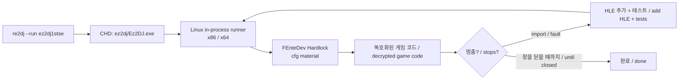

# 작업 420 설계 — Linux에서 1st SE CHD 실행 / Task 420 design — running the 1st SE CHD on Linux

선행: [작업 419 설계](20260928-419-wsprintf.md)

## 배경 / Background

작업 406~419는 Linux에서 EZ2DJ 1st(`roms/ez2dj1st`)를 한 경계씩 진행시켰다. 지금 개발 환경에는 1st가 없고 1st SE의 CHD(`roms/ez2dj1stse/ez2dj1stse.chd`)만 있다. 이번 작업은 같은 브랜치의 Linux in-process 실행으로 1st SE CHD를 실행할 수 있을 때까지 진행한다.

- CHD의 `ez2dj/Ez2DJ.exe`는 `.protect` 보호 빌드다. 1st·3rd·4th와 같은 계열이다. 확인됨: [1st SE CHD 분석](../analysis/ez2dj1stse-chd-filesystem.md).
- 보호 계층은 `\\.\FEnteDev` Hardlock을 쓴다. Linux의 `GuestDeviceSet`이 이미 이 장치를 답한다(작업 4th·1st). 응답 자료는 사용자 로컬 `cfg/hardlock-ez2dj1stse.map`과 `cfg/hardlock.ini`의 `[ez2dj1stse]`다. 저장소에는 넣지 않는다.
- 1st SE는 1st보다 두 시간 먼저 빌드된 다른 실행 파일이다. 1st에서 확인한 경계(CRT 시작, DirectX 6 장치, 스레드, `wsprintfA` 등)를 대부분 공유할 것으로 **추정**한다. 실행해서 확인한다.
- Windows 실행에서는 타이틀·LEVEL SELECT·게임플레이까지 확인됐다(작업 226~233). 그때 `LoadImageA`와 `GetPrivateProfile*`가 필요했다.

*Tasks 406–419 moved EZ2DJ 1st (`roms/ez2dj1st`) forward on Linux one boundary at a time. The current environment has no 1st, only the 1st SE CHD (`roms/ez2dj1stse/ez2dj1stse.chd`). This task carries the 1st SE CHD forward on the same branch's Linux in-process runner until it runs.*

- *The CHD's `ez2dj/Ez2DJ.exe` is the `.protect` build, the same family as 1st, 3rd, and 4th; confirmed in the [1st SE CHD analysis](../analysis/ez2dj1stse-chd-filesystem.md).*
- *Its protection uses the `\\.\FEnteDev` Hardlock, which Linux's `GuestDeviceSet` already answers (4th, 1st). The response material is the user's local `cfg/hardlock-ez2dj1stse.map` and the `[ez2dj1stse]` section of `cfg/hardlock.ini`, kept out of the repository.*
- *1st SE is a different executable, built two hours before 1st. It is **inferred** to share most of the boundaries confirmed for 1st (CRT startup, the DirectX 6 device, threads, `wsprintfA`, and so on); running it will tell.*
- *On Windows it reached the title, LEVEL SELECT, and gameplay (tasks 226–233), which needed `LoadImageA` and `GetPrivateProfile*`.*

## 결정 / Decisions

1. **프로필은 바꾸지 않는다.** `ez2dj1stse`는 이미 CHD shortcut이고 Linux 실행 경로가 CHD 입력(`OriginalRunEnvironment::files.chd_image`)을 받는다. 게스트 경로 `C:\ez2dj`, 장치, legacy I/O RVA도 프로필 값을 그대로 쓴다.
   *The profile stays as it is: `ez2dj1stse` is already a CHD shortcut, and the Linux path takes CHD input (`OriginalRunEnvironment::files.chd_image`). The guest path `C:\ez2dj`, the device, and the legacy-I/O RVAs come from the profile unchanged.*
2. **멈추는 경계마다 하나씩.** 실행이 멈춘 import나 fault를 1st에서처럼 처리한다. 동작은 Windows 측정이나 복호화 이미지 분석으로 먼저 확인하고, 공용 HLE와 단위 테스트로 옮긴다. 각 경계의 사실과 결정은 아래 진행 기록에 덧붙인다. 커다란 하위 시스템이 필요하면 별도 작업으로 나눈다.
   *One stopping boundary at a time. Each stopping import or fault is handled as for 1st: the behavior is first confirmed by a Windows measurement or the decrypted image, then carried into the shared HLE with unit tests. Each boundary's facts and decisions are appended to the progress section below, and a large subsystem gets its own task.*
3. **1st 회귀.** 1st가 없으므로 1st의 실제 실행 회귀는 할 수 없다. 공용 HLE 변경은 단위 테스트로 확인하고, 실행기 핵심이 바뀌면 4th 회귀를 돌린다.
   *1st regression: with no 1st present, its real-run regression cannot be run. Shared HLE changes are covered by unit tests, and a change to the runner core gets the 4th regression.*

## 흐름 / Flow

## 검증 / Verification

- Linux x64·x86과 Windows x86에서 CTest.
- Linux x64·x86에서 `re2dj --run ez2dj1stse`를 실행해 도달한 경계를 작업 로그에 적는다.

*CTest on Linux x64, x86, and Windows x86; `re2dj --run ez2dj1stse` on Linux x64 and x86, with the boundary reached recorded in the work log.*

## 진행 기록 / Progress

### 1. Hardlock 통과와 `SetBkColor` / Past the Hardlock, and `SetBkColor`

첫 실행(x64)에서 보호 계층이 Hardlock 요청 39건(initialize 2, handshake 2, descriptor 18, transform 17)을 모두 마쳤다. 이어서 원본 import를 `GetProcAddress`로 해석하다가 `GDI32!SetBkColor`에서 멈췄다. 원본 `.idata`(두 빌드에서 바이트 단위로 같다)의 144개 import를 facade의 export와 대조하니, 없는 것은 `SetBkColor` 하나뿐이었다(`DSOUND #1`은 있다).

Windows 11에서 32비트 probe로 측정했다(`scratchpad/bk420`).

| 호출 | 결과 |
| --- | --- |
| 새 메모리 DC·화면 DC의 첫 호출 | 이전 값 `0x00FFFFFF` |
| 이후 호출 | 이전 값. 새 값은 상위 바이트까지 받은 그대로 보관(`0x01000003`, `0x02ABCDEF`, `0xFFFFFFFF`) |
| 성공 | last error를 바꾸지 않는다 |
| NULL, 가짜 핸들, 브러시 핸들 | `CLR_INVALID`(`0xFFFFFFFF`), `ERROR_INVALID_HANDLE`(6) |
| 지운 DC | `CLR_INVALID`, `ERROR_INVALID_PARAMETER`(87) |

`SetTextColor`와 같은 형태로 구현한다. `GuestDc::background_color`는 이미 있다(OPAQUE `DrawTextA`가 칠하는 색). facade는 지운 DC를 다른 핸들과 구분하지 않으므로 그 경우도 6을 준다.

*On the first run (x64) the protection completed all 39 Hardlock requests (initialize 2, handshake 2, descriptor 18, transform 17), then stopped at `GDI32!SetBkColor` while resolving the original imports with `GetProcAddress`. Checking the 144 imports of the original `.idata` (byte-identical in both builds) against the facade's exports left `SetBkColor` as the only one missing (`DSOUND #1` is there).*

*Measured with a 32-bit probe on Windows 11 (`scratchpad/bk420`): the first call on a new memory or screen DC returns `0x00FFFFFF`; later calls return the previous value, the new one kept exactly as given, high byte included (`0x01000003`, `0x02ABCDEF`, `0xFFFFFFFF`); success leaves the last error alone; NULL, a bogus handle, or a brush handle give `CLR_INVALID` (`0xFFFFFFFF`) with `ERROR_INVALID_HANDLE` (6); a deleted DC gives `CLR_INVALID` with `ERROR_INVALID_PARAMETER` (87).*

*It is implemented in the same shape as `SetTextColor`; `GuestDc::background_color` already exists (the color OPAQUE `DrawTextA` paints). The facade does not tell a deleted DC from any other handle, so that case also gets 6.*

### 2. 이후 경계 / Later boundaries

- 호출 1305 `user32!LoadImageA`: [작업 421](20260928-421-bitmap-files.md), 파일에서 읽는 비트맵.
  *Call 1305, `user32!LoadImageA`: [Task 421](20260928-421-bitmap-files.md), bitmaps loaded from files.*
- 호출 1317 `IDirectDrawSurface4::QueryInterface(IID_IDirect3DTexture2)`부터 호출 430092 source `Blt`까지: [작업 422](20260928-422-dx6-textures.md), DX6 texture와 그 뒤의 DX 호출.
  *From call 1317, `IDirectDrawSurface4::QueryInterface(IID_IDirect3DTexture2)`, to call 430092, a source `Blt`: [Task 422](20260928-422-dx6-textures.md), DX6 textures and the DX calls after them.*
- 그 뒤 1st SE는 창을 닫을 때까지 돈다.
  *After that 1st SE runs until its window is closed.*
