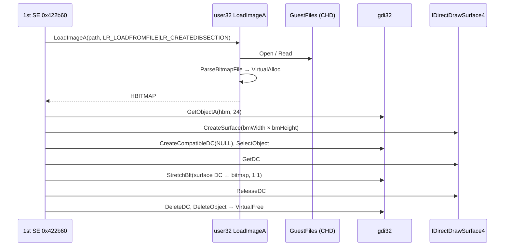

# 작업 421 설계 — 파일에서 읽는 비트맵 / Task 421 design — bitmaps loaded from files

선행: [작업 420 설계](20260928-420-1stse-chd-linux.md)

## 배경 / Background

작업 420에서 Linux의 1st SE CHD는 Hardlock과 `SetBkColor`를 지나 호출 1305번째 `user32!LoadImageA`에서 멈췄다. 작업 419의 1st도 같은 곳에서 멈췄다. 1st SE의 복호화 이미지(`--image-dump`, 원본 자산이라 커밋하지 않음)에서 호출 경로를 확인했다. 확인됨.

- `0x422b60`(이미지 등록): `wsprintfA("%s.bmp")`를 부르고, `CreateFileA`/`CloseHandle`로 파일이 있는지 본다. 이어서 `LoadImageA(NULL, path, IMAGE_BITMAP, 0, 0, LR_LOADFROMFILE | LR_CREATEDIBSECTION)`를 부른다. NULL이 오면 `0x422a20`의 대체 그림으로 넘어간다: 128×128 24비트 DIB section을 빨강(`0x7f0000`)으로 채우고 파일 이름을 쓴다. 성공하면 `Sleep(1)`, `GetObjectA(hbm, 24, &bm)`을 부르고, `0x422760`에 `bmWidth`와 `bmHeight`를 넘긴다. 마지막에 `DeleteObject(hbm)`를 부른다.
- `0x422760`: `IDirectDraw4::CreateSurface`로 texture surface를 만든다. 크기는 비트맵 크기다. 다만 전역 `0x1462880`의 비트 2나 `0x20`이 켜져 있으면 2의 거듭제곱이나 정사각형으로 키운다. 이 전역은 `IDirect3DDevice3::GetCaps`가 준 HAL 설명의 삼각형 `dwTextureCaps`(`D3DDEVICEDESC` +0x84)다. 즉 `D3DPTEXTURECAPS_POW2`와 `SQUAREONLY`다. facade는 둘 다 보고하지 않는다(`direct3d_description.cpp`). 그래서 surface는 비트맵과 같은 크기다.
- `0x4228e0`(DDCopyBitmap 형태): `CreateCompatibleDC(NULL)`, `SelectObject(dc, hbm)`, `surface->GetDC`를 부른다. 이어서 `StretchBlt(surface_dc, 0, 0, dx, dy, dc, 0, 0, bmWidth, bmHeight, SRCCOPY)`, `surface->ReleaseDC`, `DeleteDC(dc)`를 부르고, 필요하면 `SetColorKey`를 부른다.

자산의 BMP는 7,360개다. 전부 `BITMAPINFOHEADER`, `BI_RGB`, bottom-up이다. 7,355개가 24비트, 5개가 8비트(`biClrUsed` 0, 256색 표)다(`roms/ez2dj1stse/ez2dj` 전수 조사).

*In Task 420 the 1st SE CHD on Linux got past the Hardlock and `SetBkColor` and stopped at `user32!LoadImageA` (call 1305), where 1st stopped in Task 419 too. The call path was confirmed in 1st SE's decrypted image (`--image-dump`; an original asset, not committed):*
- *`0x422b60` (image registration) calls `wsprintfA("%s.bmp")` and checks the file exists with `CreateFileA`/`CloseHandle`, then calls `LoadImageA(NULL, path, IMAGE_BITMAP, 0, 0, LR_LOADFROMFILE | LR_CREATEDIBSECTION)`. On NULL it falls back to `0x422a20`, a 128×128 24-bit DIB section filled red (`0x7f0000`) and labelled with the file name. On success it calls `Sleep(1)` and `GetObjectA(hbm, 24, &bm)`, hands `bmWidth` and `bmHeight` to `0x422760`, and finally calls `DeleteObject(hbm)`.*
- *`0x422760` creates the texture surface with `IDirectDraw4::CreateSurface` at the bitmap's size, grown to a power of two or a square only when bit 2 or `0x20` of the global `0x1462880` is set. That global is the HAL description's triangle `dwTextureCaps` (`D3DDEVICEDESC` +0x84) from `IDirect3DDevice3::GetCaps`, i.e. `D3DPTEXTURECAPS_POW2` and `SQUAREONLY`. The facade reports neither (`direct3d_description.cpp`), so the surface matches the bitmap.*
- *`0x4228e0` (the DDCopyBitmap shape) calls `CreateCompatibleDC(NULL)`, `SelectObject(dc, hbm)`, and `surface->GetDC`, then `StretchBlt(surface_dc, 0, 0, dx, dy, dc, 0, 0, bmWidth, bmHeight, SRCCOPY)`, `surface->ReleaseDC`, and `DeleteDC(dc)`, and `SetColorKey` when asked.*

*The assets hold 7,360 BMPs, all `BITMAPINFOHEADER`, `BI_RGB`, bottom-up: 7,355 at 24 bits and 5 at 8 bits (`biClrUsed` 0, a 256-color table), from a full survey of `roms/ez2dj1stse/ez2dj`.*

## Windows 측정 / Windows measurements

Windows 11에서 32비트 probe로 측정했다(`scratchpad/bmp421/probe.cpp`, `stretch.cpp`).

| 호출 | 결과 |
| --- | --- |
| `LoadImageA`, 24비트 3×2 bottom-up | 핸들. last error를 **0으로** 둔다. `GetObjectA(24)`: type 0, w 3, h 2, widthBytes 12, planes 1, bpp 24, bits ≠ NULL |
| 그 비트 | 파일의 행 순서(bottom-up) 그대로. 행 끝 padding은 파일 값이 아니라 0. page 시작, `PAGE_READWRITE`, `MEM_PRIVATE` |
| `LoadImageA`, 8비트 2×2 | bpp 8, widthBytes 4, index 바이트 그대로 |
| `LoadImageA`, 없는 파일 / 없는 디렉터리 | NULL, 2(둘 다 `ERROR_FILE_NOT_FOUND`) |
| `LoadImageA`, `BM`이 아닌 파일 | NULL, 0 |
| `GetObjectA(hbm, cb, buf)` | cb 24·30 → 24(BITMAP), cb 84 → 84(DIBSECTION), cb 10 → 0, buf NULL → 24. last error 그대로 |
| `CreateCompatibleDC(NULL)` | DC. 기본 비트맵은 `0x0085000F`(1×1, 1비트, widthBytes 2, bits NULL). last error 그대로 |
| `SelectObject(dc, hbm)` | 이전 비트맵. 다른 DC에 이미 선택된 비트맵은 0. 가짜 DC는 0과 6. 가짜 객체는 0이고 last error 그대로 |
| 선택된 비트맵의 `DeleteObject` | TRUE. 그 뒤에도 그 DC로 그릴 수 있다. 선택이 풀리면 없어진다(그 뒤 `DeleteObject`는 FALSE) |
| `DeleteDC` | TRUE. 두 번째와 NULL은 FALSE이고 last error 그대로 |
| 기본 stretch mode | `BLACKONWHITE`(1) |
| `StretchBlt` 같은 크기, 24비트 → RGB565 | 원본의 위 행이 대상의 위 행. 채널은 GDI 규칙대로 자른다: (10,20,30) → `0x08A3`. TRUE, last error 그대로 |
| `StretchBlt` 8비트 → RGB565 | 색표를 거쳐 같은 규칙 |
| `StretchBlt` 대상 밖 | 잘린다 |
| `StretchBlt` 가짜 원본·대상 DC | FALSE, 6 |
| `StretchBlt` 확대 | 규칙을 하나로 정하지 못했다. 3→8은 `0,0,0,1,1,2,2,2`다. 3→4는 2행 원본을 4행으로 늘릴 때 `0,1,1,2`이고, 1행 그대로일 때 `0,1,2,2`다. 15→16은 `0..14,14`다. **미확정** |

*Measured with 32-bit probes on Windows 11 (`scratchpad/bmp421/probe.cpp`, `stretch.cpp`); the table's findings, in brief:*
- *`LoadImageA` on a 24-bit 3×2 bottom-up file gives a handle and sets the last error to **0**; `GetObjectA(24)` reports type 0, 3×2, widthBytes 12, 1 plane, 24 bpp, and non-NULL bits.*
- *The bits keep the file's row order (bottom-up) with each row's padding zeroed rather than copied, in page-aligned `PAGE_READWRITE` `MEM_PRIVATE` memory.*
- *An 8-bit 2×2 file keeps its index bytes (bpp 8, widthBytes 4).*
- *A missing file or directory gives NULL with 2 in both cases (`ERROR_FILE_NOT_FOUND`); a file not starting with `BM` gives NULL with 0.*
- *`GetObjectA` returns 24 (BITMAP) for cb 24 or 30, 84 (DIBSECTION) for cb 84, 0 for cb 10, and 24 for a NULL buffer, leaving the last error alone.*
- *`CreateCompatibleDC(NULL)` gives a DC whose default bitmap is `0x0085000F` (1×1, 1 bit, widthBytes 2, NULL bits), leaving the last error alone.*
- *`SelectObject` returns the previous bitmap. A bitmap already selected in another DC gives 0, a bogus DC gives 0 with 6, and a bogus object gives 0 with the last error untouched.*
- *`DeleteObject` of a selected bitmap returns TRUE and the DC still draws with it; it goes once deselected (a later `DeleteObject` is FALSE).*
- *`DeleteDC` returns TRUE; a second call or NULL is FALSE, with the last error untouched. The default stretch mode is `BLACKONWHITE` (1).*
- *Same-size `StretchBlt` from 24 bits to RGB565 puts the source's top row at the destination's top and truncates channels by the GDI rules ((10,20,30) → `0x08A3`), returning TRUE with the last error untouched. 8 bits go through the color table the same way. Destination pixels outside the bitmap are clipped, and a bogus source or destination DC gives FALSE with 6.*
- *No single rule fits enlarging: 3→8 maps `0,0,0,1,1,2,2,2`, 3→4 maps `0,1,1,2` with a 2-row source stretched to 4 rows but `0,1,2,2` with a 1-row source left as is, and 15→16 maps `0..14,14`. **Unresolved**.*

## 결정 / Decisions

1. **BMP 파일 해석은 공용 core로.** `hle/bitmap_file.h`는 BMP 파일 바이트를 DIB로 바꾼다(`ParseBitmapFile`): 크기, 깊이, 색표, DWORD 정렬 행(padding 0). 결과는 셋이다.
   - 읽음: `BITMAPINFOHEADER`, `BI_RGB`, 24·8비트, bottom-up.
   - BMP가 아님: `BM`으로 시작하지 않는다.
   - 모형 없음: 그 밖의 형식. 자산에 없으므로 멈춘다.

   *BMP parsing is a shared core. `hle/bitmap_file.h` turns a BMP file's bytes into a DIB (`ParseBitmapFile`): size, depth, color table, and DWORD-aligned rows with zeroed padding. There are three outcomes:*
   - *read: `BITMAPINFOHEADER`, `BI_RGB`, 24 or 8 bits, bottom-up;*
   - *not a bitmap: the bytes do not start with `BM`;*
   - *not modelled: any other format, absent from the assets, which stops.*

2. **`LoadImageA`.** `hInst` NULL, `IMAGE_BITMAP`, 크기 0, `LR_LOADFROMFILE | LR_CREATEDIBSECTION`만 받는다. 다른 조합은 멈춘다.
   - 파일은 `GuestFiles`로 연다(현재 디렉터리 기준 상대 경로).
   - 열지 못하면 NULL과 2다. BMP가 아니면 NULL과 0이다.
   - 성공하면 비트를 `VirtualAlloc`(commit, RW)한 게스트 메모리에 쓰고, `GuestBitmap`(bottom-up, 소유한 비트)으로 등록한다. last error는 0이다.

   *`LoadImageA` takes only a NULL `hInst`, `IMAGE_BITMAP`, zero sizes, and `LR_LOADFROMFILE | LR_CREATEDIBSECTION`; anything else stops. The file opens through `GuestFiles`, relative to the current directory. An open failure gives NULL with 2, and a file that is no bitmap NULL with 0. On success the bits go into guest memory from `VirtualAlloc` (commit, RW) and register as a `GuestBitmap` (bottom-up, owning its bits), with the last error 0.*

3. **gdi32.** 측정대로 구현한다.
   - `GetObjectA`: 비트맵 대상, BITMAP만. 84바이트 이상의 DIBSECTION은 필드 일부를 측정하지 않아 멈춘다.
   - `CreateCompatibleDC`: NULL만 받는다. 기본 비트맵은 `0x0085000F`다.
   - `SelectObject`: 비트맵만 받는다. 브러시 등 다른 객체는 멈춘다.
   - `DeleteDC`.
   - `StretchBlt`: `SRCCOPY`만 받는다. 원본과 대상 크기가 같아야 하고, 원본 사각형이 원본 안에 있어야 한다. 원본은 24·8비트, 대상은 16비트다. 확대·축소는 대응 규칙이 미확정이라 멈춘다.
   - `DeleteObject`: 선택되지 않은 비트맵은 곧바로 없애고 비트를 `VirtualFree`한다. 선택된 비트맵은 TRUE를 주고 해제를 미룬다. 선택이 풀리거나 그 DC가 없어질 때 없앤다.

   *gdi32, as measured:*
   - *`GetObjectA` of a bitmap, BITMAP only; a DIBSECTION of 84 bytes or more stops, since some of its fields were not measured.*
   - *`CreateCompatibleDC` of NULL only, with the default bitmap `0x0085000F`.*
   - *`SelectObject` of bitmaps only; brushes and other objects stop.*
   - *`DeleteDC`.*
   - *`StretchBlt` with `SRCCOPY` only, equal source and destination extents, and a source rectangle inside the source, from 24 or 8 bits into 16 bits. Enlarging or shrinking stops, since its mapping is unresolved.*
   - *`DeleteObject` deletes an unselected bitmap at once and `VirtualFree`s its bits. A selected bitmap gets TRUE with deletion deferred until it is deselected or its DC goes.*

4. **1:1 복사를 행 단위로.** `StretchBlt`는 원본의 화면 행 y를 대상의 y행에 쓴다. bottom-up 원본의 메모리 행은 `height - 1 - y`다. 채널 변환은 `ConvertGdiPixel`, 8비트는 색표 항목(`0x00RRGGBB`)을 `kGdiBgr888`로 읽는다.
   *Row-by-row 1:1 copy: `StretchBlt` writes the source's screen row y to the destination's row y; a bottom-up source's memory row is `height - 1 - y`. Channels convert with `ConvertGdiPixel`, and 8 bits read their color-table entry (`0x00RRGGBB`) as `kGdiBgr888`.*

## 흐름 / Flow

## 검증 / Verification

- 단위 테스트: `ParseBitmapFile`(24·8비트, padding, BMP 아님, 모형 없음), `LoadImageA`(측정된 결과·last error·비트), `GetObjectA`·`SelectObject`·`DeleteDC`·`DeleteObject` 미룸, `StretchBlt` 1:1(측정 화소값)과 멈춤 조건.
- Linux x64·x86과 Windows x86에서 CTest. Linux 1st SE 실행으로 경계가 넘어가는지 본다.

*Unit tests for `ParseBitmapFile` (24 and 8 bits, padding, not a bitmap, not modelled), `LoadImageA` (the measured results, last error, and bits), `GetObjectA`, `SelectObject`, `DeleteDC`, deferred `DeleteObject`, and 1:1 `StretchBlt` (the measured pixel values) with its stopping conditions. CTest on Linux x64, x86, and Windows x86; a Linux 1st SE run shows whether the boundary is passed.*
