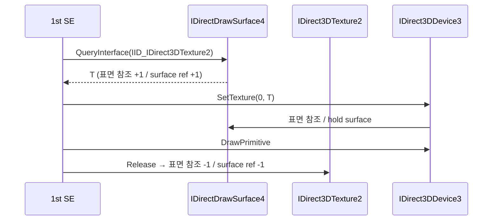

# 작업 422 설계 — Linux DX6 texture / Task 422 design — DX6 textures on Linux

선행: [작업 421 설계](20260928-421-bitmap-files.md)

## 배경 / Background

작업 421 뒤 Linux의 1st SE CHD는 비트맵을 texture surface에 복사한 뒤 `IDirectDrawSurface4::QueryInterface(IID_IDirect3DTexture2)`(호출 1317, 반환 `0x4228cd`)에서 멈춘다. 확인됨: 요청 IID `93281502-8CF8-11D0-89AB-00A0C9054129`는 복호화 이미지의 `0x458618`에 있다. 결과는 이미지 항목의 +0x10에 둔다.

Windows facade(`direct3d3_com_facade.cpp`, 작업 066·088)는 이미 이 경로로 1st SE를 게임플레이까지 돌렸다. 그 규칙은 다음과 같다.

- texture 인터페이스는 표면 객체 안의 두 번째 인터페이스로, 표면과 참조 수를 공유한다.
- `QueryInterface(IID_IDirect3DTexture2)`는 texture caps 표면에만 준다.
- `GetHandle`과 `PaletteChanged`는 `DDERR_UNSUPPORTED`다.
- `Load`는 같은 root·같은 크기의 texture 표면 사이에서 행과 source color key를 복사한다.
- `IDirect3DDevice3::SetTexture`는 stage 0만 받고, texture가 아니면 `DDERR_INVALIDOBJECT`다.

*After Task 421, the 1st SE CHD on Linux copies the bitmap onto its texture surface, then stops at `IDirectDrawSurface4::QueryInterface(IID_IDirect3DTexture2)` (call 1317, return `0x4228cd`). Confirmed: the requested IID `93281502-8CF8-11D0-89AB-00A0C9054129` sits at `0x458618` in the decrypted image, and the result goes to the image entry's +0x10.*

*The Windows facade (`direct3d3_com_facade.cpp`, tasks 066 and 088) already ran 1st SE to gameplay through this path, under these rules:*
- *the texture interface is a second interface of the surface object, sharing its reference count;*
- *`QueryInterface(IID_IDirect3DTexture2)` gives it only for a surface with texture caps;*
- *`GetHandle` and `PaletteChanged` answer `DDERR_UNSUPPORTED`;*
- *`Load` copies rows and the source color key between texture surfaces of the same root and size;*
- *`IDirect3DDevice3::SetTexture` takes stage 0 only and answers `DDERR_INVALIDOBJECT` for anything that is not a texture.*

## 결정 / Decisions

작업 416의 사용자 지시대로, DirectDraw·Direct3D가 아닌 미구현 API가 나올 때까지 DX6 호출을 이 작업에서 이어서 추가한다. 동작은 Windows facade를 따른다.
*As the user directed in Task 416, DX6 calls are added in this task until an unimplemented API outside DirectDraw and Direct3D appears, following the Windows facade.*

1. **texture 객체.** Linux COM 블록은 vtable 하나만 가지므로 texture는 따로 된 `IDirect3DTexture2` 블록이다(`ddraw_texture2.cpp`).
   - 표면 상태가 그 블록을 소유한다. 처음 요청될 때 만들고, 표면이 사라질 때 함께 없앤다.
   - texture 블록은 자기 표면 주소만 안다.
   - `AddRef`와 `Release`는 표면의 참조 수를 바꾸고 그 값을 돌려준다. 그래서 참조 수 공유가 Windows facade와 같다.
   - `QueryInterface`는 표면의 규칙을 따른다: `IUnknown`·`IDirectDrawSurface4`는 표면, `IDirect3DTexture2`는 texture다.

   *The texture object: a Linux COM block has one vtable, so the texture is a separate `IDirect3DTexture2` block (`ddraw_texture2.cpp`).*
   - *The surface's state owns the block, made on first request and freed with the surface.*
   - *The texture block knows only its surface's address.*
   - *`AddRef` and `Release` change the surface's count and return it, sharing the count as the Windows facade does.*
   - *`QueryInterface` follows the surface's rules: `IUnknown` and `IDirectDrawSurface4` give the surface, `IDirect3DTexture2` the texture.*

2. **표면 `QueryInterface`.** DX6 표면에 `IID_IDirect3DTexture2`를 요청하면 texture를 주고 표면 참조를 하나 늘린다. 조건은 texture caps다. texture가 아닌 표면이나 다른 IID는 전처럼 멈춘다. 1st SE가 그런 요청을 하지 않아 모형을 두지 않는다.
   *Surface `QueryInterface`: asking a DX6 surface with texture caps for `IID_IDirect3DTexture2` gives the texture and adds a surface reference. A non-texture surface or another IID stops as before; 1st SE makes no such request, so none is modelled.*

3. **texture method.** 모두 Windows facade와 같다.
   - `GetHandle`, `PaletteChanged`: `DDERR_UNSUPPORTED`.
   - `Load(source)`: 다음 순서로 확인하고 답한다.
     1. NULL은 `DDERR_INVALIDPARAMS`다.
     2. 자기 자신이면 `DD_OK`다.
     3. facade texture가 아니거나 root가 다르면 `DDERR_INVALIDOBJECT`다.
     4. 크기가 다르면 `D3DERR_TEXTURE_LOAD_FAILED`다.
     5. 어느 한쪽 DC를 게스트가 잡고 있으면 `DDERR_SURFACEBUSY`다.
     6. 그 밖에는 행을 복사하고 행 끝 padding을 0으로 채운다. source color key도 복사하고 revision을 올린다.

   *Texture methods, all as in the Windows facade:*
   - *`GetHandle` and `PaletteChanged`: `DDERR_UNSUPPORTED`.*
   - *`Load(source)`, checked and answered in this order: NULL is `DDERR_INVALIDPARAMS`; itself is `DD_OK`; not a facade texture or another root is `DDERR_INVALIDOBJECT`; another size is `D3DERR_TEXTURE_LOAD_FAILED`; a DC the guest holds on either side is `DDERR_SURFACEBUSY`; otherwise the rows are copied with each row's padding zeroed, the source color key copied, and the revision raised.*

4. **`IDirect3DDevice3::SetTexture(stage, texture)`.** texture를 표면으로 바꾼 뒤 DX7 `SetTexture`와 같은 규칙과 상태를 쓴다. 장치는 표면 참조를 잡는다. texture 블록이 아닌 값은 `DDERR_INVALIDOBJECT`다.
   *`IDirect3DDevice3::SetTexture(stage, texture)` turns the texture into its surface and then uses DX7 `SetTexture`'s rules and state, the device holding a surface reference; a value that is no texture block is `DDERR_INVALIDOBJECT`.*

5. **ABI.** `kIidDirect3DTexture2`, `kD3dErrTextureLoadFailed`, `kDdErrSurfaceBusy`를 `abi.h`에 둔다. Windows 쪽 `directx_abi_windows.h`가 두 오류 값을 SDK와 대조한다.
   *ABI: `kIidDirect3DTexture2`, `kD3dErrTextureLoadFailed`, and `kDdErrSurfaceBusy` go in `abi.h`; the Windows `directx_abi_windows.h` checks the two error values against the SDK.*

## 흐름 / Flow

## 검증 / Verification

- 단위 테스트
  - `QueryInterface`: texture 표면과 비 texture 표면, 같은 블록 재사용.
  - 참조 수 공유: texture의 AddRef/Release가 표면 수를 바꾼다.
  - `GetHandle`/`PaletteChanged`.
  - `Load`의 각 오류와 복사(행·padding·color key).
  - `IDirect3DDevice3::SetTexture`의 stage·객체 검사와 참조.
- Linux x64·x86과 Windows x86에서 CTest. Linux 1st SE 실행.

*Unit tests: `QueryInterface` on texture and non-texture surfaces and reuse of the same block; the shared count (texture AddRef/Release change the surface's count); `GetHandle`/`PaletteChanged`; each `Load` error and the copy (rows, padding, color key); `IDirect3DDevice3::SetTexture`'s stage and object checks and references. CTest on Linux x64, x86, and Windows x86; a Linux 1st SE run.*

## 진행 기록 / Progress

### 1. texture 뒤에 이어진 DX 호출 / The DX calls that followed the texture

texture를 더한 뒤 1st SE는 다음 DX 호출에서 차례로 멈췄다. 모두 Windows DX6 facade를 따라 더했다. 대상 밖 호출은 없었다.
*After the texture, 1st SE stopped at the following DX calls in turn, each added after the Windows DX6 facade; no call outside DirectX came up.*

| 멈춘 호출 / stopped at | 호출 번호 / call | 더한 것 / added |
| --- | --- | --- |
| `IDirectDrawSurface4::Blt`(`DDBLT_COLORFILL`) | 1312 | 색 채우기. 전체 채우기가 표시 표면이면 host target도 지운다(`Clear`와 같게) / color fill; a whole fill of the presented surface also clears the host target, as `Clear` does |
| `IDirectDraw4::RestoreAllSurfaces` | 4421 | `DD_OK`(DX7과 같다) / `DD_OK`, as DX7 |
| `IDirect3DDevice3::SetLightState` | 4459 | `Set/GetLightState`, 공용 core 규칙 / the shared core's rules |
| `IDirect3D3::CreateVertexBuffer` | 61199 | DX7 버퍼 공유, `IDirect3DVertexBuffer`(8개 method) vtable. `DrawPrimitiveVB`는 DX7 handler, DX6 `DrawIndexedPrimitiveVB`(인자 다름)는 facade 규칙 / DX7 buffers with the 8-method `IDirect3DVertexBuffer` vtable; `DrawPrimitiveVB` reuses DX7's handler, DX6 `DrawIndexedPrimitiveVB` (other arguments) follows the facade |
| `IDirectDrawSurface4::BltFast` | 84351 | 표면 복사와 source color key. primary면 표시, back buffer면 host에도 textured quad로 그린다 / surface copy with the source color key; onto the primary it presents, onto a back buffer it is also drawn on the host as a textured quad |
| `IDirectDrawSurface4::Blt`(source, `DDBLT_KEYSRC`) | 430092 | 같은 크기 사각형 사이의 `BltFast` 복사. 늘이기는 `DDERR_UNSUPPORTED` / `BltFast`'s copy between equal rectangles; a stretch is `DDERR_UNSUPPORTED` |

이 호출들이 쓰는 값은 `abi.h`에 두고 Windows에서 SDK와 대조한다: `DDERR_INVALIDRECT`, `DDERR_NOCOLORKEY`, `DDBLT_COLORFILL`·`KEYSRC`·`WAIT`, `DDBLTFAST_SRCCOLORKEY`·`WAIT`, `DDBLTFX` 크기와 `dwFillColor` 위치.
*The values these calls use live in `abi.h`, checked against the SDK on Windows: `DDERR_INVALIDRECT`, `DDERR_NOCOLORKEY`, `DDBLT_COLORFILL`/`KEYSRC`/`WAIT`, `DDBLTFAST_SRCCOLORKEY`/`WAIT`, and the `DDBLTFX` size and `dwFillColor` offset.*

그 뒤 1st SE는 멈추지 않는다. 시간 제한으로 창이 닫힐 때까지 돈다(x64, 500초, 983,378호출).
*After that 1st SE no longer stops: it runs until the timeout closes its window (x64, 500 s, 983,378 calls).*
