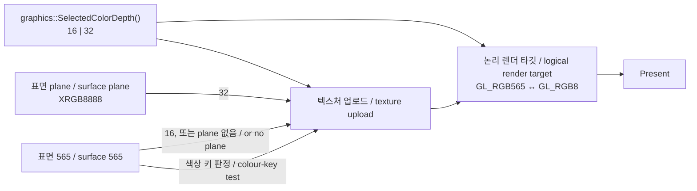
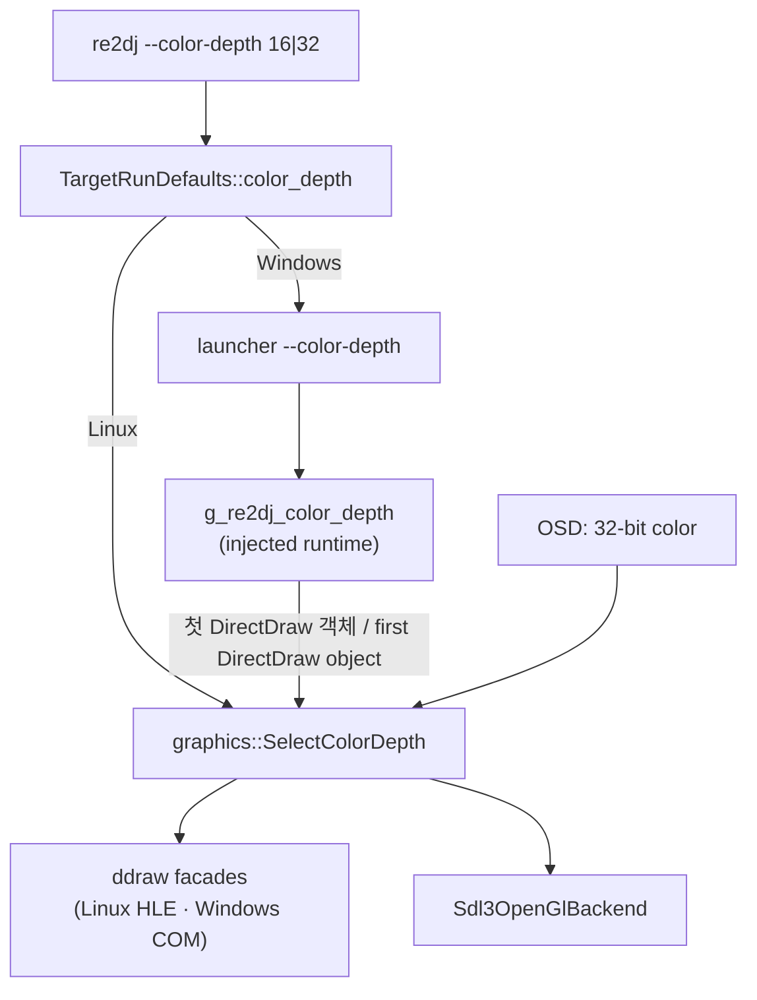

# 작업 429 설계 — 32비트 트루컬러 표면 선택 옵션 / Task 429 design — an optional 32-bit true-color surface mode

## 배경 / Background

원본은 모두 `SetDisplayMode(640, 480, 16)`을 부른다(1st SE `0x0041f82e`, 4th `0x00410a72`, 실행 로그로 확인). HLE는 처음부터 끝까지 RGB565로만 그린다.

- guest 메모리의 표면 픽셀
- `EnumTextureFormats`가 알리는 텍스처 형식
- OpenGL 논리 렌더 타깃(`GL_RGB565`)
- Clear, readback, 색상 키 비교

그래서 원본 자산이 더 깊은 색을 가져도 화면에는 565로 깎인 색만 나온다. 반투명을 겹칠 때마다 결과도 565로 다시 양자화되므로, 그라데이션에 띠(banding)가 생긴다.

*Every original calls `SetDisplayMode(640, 480, 16)` (1st SE at `0x0041f82e`, 4th at `0x00410a72`, confirmed in run logs), and the HLE draws in RGB565 from end to end:*

- *surface pixels in guest memory;*
- *the texture format `EnumTextureFormats` announces;*
- *the OpenGL logical render target (`GL_RGB565`);*
- *clears, readback, and colour-key comparison.*

*So even when the original assets carry deeper colour, the screen only shows it cut down to 565, and every translucent layer is quantized to 565 again, which bands gradients.*

**확인됨 — 1st SE 자산의 색 깊이.** 1st SE 실행 로그 `20260928-141813-648.api.log`에는 `GetObjectA` 결과가 있다. 원본이 불러온 BMP의 `BITMAP.bmBitsPixel`은 모두 24다. 따라서 565로 깎이는 정밀도가 실제로 존재한다.

***Confirmed — the colour depth of 1st SE's assets.** 1st SE run log `20260928-141813-648.api.log` records `GetObjectA` results, and every BMP the original loads has `BITMAP.bmBitsPixel` 24. The precision lost to 565 is therefore real.*

사용자는 텍스처와 표면까지 32비트로 다루는 방식(C안)을 선택 옵션으로 요청했다. OSD에서도 바꿀 수 있어야 한다.

*The user asked for the approach that carries textures and surfaces at 32 bits as well (option C), as an option that can also be switched from the OSD.*

## 결정 / Decisions

### 1. 게스트가 보는 계약은 바꾸지 않는다 / The guest-visible contract does not change

C안의 목표는 "텍스처와 표면이 24비트 원본 색을 잃지 않는 것"이다. 이것을 게스트에게 32비트 형식을 알리는 방식으로 하지 않는다. 호스트 쪽에 32비트 사본을 두는 방식으로 한다. 게스트는 32비트 모드에서도 지금과 똑같은 것을 본다.

- `SetDisplayMode`는 640×480×16만 받는다.
- `GetPixelFormat`, `GetSurfaceDesc`, `EnumTextureFormats`는 RGB565를 답한다.
- 표면 메모리, pitch, `Lock`이 주는 픽셀은 RGB565다.
- `SetColorKey` 값은 RGB565로 해석한다.

*Option C's goal is that textures and surfaces do not lose the assets' 24-bit colour. It is not reached by announcing 32-bit formats to the guest, but by keeping a 32-bit copy on the host side. In 32-bit mode the guest sees exactly what it sees today:*

- *`SetDisplayMode` accepts only 640×480×16;*
- *`GetPixelFormat`, `GetSurfaceDesc`, and `EnumTextureFormats` answer RGB565;*
- *surface memory, pitch, and the pixels `Lock` hands out are RGB565;*
- *`SetColorKey` values are read as RGB565.*

근거는 다음과 같다.

1. 원본 게임 로직과 실행 파일을 건드리지 않는다(AGENTS.md 우선순위 1·2).
2. 원본이 32비트 형식을 받았을 때 어떻게 동작하는지 분석할 필요가 없다. 텍스처 형식 선택 콜백(1st SE `0x00422e50`)과 색상 키 계산이 그 예다. 그래서 모든 타깃에 같은 방식으로 적용된다.
3. 실행 중에 켜고 끌 수 있다. 게스트가 한번 고른 형식은 되돌릴 수 없지만, 호스트 사본은 언제든 바꿀 수 있다.

*The reasons:*

1. *The original game logic and executable stay untouched (AGENTS.md priorities 1 and 2).*
2. *There is no need to analyse how an original behaves when offered 32-bit formats, such as its texture-format callback (1st SE `0x00422e50`) and its colour-key arithmetic, so the same approach applies to every target.*
3. *It can be switched while running: a format the guest has chosen cannot be taken back, but the host's copy can change at any time.*

**예외 — Windows의 GDI DC.** Windows host는 GDI 래스터화를 실제 Windows GDI에 맡긴다. 24비트 원본 색을 잃지 않고 받으려면, 32비트 모드의 `GetDC`는 32bpp DIB가 선택된 DC를 돌려줘야 한다. 이 DC에 `GetDeviceCaps(BITSPIXEL)`, `GetObject`, `GetPixel`을 부르면 32비트가 보인다. 1st SE 로그에서 게임은 표면 DC에 `StretchBlt`/`BitBlt`만 부른다(**추정**: 다른 타깃도 같음). 16비트 모드는 지금과 같다. Linux는 GDI를 직접 구현하므로 DC는 모드와 관계없이 16비트다.

***Exception — the GDI DC on Windows.** The Windows host leaves GDI rasterization to real Windows GDI, so to receive the 24-bit colour intact, `GetDC` in 32-bit mode must return a DC with a 32bpp DIB selected. `GetDeviceCaps(BITSPIXEL)`, `GetObject`, or `GetPixel` on that DC see 32 bits. In the 1st SE logs the game only calls `StretchBlt`/`BitBlt` on a surface DC (**inferred**: the other targets do the same). 16-bit mode is unchanged. Linux implements GDI itself, so its DC stays 16-bit in either mode.*

### 2. 트루컬러 plane / The true-color plane

픽셀이 있는 표면마다 호스트 메모리에 XRGB8888 plane을 하나 둘 수 있다. plane은 위에서 아래로 행을 저장하고, 표면과 크기가 같다. 모든 plane은 다음 **불변식**을 지킨다.

> plane 픽셀의 채널을 하위 비트를 버려 5-6-5로 줄이면, guest 메모리의 RGB565 픽셀과 같다.

줄이는 규칙은 GDI가 Windows 11에서 채널을 좁힐 때와 같다(`ConvertGdiChannel`, 측정값). 넓히는 쪽인 "RGB565만 있는 픽셀의 plane 값"은 backend가 지금 텍스처를 올릴 때 쓰는 식과 같다: `c * 255 / 31`(초록은 `/ 63`). 이 값을 다시 줄이면 원래 565 값이 나온다.

*Each surface with pixels can have one XRGB8888 plane in host memory, the same size as the surface, rows top-down. Every plane keeps this **invariant**:*

> *Narrowing a plane pixel's channels to 5-6-5 by dropping low bits gives the guest-memory RGB565 pixel.*

*The narrowing rule is the one GDI uses when it narrows a channel on Windows 11 (`ConvertGdiChannel`, measured). The widening rule, the plane value of a pixel known only as RGB565, is the one the backend already uses to upload textures: `c * 255 / 31` (`/ 63` for green), which narrows back to the original 565 value.*

**plane이 생기는 때.** plane은 32비트 모드에서만 새로 만든다.

- 32비트 모드에서 만든 표면은 처음부터 plane을 가진다. 0으로 채운 565 메모리와 plane은 둘 다 검정이다.
- 16비트 모드에서 만든 표면은, 32비트 모드에서 처음 필요할 때 565에서 넓혀 plane을 만든다. 필요한 때는 `GetDC`, 텍스처 뷰, 정밀한 쓰기의 대상이 될 때다.

한번 생긴 plane은 표면이 해제될 때까지 두 모드 모두에서 유지·갱신한다. 16비트 모드만 쓰는 실행은 plane을 만들지 않으므로 비용이 없다.

***When a plane exists.** Planes are only created in 32-bit mode:*

- *A surface made in 32-bit mode has one from the start; its zeroed 565 memory and its plane are both black.*
- *A surface made in 16-bit mode gets one, widened from 565, the first time 32-bit mode needs it: at `GetDC`, a texture view, or as the target of a precise write.*

*Once made, a plane is kept and updated in either mode until its surface is released. A run that stays in 16-bit mode never makes one and pays nothing.*

**화해(reconcile) 규칙.** 게스트가 565를 직접 바꿨을 수 있는 경로가 있다(`Unlock`, Windows 16비트 모드의 `ReleaseDC`). 이 경로 뒤에는 영역 안의 각 픽셀을 다음 규칙으로 plane에 맞춘다.

- plane을 줄인 값이 지금 565와 같으면 plane을 그대로 둔다.
- 다르면 565를 넓힌 값으로 바꾼다.

그래서 게스트가 건드리지 않은 픽셀은 24비트 정밀도를 잃지 않는다. 한계도 있다. 게스트가 같은 565 칸 안의 다른 색으로 바꾼 픽셀은 이전 plane 값이 남는다. 565 수준에서는 구별되지 않는 차이다.

***The reconcile rule.** Some paths may have had the guest change 565 directly (`Unlock`, and `ReleaseDC` in Windows 16-bit mode). After them, each pixel in the area is matched to the plane:*

- *if the narrowed plane value still equals the 565 pixel, the plane pixel stays;*
- *otherwise it becomes the widened 565 value.*

*Pixels the guest did not touch therefore keep their 24-bit precision. The limit: a pixel the guest changed to another colour inside the same 565 cell keeps its previous plane value, a difference invisible at 565.*

### 3. 표면에 쓰는 경로 / Paths that write surfaces

| 경로 / Path | 565 (게스트) / 565 (guest) | plane |
|---|---|---|
| GDI `StretchBlt`/`StretchDIBits`/`FillRect`/`DrawText` (Linux) | 지금 그대로 / as today | 같은 원본 픽셀을 32비트로 변환해 같이 쓴다 / the same source pixel converted to 32 bits, written alongside |
| GDI 전체 (Windows, 32비트 모드) / all GDI (Windows, 32-bit mode) | `ReleaseDC`에서 plane을 줄여 쓴다 / plane narrowed at `ReleaseDC` | DC가 32bpp DIB라 GDI가 직접 쓴다 / GDI writes it directly through the 32bpp DIB DC |
| GDI 전체 (Windows, 16비트 모드) / all GDI (Windows, 16-bit mode) | GDI가 565 DIB에 쓴다 / GDI writes the 565 DIB | `ReleaseDC`에서 화해 / reconciled at `ReleaseDC` |
| `Blt`/`BltFast` 복사 / copy | 지금 그대로 / as today | 원본 plane을 복사하거나, 없으면 565를 넓혀 쓴다. 색상 키는 565로 판정한다 / copies the source plane, or the widened 565 when there is none; the colour key is tested on 565 |
| `DDBLT_COLORFILL` | 지금 그대로 / as today | 565 채움 색을 넓혀 채운다 / fills with the widened 565 colour |
| 장치 `Clear` / device `Clear` | 지금 그대로 / as today | 32비트 모드면 `D3DCOLOR`의 RGB 그대로 / the `D3DCOLOR` RGB as given, in 32-bit mode |
| `IDirect3DTexture2::Load` | 지금 그대로 / as today | 원본 plane 복사, 없으면 넓힘 / copies the source plane, or widens |
| `Lock`/`Unlock` | 게스트가 쓴다 / the guest writes | `Unlock`에서 잠근 영역을 화해 / the locked area is reconciled at `Unlock` |

변환은 공용 `graphics` 코어 함수로 한다. 두 host가 같은 규칙을 따른다.

*Conversions go through shared `graphics` core functions, so both hosts follow the same rules.*

### 4. render backend / The render backend

- **렌더 타깃 형식.** 모드가 32비트면 논리 렌더 타깃을 `GL_RGB8`로 둔다. 알파 채널이 없어야 `DESTALPHA` 블렌드가 지금처럼 1.0을 읽는다(원본의 16비트 표면에도 알파가 없다). 모드가 바뀌면 다음 GL 연산 때 렌더 타깃을 새 형식으로 다시 만들고 내용을 옮긴다. 32→16은 하위 비트를 버린다. `GL_RGB8` 프레임버퍼가 완전하지 않으면 565로 남고, host가 기록할 수 있게 알린다.
- **텍스처.** 32비트 모드이고 뷰에 plane이 있으면 RGB는 plane에서 가져온다. 알파(색상 키)는 565 픽셀로 판정한다. 원본과 같은 키 의미를 지키기 위해서다. 캐시는 어느 쪽에서 올렸는지 기억한다. 그래서 모드를 바꾸면 다시 올린다.
- **`ReadRenderTarget`/`WriteRenderTarget`**(게스트의 렌더 타깃 Lock). 32비트 렌더 타깃에서는 읽을 때 채널을 버림으로 줄인다. 쓸 때는 화해 규칙을 적용한다. 곧 현재 렌더 타깃 픽셀을 줄인 값이 들어온 565와 같으면 그 픽셀을 둔다. 4th의 테스트 모드처럼 매 프레임 Lock하는 경우에도 건드리지 않은 부분이 565로 깎이지 않는다.
- **Clear.** `ClearRenderTargetColor(XRGB8888)`를 더한다. 16비트 모드의 기존 `ClearRenderTarget(RGB565)` 경로는 그대로다.

- ***Render-target format.** In 32-bit mode the logical render target is `GL_RGB8`. It has no alpha channel so that `DESTALPHA` blending still reads 1.0 as it does today (the original's 16-bit surfaces have no alpha either). When the mode changes, the next GL operation re-creates the render target in the new format and carries the contents over; 32→16 drops low bits. An incomplete `GL_RGB8` framebuffer leaves the target at 565 and is reported so the host can record it.*
- ***Textures.** In 32-bit mode, with a plane in the view, RGB comes from the plane while alpha (the colour key) is decided on the 565 pixel, keeping the original key meaning. The cache remembers which one it uploaded, so a mode change uploads again.*
- ***`ReadRenderTarget`/`WriteRenderTarget`** (the guest locking its render target). On a 32-bit target, reads narrow by dropping bits, and writes reconcile: a target pixel whose narrowed value equals the incoming 565 stays. Even a guest that locks every frame, like 4th's test mode, does not have the untouched parts cut to 565.*
- ***Clear.** `ClearRenderTargetColor(XRGB8888)` is added; the existing 16-bit `ClearRenderTarget(RGB565)` path is unchanged.*

### 5. 모드 스위치와 옵션 / The mode switch and the option

- 스위치는 프로세스 하나에 하나다. 공용 `graphics` 라이브러리의 `SelectedColorDepth()`/`SelectColorDepth()`가 atomic으로 보관한다. 표시가 프로세스마다 하나뿐이라서 이렇게 한다. facade와 backend는 연산마다 이 값을 읽는다. 그래서 OSD 토글이 다음 연산부터 바로 적용된다.
- 기본값은 16이다. 원본과 같은 화면이 기본이다. 프로파일은 이 값을 바꾸지 않는다.
- 제품 CLI는 `--color-depth <16|32>`를 받는다. Linux는 실행 전에 스위치를 설정한다. Windows는 16이 아닐 때만 launcher에 `--color-depth 32`를 넘긴다. launcher는 주입 런타임의 `g_re2dj_color_depth` export에 값을 쓰고, 런타임은 첫 DirectDraw 객체를 만들 때 한 번만 스위치에 반영한다. `--present-sync`와 같은 경로다.

- *There is one switch per process, held atomically by `SelectedColorDepth()`/`SelectColorDepth()` in the shared `graphics` library, since a process has one display. Facades and the backend read it on every operation, so an OSD toggle applies from the next one.*
- *The default is 16: the original's picture. No profile changes it.*
- *The product CLI takes `--color-depth <16|32>`. Linux sets the switch before running. Windows passes `--color-depth 32` to the launcher only when it is not 16; the launcher writes the injected runtime's `g_re2dj_color_depth` export, which the runtime applies once when the first DirectDraw object is made. This is the same route as `--present-sync`.*

### 6. OSD / The OSD

- 두 host의 OSD에 "32-bit color" 토글을 더한다. 공용 `ui` 도우미가 스위치를 읽고 쓴다.
- OSD는 지금 Windows에만 있다. 이 작업은 Linux host에도 같은 `ui::Osd`를 설치한다.
  - 백틱(`` ` ``)은 OSD를 켜고 끄며 게스트에게 가지 않는다.
  - 마우스 위치는 창 픽셀 단위로 OSD에 넘긴다.
  - OSD가 보이는 동안 마우스 버튼은 게스트에게 가지 않고, 더블클릭 전체 화면 전환도 하지 않는다.
  - 정보 줄은 Windows와 같다: 버전, 타깃 id, 실행 파일.
- Linux의 autoplay 토글은 이 작업에 넣지 않는다.

- *Both hosts' OSDs gain a "32-bit color" toggle; a shared `ui` helper reads and writes the switch.*
- *Today only Windows has an OSD. This task installs the same `ui::Osd` on the Linux host too:*
  - *backtick (`` ` ``) shows and hides it and does not reach the guest;*
  - *the mouse position reaches it in window pixels;*
  - *while it is shown, mouse buttons do not reach the guest, and a double click does not toggle fullscreen;*
  - *its information lines match Windows': version, target id, executable.*
- *A Linux autoplay toggle is not part of this task.*

## 범위 밖 / Out of scope

- 게스트에게 32비트 표시 모드나 32비트 텍스처 형식을 알리는 것.
- 16비트 하드웨어의 디더링 재현.
- Linux의 autoplay OSD.

- *Announcing a 32-bit display mode or 32-bit texture formats to the guest.*
- *Reproducing 16-bit hardware dithering.*
- *An autoplay control on the Linux OSD.*

## 기대 효과와 한계 / Expected effect and limits

- 1st SE처럼 24비트 BMP를 GDI로 표면에 옮기는 타깃은 텍스처 색이 원본 그대로 나온다(**추정**: 실행 캡처로 확인할 것).
- 게스트가 `Lock`으로 565 픽셀을 직접 쓰는 텍스처는 색이 그대로다. 대신 블렌드 누적 정밀도는 모든 타깃에서 좋아진다.
- 16비트 모드는 지금과 같아야 한다. 기존 단위 테스트와 blend probe로 확인한다.

- *Targets that move 24-bit BMPs into surfaces through GDI, like 1st SE, show texture colours as authored (**inferred**: to be confirmed by run captures).*
- *Textures whose 565 pixels the guest writes itself through `Lock` keep their colours, but blend accumulation gets more precise on every target.*
- *16-bit mode must be what it is today, checked by the existing unit tests and the blend probe.*

## 검증 전략 / Verification strategy

1. 공용 코어 단위 테스트. 대상은 넓힘·줄임 불변식(65,536개 값 전부), 화해, 키 있는 복사, 채움, 옵션 이름 해석이다.
2. Linux ddraw 모듈 단위 테스트(32비트 모드).
   - GDI로 채운 표면의 plane이 원본 24비트 색을 갖는지.
   - 565 쪽은 16비트 모드와 같은지.
   - `Blt`, `Load`, `Unlock`, Clear가 plane을 규칙대로 갱신하는지.
   - 텍스처 뷰에 plane이 실리는지.
3. 새 `re2dj_opengl_true_color_probe`로 실제 GL을 검증한다.
   - 32비트 렌더 타깃의 정밀도.
   - plane 텍스처 업로드와 색상 키.
   - 모드 전환 때 내용 유지.
   - `WriteRenderTarget` 화해.

   기존 blend probe는 16비트에서 그대로 통과해야 한다.
4. Windows x86과 Linux x86·x64를 빌드하고 테스트한다.
5. Linux에서 1st SE를 두 모드로 실행하고 화면을 캡처해 비교한다. OSD 토글로 실행 중 전환도 확인한다.

1. *Shared-core unit tests: the widen/narrow invariant over all 65,536 values, reconcile, keyed copies, fills, and option-name parsing.*
2. *Linux ddraw module unit tests in 32-bit mode:*
   - *a GDI-filled surface's plane holds the source's 24-bit colours;*
   - *its 565 side equals 16-bit mode's;*
   - *`Blt`, `Load`, `Unlock`, and Clear update the plane by the rules;*
   - *the texture view carries the plane.*
3. *A new `re2dj_opengl_true_color_probe` checks real GL:*
   - *32-bit render-target precision;*
   - *plane texture upload with the colour key;*
   - *contents kept across mode switches;*
   - *`WriteRenderTarget` reconcile.*

   *The existing blend probe must still pass at 16 bits.*
4. *Build and test Windows x86 and Linux x86 and x64.*
5. *Run 1st SE on Linux in both modes and compare captures, and switch while running through the OSD toggle.*
