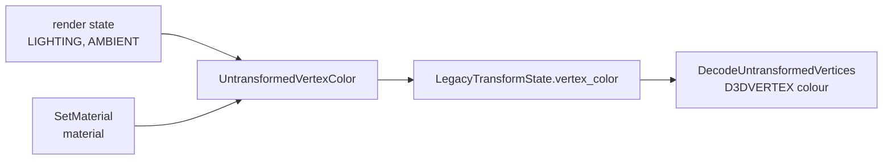

# 작업 430 설계 — DX7 조명과 깊이 기본값 / Task 430 design — DX7 lighting and depth defaults

선행: [작업 429 설계](20260929-429-true-color-surfaces.md)

## 배경 / Background

Win32 6th의 모드 선택 화면에서 모드별 그림(가운데의 선택 모드 로고와 원형으로 늘어선 다른 모드 로고)이 빠졌다. 배경, 모드 설명, 아래쪽 패널은 정상이었다. 사용자가 보고했다.

*In Win32 6th's mode select, the per-mode pictures were missing: the selected mode's logo in the middle and the other modes' logos arranged on a ring. The background, the mode description, and the bottom panels were fine. The user reported it.*

### 확인 / Findings

draw 진단 실행(`--graphics-draw-diagnostics`)의 모드 선택 구간에서 확인한 내용은 다음과 같다.

- **실패한 그리기**: 텍스처 241~273의 `DrawPrimitive`가 모두 `unsupported Direct3D3 depth comparison function`(`E_FAIL`)로 실패했다. 이 그리기는 `fvf=0x112`(`D3DFVF_VERTEX`: 위치, 법선, 텍스처 좌표. 색 없음)로, 변환 전 3D 정점이다.
- **게임이 설정한 render state**: `ZENABLE`을 켰지만 `ZFUNC`는 한 번도 설정하지 않았다. 그래서 공용 core의 초기값 0이 쓰였고, 이 값은 D3DCMPFUNC 범위(1~8) 밖이다.
- **조명 관련 설정**: 게임은 `LIGHTING` 1과 `AMBIENT` `0xFFFFFFFF`를 설정하고 `SetMaterial`을 부른다. `SetLight`·`LightEnable`은 부르지 않는다. Windows DX7 facade의 `SetMaterial`은 기록만 남기고 material을 버렸고, 공용 변환은 색이 없는 `D3DVERTEX`를 흰색으로 그렸다.

*From the mode-select section of a draw-diagnostics run (`--graphics-draw-diagnostics`):*
- ***Failing draws**: every `DrawPrimitive` of textures 241–273 failed with `unsupported Direct3D3 depth comparison function` (`E_FAIL`). These draws use `fvf=0x112` (`D3DFVF_VERTEX`: position, normal, texture coordinate, no colour), untransformed 3D vertices.*
- ***The game's render states**: it enables `ZENABLE` but never sets `ZFUNC`, so the shared core's initial 0 was used, which lies outside the D3DCMPFUNC range (1–8).*
- ***Lighting**: the game sets `LIGHTING` 1 and `AMBIENT` `0xFFFFFFFF` and calls `SetMaterial`, but never `SetLight` or `LightEnable`. The Windows DX7 facade's `SetMaterial` only logged and dropped the material, and the shared transform drew a colourless `D3DVERTEX` white.*

## Windows 11 측정 / Windows 11 measurements

`scratchpad/rs430`에서 측정했다.

### 새 장치의 상태 / A new device's state

`rs430.exe`로 새 Direct3D 7 HAL 장치와 새 Direct3D 3 HAL 장치를 만들어 `GetRenderState`와 stage 0 `GetTextureStageState`를 읽었다.

| 상태 / State | D3D7 | D3D3 |
| --- | --- | --- |
| `ZENABLE`(7) | 0 | 0 |
| `ZWRITEENABLE`(14) | 1 | 1 |
| `SRCBLEND`(19) / `DESTBLEND`(20) | ONE / ZERO | ONE / ZERO |
| `CULLMODE`(22) | CCW(3) | CCW(3) |
| `ZFUNC`(23) | LESSEQUAL(4) | LESSEQUAL(4) |
| `ALPHAFUNC`(25) | ALWAYS(8) | ALWAYS(8) |
| `LIGHTING`(137) | 1 | 상태 없음 / no such state |
| `AMBIENT`(139) | 0 | 상태 없음 / no such state |
| material(`GetMaterial`) | 모두 0 / all zero | — |

- 기존 core 초기값 중 `CULLMODE`, `SRCBLEND`, `DESTBLEND`, stage 0 색 연산·필터·주소 모드는 측정값과 같았다.
- `ZWRITEENABLE`, `ZFUNC`, `ALPHAFUNC`는 0이었다. DX7의 `LIGHTING`도 0이었다.

*Existing core defaults for `CULLMODE`, `SRCBLEND`, `DESTBLEND`, and stage 0's colour operation, filters, and address modes matched the measurements. `ZWRITEENABLE`, `ZFUNC`, and `ALPHAFUNC` were 0, as was DX7's `LIGHTING`.*

### 광원 없는 조명 색 / The colour lighting gives with no light

`lit430.exe`로 D3D7 HAL 장치에 `D3DVERTEX` 사각형을 그리고 가운데 픽셀을 읽었다. 32비트 렌더 타깃에 광원 없이 그렸다.

| material / 상태 | 픽셀 / Pixel |
| --- | --- |
| material 없음, `LIGHTING` 1, `AMBIENT` 0 또는 흰색 | `000000` |
| material 없음, `LIGHTING` 0 | `FFFFFF` |
| ambient (.5,.25,1) × `AMBIENT` 흰색 | `8040FF` |
| ambient (.5,.25,1) × `AMBIENT` `808080` | `402080` |
| ambient (.5,.25,1) × `AMBIENT` `FF0000` | `800000` |
| ambient (.5,.25,1) + emissive (.25,.5,0), `AMBIENT` 흰색 | `BFBFFF` |
| ambient 1 + emissive 1 | `FFFFFF`(clamp) |
| ambient 1(ambient alpha .25), diffuse alpha .5, SRCALPHA 블렌드 / blend | `808080` |
| diffuse alpha 0, 블렌드 / blend | `000000` |
| `LIGHTING` 0, diffuse alpha .5, 블렌드 / blend | `FFFFFF` |
| ambient (-.5,2,.5), diffuse alpha 1.5, 블렌드 / blend | `00FF80` |

규칙은 다음과 같다.
- **색**: RGB는 채널마다 emissive + `AMBIENT` × material ambient다. alpha는 material diffuse의 alpha다.
- **범위**: 각각 0~1로 자르고 ×255를 반올림한다.
- **쓰지 않는 값**: ambient의 alpha와 diffuse의 RGB는 광원이 없으면 쓰이지 않는다.
- **`LIGHTING` 0**: 불투명 흰색이다.

*`lit430.exe` drew a `D3DVERTEX` quad on a D3D7 HAL device and read the centre pixel, drawing with no light on a 32-bit render target. The rules:*
- ***Colour**: red, green, and blue are each emissive + `AMBIENT` × material ambient; alpha is the material diffuse alpha.*
- ***Range**: each is clamped to 0..1, and ×255 is rounded.*
- ***Unused values**: with no light, the ambient alpha and the diffuse RGB play no part.*
- ***`LIGHTING` 0**: opaque white.*

## 결정 / Decisions

1. **초기값**: 공용 `InitialDeviceState`가 측정한 `ZWRITEENABLE` 1, `ZFUNC` LESSEQUAL, `ALPHAFUNC` ALWAYS로 시작한다. `InitialDevice7State`는 여기에 `LIGHTING` 1을 더한다. DX7 장치만 이것을 쓴다. Windows에서는 DX7 facade의 root가 자기 device vtable을 가진 경우이고, Linux에서는 `CreateDirect3DDevice7`의 DX6가 아닌 경우다.
   *Initial state: the shared `InitialDeviceState` starts with the measured `ZWRITEENABLE` 1, `ZFUNC` LESSEQUAL, and `ALPHAFUNC` ALWAYS. `InitialDevice7State` adds `LIGHTING` 1, and only DX7 devices use it: on Windows when the DX7 facade's root carries its own device table, and on Linux when `CreateDirect3DDevice7` is not making a DX6 device.*
2. **조명 색**: 공용 `UntransformedVertexColor`가 측정한 규칙으로 `D3DVERTEX`의 색을 계산한다. 두 변환 builder(`BuildTransformState`, `BuildViewport2TransformState`)가 그 값을 `LegacyTransformState::vertex_color`에 넣고, `DecodeUntransformedVertices`가 흰색 대신 그 색을 쓴다. DX6 장치는 `LIGHTING` 상태가 0이라 지금처럼 흰색이다.
   *Lighting colour: the shared `UntransformedVertexColor` computes a `D3DVERTEX`'s colour by the measured rules. Both transform builders (`BuildTransformState`, `BuildViewport2TransformState`) put it in `LegacyTransformState::vertex_color`, and `DecodeUntransformedVertices` uses it in place of white. A DX6 device's `LIGHTING` state is 0, so it stays white as before.*
3. **material**: Windows DX7 `SetMaterial`·`GetMaterial`이 공용 장치 상태에 저장하고 읽는다. DX6 facade는 DX7 SDK 형식 없이 빌드되므로, interop(`LegacyDeviceSetMaterial`·`LegacyDeviceGetMaterial`)은 core 구조체로 주고받는다. Linux는 `GetMaterial`을 더했다. null 포인터 `GetMaterial`은 두 host 모두 `DDERR_INVALIDPARAMS`다(측정하지 않음).
   *Material: Windows DX7 `SetMaterial` and `GetMaterial` keep it on the shared device state and read it back. The DX6 facade is built without the DX7 SDK types, so the interop (`LegacyDeviceSetMaterial`, `LegacyDeviceGetMaterial`) passes the core structure. Linux gains `GetMaterial`. A null `GetMaterial` pointer gives `DDERR_INVALIDPARAMS` on both hosts (not measured).*
4. **광원**: 모델하지 않는다. 6th는 쓰지 않는다. `SetLight`·`LightEnable`은 지금처럼 미구현 기록을 남긴다.
   *Lights are not modelled; 6th does not use them. `SetLight` and `LightEnable` still record themselves as unimplemented.*

## 영향 / Effects

- **깊이 쓰기**: DX7·DX6 게임이 `ZWRITEENABLE`을 설정하지 않고 `ZENABLE`만 켜면 이제 깊이를 쓴다. 실제 D3D와 같은 동작이다.
- **조명**: DX7 게임이 `LIGHTING`을 끄지 않고 `D3DVERTEX`를 그리면 이제 material 색으로 그린다. 이것도 실제 D3D와 같다.
- **회귀 확인**: Windows 4th·5th 타이틀이 정상으로 나오는 것을 확인했다.

*Effects:*
- ***Depth writes**: a DX7 or DX6 game that turns on `ZENABLE` without setting `ZWRITEENABLE` now writes depth, as real D3D does.*
- ***Lighting**: a DX7 game that draws `D3DVERTEX` without turning `LIGHTING` off now draws it in its material colour, again as real D3D does.*
- ***Regression check**: Windows 4th's and 5th's title screens were confirmed to show correctly.*
