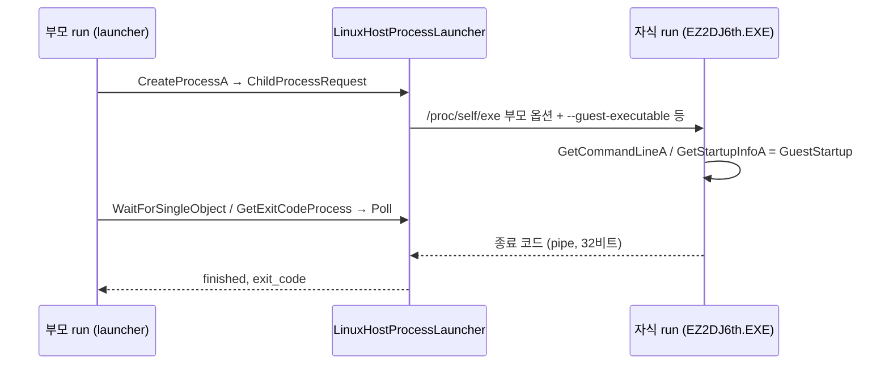

# 작업 431 설계 — Linux 6th와 자식 프로세스 / Task 431 design — Linux 6th and child processes

선행: [작업 430 설계](20260930-430-d3d7-lighting-defaults.md)

## 배경 / Background

6th CHD의 프로필 실행 파일 `EZ2DJ/EZ2DJ.EXE`는 게임이 아니라 launcher다. 원본에서 확인한 launcher의 동작은 다음과 같다.

1. Hardlock을 확인하고 자기 디렉터리로 `SetCurrentDirectoryA`를 한다.
2. 반복한다.
   - `GetKeyState(VK_SCROLL)`이 눌린 상태면 끝낸다.
   - 직전 종료 코드가 0x105(처음 값)이면 `.\EZ2DJ6TH.EXE`를, 0x100이면 `.\EZ2DJ1ST\EZ2DJ.EXE`를 `CreateProcessA`로 실행한다. 다른 값이면 끝낸다.
   - `STARTUPINFO`의 `cbReserved2`는 0x115c로, `lpReserved2`는 앞 4바이트 0 뒤에 직전 종료 코드의 10진 문자열("261")을 두어 넘긴다.
   - `SetPriorityClass(HIGH)`, `WaitForSingleObject(INFINITE)`, `GetExitCodeProcess`, `CloseHandle` 두 번을 차례로 한다.

자식 `EZ2DJ6th.EXE`는 `GetStartupInfoA`의 `cbReserved2`가 0이면 "This program only allow to run from Launcher."를 띄우고 끝낸다. `atoi(lpReserved2 + 4)`가 0x100이면 모드 플래그를 켠다.

Linux runner는 guest 프로그램 하나를 host 프로세스 안에서 실행하고, 모든 guest 이미지는 0x400000에 올라간다. 그래서 자식은 부모와 같은 주소 공간에서 돌 수 없다.

*The 6th CHD's profile executable, `EZ2DJ/EZ2DJ.EXE`, is not the game but a launcher. As found in the original, the launcher:*
1. *checks the Hardlock and calls `SetCurrentDirectoryA` with its own directory;*
2. *loops:*
   - *it ends when `GetKeyState(VK_SCROLL)` reports the key held;*
   - *with the last exit code 0x105 (its first value) it runs `.\EZ2DJ6TH.EXE` through `CreateProcessA`, with 0x100 `.\EZ2DJ1ST\EZ2DJ.EXE`, and with anything else it ends;*
   - *it passes `STARTUPINFO` with `cbReserved2` 0x115c and `lpReserved2` holding four zero bytes, then the last exit code in decimal ("261");*
   - *it calls `SetPriorityClass(HIGH)`, `WaitForSingleObject(INFINITE)`, `GetExitCodeProcess`, and `CloseHandle` twice.*

*The child `EZ2DJ6th.EXE` shows "This program only allow to run from Launcher." and ends when its `GetStartupInfoA` reports `cbReserved2` 0, and sets a mode flag when `atoi(lpReserved2 + 4)` is 0x100.*

*The Linux runner runs one guest program inside a host process, and every guest image loads at 0x400000, so a child cannot run in its parent's address space.*

## Windows 11 측정 / Windows 11 measurements

측정은 `scratchpad/cp431`에서 했다.

- **`CreateProcessA`**(launcher와 같은 방식: 이름 없이 상대 명령줄, 현재 디렉터리, reserved 영역)
  - **성공**: TRUE와 두 핸들, PID와 TID가 돌아온다.
  - **실패**: 실행 파일이 없으면 FALSE와 오류 2가 돌아오고, `PROCESS_INFORMATION`은 0으로 채워진다.
  - **경로**: 상대 실행 파일은 부모의 현재 디렉터리를 기준으로 찾는다.
  - **자식이 받는 값**: 명령줄은 부모가 넘긴 그대로다. `cbReserved2`=4444이고 `lpReserved2`의 모든 바이트가 복사된다. 현재 디렉터리는 `lpCurrentDirectory`다.
- **자식 실행 중**: `GetExitCodeProcess`는 259, `WaitForSingleObject(h,0)`은 0x102를 돌려준다. `SetPriorityClass`는 TRUE다.
- **자식 종료 후**: 대기는 0을 돌려주고, 종료 코드는 32비트 전체(0x105)다. `CloseHandle`은 둘 다 TRUE다.
- **`GetKeyState`**: 누름은 EAX `0x0000FF80`, 토글은 1, 누름과 토글은 `0x0000FF81`이다. 0xFF를 넘는 코드는 0이고 오류값은 그대로다.
- **`GetFullPathNameA`**
  - 문자열 연산이라 파일이 없어도 되고, 성공하면 오류값은 그대로다.
  - `/`는 `\`로, `.`과 `..`은 적용된다. `\`로 시작하면 드라이브 루트다.
  - 버퍼가 짧으면 필요한 크기(NUL 포함)를 돌려주고, 버퍼와 파일 부분은 그대로 둔다.
  - 파일 부분은 마지막 구성 요소를 가리키고, 끝이 구분자면 NULL이다.
  - 빈 이름은 0과 `ERROR_INVALID_NAME`이다.
- **32비트 `BI_RGB` DIB의 `StretchDIBits`**(RGB565 대상): 같은 색의 24비트 DIB와 결과가 같고, 위쪽 바이트는 무시된다.

*Measured in `scratchpad/cp431`:*
- ***`CreateProcessA`** (as the launcher calls it: no name, a relative command line, a current directory, and a reserved area):*
  - ***Success**: TRUE with both handles, a PID, and a TID.*
  - ***Failure**: a missing executable gives FALSE with error 2 and a zeroed `PROCESS_INFORMATION`.*
  - ***Path**: a relative executable is found against the parent's current directory.*
  - ***What the child receives**: the command line exactly as passed; `cbReserved2` 4444 with every byte of `lpReserved2` copied; `lpCurrentDirectory` as its current directory.*
- ***While the child runs**: `GetExitCodeProcess` gives 259 and `WaitForSingleObject(h,0)` gives 0x102; `SetPriorityClass` is TRUE.*
- ***After the child ends**: the wait gives 0, the exit code arrives as all 32 bits (0x105), and both `CloseHandle` calls are TRUE.*
- ***`GetKeyState`**: held is EAX `0x0000FF80`, toggled 1, and held and toggled `0x0000FF81`; a code above 0xFF is 0 with the last error untouched.*
- ***`GetFullPathNameA`**:*
  - *a string operation: the file need not exist, and success leaves the last error alone;*
  - *`/` becomes `\`, `.` and `..` apply, and a leading `\` is the drive root;*
  - *a short buffer returns the size needed (with the NUL) and leaves the buffer and file part alone;*
  - *the file part points at the last component, or is NULL after a trailing separator;*
  - *an empty name is 0 with `ERROR_INVALID_NAME`.*
- ***`StretchDIBits` of a 32-bit `BI_RGB` DIB** (into RGB565): the same result as a 24-bit DIB of the same colours, the top byte ignored.*

## 결정 / Decisions

1. **공용 인터페이스**
   - `hle::HostProcessLauncher`(Start, Poll)와 `hle::ChildProcessRequest`, `hle::GuestStartup`을 둔다.
   - `ImportCallServices::ProcessLauncher()`로 host가 제공한다.
   - `GuestProcess`는 자식 표(ID, 두 핸들, 종료 여부, 종료 코드)와 자신의 `GuestStartup`을 가진다.

   *Shared interfaces:*
   - *`hle::HostProcessLauncher` (Start, Poll), `hle::ChildProcessRequest`, and `hle::GuestStartup`;*
   - *the host provides the launcher through `ImportCallServices::ProcessLauncher()`;*
   - *`GuestProcess` keeps a child table (IDs, both handles, whether it ended, its exit code) and its own `GuestStartup`.*
2. **kernel32**
   - `CreateProcessA`는 측정대로 동작한다. 실행 파일은 명령줄의 첫 토큰을 부모 현재 디렉터리 기준으로 `GuestFiles::ImagePath`에서 찾고, 확장자가 없으면 `.exe`를 붙인다. 응용 프로그램 이름, 환경, 생성 플래그는 모델하지 않는다(멈춤).
   - `GetExitCodeProcess`, `SetPriorityClass`, 자식 핸들의 `WaitForSingleObject`(10 ms 간격 poll)와 `CloseHandle`을 구현한다.
   - `GetStartupInfoA`는 reserved 바이트를 process heap에 한 번 복사해 `cbReserved2`와 `lpReserved2`로 준다. `GetCommandLineA`는 launcher가 준 명령줄을 쓴다.
   - `GetFullPathNameA`는 `GuestFiles::FullPath`로 측정 규칙을 따른다.

   *kernel32:*
   - *`CreateProcessA` follows the measurements: the executable is the command line's first token, found through `GuestFiles::ImagePath` against the parent's current directory, with `.exe` added when it has no extension. An application name, an environment, or creation flags are not modelled (they stop).*
   - *`GetExitCodeProcess`, `SetPriorityClass`, and `WaitForSingleObject` (polling every 10 ms) and `CloseHandle` on child handles are implemented.*
   - *`GetStartupInfoA` copies the reserved bytes once onto the process heap and gives them as `cbReserved2` and `lpReserved2`; `GetCommandLineA` uses the launcher's command line.*
   - *`GetFullPathNameA` follows the measured rules through `GuestFiles::FullPath`.*
3. **user32·gdi32**
   - `GetKeyState`는 host 키 상태로 답한다. 토글 비트는 모델하지 않는다.
   - `StretchDIBits`가 32비트 `BI_RGB`를 받는다.

   *user32 and gdi32:*
   - *`GetKeyState` answers from the host key state; the toggle bit is not modelled.*
   - *`StretchDIBits` takes 32-bit `BI_RGB`.*
4. **Linux host**
   - `LinuxHostProcessLauncher`는 `posix_spawn`으로 `/proc/self/exe`를 실행한다. 부모 인자에서 자식 옵션(`--guest-*`)만 뺀 것을 쓰고, 그 뒤에 `--guest-executable`, `--guest-command-line`, `--guest-current-directory`, `--guest-startup-reserved`(hex), `--guest-exit-code-fd`를 붙인다.
   - 자식 run은 guest 종료 코드를 pipe에 쓴다. `ExitProcess` 코드를 쓰고, host 창이 닫히면 0을, 멈추면 0xFFFFFFFF를 쓴다.
   - `--guest-executable`은 진단용으로 따로 써도 된다.

   *Linux host:*
   - *`LinuxHostProcessLauncher` runs `/proc/self/exe` with `posix_spawn`: the parent's arguments without the child options (`--guest-*`), followed by `--guest-executable`, `--guest-command-line`, `--guest-current-directory`, `--guest-startup-reserved` (hex), and `--guest-exit-code-fd`.*
   - *The child run writes the guest exit code to the pipe: the `ExitProcess` code, 0 when the host window was closed, and 0xFFFFFFFF when it stopped.*
   - *`--guest-executable` may also be used on its own for diagnostics.*
5. **진단**: 실행을 멈춘 호출은 API 로그의 호출 수 한도를 넘어도 사유와 함께 기록한다.
   *Diagnostics: the call a run stops on is recorded with its reason even past the API log's call limit.*

## 범위 밖 / Out of scope

- **Remember 1st 모드**(`EZ2DJ1ST\EZ2DJ.EXE`): Linux 자식 run은 6th 프로필의 guest root와 Hardlock 설정을 그대로 쓴다. 1st 자식에 맞는지는 확인하지 않았다(TODO).
- **Windows 제품**: 실제 `CreateProcessA`를 쓰므로 바뀌는 것이 없다.

*Out of scope:*
- ***Remember 1st mode** (`EZ2DJ1ST\EZ2DJ.EXE`): a Linux child run keeps the 6th profile's guest root and Hardlock settings; whether that suits the 1st child is unchecked (TODO).*
- ***The Windows product** uses the real `CreateProcessA`, so nothing changes there.*
