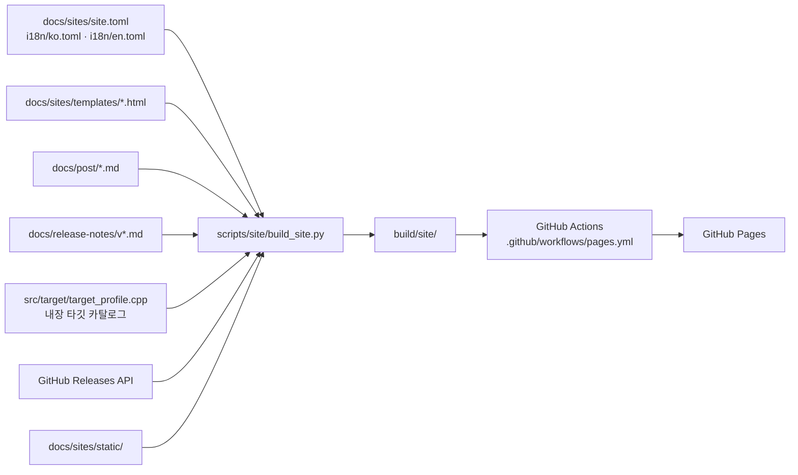

# 설계 432: re2DJ GitHub Pages 프로젝트 사이트

## 배경

rePIU 저장소는 `docs/sites/`의 정적 사이트 소스를 `scripts/site/build_site.py`로 빌드해 GitHub Actions로 GitHub Pages에 배포한다(rePIU Task 756). re2DJ도 같은 작업 방식과 페이지 구성을 따르되, 시각 디자인은 8비트 레트로 기반 위에 EZ2DJ 초기 버전(The 1st Tracks, 1st Tracks Special Edition)의 분위기를 입힌다.

## 목표

1. <https://nworkers.github.io/re2DJ/>에 배포되는 한국어/영어 2개 언어 정적 사이트를 만든다.
2. rePIU와 같은 소스 구성(`docs/sites/` + `scripts/site/` + `pages.yml`)과 콘텐츠 파이프라인(소개 / 진행 상황 / 다운로드 / 개발 기록 / 릴리스 타임라인)을 유지한다.
3. 디자인은 Galmuri 픽셀 폰트 기반 8비트 레트로를 유지하되, 팔레트와 장식 요소를 EZ2DJ 1st·1st SE의 어두운 네온 아케이드 분위기로 바꾼다.
4. 원본 자산을 포함하지 않는다는 프로젝트 원칙을 사이트 문구와 자산 구성 모두에서 지킨다.

## 구성

### rePIU에서 가져오는 것

* 빌드 스크립트 3개(`build_site.py`, `content.py`, `releases.py`)와 의존성 고정(`requirements.txt`: markdown-it-py, mdit-py-plugins, Jinja2 — 모두 MIT/BSD 계열).
* 페이지 구성: `index`(소개), `wip`(개발 기록 + 릴리스 타임라인), `download`, 글별 `post` 페이지, `404`.
* 한국어 `/`, 영어 `/en/` 산출물 구조, 첫 방문 언어 리다이렉트, 내부 링크 검사.
* Galmuri 픽셀 폰트(woff2, SIL OFL 1.1)와 OFL 라이선스 파일.
* Pages 전용 GitHub Actions 워크플로(소스는 Settings → Pages → **GitHub Actions**).

### re2DJ에 맞춰 바꾸는 것

| 항목 | rePIU | re2DJ |
|---|---|---|
| 언어 분리 | 첫 `---` 뒤 같은 수준 heading | 저장소 릴리스 노트 관례인 `## English` 행을 우선 지원하고, `---` 규칙은 fallback으로 유지 |
| 타깃 카탈로그 | `MakePiuTargetProfile(...)` 호출 정규식 | `entry.profile.id/display_name` 대입과 `MakeChdCompatibilityProfile(...)` 호출 두 형태를 순서대로 파싱하고, 블록에서 `HddInputKind::kMameChd`를 찾아 입력 형식(HDD 디렉터리/MAME CHD)을 표시 |
| 릴리스 자산 분류 | `-win32.zip`=package, `openwatcom-samples-*`=report | `re2dj-v*-windows-x86.zip`=package, `*.sha256`=checksum |
| 플랫폼 상태 | win32/linux/web | windows(배포)/linux x86·x86-64(진행 중). 브라우저 실행은 AGENTS.md 지원 범위 밖이므로 싣지 않음 |
| localStorage 키 | `repiu-lang` | `re2dj-lang` |

### 시각 디자인

rePIU는 DOS EDIT.COM 텍스트 모드(VGA 16색, 회색 메뉴 바)를 정체성으로 삼았다. re2DJ는 Windows 9x 세대 아케이드였던 EZ2DJ 초기 버전의 화면을 정체성으로 삼는다.

* **팔레트** — 검정에 가까운 남색 배경, 네온 시안 제목, 호박색(amber) 링크, 빨강·흰색 강조. EZ2DJ 1st 모드 셀렉트/곡 셀렉트 화면의 어두운 바탕 + 네온 글자 구도를 따른다.
* **기어 스트립** — 1인 플레이 기어(턴테이블 빨강 + 건반 흰/파랑 교차 + 페달 초록)를 단순화한 색 띠를 메뉴 바 아래 장식으로 둔다. EZ2DJ를 아는 사람에게만 보이는 인용이고, 모르는 사람에게는 레트로 색 띠다.
* **스캔라인** — CRT 스캔라인을 아주 옅게 깐다(`prefers-reduced-motion`과 무관한 정적 오버레이, 가독성을 해치지 않는 농도).
* **히어로 타이틀** — 시안/빨강을 비껴 얹은 네온 이중 그림자. DOS식 블록 그림자 대신 아케이드 네온.
* **프롬프트 모티프** — rePIU의 `C:\REPIU>` 프롬프트 관례를 `C:\RE2DJ>`로 이어받는다. 원본 게임이 실제로 Windows PC에서 돌던 물건이라는 프로젝트 정체성과 맞는다.
* **404** — "INSERT COIN TO CONTINUE" 아케이드 컨티뉴 화면 모티프.
* **픽셀 폰트 규율** — Galmuri14는 15px 배수, Galmuri11/GalmuriMono11은 12px 배수로만 쓴다(rePIU와 동일).

### 콘텐츠 소스 규칙

* 개발 기록: `docs/post/YYYY-MM-DD-NNNNNN-slug.md`(NNNNNN은 작업 번호). 한국어 전문 뒤 `## English` 아래 영어 전문.
* 릴리스 본문: `docs/release-notes/<tag>.md`가 있으면 사용, 없으면 GitHub API body.
* 타깃 목록: `src/target/target_profile.cpp`에서 추출해 코드와 사이트가 어긋나지 않게 한다.
* 플랫폼 상태·소개 문구: `site.toml`과 `i18n/*.toml`에서 직접 관리.

### 배포

`.github/workflows/pages.yml`이 main의 관련 경로 변경, Release 워크플로 성공, 수동 실행에서 빌드·배포한다. PR에서는 빌드와 링크 검사만 한다. 저장소 Settings → Pages → Source는 GitHub Actions여야 하며, 브랜치 `/docs` 배포는 내부 문서가 공개되므로 쓰지 않는다.

## 검증 계획

1. WSL에서 `python3 scripts/site/build_site.py --offline`으로 빌드가 성공하고 내부 링크 검사가 통과하는지 확인한다.
2. 타깃 카탈로그 파싱이 내장 프로파일 8개(ez2dj1st, ez2dj2nd, ez2dj1stse, ez2dj3rd, ez2dj4th, ez2dj5th, ez2dj6th, ez2d2m)를 정확히 읽는지 빌드 출력으로 확인한다.
3. 기존 릴리스 노트(`## English` 분리형)가 두 언어로 올바르게 나뉘는지 확인한다.
4. 산출물을 브라우저로 열어 한국어/영어 페이지와 디자인을 눈으로 확인한다.

---

# Design 432: re2DJ GitHub Pages project site

## Background

The rePIU repository builds a static site from `docs/sites/` with `scripts/site/build_site.py` and deploys it to GitHub Pages through GitHub Actions (rePIU Task 756). re2DJ follows the same working method and page structure, while the visual design layers the mood of early EZ2DJ (The 1st Tracks, 1st Tracks Special Edition) on top of an 8-bit retro base.

## Goals

1. A bilingual (Korean/English) static site deployed at <https://nworkers.github.io/re2DJ/>.
2. The same source layout (`docs/sites/` + `scripts/site/` + `pages.yml`) and content pipeline as rePIU (about / progress / download / dev log / release timeline).
3. Keep the Galmuri-pixel-font 8-bit retro base, but move the palette and ornaments to the dark neon arcade mood of EZ2DJ 1st and 1st SE.
4. Uphold the no-original-assets principle in both the copy and the asset set.

## Structure

See the Mermaid diagram in the Korean section: config, templates, posts, release notes, the built-in target catalog, the Releases API and static files feed `scripts/site/build_site.py`, whose output `build/site/` is deployed by `.github/workflows/pages.yml`.

### Taken from rePIU

* The three build scripts (`build_site.py`, `content.py`, `releases.py`) and pinned dependencies (markdown-it-py, mdit-py-plugins, Jinja2 — MIT/BSD family).
* Page set: `index`, `wip` (dev log + release timeline), `download`, per-post pages, `404`.
* Korean at `/`, English under `/en/`, the first-visit language redirect and the internal link check.
* The Galmuri pixel fonts (woff2, SIL OFL 1.1) with their licence file.
* The Pages-only GitHub Actions workflow (Pages source must be **GitHub Actions**).

### Adapted for re2DJ

The table in the Korean section lists the deltas: the language splitter prefers this repository's `## English` separator with the `---` rule as fallback; the catalog parser reads both direct `entry.profile.id/display_name` assignments and `MakeChdCompatibilityProfile(...)` calls and reports the input kind (HDD directory vs MAME CHD); release assets classify as `re2dj-v*-windows-x86.zip` = package and `*.sha256` = checksum; platforms are windows (release) and linux x86/x86-64 (in progress); the localStorage key is `re2dj-lang`.

### Visual design

rePIU's identity is DOS EDIT.COM text mode. re2DJ's identity is the dark neon arcade screen of early EZ2DJ, which ran on Windows-9x-era PC hardware: a near-black navy background, neon cyan headings, amber links, red/white highlights; a simplified single-player gear strip (red turntable, white/blue keys, green pedal) under the menu bar; a faint CRT scanline overlay; a neon double shadow on the hero title; the `C:\RE2DJ>` prompt motif carried over from rePIU; an "INSERT COIN TO CONTINUE" 404. Pixel-font discipline stays: Galmuri14 at multiples of 15px, Galmuri11/GalmuriMono11 at multiples of 12px.

### Content source rules

Dev log posts live in `docs/post/YYYY-MM-DD-NNNNNN-slug.md` (full Korean, then `## English`, then full English). Release bodies come from `docs/release-notes/<tag>.md` when present, else from the GitHub API. The target list is extracted from `src/target/target_profile.cpp` so the site cannot drift from the code. Platform status and introduction copy are maintained in `site.toml` and `i18n/*.toml`.

### Deployment

`.github/workflows/pages.yml` builds and deploys on relevant-path pushes to main, on a successful Release workflow and on manual dispatch; pull requests only build and link-check. Deploying a branch `/docs` folder would publish internal documents, so it is not used.

## Verification plan

1. `python3 scripts/site/build_site.py --offline` under WSL builds and passes the internal link check.
2. The catalog parser reads exactly the eight built-in profiles (ez2dj1st, ez2dj2nd, ez2dj1stse, ez2dj3rd, ez2dj4th, ez2dj5th, ez2dj6th, ez2d2m), confirmed from build output.
3. Existing release notes (the `## English` form) split into both languages correctly.
4. The output is opened in a browser to inspect both languages and the design.
