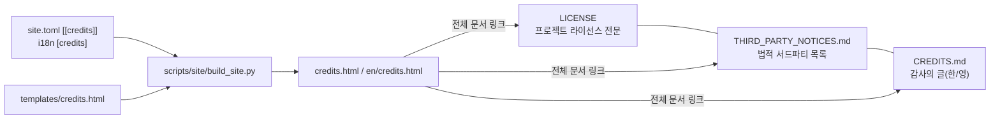

# 설계 433: CREDITS 문서와 사이트 크레딧 페이지

## 배경

rePIU는 Task 765에서 LICENSE·CREDITS.md·사이트 크레딧 페이지를 추가해 문서 역할을 분리했다: LICENSE는 프로젝트 자체 라이선스 전문, THIRD_PARTY_NOTICES.md는 법적 서드파티 목록, CREDITS.md는 감사의 글, 사이트 크레딧 페이지는 그 요약이다. re2DJ도 같은 구성을 따른다.

re2DJ와 rePIU의 출발점 차이:

* re2DJ에는 BSD 3-Clause `LICENSE` 파일이 이미 있다(루트, "re2DJ contributors"). 새로 만들 것이 없고 역할 분리만 문서화한다.
* `THIRD_PARTY_NOTICES.md`는 작업 432에서 사이트 의존성(Galmuri, Jinja2 등)까지 이미 반영되어 있다.
* 단위 테스트는 자체 harness(`tests/unit/test_support.h`)라 서드파티 테스트 프레임워크 크레딧이 없다. 대신 분석 스킬(`game-state-hunt`)의 스크립트가 Capstone을 쓴다.
* MAME 코드는 이식하지 않았다(rePIU의 PIU10·CAT702와 다름). MAME에는 CHD 포맷과 보존 작업에 대한 감사만 남기고, 코드 수준 크레딧은 libchdr가 담당한다.

## 목표

1. 저장소 루트에 한국어/영어 `CREDITS.md`를 추가한다: 원작, 참조한 프로젝트, 실행 파일에 포함되는 오픈소스, 개발·분석 도구, 사이트와 문서, 도구(Claude).
2. README 라이선스 절이 LICENSE·THIRD_PARTY_NOTICES.md·CREDITS.md 세 문서의 역할을 모두 가리키게 한다.
3. 프로젝트 사이트에 F4 크레딧 페이지를 추가한다. 항목은 `site.toml`의 `[[credits]]`(언어 중립 사실)에서, 그룹 제목과 항목 설명은 `i18n/*.toml`의 `[credits]`에서 온다.

## 구성

### 크레딧 항목 (site.toml `[[credits]]`, 그룹 순서 runtime → dev → site)

| key | group | 이름 | 버전 | 라이선스 | 역할(요약) |
|---|---|---|---|---|---|
| sdl3 | runtime | SDL | 3.4.14 | zlib | Linux 창·입력·OpenGL |
| sdlmixer | runtime | SDL_mixer | 3.2.4 | zlib | 오디오 backend 출력·디코딩 |
| imgui | runtime | Dear ImGui | 1.92.9 | MIT | 런처 OSD UI |
| spdlog | runtime | spdlog | 1.14.1 | MIT | 진단 로그 |
| libchdr | runtime | libchdr | master 스냅샷 | BSD 3-Clause | MAME CHD 읽기(LZMA·miniz·zstd·dr_flac 내장) |
| unifont | runtime | GNU Unifont | 15.1.05 | SIL OFL 1.1 | Linux HLE `DrawTextA`의 ASCII 글리프 |
| capstone | dev | Capstone | — | BSD 3-Clause | 분석 스크립트의 x86 디코딩 |
| galmuri | site | Galmuri | 2.40.3 | SIL OFL 1.1 | 사이트 픽셀 폰트 |
| jinja | site | Jinja | 3.1.6 | BSD 3-Clause | 사이트 템플릿 |
| markdownit | site | markdown-it-py | 4.2.0 | MIT | Markdown 렌더링 |
| mermaid | site | Mermaid | 11.17.2 | MIT | 다이어그램(CDN) |

버전은 `THIRD_PARTY_NOTICES.md`·`third_party/unifont/README.md`·`scripts/site/requirements.txt`에서 확인한 값만 쓴다. Capstone은 저장소에 vendoring되지 않는 스크립트 의존성이라 버전을 적지 않고, THIRD_PARTY_NOTICES.md에도 올리지 않는다(법적 목록은 배포물·저장소 포함물 기준).

### 원작 문구

EZ2DJ는 1999년 Amuse World가 처음 선보인 아케이드 리듬 게임이라는 역사적 사실만 적고, 현재 권리 귀속은 "모든 상표와 저작물의 권리는 각 권리자에게 있습니다"로 일반화한다. EZ2Dancer도 함께 언급한다. 미확인 권리 관계를 단정하지 않는다.

### 사이트 변경

* `base.html` 메뉴: `F4 크레딧` 추가, GitHub은 `F5`로 이동.
* `templates/credits.html` 신설: 원작 박스 → 그룹별 목록(라이선스 배지 + 링크 + 설명) → runtime 그룹 아래 MAME 감사 각주 → 전체 문서 링크 박스.
* `build_site.py`: `PAGES`에 `credits` 추가, `CREDIT_GROUPS = ("runtime", "dev", "site")`, credits 컨텍스트 구성.
* CSS: `.credits li` 그리드(배지 13ch + 내용)와 모바일 1열 전환.

## 검증 계획

1. WSL offline 빌드 성공 + 내부 링크 검사 통과.
2. 한국어/영어 크레딧 페이지를 headless Edge로 캡처해 확인한다.
3. i18n 두 파일의 `[credits]` 키 구조가 같은지 빌드(StrictUndefined)로 확인된다.

---

# Design 433: CREDITS document and a site credits page

## Background

rePIU Task 765 split the document roles: LICENSE holds the project's own licence text, THIRD_PARTY_NOTICES.md stays the legal third-party inventory, CREDITS.md carries the acknowledgements and the site credits page summarises them. re2DJ follows the same arrangement. Differences at the start: re2DJ already has a BSD 3-Clause `LICENSE`; the notices file already covers the site dependencies (Task 432); the unit tests use an in-house harness so there is no third-party test framework to credit, while the `game-state-hunt` analysis scripts use Capstone; and no MAME code was adapted, so MAME receives an acknowledgement for the CHD format and preservation work only, with code-level credit belonging to libchdr.

## Goals

1. Add a bilingual root `CREDITS.md`: the original game, referenced projects, open source in the executables, development/analysis tools, site and documentation, and tools (Claude).
2. Point the README licence section at all three documents.
3. Add an F4 credits page to the site, driven by language-neutral `[[credits]]` facts in `site.toml` and `[credits]` strings in `i18n/*.toml`.

## Structure

See the Korean section: the credits table lists the entries (groups runtime → dev → site) with versions taken only from `THIRD_PARTY_NOTICES.md`, `third_party/unifont/README.md` and `scripts/site/requirements.txt`. Capstone is a script-only dependency, so it carries no version and stays out of the legal notices. The original-game copy states the verifiable historical fact (EZ2DJ first released by Amuse World in 1999, EZ2Dancer alongside) and generalises current ownership to "all trademarks and works belong to their respective rights holders". Site changes: an `F4` credits menu entry (GitHub moves to `F5`), a new `credits.html` template (original-game box, per-group lists with licence badges, a MAME acknowledgement under the runtime group, a full-documents box), `build_site.py` gains the page and the group order, and the CSS gains the `.credits` grid with the mobile single-column fallback.

## Verification plan

Offline WSL build with the link check; headless-Edge captures of the Korean and English credits pages; the identical `[credits]` key structure is enforced by the StrictUndefined build.
