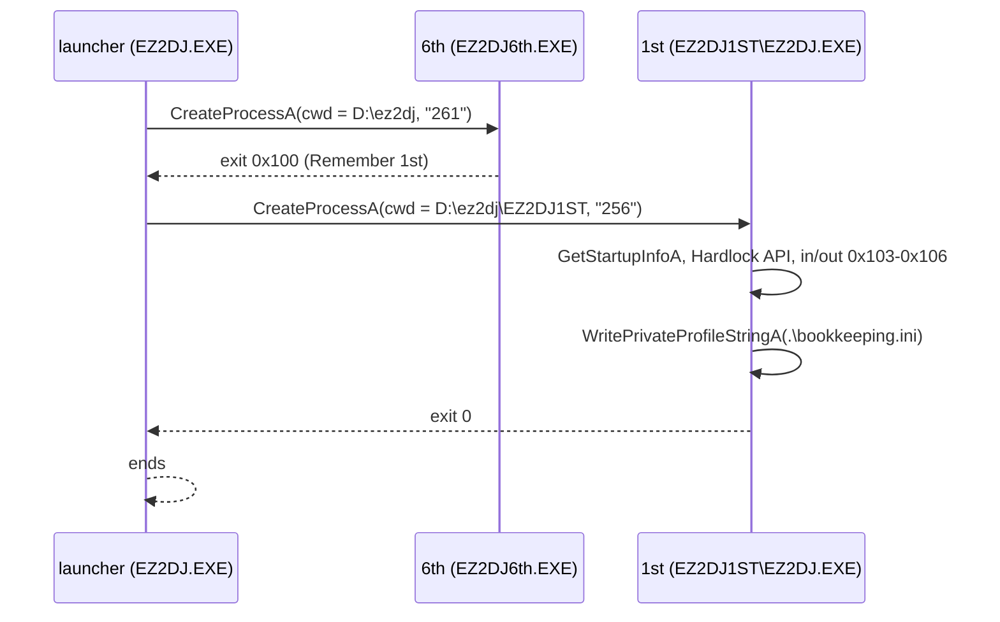

# 작업 434 설계 — 6th의 Remember 1st 모드 / Task 434 design — 6th's Remember 1st mode

선행: [작업 431 설계](20260930-431-linux-6th-child-process.md)

## 배경 / Background

6th의 모드 선택에서 Remember 1st를 고르면 `EZ2DJ6th.EXE`가 0x100으로 끝나고, launcher가 동봉된 1st Tracks를 실행한다. 작업 431은 이 경로를 범위 밖으로 두었다. 원본에서 확인한 내용은 다음과 같다.

- **launcher**(`EZ2DJ/EZ2DJ.EXE`, 반복 `0x401070`): 직전 종료 코드가 0x100이면 명령줄 `.\EZ2DJ1ST\EZ2DJ.EXE`, `lpCurrentDirectory`는 `"%s\EZ2DJ1ST"`에 자기 현재 디렉터리를 넣은 것, reserved 영역은 `"256"`으로 `CreateProcessA`를 부른다. 6th 자식일 때의 현재 디렉터리는 `"%s"`, 곧 자기 디렉터리다. 자식이 0x105도 0x100도 아닌 코드로 끝나면 launcher는 끝난다.
- **1st 자식**(`EZ2DJ/Ez2Dj1st/Ez2DJ.exe`, 2004-08-12 재빌드, 보호 섹션 없음):
  - `GetStartupInfoA`의 `cbReserved2`가 0이면 "This program only allow to run from Launcher."를 띄우고 끝낸다(`0x4145a0`). reserved의 내용은 읽지 않는다.
  - Hardlock은 보호 계층이 아니라 게임에 link된 API가 쓴다. `GetVersion`으로 `\\.\FEnteDev`(NT)나 `\\.\HARDLOCK.VXD`(9x)를 열고, handshake `0x9c402450`(버전 0x33c 이상), descriptor `0x9c40244c`(0x100바이트), transform `0x9c402458`을 요청한다(`0x423710`, `0x423910`). 같은 cabinet의 dongle이므로 6th의 Hardlock 재료를 그대로 쓴다.
  - I/O board는 helper 함수 없이 곳곳에서 inline `in al,dx`/`out dx,al`로 포트 0x103~0x106을 읽고 쓴다(예: `0x410a14`, `0x410d80`). 그래서 helper RVA는 없고 opcode만으로 판단해야 한다.
  - 현재 디렉터리 기준으로 `.\ez2dj.ini`, `.\bookkeeping.ini`, `Songs\music.ini`를 읽고, `.\bookkeeping.ini`에 `WritePrivateProfileStringA`로 `[GAMEASSIGNMENTS]`의 `Coins` 등을 쓴다.
  - 끝은 `ExitProcess(0)`(`0x4169b0` wrapper)이다. (정정: 이것은 오류 종료다. 정상 종료는 게임 한 판 뒤 0x105로 6th로 돌아간다. [작업 438](20261003-438-remember-1st-return.md) 참고.) 0은 launcher가 다시 실행하는 코드가 아니므로 launcher도 끝난다. cabinet에서 launcher를 다시 띄우는 것은 Windows shell이며(추정), 모델하지 않는다.
- **Linux 첫 실행**(자식을 직접 실행, reserved `"256"`): handshake 2회와 descriptor 1회 뒤 183번째 호출 `kernel32!WritePrivateProfileStringA`에서 멈췄다. 또 자식 run이 실행 파일의 상위 디렉터리를 guest root로 삼아, 1st 자식의 `D:\ez2dj`가 `EZ2DJ/EZ2DJ1ST`가 되고 module 경로가 `D:\ez2dj\Ez2DJ.exe`가 되는 모델 오류가 있다. launcher가 준 현재 디렉터리 `D:\ez2dj\EZ2DJ1ST`는 그 root 밖이라 거부된다.
- **Windows 제품**: launcher probe는 `EZ2DJ6TH.EXE` 하나만 따라가고, 그 자식이 끝나면 launcher를 종료한다. launcher가 1st를 만들 기회가 없다.

*Choosing Remember 1st in 6th's mode select ends `EZ2DJ6th.EXE` with 0x100, and the launcher runs the bundled 1st Tracks. Task 431 left this path out of scope. As found in the original:*
- ***The launcher** (`EZ2DJ/EZ2DJ.EXE`, loop `0x401070`): with the last exit code 0x100 it calls `CreateProcessA` with the command line `.\EZ2DJ1ST\EZ2DJ.EXE`, `lpCurrentDirectory` from `"%s\EZ2DJ1ST"` with its own current directory, and `"256"` in the reserved area; for the 6th child the directory is `"%s"`, its own. A child ending with neither 0x105 nor 0x100 ends the launcher.*
- ***The 1st child** (`EZ2DJ/Ez2Dj1st/Ez2DJ.exe`, a 2004-08-12 rebuild without a protection section):*
  - *with `cbReserved2` 0 from `GetStartupInfoA` it shows "This program only allow to run from Launcher." and ends (`0x4145a0`); the reserved bytes themselves are not read;*
  - *Hardlock is used by the API linked into the game rather than a protection layer: by `GetVersion` it opens `\\.\FEnteDev` (NT) or `\\.\HARDLOCK.VXD` (9x), then requests the handshake `0x9c402450` (version at least 0x33c), the descriptor `0x9c40244c` (0x100 bytes) and the transform `0x9c402458` (`0x423710`, `0x423910`). The dongle is the cabinet's, so 6th's Hardlock material applies as it is;*
  - *the I/O board is read and written with inline `in al,dx`/`out dx,al` on ports 0x103–0x106 in many places (for example `0x410a14`, `0x410d80`), with no helper routine, so there is no helper RVA and the opcode alone must decide;*
  - *it reads `.\ez2dj.ini`, `.\bookkeeping.ini` and `Songs\music.ini` against its current directory, and writes `[GAMEASSIGNMENTS]` `Coins` and the like into `.\bookkeeping.ini` with `WritePrivateProfileStringA`;*
  - *it ends with `ExitProcess(0)` (the `0x4169b0` wrapper). (Correction: that is the error exit; the normal exit returns to 6th with 0x105 after one game, see [task 438](20261003-438-remember-1st-return.md).) Since 0 is not a code the launcher runs anything for, the launcher ends too. That the Windows shell restarts the launcher on the cabinet is inferred and not modelled.*
- ***The first Linux run** (the child started directly with reserved `"256"`) stopped at call 183, `kernel32!WritePrivateProfileStringA`, after two handshakes and one descriptor. The child run also takes the executable's parent directory as the guest root, so the 1st child's `D:\ez2dj` became `EZ2DJ/EZ2DJ1ST` and its module path `D:\ez2dj\Ez2DJ.exe`; the launcher's current directory `D:\ez2dj\EZ2DJ1ST` lies outside that root and is refused.*
- ***The Windows product**: the launcher probe follows `EZ2DJ6TH.EXE` alone and ends the launcher when that child ends, so the launcher never gets to start 1st.*

## Windows 11 측정 — `WritePrivateProfileStringA` / Windows 11 measurements

`scratchpad/wp432`의 32비트 probe로 쟀다. 파일은 `CreateFileA`로 미리 써 두고, 호출 전에 last error를 1234로 두었다.

| 경우 / Case | 결과 / Result |
| --- | --- |
| 성공 | TRUE. last error는 그대로(1234)였다가 같은 파일을 여러 번 고쳐 쓴 실행에서는 0이었다. 어느 쪽도 값을 정하지 않으므로 모델은 손대지 않는다. |
| 없는 파일 / 빈 파일 | `[S]\r\nk=v\r\n`으로 만든다. |
| 없는 디렉터리 | FALSE, `ERROR_PATH_NOT_FOUND`(3). |
| 있는 키 | 그 줄만 다시 쓴다. `=`까지의 원문(앞 공백, 키, `=` 앞 공백)은 그대로, 그 뒤에 새 값, 그 뒤에 옛 값 뒤의 공백(값이 비었으면 전부)이 남는다. `key = old value ` → `key =x `, `key\t=\told\t` → `key\t=x\t`, `key=   ` → `key=x   `, `key= old` → `key=x`. 키의 대소문자·철자는 파일의 것이 남는다. 줄 끝이 없던 마지막 줄에는 CRLF가 붙는다. |
| 새 키 | 섹션의 마지막 키 줄(`=`가 있는, `;`로 시작하지 않는 줄) 바로 뒤에 `key=value\r\n`으로 넣는다. 그 뒤의 빈 줄과 주석은 뒤로 밀린다. 키 줄이 없으면 헤더 뒤. 앞 줄에 줄 끝이 없으면 CRLF를 먼저 붙인다. |
| 새 섹션 | 파일 끝에 `[name]\r\nkey=value\r\n`을 붙인다(부른 대로의 대소문자, 빈 줄 없이). 파일이 `\n`으로 끝나지 않으면 CRLF를 먼저 붙인다. |
| 값이 NULL | 키 줄을 지운다. 줄 앞 공백은 남고, 키부터 줄 끝까지 없어진다. |
| 키가 NULL | 헤더부터 마지막 키 줄까지 지운다. 그 뒤의 빈 줄은 남는다. |
| 값 | 그대로 쓴다: 앞뒤 공백, 따옴표, 빈 값(`key=`). |
| 이름 | 부른 섹션·키 이름의 앞뒤 공백은 무시하고, 대소문자 없이 비교한다. 헤더는 `[`와 첫 `]` 사이를 다듬은 것이고 `]` 뒤는 무시한다(`[ S ]`, `[S] ;c`). |
| 중복 | 같은 이름의 섹션·키는 첫 것만 다룬다. |
| 줄 끝 | 있는 줄의 LF는 그대로 두고, 새로 쓰는 줄은 CRLF다. CR만 쓴 파일과 UTF-8 BOM으로 시작하는 파일은 모델하지 않는다(BOM 헤더는 헤더로 보지 않아 새 섹션이 붙는데, 본 구현도 같다). |

*Measured with the 32-bit probe in `scratchpad/wp432`; the file was written with `CreateFileA` first and the last error set to 1234 before each call.*
- ***Success**: TRUE; the last error stayed 1234 in one run and read 0 in a run that rewrote one file repeatedly. Neither settles the value, so the model leaves it alone.*
- ***A missing or empty file** is written as `[S]\r\nk=v\r\n`; **a missing directory** is FALSE with `ERROR_PATH_NOT_FOUND` (3).*
- ***An existing key**: only its line is rewritten. The text up to `=` (leading blanks, the key, the blanks before `=`) stays, then the new value, then the blanks that followed the old value (all of them when the value was empty): `key = old value ` → `key =x `, `key\t=\told\t` → `key\t=x\t`, `key=   ` → `key=x   `, `key= old` → `key=x`. The file's spelling of the key stays. A last line without a line ending gets CRLF.*
- ***A new key** goes right after the section's last key line (a line with `=` not starting with `;`) as `key=value\r\n`, pushing blank and comment lines after it; after the header when there is none; with CRLF first when the line before has no ending.*
- ***A new section** is appended as `[name]\r\nkey=value\r\n` (the name as passed, no blank line), after CRLF when the file does not end with `\n`.*
- ***A null value** removes the key line from the key to the line ending, keeping leading blanks; **a null key** removes the header through the last key line, keeping blank lines after it.*
- ***Values** are written as they are: surrounding blanks, quotes, an empty value (`key=`).*
- ***Names**: the blanks around the section and key names passed are ignored, and names compare without case. A header is the trimmed text between `[` and the first `]`; anything after `]` is ignored (`[ S ]`, `[S] ;c`).*
- ***Duplicates**: only the first section and the first key of a name count.*
- ***Line endings**: existing LF lines stay, written lines are CRLF. CR-only files and files starting with a UTF-8 BOM are not modelled (the BOM header is not a header, so a new section is appended, which this implementation does too).*

## Windows 11 측정 — 1st 자식이 이어서 만난 경계 / Windows 11 measurements — the 1st child's later boundaries

1st 자식을 직접 실행하며 차례로 만난 import를 `scratchpad/wp432`의 32비트 probe(`qpf432`, `gdi432`)로 쟀다.

| 호출 / Call | 결과 / Result |
| --- | --- |
| `QueryPerformanceFrequency` | TRUE, 10,000,000. last error 그대로. 1st 자식은 counter는 부르지 않는다. |
| `GetDC(hwnd)` | 창의 DC. 놓았다 다시 얻어도 같은 핸들. last error 그대로. |
| `ReleaseDC(hwnd, hdc)` | 창 DC면 1, 두 번째는 0. hwnd는 보지 않는다(NULL이어도 1). 메모리 DC는 0이고 그대로 쓸 수 있다. |
| `CreateDIBSection(NULL, 128×128×24 bottom-up, DIB_RGB_COLORS)` | 비트맵과 bits. `GetObjectA`: 24 bpp, 행 384바이트, bits 있음. last error 그대로. |
| `CreateDIBitmap(창 DC, 24비트 bottom-up DIB, CBM_INIT, DIB_RGB_COLORS)` | 화면 형식의 DDB. `GetObjectA`: 32 bpp, 행 = 너비×4, bits NULL. 행은 화면 순서(DIB의 마지막 메모리 행이 위). 메모리 DC를 주면 그 DC에 선택된 비트맵의 형식(24 bpp), NULL을 주면 1 bpp. last error 그대로. |
| `FillRect`·`DrawTextA` on 24비트 DIB section | B,G,R 바이트 순으로 칠한다. `DrawTextA`는 16비트와 같은 배치. |
| `ExtTextOutA(hdc, x, y, 0, NULL, s, n, NULL)` | `DrawTextA`를 `{x,y,x,y}`에 `DT_LEFT\|DT_TOP\|DT_SINGLELINE\|DT_NOCLIP`으로 그린 것과 픽셀이 같다(TRANSPARENT·OPAQUE 모두). TRUE, last error 0. n=0이면 TRUE에 last error 그대로. DC가 아니면 FALSE에 그대로. |
| `SendMessageA(hwnd, WM_DESTROY, 0, 0)` | 창 procedure가 곧바로 불리고 그 반환값이 돌아온다. 창은 남는다. last error 그대로. |

*Measured with the 32-bit probes `qpf432` and `gdi432` in `scratchpad/wp432`, at the imports the 1st child met in turn when run directly:*
- *`QueryPerformanceFrequency`: TRUE with 10,000,000, the last error untouched; the 1st child never asks for the counter.*
- *`GetDC(hwnd)`: the window's DC, the same handle after a release; last error untouched. `ReleaseDC(hwnd, hdc)`: 1 for a window DC, 0 the second time, hwnd ignored (NULL still gives 1); 0 for a memory DC, which stays usable.*
- *`CreateDIBSection(NULL, 128×128×24 bottom-up, DIB_RGB_COLORS)`: a bitmap with bits; `GetObjectA` reports 24 bpp, 384-byte rows and the bits; last error untouched.*
- *`CreateDIBitmap(window DC, 24-bit bottom-up DIB, CBM_INIT, DIB_RGB_COLORS)`: a DDB in the display's format; `GetObjectA` reports 32 bpp, width × 4 bytes per row and no bits; rows in screen order (the DIB's last memory row on top). A memory DC gives the format of its selected bitmap (24 bpp), NULL 1 bpp. Last error untouched.*
- *`FillRect` and `DrawTextA` on a 24-bit DIB section write B, G, R bytes, `DrawTextA` placed as on 16 bits.*
- *`ExtTextOutA(hdc, x, y, 0, NULL, s, n, NULL)` draws the same pixels as `DrawTextA` at `{x,y,x,y}` with `DT_LEFT|DT_TOP|DT_SINGLELINE|DT_NOCLIP`, transparent and opaque; TRUE with the last error 0; n = 0 is TRUE with it untouched; a non-DC is FALSE with it untouched.*
- *`SendMessageA(hwnd, WM_DESTROY, 0, 0)` calls the window procedure at once and returns its result; the window stays; last error untouched.*

## 결정 / Decisions

1. **자식 run의 root** (공용 `target`)
   - 프로필에 `child_executable_paths`를 둔다: launcher가 실행하는 이미지 안의 실행 파일들이다. 6th는 `EZ2DJ/EZ2DJ6th.EXE`와 `EZ2DJ/EZ2DJ1ST/Ez2DJ.exe`다. CLI는 CHD staging에 이 파일들을 모두 꺼내 둔다(Windows의 실제 `CreateProcessA`가 파일과 현재 디렉터리를 디스크에서 찾으므로).
   - 자식은 launcher의 root를 그대로 쓴다. 실행 파일이 프로필 실행 파일의 디렉터리 아래에 있으면 작업 디렉터리는 그 디렉터리(6th의 `EZ2DJ`)이고, `GuestExecutablePath`는 guest root 뒤에 그 아래 경로를 붙인다(`D:\ez2dj\EZ2DJ1ST\Ez2DJ.exe`). 그래서 launcher가 준 현재 디렉터리 `D:\ez2dj\EZ2DJ1ST`가 root 안이고, 자식의 상대 경로가 `EZ2DJ/EZ2DJ1ST` 아래로 간다. 이 규칙은 `target::ExecutableWorkingDirectory`에 두고 Linux CLI와 Windows probe가 같이 쓴다.

   *The root of a child run (shared `target`):*
   - *a profile lists `child_executable_paths`, the executables in the image its launcher starts: for 6th `EZ2DJ/EZ2DJ6th.EXE` and `EZ2DJ/EZ2DJ1ST/Ez2DJ.exe`. The CLI stages them all out of the CHD, since the real `CreateProcessA` on Windows finds the file and the current directory on disk;*
   - *a child keeps the launcher's root: an executable below the profile executable's directory keeps that directory (6th's `EZ2DJ`) as the working directory, and `GuestExecutablePath` appends the path below it to the guest root (`D:\ez2dj\EZ2DJ1ST\Ez2DJ.exe`). The launcher's current directory `D:\ez2dj\EZ2DJ1ST` then lies inside the root, and the child's relative paths land under `EZ2DJ/EZ2DJ1ST`. The rule lives in `target::ExecutableWorkingDirectory`, shared by the Linux CLI and the Windows probe.*
2. **kernel32 `WritePrivateProfileStringA`** (Linux facade): 공용 INI core의 `UpdatePrivateProfile`(위 측정 규칙; NULL 값은 키 삭제, NULL 키는 섹션 삭제)로 새 본문을 만들고, `GuestFiles`에 `CREATE_ALWAYS`로 써서 overlay에 남긴다. 없는 파일은 빈 본문으로 시작한다. 없는 디렉터리는 FALSE와 그 오류다. NULL 섹션, NULL 파일 이름, Windows 디렉터리의 파일(구분자 없는 이름)은 멈춘다. Windows 제품은 실제 kernel32가 처리한다(그대로).
   *kernel32 `WritePrivateProfileStringA` (the Linux facade): the shared INI core's `UpdatePrivateProfile` (the rules above; a null value deletes the key, a null key the section) makes the new text, written through `GuestFiles` with `CREATE_ALWAYS` into the overlay. A missing file starts from empty text; a missing directory is FALSE with that error. A null section, a null file name and a file in the Windows directory (a name without a separator) stop. The Windows product leaves it to the real kernel32, unchanged.*
3. **Windows 제품**: launcher probe는 launcher가 만드는 프로세스 중 `child_executable_paths`의 것을 만날 때마다 같은 옵션으로 준비하고, 그 자식이 끝나면 핸들을 닫고 다음 자식을 기다린다. launcher가 끝나면 run이 끝난다. 유휴 시간 제한은 자식이 끝날 때마다 다시 센다. 진단으로 `--startup-reserved <hex>`를 두어 debuggee의 `STARTUPINFO`에 reserved 바이트를 넣는다. CLI의 `--guest-startup-reserved`가 두 host에서 이것을 받고, 프로필 실행 파일이 아닌 `--guest-executable`은 Windows에서 따라가지 않는 detached run이 된다.
   *The Windows product: whenever the launcher makes a process in `child_executable_paths`, the probe prepares it with the same options, and when it ends closes its handles and waits for the next; the run ends with the launcher. The idle timeout restarts after each child. For diagnostics `--startup-reserved <hex>` puts reserved bytes into the debuggee's `STARTUPINFO`; the CLI's `--guest-startup-reserved` feeds it on both hosts, and a `--guest-executable` other than the profile's own becomes a detached, unfollowed run on Windows.*
4. **Hardlock과 I/O**: 6th 프로필의 재료와 정책이 자식에도 적용된다. helper RVA 0으로 opcode만 보는 규칙(작업 431)이 inline `in`/`out`을 받는다.
   *Hardlock and I/O: the 6th profile's material and policy apply to the child; the opcode-only rule with helper RVAs 0 (task 431) takes the inline `in`/`out`.*

5. **1st 자식이 이어서 만난 경계**(Linux facade, 위 측정대로)
   - kernel32 `QueryPerformanceFrequency`: 10 MHz. counter는 쓰는 게임이 나올 때.
   - user32 `GetDC`·`ReleaseDC`: 창의 DC는 창이 가진 핸들(`device_context`)로 `GuestGdi`에 등록하고 `held`로 돌려줌 여부를 센다. 창 DC는 비트맵이 없어 그리기는 멈춘다. `SendMessageA`: 창 procedure를 부른다(`SendToWindow`).
   - gdi32 `CreateDIBSection`(24비트 bottom-up, DC 없이), `CreateDIBitmap`(창 DC, CBM_INIT: 24·8비트 DIB를 32비트 top-down XRGB로 옮긴 `device_dependent` 비트맵; `GetObjectA`는 bits 0), `ExtTextOutA`(옵션·사각형 없이). 텍스트 그리기(`DrawTextPixels`)는 `gdi_text`로 옮겨 user32·gdi32가 같이 쓰고, `FillRect`와 함께 24비트 비트맵을 받는다. `StretchBlt`는 32비트 원본을 받는다.

   *The 1st child's later boundaries (the Linux facade, as measured above): kernel32 `QueryPerformanceFrequency` at 10 MHz (the counter waits for a game that reads it); user32 `GetDC` and `ReleaseDC`, a window's DC kept in `GuestGdi` under the handle the window holds (`device_context`) with `held` counting whether it is out, drawing through it stopping since it has no bitmap, and `SendMessageA` calling the window procedure (`SendToWindow`); gdi32 `CreateDIBSection` (24-bit bottom-up, no DC), `CreateDIBitmap` (a window DC with CBM_INIT: a 24- or 8-bit DIB moved into a 32-bit top-down XRGB `device_dependent` bitmap whose `GetObjectA` shows no bits) and `ExtTextOutA` (no options or rectangle). Text drawing (`DrawTextPixels`) moves into `gdi_text`, shared by user32 and gdi32, and takes 24-bit bitmaps as `FillRect` does; `StretchBlt` takes 32-bit sources.*
6. **Windows 제품의 자식 VFS**: 자식의 첫 guest 디렉터리는 host 프로세스의 실제 현재 디렉터리가 HDD root 아래에 있으면 그 아래 경로다(launcher가 준 `EZ2DJ1ST`). 처음엔 root였고, 1st 자식의 상대 경로가 모두 `EZ2DJ`에서 찾아져 실패했다. 자식의 `GetPrivateProfileIntA`·`StringA`·`SectionNamesA`·`WritePrivateProfileStringA` import도 VFS로 잇는다. 읽기는 overlay 사본(없으면 이미지에서 만든 것)을 실제 API에 주고, 쓰기는 overlay 사본에 실제 API로 쓴다. 그래서 두 host 모두 `overlays/<profile>/EZ2DJ1ST/bookkeeping.ini`에 쓴다.
   *The Windows product's child VFS: a child's first guest directory is the host process's real current directory below the HDD root (the `EZ2DJ1ST` the launcher gave); it used to be the root, so every relative path of the 1st child was looked up under `EZ2DJ` and failed. The child's `GetPrivateProfileIntA`, `StringA`, `SectionNamesA` and `WritePrivateProfileStringA` imports go through the VFS as well: reads hand the real API the overlay copy (made from the image when absent), writes go into the overlay copy through the real API, so both hosts write `overlays/<profile>/EZ2DJ1ST/bookkeeping.ini`.*

## 범위 밖 / Out of scope

- launcher가 끝난 뒤 다시 띄우는 것(cabinet의 shell).
- 1st 자식의 `C:\EZ2DJ\TEST.EXE` 실행(test mode).
- kernel32 `QueryPerformanceCounter`: 1st 자식이 부르지 않는다.
- Linux에서 launcher를 거친 경로(6th에서 Remember 1st를 골라 1st로 넘어가는 것)는 키 입력을 자동화하지 못해 사용자 확인으로 남긴다. 자식 run 자체는 두 폭에서 직접 실행으로 확인했다.

*Out of scope: restarting the launcher after it ends (the cabinet's shell); the 1st child's run of `C:\EZ2DJ\TEST.EXE` (test mode); kernel32 `QueryPerformanceCounter`, which the 1st child does not call; and the path through the launcher on Linux (choosing Remember 1st in 6th), which is left to the user since its key input could not be automated there, the child run itself being verified by direct runs on both widths.*
