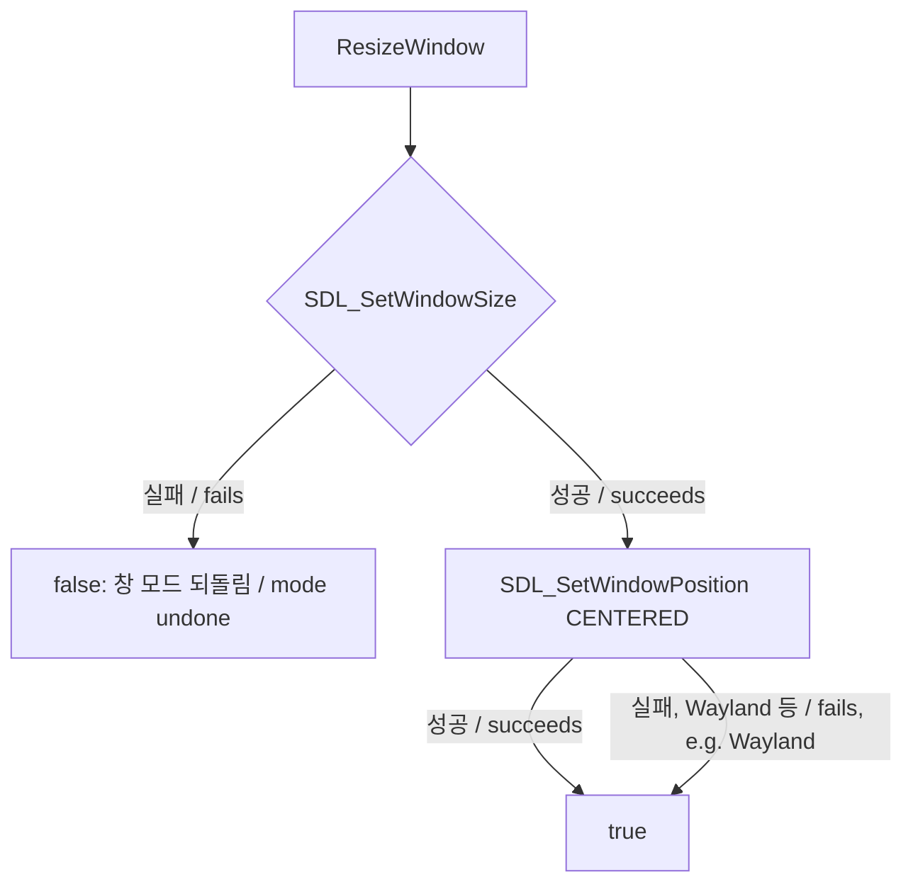

# 작업 435 설계 — Wayland에서 창 가운데 정렬 / Task 435 design — centring the window on Wayland

선행: [작업 396 설계](20260927-396-linux-window-policy.md)

## 배경 / Background

Ubuntu 26.04 Wayland 세션(`XDG_SESSION_TYPE=wayland`)에서 Linux x64 빌드로 6th를 실행하면 6th 자식이 257번째 호출 `ddraw!IDirectDraw7::SetCooperativeLevel`에서 멈추고, launcher도 `ExitProcess(0)`으로 끝났다. API 로그의 이유는 다음과 같다.

```
UNHANDLED: ddraw.dll!IDirectDraw7::SetCooperativeLevel cannot show the window on the host:
cannot resize the SDL3 window: wayland cannot position non-popup windows
```

작업 396의 `Sdl3OpenGlBackend::ResizeWindow`는 `SDL_SetWindowSize` 뒤에 `SDL_SetWindowPosition(CENTERED)`를 부르고, 둘 중 하나라도 실패하면 실패를 돌려준다. Wayland는 클라이언트가 일반(top-level) 창의 위치를 정하지 못하게 하므로 SDL3의 Wayland backend는 위치 지정을 실패로 돌려준다. 그 실패가 창 크기 변경 실패와 같게 취급되어 `LinuxHostPresentation::ApplyWindowMode`, 이어서 `SetCooperativeLevel`의 host 정책이 실패했다. 작업 396 이후의 검증은 WSL(X11 경로)에서 했기 때문에 드러나지 않았다.

반면 창을 만들 때의 가운데 정렬(`config.centered`)은 생성 속성 `SDL_PROP_WINDOW_CREATE_X/Y_NUMBER`로 주는 요청이라, Wayland에서는 무시될 뿐 실패하지 않는다.

*On an Ubuntu 26.04 Wayland session, running 6th with the Linux x64 build stopped the 6th child at call 257, `ddraw!IDirectDraw7::SetCooperativeLevel`, and the launcher ended with `ExitProcess(0)`, the API log giving the reason above. Task 396's `Sdl3OpenGlBackend::ResizeWindow` calls `SDL_SetWindowPosition(CENTERED)` after `SDL_SetWindowSize` and fails if either fails. Wayland does not let a client place a top-level window, so SDL3's Wayland backend reports the positioning as a failure, which was treated like a failed resize and failed `LinuxHostPresentation::ApplyWindowMode` and with it `SetCooperativeLevel`'s host policy. Verification since task 396 ran on WSL (the X11 path), so it did not show. Centring at creation (`config.centered`), by contrast, is a request through the creation properties `SDL_PROP_WINDOW_CREATE_X/Y_NUMBER`, which Wayland ignores without failing.*

## 결정 / Decisions



1. **가운데 정렬은 요청이다.** `ResizeWindow`는 크기 변경 실패만 실패로 돌려준다. 다시 가운데로 옮기는 것은 창을 만들 때와 같이 요청으로 보고, window system이 거절하면 그 위치는 window system(Wayland에서는 compositor)에 맡긴다. 창 크기와 렌더 타깃, 배율 정책은 바뀌지 않는다.
   ***Centring is a request.** `ResizeWindow` fails only when the resize fails. Centring again is a request, as at creation; when the window system refuses it, placement is left to the window system (the compositor on Wayland). The window size, render target and scale policy do not change.*
2. **범위.** 공용 SDL3 backend의 `ResizeWindow` 하나만 고친다. Windows 제품은 자기 HWND를 감싸 이 함수를 쓰지 않으므로 영향이 없다. backend는 로그 계층에 의존하지 않으므로 거절은 기록하지 않는다.
   ***Scope.** Only the shared SDL3 backend's `ResizeWindow` changes. The Windows product wraps its own HWND and does not use it. The backend does not depend on the logging layer, so a refusal is not logged.*

## 검증 / Verification

- Linux x64 build와 CTest(경고를 오류로).
  *The Linux x64 build and CTest, with warnings as errors.*
- Wayland 세션에서 6th CHD를 실행해 `SetCooperativeLevel`을 지나 창이 뜨는지 확인한다. 화면 조작은 사용자 확인으로 남긴다.
  *Run the 6th CHD on the Wayland session and confirm it passes `SetCooperativeLevel` and opens its window; interactive play is left to the user.*
