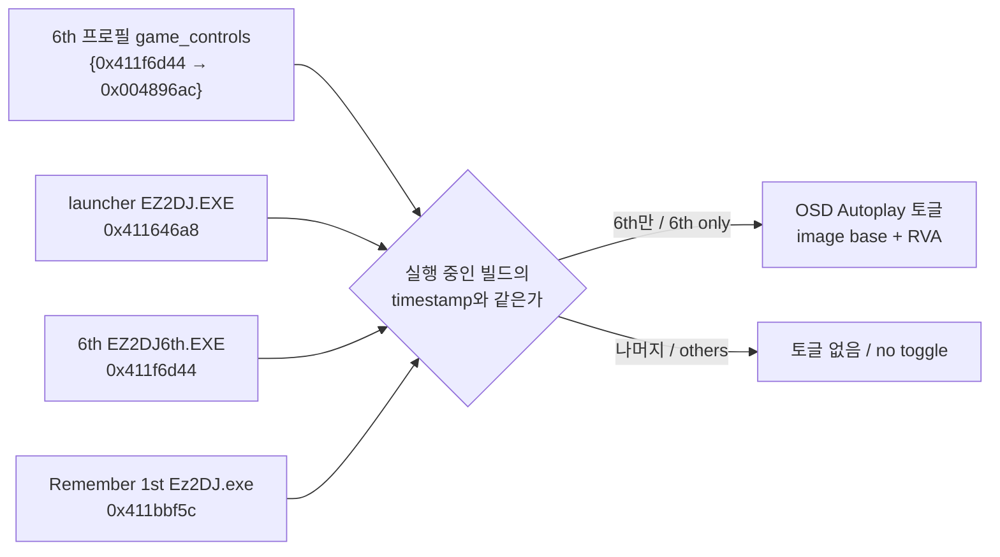

# 작업 436 설계 — 6th와 Remember 1st의 autoplay / Task 436 design — autoplay for 6th and Remember 1st

선행: [작업 297 설계](20260917-297-imgui-osd-autoplay.md), [작업 434 설계](20261001-434-remember-1st.md)
분석: [6th와 Remember 1st의 데모 플레이](../analysis/ez2dj6th-demo-play.md)
절차: [`game-state-hunt` 스킬](../../.agents/skills/game-state-hunt/SKILL.md)

## 배경 / Background

사용자가 6th CHD의 두 게임 실행 파일인 `EZ2DJ6th.EXE`와 Remember 1st의 `EZ2DJ1ST/Ez2DJ.exe`를 각각 분석해 autoplay를 찾고, 실행 중인 실행 파일에 맞게 OSD에서 autoplay를 켤 수 있게 해 달라고 요청했다.

현재 구조의 제약은 세 가지다.

- **프로필 선언**: `TargetProfile::game_controls`는 빌드 하나(timestamp 하나)만 선언할 수 있다. 6th 프로필은 launcher, 6th, Remember 1st 세 빌드를 실행한다.
- **Windows 제품**: launcher probe는 주 debuggee에만 OSD 정보(대상 id, 실행 파일 이름, autoplay 주소)를 쓴다. 6th처럼 launcher가 만든 자식(`PrepareBootstrapChildProcess`)에는 쓰지 않는다.
- **Linux 제품**: OSD에 autoplay 토글이 없다.

*The user asked for autoplay in each of the 6th CHD's two game executables, `EZ2DJ6th.EXE` and Remember 1st's `EZ2DJ1ST/Ez2DJ.exe`, switchable from the OSD according to the executable running. Three constraints stand in the way. A profile's `game_controls` declares one build (one timestamp), while the 6th profile runs three: the launcher, 6th and Remember 1st. The Windows launcher probe writes the OSD's information (target id, executable name, autoplay address) only into its main debuggee, not into a child the launcher makes (`PrepareBootstrapChildProcess`) as 6th's are. The Linux OSD has no autoplay toggle at all.*

## 분석 결과 요약 / Findings in brief

| 실행 파일 / Executable | timestamp | 데모 플래그 / demo flag | autoplay |
| --- | --- | --- | --- |
| `EZ2DJ/EZ2DJ6th.EXE` | `0x411f6d44` | `0x008895f8` | `0x008896ac` (RVA `0x004896ac`) — **확인됨**(정적·런타임 관찰) / *confirmed (static, run-time observation)* |
| `EZ2DJ/EZ2DJ1ST/Ez2DJ.exe` | `0x411bbf5c` | 전용 장면 `DemoPlayer` / *dedicated scene* | **없음**(추정) — 1st Tracks와 같은 구조 / *none (inferred), as in 1st Tracks* |

두 실행 파일 모두 보호 섹션이 없어 덤프 없이 파일을 메모리 배치로 펼쳐 분석했다. 근거는 분석 문서에 있다.

*Neither executable has a protection section, so each file was laid out as its in-memory image and analysed without a dump. The evidence is in the analysis document.*

## 결정 / Decisions

1. **빌드별 선언 목록(공용 `target`).** `TargetProfile::game_controls`를 `std::vector<GameControls>`로 바꾼다. 항목 하나는 지금처럼 빌드 하나(timestamp와 RVA)다. `ArmedAutoplayFlagRva(목록, timestamp)`는 timestamp가 같은 첫 항목의 RVA를 돌려준다. launcher의 자식은 자기 실행 파일의 timestamp로 고르므로, 한 프로필 안에서 실행 파일마다 다른 선언을 받는다. 6th 프로필은 6th 빌드 하나만 선언한다. Remember 1st는 변수가 없어 선언하지 않는다.
   ***A per-build list (shared `target`).** `TargetProfile::game_controls` becomes `std::vector<GameControls>`, each entry one build (timestamp and RVA) as before. `ArmedAutoplayFlagRva(list, timestamp)` returns the RVA of the first entry with that timestamp. A launcher's child picks by its own executable's timestamp, so each executable in one profile gets its own declaration. The 6th profile declares the 6th build only; Remember 1st has no variable and declares none.*
2. **Linux 제품.** `platform/linux/game_controls`에 무장된 autoplay 주소 하나를 둔다. Windows `game_controls.cpp`의 export 전역과 같은 역할이다.
   - CLI가 실행할 실행 파일의 PE timestamp로 `ArmedAutoplayFlagRva`를 구해 `OriginalRunEnvironment::autoplay_flag_rva`에 넣는다. launcher의 자식 run도 자기 실행 파일로 구한다.
   - 실행기는 주 이미지를 올린 base에 RVA를 더해 주소를 무장한다.
   - `LinuxHostPresentation`은 OSD를 만들 때 무장된 주소가 있으면 Autoplay 토글을 더한다.
   - Linux 게스트는 host 프로세스 안에서 자기 주소 그대로 돌므로 토글은 그 주소를 직접 읽고 쓴다. 토글은 OSD 처리(게스트 잠금을 가진 present 경로)에서만 쓰인다.
   - 실행 로그에 `game controls` 줄로 선언·무장 여부를 남긴다.

   ***The Linux product.** `platform/linux/game_controls` holds one armed autoplay address, the role the Windows `game_controls.cpp` export plays. The CLI computes `ArmedAutoplayFlagRva` from the PE timestamp of the executable it runs (a launcher's child run from its own) into `OriginalRunEnvironment::autoplay_flag_rva`; the runner arms the main image's load base plus the RVA; `LinuxHostPresentation` adds the Autoplay toggle when it makes the OSD and an address is armed. A Linux guest runs at its own addresses inside the host process, so the toggle reads and writes the address directly, only from the OSD's handling on the present path, which holds the guest lock. A `game controls` line in the run log tells whether a control was declared and armed.*
3. **Windows 제품.** `BootstrapChildHandoffOptions`에 대상 id와 프로필의 `game_controls`를 더한다. `PrepareBootstrapChildProcess`가 자식의 런타임에 대상 id·실행 파일 이름을 쓰고, 자식 이미지 timestamp로 무장된 RVA가 있으면 `g_re2dj_autoplay_flag_address`에 자식 image base + RVA를 쓴다. 결과는 `child_runtime_prepared` 진단에 `autoplay_armed`로 남긴다. 주 debuggee 경로는 목록에서 고르는 것만 바뀐다.
   ***The Windows product.** `BootstrapChildHandoffOptions` gains the target id and the profile's `game_controls`. `PrepareBootstrapChildProcess` writes the target id and executable name into the child's runtime, and, when the child image's timestamp arms an RVA, the child's image base plus that RVA into `g_re2dj_autoplay_flag_address`; the `child_runtime_prepared` diagnostic records `autoplay_armed`. The main-debuggee path only changes to pick from the list.*
4. **Remember 1st.** 1st Tracks(작업 304)처럼 일반 곡에서 켤 변수가 없으므로 선언하지 않는다. 장면 교체나 코드 패치는 원본 코드를 바꾸지 않는다는 원칙에 걸리므로 이 작업의 범위 밖이며, 필요하면 별도 설계로 다룬다.
   ***Remember 1st.** As with 1st Tracks (task 304) there is no variable to switch normal play to autoplay, so none is declared. Swapping scenes or patching code runs against the rule of leaving the original code unchanged, so it is out of scope here and would need its own design.*
5. **분석 도구.** `guest_memory.py`가 Linux에서 `/proc/<pid>/mem`으로 읽고 쓰게 한다. Yama `ptrace_scope` 1에서는 조상만 읽을 수 있으므로 `--launch`로 실행을 스크립트의 자식으로 띄운다.
   ***Analysis tooling.** `guest_memory.py` reads and writes through `/proc/<pid>/mem` on Linux; since Yama's `ptrace_scope` 1 lets only an ancestor read, `--launch` starts the run as the script's child.*

## 검증 / Verification

- 단위 테스트: 빌드별 목록의 선택(6th timestamp만 무장, launcher·Remember 1st·다른 빌드는 0), 기존 프로필 값.
  *Unit tests: picking from the per-build list (only the 6th timestamp arms; the launcher, Remember 1st and other builds give 0) and the existing profiles' values.*
- Linux x64 build와 CTest(경고를 오류로). Linux 실행에서 6th 자식의 `game controls` 줄이 무장을, launcher가 무장 없음을 보이는지 확인한다.
  *The Linux x64 build and CTest with warnings as errors; in a Linux run the 6th child's `game controls` line shows the control armed and the launcher's shows none.*
- 사용자 확인: 곡 선택 화면에서 OSD(백틱)의 Autoplay를 켜고 곡을 시작해 노트가 자동으로 맞는지.
  *User check: tick Autoplay in the OSD (backtick) at song select, start a song and see the notes hit by themselves.*
- Windows: 이 작업 환경에는 MSVC가 없어 build와 실행을 하지 못한다. Windows 변경은 기존 코드의 같은 쓰기 형태를 따르고, 확인은 사용자에게 남긴다.
  *Windows: this environment has no MSVC, so it cannot build or run the Windows product; the Windows change follows the existing write pattern and its check is left to the user.*
