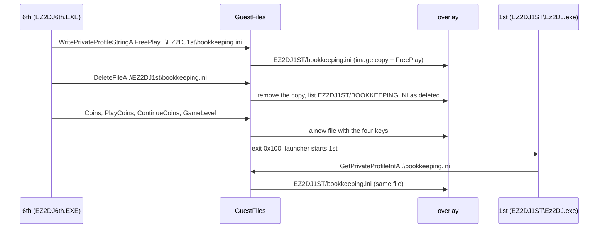

# 작업 437 설계 — Remember 1st로 넘기는 파일 / Task 437 design — the files handed to Remember 1st

선행: [작업 434 설계](20261001-434-remember-1st.md), [작업 436 설계](20261003-436-ez2dj6th-autoplay.md)

## 배경 / Background

Linux에서 6th 모드 선택으로 Remember 1st를 고르자 re2dj가 끝났다. 6th 자식이 `kernel32!DeleteFileA`(Linux facade에 없음)에서 멈췄고, launcher는 0x100을 받지 못해 `ExitProcess(0)`으로 끝났다(실행 `20261003-030014-522`, `20261003-030015-364`).

원본에서 확인한 6th의 넘김 루틴은 다음과 같다(`EZ2DJ6th.EXE`, timestamp `0x411f6d44`).

- `0x0044b250`이 종료 코드 전역 `[0x0047d0e0]`을 0x100으로 쓰고 `0x0044b0a0`을 부른다.
- `0x0044b0a0`은 `.\EZ2DJ1st\bookkeeping.ini`의 `[GAMEASSIGNMENTS]`에 차례로 다음을 한다.
  1. `FreePlay`를 쓴다.
  2. `DeleteFileA`로 그 파일을 지운다(IAT `0x0047204c`).
  3. `Coins`, `PlayCoins`, `ContinueCoins`, `GameLevel`을 쓴다.
- 쓰기는 `0x0044b170`(`wsprintfA("%d")` 뒤 `WritePrivateProfileStringA`)이다.

이것으로 작업 434에서 **미확정**이던 "1st 자식이 6th의 코인 수를 아는 이유"가 풀린다. 6th가 1st의 `bookkeeping.ini`에 직접 써 준다.

같은 로그에서 두 번째 문제도 드러났다. overlay에 `EZ2DJ1st/`와 `EZ2DJ1ST/`가 따로 생겼다. 6th는 `.\EZ2DJ1st\bookkeeping.ini`로, 1st는 launcher가 준 현재 디렉터리 `D:\ez2dj\EZ2DJ1ST`의 `.\bookkeeping.ini`로 쓴다. Windows(NTFS)는 대소문자를 구분하지 않아 같은 파일이지만, overlay의 host 경로 변환(`HostPath`)은 철자를 그대로 써서 Linux에서는 두 파일이 된다. 그래서 `DeleteFileA`만 더해도 1st는 6th가 쓴 값을 읽지 못한다.

*Choosing Remember 1st in 6th's mode select on Linux ended re2dj: the 6th child stopped at `kernel32!DeleteFileA`, missing from the Linux facade, and the launcher, never seeing 0x100, ended with `ExitProcess(0)` (runs `20261003-030014-522`, `20261003-030015-364`). The original's hand-over routine (`EZ2DJ6th.EXE`, `0x411f6d44`): `0x0044b250` writes 0x100 into the exit-code global `[0x0047d0e0]` and calls `0x0044b0a0`, which in `.\EZ2DJ1st\bookkeeping.ini`'s `[GAMEASSIGNMENTS]` writes `FreePlay`, deletes the file with `DeleteFileA` (IAT `0x0047204c`), then writes `Coins`, `PlayCoins`, `ContinueCoins` and `GameLevel`, each through `0x0044b170` (`wsprintfA("%d")` then `WritePrivateProfileStringA`). This settles task 434's **unresolved** question of how the 1st child knows 6th's coins: 6th writes them into 1st's `bookkeeping.ini`. The same log shows a second problem: the overlay holds both `EZ2DJ1st/` and `EZ2DJ1ST/`. 6th writes `.\EZ2DJ1st\bookkeeping.ini` and 1st writes `.\bookkeeping.ini` in the current directory `D:\ez2dj\EZ2DJ1ST` the launcher gives it. NTFS ignores case, so on Windows this is one file, but the overlay's host path (`HostPath`) keeps the spelling, making two files on Linux; with `DeleteFileA` alone 1st would still not read what 6th wrote.*

## 결정 / Decisions

1. **overlay 경로는 대소문자를 구분하지 않는다.** overlay의 host 경로를 정할 때, 각 구성요소는 정확한 철자가 있으면 그것을 쓰고, 없으면 대소문자 없이 일치하는 기존 항목을 쓴다. 둘 다 없으면 부른 철자로 새로 만든다. `HostDirectorySource::Resolve`와 같은 규칙이다. 이미 철자별로 갈라진 overlay 디렉터리는 정확한 철자가 이기므로 합쳐지지 않는다. 사용자가 한쪽을 지워야 한다.
   ***Overlay paths ignore case.** Each component of an overlay host path uses its exact spelling when present, otherwise an existing entry matching without case, otherwise the spelling given, as `HostDirectorySource::Resolve` does. Overlay directories already split by spelling are not merged, since the exact spelling wins; the user removes one.*
2. **이미지 파일의 삭제 표시(whiteout).** 원본 이미지는 바꾸지 않으므로, 지운 이미지 파일은 overlay 루트의 `.re2dj-deleted` 목록에 guest root 아래 경로를 대문자로 한 줄씩 남긴다. 목록에 있는 이미지 파일은 `Lookup`, `Open`, `ImagePath`, `FindFirst`에서 없는 것으로 본다. overlay 사본은 목록과 관계없이 이긴다. 그래서 지운 뒤 다시 만든 파일은 이미지 내용 없이 새로 시작한다. 목록은 `Configure`에서 읽고 삭제할 때 다시 쓴다. 6th와 1st는 차례로 도는 별도 host 프로세스이므로 디스크로 전달된다. 동시에 도는 guest 프로세스는 모델하지 않는다.
   ***Whiteouts for image files.** The image stays untouched, so a deleted image file is recorded in `.re2dj-deleted` at the overlay root, one upper-cased path below the guest root per line. A listed image file counts as missing in `Lookup`, `Open`, `ImagePath` and `FindFirst`; an overlay copy wins regardless, so a file made again after deletion starts fresh without the image's contents. The list is read at `Configure` and rewritten on each deletion; 6th and 1st are separate host processes run one after another, so it travels on disk. Guest processes running at the same time are not modelled.*
3. **`GuestFiles::Delete`와 kernel32 `DeleteFileA`(Linux facade).** [Microsoft 문서](https://learn.microsoft.com/en-us/windows/win32/api/fileapi/nf-fileapi-deletefilea)의 규칙을 따른다.

   | 경우 / Case | 결과 / Result |
   | --- | --- |
   | 성공 / success | TRUE, last error는 그대로 / *last error untouched* |
   | 없는 파일 / missing file | FALSE, `ERROR_FILE_NOT_FOUND`(2) |
   | 경로의 디렉터리가 없음 / missing directory on the way | FALSE, `ERROR_PATH_NOT_FOUND`(3) |
   | 디렉터리 / a directory | FALSE, `ERROR_ACCESS_DENIED`(5) |
   | 이 프로세스가 연 파일 / a file this process holds open | FALSE, `ERROR_SHARING_VIOLATION`(32) |

   - 성공 시 last error는 Windows 11에서 재지 못했다. 다른 측정된 파일 API와 같이 그대로 둔다(**추정**).
   - 열린 파일은 공유 모드를 모델하지 않으므로, 열려 있으면 항상 거부한다.
   - 읽기 전용 속성은 이미지에서 모델하지 않는다.
   - NULL 이름과 guest root 밖의 경로는 멈춘다.
   - Windows 제품은 그대로 둔다(아래 범위 밖).

   ***`GuestFiles::Delete` and kernel32 `DeleteFileA` (Linux facade)** follow [Microsoft's documentation](https://learn.microsoft.com/en-us/windows/win32/api/fileapi/nf-fileapi-deletefilea) as tabulated. The last error on success could not be measured on Windows 11 here and is left untouched as other measured file APIs do (**inferred**). Share modes are not modelled, so an open file always refuses. The image's read-only attribute is not modelled. A null name or a path outside the guest root stops. The Windows product is left alone (see out of scope).*

## 범위 밖 / Out of scope

- **Windows 제품의 `DeleteFileA`.** Windows의 자식 VFS는 INI 쓰기를 overlay 사본으로 보내지만 `DeleteFileA`는 실제 API로 간다. 그래서 overlay 사본이 지워지지 않을 수 있다(**추정**). 이 작업 환경에는 MSVC가 없어 확인하지 못하므로 별도 작업으로 남긴다.
  *The Windows product's `DeleteFileA`: its child VFS sends INI writes to the overlay copy but `DeleteFileA` to the real API, so the overlay copy may survive (**inferred**). With no MSVC here it cannot be checked, so it is left to a separate task.*
- overlay에만 있는 파일을 `FindFirst`가 나열하지 않는 기존 제약.
  *The existing limit that `FindFirst` does not list files only in the overlay.*

## 검증 / Verification

- 단위 테스트: 대소문자가 다른 overlay 경로가 같은 파일로 가는 것, `Delete`의 각 결과, whiteout된 이미지 파일이 `Open`·`Attributes`·`FindFirst`에서 사라지고 목록이 새 `GuestFiles`에 전달되는 것, 지운 뒤 INI 쓰기가 빈 파일에서 시작하는 것, kernel32 `DeleteFileA`.
  *Unit tests: overlay paths differing in case reach one file; each `Delete` outcome; a whiteouted image file vanishing from `Open`, `Attributes` and `FindFirst`, with the list carried to a new `GuestFiles`; an INI write after deletion starting from an empty file; and kernel32 `DeleteFileA`.*
- Linux x64 build와 CTest(경고를 오류로).
  *The Linux x64 build and CTest with warnings as errors.*
- 사용자 확인: Linux에서 6th 모드 선택으로 Remember 1st를 골라 1st 타이틀까지 가고, 6th에서 넣은 크레딧이 보이는지. 키 입력을 자동화하지 못해 사용자에게 맡긴다.
  *User check: on Linux, choose Remember 1st in 6th's mode select, reach 1st's title and see the credits put in on 6th; the key input cannot be automated here.*
