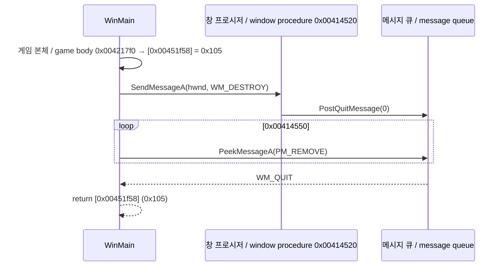

# 작업 439 설계 — Remember 1st의 WM_QUIT / Task 439 design — Remember 1st's WM_QUIT

선행: [작업 438 설계](20261003-438-remember-1st-return.md)

## 배경 / Background

작업 438 뒤에도 1st는 6th로 돌아가지 않았다. 이번에는 정리와 bookkeeping 저장을 마친 뒤 `user32!PostQuitMessage`(`0x00414532`)에서 멈췄다(실행 `20261003-114437-248`, `20261003-114502-346`).

원본의 WinMain은 다음과 같이 끝난다([분석](../analysis/ez2dj5th-6th-chd-filesystem.md)).

*After task 438, 1st still did not return to 6th: having cleaned up and saved bookkeeping, it stopped at `user32!PostQuitMessage` (`0x00414532`) (runs `20261003-114437-248`, `20261003-114502-346`). The original WinMain ends as diagrammed: after the game body it sends `WM_DESTROY` to its window, whose procedure calls `PostQuitMessage(0)`; it pumps with `PeekMessageA(PM_REMOVE)` until `WM_QUIT`; then it returns `[0x00451f58]`, 0x105 ([analysis](../analysis/ez2dj5th-6th-chd-filesystem.md)).*

## 결정 / Decisions

- **`PostQuitMessage`(Linux user32)**: 스레드의 quit 표시와 종료 코드를 `GuestUser`에 둔다. 반환값은 없고 last error는 그대로 둔다. [Microsoft 문서](https://learn.microsoft.com/en-us/windows/win32/api/winuser/nf-winuser-postquitmessage)대로, quit 표시는 메시지를 큐에 넣지 않고 표시만 세운다.
  ***`PostQuitMessage` (Linux user32)** keeps the thread's quit flag and exit code in `GuestUser`, returns nothing and leaves the last error alone; as [Microsoft documents](https://learn.microsoft.com/en-us/windows/win32/api/winuser/nf-winuser-postquitmessage), it sets a flag rather than posting a message.*
- **`PeekMessageA`**: 표시가 있으면 `WM_QUIT`(hwnd 0, wParam = 종료 코드)를 돌려준다. 그 순서는 보낸 메시지 다음, `WM_PAINT`·`WM_TIMER`보다 앞이다(같은 문서와 [PeekMessage 문서](https://learn.microsoft.com/en-us/windows/win32/api/winuser/nf-winuser-peekmessagea)의 처리 순서). `PM_REMOVE`로 꺼내면 표시를 지우고, `PM_NOREMOVE`면 남긴다. 이 모델은 보낸(posted) 메시지와 입력 메시지를 두지 않으므로 `WM_QUIT`이 맨 앞이다.
  ***`PeekMessageA`** gives `WM_QUIT` (hwnd 0, wParam the exit code) while the flag is set, after posted messages and before `WM_PAINT` and `WM_TIMER` (the processing order in that page and the [PeekMessage documentation](https://learn.microsoft.com/en-us/windows/win32/api/winuser/nf-winuser-peekmessagea)); `PM_REMOVE` clears the flag, `PM_NOREMOVE` keeps it. This model has no posted or input messages, so `WM_QUIT` comes first.*
- **`DefWindowProcA(WM_DESTROY)`**: 1st의 창 프로시저는 `PostQuitMessage` 뒤 `WM_DESTROY`를 `DefWindowProcA`로 넘긴다. Windows의 기본 처리는 아무것도 하지 않고 0을 돌려준다([WM_DESTROY 문서](https://learn.microsoft.com/en-us/windows/win32/winmsg/wm-destroy)는 처리하면 0을 돌려준다고 한다). 그대로 모델한다.
  ***`DefWindowProcA(WM_DESTROY)`**: after `PostQuitMessage` 1st's window procedure passes `WM_DESTROY` on to `DefWindowProcA`, whose default does nothing and returns 0 ([WM_DESTROY](https://learn.microsoft.com/en-us/windows/win32/winmsg/wm-destroy) says a handler returns zero); modelled as such.*
- 스레드별 큐는 지금처럼 모델하지 않는다. 1st는 창을 만든 주 스레드에서 부르고 꺼낸다.
  *Per-thread queues stay unmodelled as before; 1st posts and pumps on the main thread that made its window.*

## 검증 / Verification

- 단위 테스트(`user32_module_test.cpp`): last error 유지, `WM_QUIT`이 due timer보다 먼저 나오는 것, `PM_NOREMOVE`에 남고 `PM_REMOVE`로 사라지는 것.
  *Unit tests (`user32_module_test.cpp`): the last error kept, `WM_QUIT` ahead of a due timer, kept by `PM_NOREMOVE` and gone after `PM_REMOVE`.*
- Linux x64 build와 CTest(경고를 오류로).
  *The Linux x64 build and CTest with warnings as errors.*
- 사용자 확인: 6th → Remember 1st → 게임 한 판 → 6th.
  *User check: 6th → Remember 1st → one game → 6th.*
