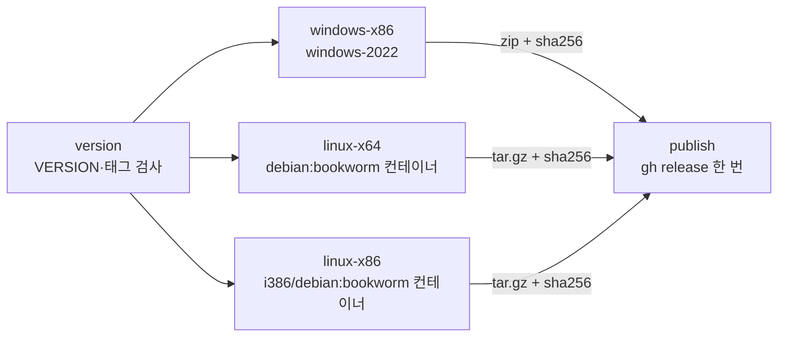

# 작업 442 설계 — Linux 릴리스 산출물 / Task 442 design — Linux release artifacts

선행: [작업 432 설계](20261001-432-github-pages-site.md)(사이트의 릴리스 분류), Release workflow(`.github/workflows/release.yml`)

## 배경 / Background

사용자가 GitHub Actions 릴리스 산출물에 Linux x86과 Linux x64를 더해 달라고 요청했다. 현재 상태는 다음과 같다.

- `release.yml`: Windows x86 job 하나가 version 검사, 빌드, 테스트, 패키징, `gh release create`를 모두 한다.
- `ci.yml`: Linux는 x64(gcc·clang)만 있다. x86 빌드는 CI가 확인하지 않는다. 설치 패키지에 오디오 헤더가 없어, SDL이 ALSA·Pulse·PipeWire backend 없이 빌드된다.
- SDL3와 SDL3_mixer는 정적 링크다. SDL은 X11·Wayland·EGL·오디오 라이브러리를 실행 시점에 `dlopen`한다. 그래서 바이너리가 직접 링크하는 공유 라이브러리는 C/C++ 런타임 정도다.
- 사이트(`scripts/site/releases.py`, `download.html`)는 릴리스마다 `-windows-x86.zip` 패키지 하나만 안다.
- Windows zip에는 서드파티 고지(`THIRD_PARTY_NOTICES.md`, `CREDITS.md`)가 들어 있지 않다. 정적 링크한 SDL 등의 라이선스는 고지를 함께 배포하도록 요구한다.

*The user asked for Linux x86 and Linux x64 in the GitHub Actions release artifacts. Today `release.yml` has one Windows x86 job doing the version gate, build, tests, packaging and `gh release create`; `ci.yml` covers Linux x64 only (gcc, clang), so no CI checks the x86 build, and its packages lack the audio headers, so SDL builds without its ALSA, Pulse and PipeWire backends. SDL3 and SDL3_mixer link statically and SDL `dlopen`s X11, Wayland, EGL and the audio libraries at run time, so the binary links little beyond the C and C++ runtimes. The site (`scripts/site/releases.py`, `download.html`) knows one `-windows-x86.zip` package per release. The Windows zip carries no third-party notices (`THIRD_PARTY_NOTICES.md`, `CREDITS.md`), which the licences of the statically linked SDL and others ask to be shipped.*

## 결정 / Decisions

1. **Workflow 구조.** `release.yml`을 다음 job으로 나눈다.
   - `version`: VERSION과 태그를 한 번만 검사하고 output으로 넘긴다.
   - `windows-x86`, `linux`(x64·x86 matrix): 빌드·테스트·패키징을 하고 artifact를 올린다.
   - `publish`: 모든 빌드 job 뒤에 artifact를 모아 `gh release`를 한 번 실행한다. 태그 실행에서만 돈다.

   빌드 job이 하나라도 실패하면 release를 만들지 않는다. 여러 job이 release를 동시에 만드는 경쟁도 없다. Release 생성과 notes 규칙은 지금과 같다.

   ***Workflow shape.** `release.yml` splits into `version` (checks VERSION against the tag once and passes it on as an output); `windows-x86` and `linux` (an x64 and x86 matrix), which build, test and package and upload artifacts; and `publish`, which after every build job gathers the artifacts and runs `gh release` once, on tag runs only. A failed build job means no release, and jobs never race to create one; release creation and the notes rules stay as they are.*
2. **Linux 빌드 환경.** 두 폭 모두 Debian 12(bookworm, glibc 2.36) 컨테이너에서 빌드한다.
   - 빌드한 glibc보다 오래된 시스템에서는 실행되지 않는다. 그래서 runner의 Ubuntu 24.04(glibc 2.39)보다 오래된 기반을 고른다.
   - x86은 `i386/debian:bookworm` 이미지로 네이티브 i386 툴체인을 쓴다. 64비트 runner가 32비트 컨테이너를 그대로 돌리고, multilib과 `:i386` 개발 패키지를 섞을 때의 충돌을 피한다. preset의 `-m32`는 i386 gcc에서도 그대로 통한다.
   - 설치 패키지는 CI 목록에 `libasound2-dev libpulse-dev libpipewire-0.3-dev libdecor-0-dev`와 `cmake ninja-build g++ git python3 file binutils`를 더한 것이다.
   - Debian 12의 CMake 3.25는 이 저장소의 최소 3.20을 만족한다. preset 형식 버전도 같이 확인한다.

   ***Linux build environment.** Both widths build in a Debian 12 (bookworm, glibc 2.36) container, older than the runner's Ubuntu 24.04 (glibc 2.39), since a binary does not run on a glibc older than the one it was built with. x86 uses the `i386/debian:bookworm` image, a native i386 toolchain the 64-bit runner runs as is, avoiding the clashes of mixing multilib with `:i386` development packages; the preset's `-m32` works with i386 gcc too. The packages are the CI list plus `libasound2-dev libpulse-dev libpipewire-0.3-dev libdecor-0-dev` and `cmake ninja-build g++ git python3 file binutils`. Debian 12's CMake 3.25 satisfies the repository's 3.20, and the preset schema version is checked with it.*
3. **C++ 런타임 정적 링크.** `linux-x64-release`와 `linux-x86-release` preset의 링크에 `-static-libstdc++ -static-libgcc`를 더한다. 대상 시스템의 libstdc++ 버전과 무관해진다. GCC Runtime Library Exception이 정적 링크를 허용한다([GCC 문서](https://gcc.gnu.org/onlinedocs/libstdc++/manual/license.html)). Debug preset은 그대로다.
   ***Static C++ runtime.** The `linux-x64-release` and `linux-x86-release` presets link with `-static-libstdc++ -static-libgcc`, so the target's libstdc++ version no longer matters; the GCC Runtime Library Exception allows it ([GCC documentation](https://gcc.gnu.org/onlinedocs/libstdc++/manual/license.html)). The debug presets are unchanged.*
4. **패키징(`scripts/package_release.sh`).** `scripts/package_release.sh <linux-x64|linux-x86> [version]`이 Release 빌드 결과를 묶는다.
   - 결과물: `build/package/re2dj-v<version>-linux-<arch>.tar.gz`와 `.sha256`(Windows와 같은 `hash *name` 형식).
   - tar.gz는 실행 권한을 보존한다. 압축 안에는 같은 이름의 최상위 디렉터리를 둔다.
   - 내용: strip한 `re2dj`, `README.md`, `LICENSE`, `VERSION`, `RELEASE_NOTES.md`, `THIRD_PARTY_NOTICES.md`, `CREDITS.md`, `config/`.
   - 스크립트는 다음을 검사하고 어긋나면 실패한다.
     - `file`로 ELF 폭(x64는 x86-64, x86은 Intel 80386)
     - `readelf -d`의 NEEDED가 허용 목록(`libc`, `libm`, `libdl`, `libpthread`, `librt`, `ld-linux*`) 안인지
     - `objdump -T`의 최대 `GLIBC_` 심볼 버전이 2.36 이하인지(로컬 빌드는 `RE2DJ_MAX_GLIBC`로 바꿀 수 있다)

   ***Packaging (`scripts/package_release.sh`).** `scripts/package_release.sh <linux-x64|linux-x86> [version]` bundles the Release build into `build/package/re2dj-v<version>-linux-<arch>.tar.gz` and `.sha256` (the Windows `hash *name` form). tar.gz keeps the executable bit, with a top-level directory of the same name inside. It holds the stripped `re2dj`, `README.md`, `LICENSE`, `VERSION`, `RELEASE_NOTES.md`, `THIRD_PARTY_NOTICES.md`, `CREDITS.md` and `config/`. The script fails unless `file` shows the right ELF width (x86-64 for x64, Intel 80386 for x86), `readelf -d`'s NEEDED stays within an allow-list (`libc`, `libm`, `libdl`, `libpthread`, `librt`, `ld-linux*`), and `objdump -T`'s highest `GLIBC_` symbol version is at most 2.36 (`RE2DJ_MAX_GLIBC` overrides it for local builds).*
5. **Windows 패키지 고지.** `scripts/package_release.ps1`도 `THIRD_PARTY_NOTICES.md`와 `CREDITS.md`를 담는다.
   ***Windows package notices.** `scripts/package_release.ps1` also ships `THIRD_PARTY_NOTICES.md` and `CREDITS.md`.*
6. **CI.** `ci.yml`의 linux-x64 job에 오디오 헤더를 더한다. 같은 bookworm i386 컨테이너로 `linux-x86` job(Debug, 경고를 오류로, CTest)을 더한다.
   ***CI.** `ci.yml`'s linux-x64 job gains the audio headers, and a `linux-x86` job (Debug, warnings as errors, CTest) runs in the same bookworm i386 container.*
7. **사이트.** 산출물 분류와 화면을 여러 플랫폼으로 넓힌다.
   - `asset_kind`가 `-windows-x86.zip`, `-linux-x64.tar.gz`, `-linux-x86.tar.gz`를 package로 분류한다. `Asset.platform`에 플랫폼 이름을 둔다.
   - `Release.package`는 지금처럼 Windows 것을 먼저 돌려준다. `Release.packages`는 모든 패키지다.
   - 다운로드 페이지는 최신 릴리스에서 플랫폼마다 버튼을 보이고, 이전 릴리스 표에 플랫폼마다 링크를 보인다.
   - 문구(ko·en)에 Linux 실행 방법과 요구사항을 더한다.

   ***Site.** `asset_kind` treats `-windows-x86.zip`, `-linux-x64.tar.gz` and `-linux-x86.tar.gz` as packages, with `Asset.platform` naming the platform. `Release.package` still returns the Windows one first, and `Release.packages` returns all. The download page shows a button per platform for the latest release and a link per platform in the older-releases table, and the text (ko, en) gains the Linux steps and requirements.*

## 범위 밖 / Out of scope

- AppImage·deb 같은 배포 형식. tar.gz 하나로 시작한다.
  *Formats such as AppImage or deb; one tar.gz to start with.*
- Windows 빌드 자체의 변경(고지 문서 추가만 한다).
  *Changing the Windows build itself, beyond the notices.*

## 검증 / Verification

- 로컬(Ubuntu 26.04, x64): `linux-x64-release` 빌드와 CTest, 그 결과물로 `package_release.sh linux-x64`(로컬 glibc가 새로우므로 `RE2DJ_MAX_GLIBC`로 한도를 올려), 압축 내용과 체크섬 확인. 패키지 실행 파일로 짧은 실행.
  *Locally (Ubuntu 26.04, x64): the `linux-x64-release` build and CTest, `package_release.sh linux-x64` on it (raising the limit with `RE2DJ_MAX_GLIBC`, since the local glibc is newer), the archive's contents and checksum, and a short run of the packaged executable.*
- 사이트: `build_site.py --offline` 빌드와, 가짜 API 데이터로 분류 함수 확인.
  *The site: an offline `build_site.py` build and the classification checked on made-up API data.*
- workflow YAML 문법 확인. 이 환경에는 Docker와 GitHub Actions가 없어 컨테이너 빌드, i386 빌드, workflow 실행은 사용자가 `workflow_dispatch`로 확인한다.
  *The workflow YAML's syntax; with no Docker or GitHub Actions here, the container builds, the i386 build and the workflow run are left to the user through `workflow_dispatch`.*
