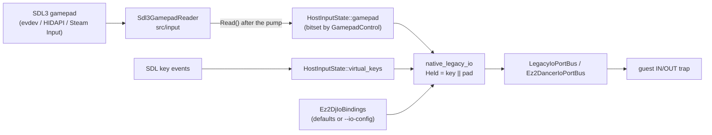

# 작업 444 설계 — 게임패드 입력 / Task 444 design — gamepad input

선행: [작업 306 설계(내장 키 매핑)](20260918-306-builtin-io-mapping.md), [작업 085 설계(EZ2DJ I/O 보드)](20260828-085-ez2dj-io-board-emulation.md), [작업 441 설계(턴테이블 step)](20261003-441-turntable-step-default.md), [작업 442 설계(Linux 릴리스)](20261003-442-linux-release-artifacts.md)

## 배경 / Background

Linux 릴리스를 스팀덱에서 돌리려면 게임패드가 필요하다. 지금 두 host의 I/O 보드 입력은 키보드뿐이다. SDL3는 `SDL_JOYSTICK`과 `SDL_HIDAPI`를 끄고 빌드하고, `hle::HostInputState`에는 키·마우스만 있다. Linux host는 `--io-config`도 받지 않고(`main.cpp`가 Windows 전용 옵션으로 거부) 내장 기본 키만 쓴다. 스팀덱 게임 모드에서는 Steam Input이 패드를 키보드로 흉내 낼 수는 있지만, 사용자가 레이아웃을 직접 만들어야 하고 스틱을 턴테이블로 쓰기 어렵다.

*Running the Linux release on a Steam Deck needs a gamepad. Both hosts' I/O board input is keyboard only: SDL3 is built with `SDL_JOYSTICK` and `SDL_HIDAPI` off, and `hle::HostInputState` holds keys and the mouse alone. The Linux host does not take `--io-config` either (`main.cpp` refuses it as a Windows-only option) and uses the built-in keys only. In the Deck's Gaming Mode, Steam Input can make the pad imitate a keyboard, but the user has to build the layout, and a stick cannot drive the turntable that way.*

## 확인된 현재 구조 / Current structure (confirmed)

| 경계 / boundary | 지금 / now |
| --- | --- |
| 바인딩 표 `input/ez2dj_keyboard_map`, `ez2dancer_keyboard_map` | 항목 이름과 기본 키 이름. 두 host 공용 |
| Windows `Ez2DjKeyboardInput` | INI를 `GetPrivateProfileStringA`로 읽고 `GetAsyncKeyState`로 폴링. 주입 런타임의 port read 트랩에서 호출 |
| Linux `native_legacy_io.cpp` | 기본 키 이름을 `ParseKeyName`으로 풀어 두고, port read 트랩(시그널 핸들러)에서 `HostInputState::virtual_keys`를 본다 |
| Linux `LinuxHostPresentation` | SDL 창의 키·마우스 이벤트를 `input_`에 기록. `Present`가 이벤트를 펌프한다 |
| CLI `--io-config` | Windows만. Linux는 `EXECUTION_UNSUPPORTED`로 끝난다 |
| SDL 빌드 | `SDL_JOYSTICK OFF`, `SDL_HIDAPI OFF` |

## 결정 / Decisions

### 1. 게임패드 컨트롤 이름과 바인딩을 공용 코어에 둔다 / Gamepad controls and bindings live in the shared core

`include/re2dj/input/gamepad.h`에 host 중립 `GamepadControl`을 둔다. SDL의 gamepad 배치(Xbox 모양)를 따르되 SDL 헤더는 포함하지 않는다. 이름은 INI가 쓰는 철자다.

| 이름 / name | 뜻 / meaning |
| --- | --- |
| `A`, `B`, `X`, `Y` | 아래·오른쪽·왼쪽·위 face 버튼(SDL south/east/west/north) |
| `BACK`, `GUIDE`, `START` | 가운데 버튼들 |
| `LSTICK`, `RSTICK` | 스틱 누름 |
| `LB`, `RB` | 숄더 |
| `LT`, `RT` | 트리거를 절반 이상 당김 |
| `DPAD_UP`, `DPAD_DOWN`, `DPAD_LEFT`, `DPAD_RIGHT` | 십자키 |
| `PADDLE1`..`PADDLE4` | 뒷면 패들(SDL right paddle 1, left paddle 1, right paddle 2, left paddle 2 순서; 스팀덱 R4·L4·R5·L5) |
| `LSTICK_LEFT`, `LSTICK_RIGHT`, `LSTICK_UP`, `LSTICK_DOWN`, `RSTICK_*` | 스틱을 그 방향으로 절반 이상 기울임 |
| `NONE` | 바인딩 없음 |

`ParseGamepadControlName`은 `ParseKeyName`과 같은 규약이다: 대소문자 무시, `NONE`과 빈 이름은 0, 모르는 이름은 -1, 그 밖에는 컨트롤 번호(1 이상).

바인딩 표 세 개(`Ez2DjButtonBinding`, `Ez2DjTurntableBinding`, `Ez2DancerButtonBinding`)에 `default_gamepad` 이름을 더한다. 기본 키처럼 **이름**으로 두어 INI 값과 같은 해석 경로를 지난다.

*`include/re2dj/input/gamepad.h` holds a host-neutral `GamepadControl`, following SDL's gamepad layout (the Xbox shape) without including SDL headers; the names are the INI spellings in the table. `ParseGamepadControlName` keeps `ParseKeyName`'s contract: case-insensitive, 0 for `NONE` or an empty name, -1 for an unknown one, otherwise the control's number (1 or more). The three binding tables gain a `default_gamepad` name, kept as a name like the default key so it takes the INI value's interpretation path.*

**기본 게임패드 매핑 / default gamepad mapping.** 한 패드로 1P를 친다. 2P 항목은 `NONE`이다.

| EZ2DJ | 패드 / pad |
| --- | --- |
| `p1_1`..`p1_5` | `X`, `Y`, `B`, `A`, `RB` |
| `p1_pedal` | `LB` |
| `p1_negative`, `p1_positive` | `LSTICK_LEFT`, `LSTICK_RIGHT` |
| `p1_start` | `START` |
| `coin` | `BACK` |
| `effector1`..`effector4` | `DPAD_UP`, `DPAD_DOWN`, `DPAD_LEFT`, `DPAD_RIGHT` |
| `test`, `service`, `p2_*` | `NONE` |

| EZ2Dancer | 패드 / pad |
| --- | --- |
| `p1_left`, `p1_center`, `p1_right` | `DPAD_LEFT`, `DPAD_DOWN`, `DPAD_RIGHT` |
| `p1_sensor_top_left`, `p1_sensor_top_right` | `LB`, `RB` |
| `p1_sensor_bottom_left`, `p1_sensor_bottom_right` | `LT`, `RT` |
| `coin` | `BACK` |
| `test`, `service`, `p2_*` | `NONE` |

턴테이블은 키보드와 같은 규칙으로 움직인다: 방향 컨트롤을 쥔 동안 8 ms마다 `step`씩. 스틱의 아날로그 양은 쓰지 않는다(절반 이상 기울임만 "쥠"). 아날로그 턴테이블은 비목표다.

*The turntable follows the keyboard rule, moving by `step` every 8 ms while a direction control is held; the stick's analogue amount is not used (half or more deflection counts as held), and an analogue turntable is a non-goal.*

### 2. INI 로더를 공용 코어에 둔다 / The INI loader lives in the shared core

`include/re2dj/input/io_bindings.h`: 두 게임의 **풀린 바인딩**(`Ez2DjIoBindings`: 항목별 키·패드 컨트롤 번호와 `step`, `Ez2DancerIoBindings`: 항목별 키·패드)과, INI **본문**에서 그것을 채우는 `LoadEz2DjIoBindings(text, out, error)`·`LoadEz2DancerIoBindings`. 파일 읽기는 호출자가 한다. INI 규칙은 작업 405의 `hle::FindPrivateProfileValue`(Windows 11과 같은 판정)를 쓴다. 덮어쓰기 정책은 작업 306 그대로다: 적힌 항목만 덮어쓰고, `NONE`은 끄고, 모르는 이름은 오류, `step`은 1..32.

섹션은 `[buttons]`·`[turntables]`(키보드, 지금과 같음)와 새 `[gamepad]`다. `[gamepad]`는 버튼과 턴테이블 방향 항목을 같은 이름으로 함께 받는다(이름이 겹치지 않는다). 예제 INI 두 개에 `[gamepad]`를 기본값으로 더하고, 공용 테스트가 기본값과 대조한다.

Windows `Ez2DjKeyboardInput`은 이번에 바꾸지 않는다(아래 4).

*`include/re2dj/input/io_bindings.h` holds both games' resolved bindings (`Ez2DjIoBindings`: each entry's key and pad control number plus `step`; `Ez2DancerIoBindings`) and `LoadEz2DjIoBindings(text, out, error)` / `LoadEz2DancerIoBindings`, which fill them from INI text the caller read, through task 405's `hle::FindPrivateProfileValue` (Windows 11's rules). The override policy is task 306's: only listed entries override, `NONE` unbinds, an unknown name is an error, `step` is 1..32. The sections are `[buttons]` and `[turntables]` as today plus a new `[gamepad]`, which takes button and turntable-direction entries under the same names (they do not collide). Both example INIs gain a `[gamepad]` section at the defaults, which the shared test compares. Windows' `Ez2DjKeyboardInput` is unchanged (4 below).*

### 3. SDL3 게임패드 reader와 Linux 연결 / The SDL3 gamepad reader and the Linux wiring

- `hle::HostInputState`에 `std::bitset<32> gamepad`를 더한다. 비트는 `GamepadControl` 번호다. 연결된 **모든** 패드의 상태를 OR한다. 패드는 키보드처럼 누구의 것도 아니다.
- `src/input/sdl3_gamepad_reader.cpp`(`re2dj_sdl3_gamepad` 라이브러리, SDL private): `SDL_INIT_GAMEPAD`를 초기화하고, 이미 꽂힌 패드를 열고, `SDL_EVENT_GAMEPAD_ADDED/REMOVED`로 열고 닫으며, `Read`가 열린 패드의 버튼·축을 bitset으로 만든다. 축 문턱은 16384(절반)다. SDL 헤더는 이 파일에만 있다. 그래픽·오디오의 SDL backend가 `src/graphics`·`src/audio`에 있듯 이 reader는 `src/input`에 둔다.
- `LinuxHostPresentation`이 reader를 소유한다. 창을 열 때 초기화하고(실패는 경고로 남기고 계속), `HandleEvent`가 장치 이벤트를 reader에 먼저 넘기고 이름을 로그에 남기며, `Present`가 이벤트 펌프 뒤에 `Read`로 `input_.gamepad`를 채운다. 포커스를 잃으면 키처럼 비운다.
- `native_legacy_io.cpp`는 풀린 바인딩(`Ez2DjIoBindings`·`Ez2DancerIoBindings`)을 받아 두고, 항목마다 키 **또는** 패드 컨트롤이 쥐어지면 눌림으로 본다. `step`도 바인딩에서 온다. 시그널 핸들러에서 bitset을 읽는 것은 지금과 같다.
- CLI: `--io-config`를 Linux에서도 받는다. 파일을 읽어 로더로 풀고 `OriginalRunEnvironment::io_bindings`로 넘긴다. 파일이 없거나 비면 기본값이다. 런처의 자식(6th)은 이미 부모 인자를 물려받으므로 `--io-config`도 따라간다. 기본값 사용·파일 사용을 로그에 남긴다.
- SDL 빌드: `SDL_JOYSTICK ON`, `SDL_HIDAPI ON`, `SDL_HIDAPI_LIBUSB OFF`. Linux의 장치 열거는 libudev를 `dlopen`하므로 NEEDED는 늘지 않는다(패키지 스크립트가 검사한다). 빌드 패키지에 `libudev-dev`를 더해 핫플러그 열거를 켠다. HIDAPI는 SDL 기본값이며 블루투스 PS·Switch 패드와 데스크톱 모드의 스팀덱 내장 패드를 위한 것이다. 스팀덱 게임 모드의 Steam Input 가상 패드는 evdev로 보인다. 어느 경로가 실제 Deck에서 쓰이는지는 **미확정**이다.

*`hle::HostInputState` gains `std::bitset<32> gamepad`, one bit per `GamepadControl`, OR-ed over every connected pad; like the keyboard, a pad belongs to nobody. `src/input/sdl3_gamepad_reader.cpp` (library `re2dj_sdl3_gamepad`, SDL private) initialises `SDL_INIT_GAMEPAD`, opens the pads already present, opens and closes on `SDL_EVENT_GAMEPAD_ADDED/REMOVED`, and `Read` turns the open pads' buttons and axes into the bitset with an axis threshold of 16384 (half); SDL headers stay in that file, placed in `src/input` as the graphics and audio SDL backends are in theirs. `LinuxHostPresentation` owns the reader: initialised when the window opens (a failure is a warning), device events go to the reader first and are logged by name, and `Present` fills `input_.gamepad` by `Read` after the event pump; losing focus clears it like the keys. `native_legacy_io.cpp` keeps the resolved bindings and treats an entry as pressed when its key or its pad control is held, with `step` from the bindings; the signal handler reads the bitset as it does today. The CLI accepts `--io-config` on Linux too, reads the file, resolves it through the loader into `OriginalRunEnvironment::io_bindings` (defaults when absent or empty) and logs which; the launcher's child (6th) already inherits the parent's arguments, so `--io-config` follows. SDL builds with `SDL_JOYSTICK ON`, `SDL_HIDAPI ON`, `SDL_HIDAPI_LIBUSB OFF`; Linux device enumeration `dlopen`s libudev so NEEDED does not grow (the package script checks), and `libudev-dev` joins the build packages for hot-plug enumeration. HIDAPI is SDL's default and serves Bluetooth PS and Switch pads and the Deck's built-in pad in Desktop Mode; Steam Input's virtual pad in Gaming Mode appears through evdev. Which path a real Deck takes is **unresolved**.*

### 4. Windows host는 이번 범위 밖 / The Windows host is out of scope

> 후속: [작업 445](20261004-445-windows-gamepad-input.md)가 Windows host 연결을 시도했으나 실제 패드 눌림이 게임에 닿지 않아 사용자 지시로 원복했다. 코드는 이 절의 상태다. / *Follow-up: [task 445](20261004-445-windows-gamepad-input.md) tried wiring the Windows host, but real pad presses never reached the game and the code was reverted at the user's request; the code stands as this section describes.*

Windows의 키보드 입력은 원본 프로세스 안의 주입 런타임에서 돈다. 거기서 SDL joystick 서브시스템을 켜면 원본 프로세스 안에 장치 알림 창과 조이스틱 스레드가 생기므로 별도 검증이 필요하다. 이번 작업은 바인딩과 로더를 host 중립으로 두어 뒤에 Windows가 같은 것을 쓸 수 있게만 한다. `Ez2DjKeyboardInput`은 `[gamepad]` 섹션을 무시한다.

*Windows keyboard input runs in the injected runtime inside the original process; enabling SDL's joystick subsystem there adds a device-notification window and a joystick thread to that process and needs its own verification. This task only keeps the bindings and loader host-neutral so Windows can adopt them later; `Ez2DjKeyboardInput` ignores a `[gamepad]` section.*

## 영향 범위 / Impact

| 대상 / target | 영향 / effect |
| --- | --- |
| Linux, 옵션 없이 | 키보드는 그대로. 연결된 게임패드가 기본 매핑으로 1P를 친다 |
| Linux `--io-config` | 거부되지 않고 적용된다(키보드·게임패드·`step`) |
| Windows | 동작 변화 없음. 예제 INI의 `[gamepad]`는 읽지 않는다 |
| 릴리스 패키지 | SDL joystick·HIDAPI 코드가 들어가 조금 커진다. NEEDED는 같아야 한다 |

## 검증 계획 / Verification plan

1. 공용 단위 테스트(`re2dj_unit_tests`): 컨트롤 이름 파싱, 세 바인딩 표의 `default_gamepad`가 모두 유효하고 예제 INI `[gamepad]`와 같음, 로더가 빈 본문에서 기본값·일부 INI에서 그 항목만·`NONE`·모르는 이름 오류·`step` 범위를 지킴.
2. SDL reader 테스트(`re2dj_sdl3_gamepad_test`): SDL 가상 조이스틱(`SDL_AttachVirtualJoystick`)으로 버튼·축을 넣고 bitset을 확인한다. 하드웨어가 없어도 돈다.
3. WSL `linux-x64-debug` build와 CTest(경고를 오류로), `linux-x64-release` build와 `package_release.sh`의 NEEDED 검사.
4. Windows x86 build와 `ez2dj_keyboard_input_test`·`ez2dancer_keyboard_input_test`(바인딩 구조체가 바뀌므로).
5. 실제 게임패드로 Linux에서 6th를 쳐 보는 것은 이 환경(WSL, USB 없음)에서 할 수 없다. 사용자가 데스크톱 Linux 또는 스팀덱에서 확인한다.

*Shared unit tests: control-name parsing, every table's `default_gamepad` valid and equal to the example INIs' `[gamepad]`, and the loader giving defaults for empty text, overriding only listed entries, `NONE`, an unknown-name error and the `step` range. An SDL reader test (`re2dj_sdl3_gamepad_test`) drives a virtual joystick (`SDL_AttachVirtualJoystick`) and checks the bitset, needing no hardware. The WSL `linux-x64-debug` build and CTest with warnings as errors, and the `linux-x64-release` build with `package_release.sh`'s NEEDED check. The Windows x86 build with `ez2dj_keyboard_input_test` and `ez2dancer_keyboard_input_test`, since the binding structs change. Playing 6th on Linux with a real pad cannot be done here (WSL, no USB); the user checks on desktop Linux or a Steam Deck.*

## 비목표 / Non-goals

- 아날로그 턴테이블, 진동, 패드별 플레이어 배정, 재매핑 UI, Windows host 연결.

*An analogue turntable, rumble, per-pad player assignment, a remapping UI, and the Windows host wiring.*
