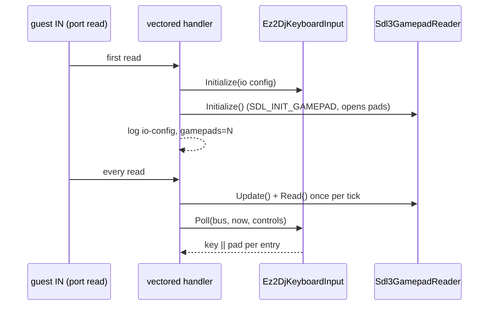

# 작업 445 설계 — Windows host 게임패드 입력 / Task 445 design — gamepad input on the Windows host

선행: [작업 444 설계(게임패드 입력)](20261003-444-gamepad-input.md), [작업 306 설계(내장 키 매핑)](20260918-306-builtin-io-mapping.md)

## 배경 / Background

작업 444는 컨트롤 이름·기본 매핑·INI 로더·SDL3 reader를 host 중립으로 만들고 Linux host만 연결했다. Windows의 `Ez2DjKeyboardInput`·`Ez2DancerKeyboardInput`은 여전히 `GetPrivateProfileStringA`로 키 항목만 읽고 `GetAsyncKeyState`로 폴링한다. 사용자가 두 host 공통 적용을 요청했다. 이 PC에는 실제 Xbox Series X 컨트롤러가 있어 Windows 연결을 실제 장치로 검증할 수 있다.

*Task 444 made the control names, default mapping, INI loader and SDL3 reader host-neutral and wired the Linux host only; Windows' `Ez2DjKeyboardInput` and `Ez2DancerKeyboardInput` still read key entries alone through `GetPrivateProfileStringA` and poll with `GetAsyncKeyState`. The user asked for both hosts, and this PC has a real Xbox Series X controller to verify the Windows wiring against.*

## 확인된 현재 구조 / Current structure (confirmed)

- 주입 런타임은 포트 read 트랩(vectored exception handler, 게스트 스레드) 안에서 첫 read 때 키보드 입력을 초기화하고(`g_keyboard_input_state` 0→1/2), 매 read마다 `Poll`한다. 이벤트 펌프는 없다.
- 같은 프로세스에서 `Sdl3MixerAudioBackend::Instance()`가 DirectSound facade 호출 때 `SDL_InitSubSystem(SDL_INIT_AUDIO)`를 이미 한다. SDL은 원본 프로세스 안에서 동작 중이다.
- SDL3 Windows joystick backend는 장치 알림용 숨은 창과 조이스틱 스레드(`SDL_JOYSTICK_THREAD` 기본 켬)를 만든다. 버튼·축 상태는 `SDL_UpdateGamepads()`(또는 이벤트 펌프)가 갱신하고, 장치 추가·제거는 이벤트 큐에 쌓인다.

*The injected runtime initialises keyboard input on the first port read inside the vectored exception handler (`g_keyboard_input_state` 0→1/2) and polls on every read, with no event pump. In the same process `Sdl3MixerAudioBackend::Instance()` already calls `SDL_InitSubSystem(SDL_INIT_AUDIO)` from a DirectSound facade call, so SDL runs inside the original process today. SDL3's Windows joystick backend makes a hidden device-notification window and a joystick thread (`SDL_JOYSTICK_THREAD` on by default); button and axis state is refreshed by `SDL_UpdateGamepads()` or the event pump, and device additions and removals queue as events.*

## 결정 / Decisions

### 1. Windows 입력 클래스가 공용 로더를 쓴다 / The Windows input classes use the shared loader

`Ez2DjKeyboardInput::Initialize(path, error)`와 `Ez2DancerKeyboardInput::Initialize`는 파일을 읽어 `LoadEz2DjIoBindings`·`LoadEz2DancerIoBindings`로 푼다. 공개 계약은 같다: 경로가 없거나 비면 기본값, 적힌 항목만 덮어쓰기, `NONE`, 모르는 이름과 `step` 범위는 오류. 그래서 `[gamepad]` 섹션이 Windows에서도 읽힌다. INI 판정이 `GetPrivateProfileStringA`에서 공용 `hle::FindPrivateProfileValue`(작업 405가 Windows 11 규칙으로 맞춘 것)로 바뀐다. `keyboard_input_common`의 `ReadKeyboardKeyBinding`은 쓰이지 않게 되어 지운다. `ParseKeyboardKeyName`과 VK 상수 `static_assert`, `IsKeyboardKeyPressed`는 남는다.

`Poll`은 게임패드 상태를 인자로 받는다: `Poll(bus, now_ms, const GamepadControls& gamepad)`, `Poll(bus, const GamepadControls& gamepad)`. 항목마다 키 **또는** 패드 컨트롤이 쥐어지면 눌림이다. 접근자 `gamepad_control(button)`·`turntable_gamepad(index)`를 더한다.

*`Ez2DjKeyboardInput::Initialize(path, error)` and `Ez2DancerKeyboardInput::Initialize` read the file and resolve it with `LoadEz2DjIoBindings` / `LoadEz2DancerIoBindings`, keeping the public contract (defaults for no or an empty path, only listed entries override, `NONE`, errors for unknown names and `step` out of range), so `[gamepad]` is read on Windows too; the INI rules move from `GetPrivateProfileStringA` to the shared `hle::FindPrivateProfileValue` (task 405's Windows 11 rules). `ReadKeyboardKeyBinding` in `keyboard_input_common` becomes unused and goes; `ParseKeyboardKeyName`, the VK `static_assert`s and `IsKeyboardKeyPressed` stay. `Poll` takes the gamepad state, `Poll(bus, now_ms, const GamepadControls& gamepad)` and `Poll(bus, const GamepadControls& gamepad)`, an entry being pressed when its key or its pad control is held, with accessors `gamepad_control(button)` and `turntable_gamepad(index)`.*

### 2. 펌프 없는 host를 위한 reader의 `Update` / The reader's `Update` for a host without an event pump

`Sdl3GamepadReader::Update()`를 더한다: `SDL_UpdateGamepads()`로 상태를 갱신한 뒤, 큐에서 joystick·gamepad 이벤트(`SDL_EVENT_JOYSTICK_AXIS_MOTION`..`SDL_EVENT_GAMEPAD_STEAM_HANDLE_UPDATED`)만 `SDL_PeepEvents`로 꺼내 ADDED·REMOVED를 `HandleEvent`로 처리하고 나머지는 버린다. 큐가 자라지 않고, 다른 이벤트는 건드리지 않는다. 장치 추가·제거를 host가 로그에 남길 수 있게 `SetDeviceObserver(std::function<void(bool added, const std::string& name)>)`를 두고, `HandleEvent`와 `Update` 모두 그것을 부른다. Linux host는 그대로 `HandleEvent`를 쓴다(observer는 쓰지 않음).

*`Sdl3GamepadReader::Update()` refreshes state with `SDL_UpdateGamepads()`, then takes only the joystick and gamepad events (`SDL_EVENT_JOYSTICK_AXIS_MOTION` .. `SDL_EVENT_GAMEPAD_STEAM_HANDLE_UPDATED`) from the queue with `SDL_PeepEvents`, routing ADDED and REMOVED through `HandleEvent` and dropping the rest, so the queue does not grow and other events are untouched. `SetDeviceObserver(std::function<void(bool added, const std::string& name)>)` lets a host log additions and removals from either path; the Linux host keeps using `HandleEvent` without it.*

### 3. 주입 런타임 연결 / The injected runtime wiring

- 전역 `g_gamepad_reader`와 `g_gamepad_controls`. 키보드 입력이 초기화되는 그 자리에서 `g_gamepad_reader.Initialize`도 한다. 실패하면 런타임 로그에 남기고 키보드만 쓴다(키보드 상태 1은 유지).
- 매 read마다 `GetTickCount64()`가 지난 갱신과 다를 때만 `Update()`와 `Read()`를 한다. 포트 read는 프레임당 여러 번이지만 SDL 갱신은 tick당 한 번이다(게임이 `timeBeginPeriod`를 걸면 1 ms, 아니면 15.6 ms).
- VFS trace의 `io-config` 줄에 `gamepads=N`을 더하고, 장치 추가·제거는 런타임 로그에 `re2dj:gamepad:added name=...`·`removed`로 남긴다.
- 트랩 안에서 SDL을 초기화하는 것은 이미 `GetPrivateProfileStringA`·파일 IO를 같은 자리에서 하는 것과 같은 성격이다. 조이스틱 스레드와 숨은 창이 원본 프로세스 안에 생기는 것은 **실제 실행으로 확인**한다.

*Globals `g_gamepad_reader` and `g_gamepad_controls`; the reader is initialised where keyboard input is, a failure being logged and leaving the keyboard (state 1) in place. On every read, `Update()` and `Read()` run only when `GetTickCount64()` differs from the last refresh: port reads come several times a frame, SDL refreshes once a tick (1 ms under the game's `timeBeginPeriod`, 15.6 ms otherwise). The VFS trace's `io-config` line gains `gamepads=N`, and additions and removals go to the runtime log as `re2dj:gamepad:added name=...` / `removed`. Initialising SDL inside the trap is of the same nature as the `GetPrivateProfileStringA` and file I/O already done there; the joystick thread and hidden window inside the original process are **checked by a real run**.*

### 3-1. SDL의 포커스 규칙과 백그라운드 이벤트 / SDL's focus rule and background events

첫 실행 확인에서 패드가 열렸는데도 버튼이 게임에 들어가지 않았다. 원인은 SDL joystick의 규칙이다: SDL 창이 하나라도 있는데 `SDL_GetKeyboardFocus()`가 없으면 눌림을 버린다(`SDL_PrivateJoystickShouldIgnoreEvent`, 놓음은 통과). Windows 제품은 게임 화면을 host 창 아래의 자식 HWND를 감싼 SDL 창에 그리고, 키보드 포커스는 상위 host 창이 가지므로 SDL 입장에서는 항상 포커스가 없다. 단위 테스트는 SDL 창이 없어 이 규칙에 걸리지 않았고, Linux는 SDL 창 자체가 포커스를 가져 문제가 없다.

결정: `Sdl3GamepadReader::AllowBackgroundEvents(bool)`(hint `SDL_HINT_JOYSTICK_ALLOW_BACKGROUND_EVENTS`)을 두고, 주입 런타임이 reader를 만들기 전에 켠다. Windows 키보드가 `GetAsyncKeyState`로 포커스와 무관하게 읽히는 것과 같은 동작이다. Linux host는 기본값(포커스 있을 때만)을 유지한다. reader 테스트가 숨은 SDL 창(포커스 없음)으로 "허용 전엔 버려지고 허용 뒤엔 보임"을 재현한다.

*The first run check opened the pad yet no button reached the game. The cause is SDL's joystick rule: once any SDL window exists and `SDL_GetKeyboardFocus()` is null, presses are dropped (`SDL_PrivateJoystickShouldIgnoreEvent`; releases pass). The Windows product draws into an SDL window wrapping a child HWND under the host window, which keeps keyboard focus, so to SDL there is never focus; the unit test had no SDL window, and on Linux the SDL window itself takes focus. Decision: `Sdl3GamepadReader::AllowBackgroundEvents(bool)` (hint `SDL_HINT_JOYSTICK_ALLOW_BACKGROUND_EVENTS`), switched on by the injected runtime before it makes the reader, matching Windows' keys read through `GetAsyncKeyState` regardless of focus; the Linux host keeps the default. The reader test reproduces "dropped before, seen after" with a hidden (unfocused) SDL window.*

### 4. 빌드 / Build

주입 런타임 DLL에 `src/input/gamepad.cpp`, `src/input/io_bindings.cpp`, `src/input/sdl3_gamepad_reader.cpp`를 더한다. SDL3 static은 이미 링크된다(오디오). 키보드 입력 테스트는 `re2dj_core`를 링크하므로 로더를 얻는다.

*The injected runtime DLL gains `src/input/gamepad.cpp`, `src/input/io_bindings.cpp` and `src/input/sdl3_gamepad_reader.cpp`; SDL3 static is linked already for audio, and the keyboard input tests get the loader from `re2dj_core`.*

## 영향 범위 / Impact

| 대상 / target | 영향 / effect |
| --- | --- |
| Windows, 옵션 없이 | 키보드는 그대로. 연결된 패드가 기본 매핑으로 1P를 친다 |
| Windows `--io-config` | `[gamepad]`도 읽힌다. INI 판정이 Win32 API에서 공용 규칙으로 바뀌지만 작업 405가 같은 결과로 맞췄다 |
| Linux | 변화 없음 |
| 원본 프로세스 | SDL 조이스틱 스레드와 숨은 창이 추가된다 |

## 검증 계획 / Verification plan

1. Windows x86 build. `ez2dj_keyboard_input_test`·`ez2dancer_keyboard_input_test`에 게임패드 검사(기본값과 예제 `[gamepad]` 대조, 부분 덮어쓰기, 패드 컨트롤을 쥔 `Poll`이 보드 포트에 반영됨)를 더해 통과.
2. `re2dj_sdl3_gamepad_test`에 `Update()` 경로 검사를 더한다(펌프 없이 가상 패드의 추가·버튼·제거가 보임).
3. 실제 실행: `re2dj.exe ez2dj6th`를 Xbox 패드를 꽂은 채 띄워 런타임 로그의 `gamepads=1`과 장치 이름을 확인한다. 버튼이 게임에 들어가는지는 사용자가 패드를 눌러 확인한다.
4. Linux x64 build와 CTest(reader 변경이 Linux에 영향 없음).

*The Windows x86 build, with gamepad checks added to `ez2dj_keyboard_input_test` and `ez2dancer_keyboard_input_test` (defaults against the example `[gamepad]`, partial overrides, a `Poll` with a pad control held reaching the board's port); an `Update()` check in `re2dj_sdl3_gamepad_test` (a virtual pad's addition, buttons and removal seen without a pump); a real run of `re2dj.exe ez2dj6th` with the Xbox pad attached, checking the runtime log's `gamepads=1` and device name, the user pressing the pad to confirm input reaches the game; and the Linux x64 build and CTest.*
