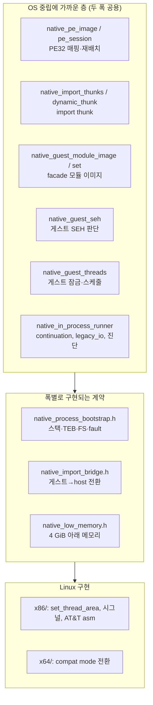
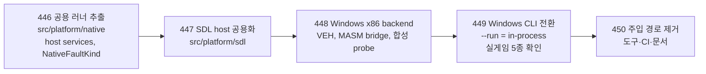

# 작업 446 설계 — Windows 주입 경로 폐기와 in-process 로더 통합 / Task 446 design — retiring Windows injection for the shared in-process loader

선행: [작업 307 Linux x86·x64 설계](20260918-307-linux-x86-x64-wsl.md), [작업 353 x64 compat mode](20260924-353-linux-x64-compat-mode-adapter.md), [작업 379 i386 helper 제거](20260926-379-remove-native-helper-ipc.md), [작업 444 게임패드](20261003-444-gamepad-input.md), [작업 445 Windows 게임패드(원복)](20261004-445-windows-gamepad-input.md)

## 배경 / Background

지금 두 host는 원본 PE32를 서로 다른 방식으로 실행한다.

| | Windows (현재) | Linux |
| --- | --- | --- |
| 실행 주체 | 원본 EXE를 **실제 Windows 프로세스**로 띄움 | re2dj **자기 프로세스 안**에 PE32를 매핑해 실행 |
| HLE 연결 | debugger로 멈춘 뒤 런타임 DLL 주입, IAT 교체, 분리 | import thunk가 공용 `ImportDispatcher`와 `hle/modules` facade로 감 |
| 그래픽·소리 | Windows 전용 COM facade(`direct3d3_com_facade` 4.5천 줄 등), 실제 Win32 창 | 공용 `hle/modules`의 DirectX facade, SDL3 창·오디오 |
| 입력 | 런타임 DLL 안의 `GetAsyncKeyState` 폴링 | SDL 이벤트 → `HostInputState` |
| 코드 규모 | 런처 probe 1.2만 줄 + 주입 런타임·facade 약 1.7만 줄 | 러너 약 1.1만 줄(두 폭 포함) |

같은 게임을 두 벌의 HLE로 맞추고 있어, Linux에서 고친 것이 Windows에 저절로 가지 않는다. 작업 445는 그 비용을 보여 줬다: 게임패드는 Linux에서 바로 됐지만, Windows는 원본 프로세스 안의 SDL 포커스·스레드 문제에 막혀 원복했다. 사용자는 Windows 주입을 폐기하고 Linux 형태의 로더로 통합하기로 했다.

*The two hosts run the original PE32 in different ways: Windows starts the EXE as a real Windows process, injects a runtime DLL behind a debugger and swaps its IAT, with Windows-only COM facades and real Win32 windows; Linux maps the PE32 into re2dj's own process, routes import thunks to the shared `ImportDispatcher` and `hle/modules` facades, and presents and plays through SDL3. Two HLEs of the same game means a Linux fix never reaches Windows by itself; task 445 showed the cost, gamepads working at once on Linux but blocked on Windows by SDL focus and thread issues inside the original process, and reverted. The user decided to retire Windows injection and unify on the Linux-style loader.*

## 확인된 현재 구조 / Current structure (confirmed)

Linux 러너(`src/platform/linux/`)는 이미 세 층으로 나뉘어 있다.

- 중립 층의 OS 의존은 좁다: `mmap`·`mprotect`·`munmap`(PE·thunk·SEH·모듈 이미지), `clock_nanosleep`·`clock_gettime`(스레드·legacy I/O), `sysconf(_SC_PAGESIZE)`(kernel32 진단), 그리고 fault 종류를 **시그널 번호**(`SIGTRAP`·`SIGILL`)로 비교하는 곳(`original_runner`, 세 observation, thread probe).
- 그래픽·오디오·키보드·게임패드 host(`host_presentation`, `host_audio`, `host_keyboard`, `game_controls`)는 SDL3만 쓴다.
- 자식 프로세스 런처(`host_process_launcher`)는 `posix_spawn`과 파이프 fd를 쓴다.
- 공용 `hle/modules`(kernel32·user32·gdi32·ddraw·d3d·dsound·dinput·winmm)는 이미 두 OS에서 빌드된다.

*The Linux runner is already layered: a nearly OS-neutral layer shared by both widths (PE mapping, import thunks, facade module images, guest SEH decisions, guest threads, the continuation, legacy I/O and diagnostics), contracts implemented per width (bootstrap, import bridge, low memory), and the Linux implementations (`x86/` with `set_thread_area`, signals and AT&T asm; `x64/` with the compatibility-mode transition). The neutral layer's OS ties are narrow: `mmap`/`mprotect`/`munmap`, `clock_nanosleep`/`clock_gettime`, `sysconf(_SC_PAGESIZE)`, and fault kinds compared as **signal numbers** (`SIGTRAP`, `SIGILL`). The presentation, audio, keyboard and gamepad hosts use SDL3 alone, the child launcher uses `posix_spawn` and pipe fds, and the shared `hle/modules` already build on both OSes.*

## 결정 / Decisions

### 1. 공용 in-process 러너를 `src/platform/native/`로 / The shared in-process runner moves to `src/platform/native/`

- Linux 루트의 중립 층과 세 계약 헤더를 `src/platform/native/`(namespace `re2dj::platform::native`)로 옮긴다. 공개 헤더 `include/re2dj/platform/linux/original_runner.h`도 `include/re2dj/platform/native/`로.
- OS 의존은 새 계약 `native_host_services.h` 뒤로 숨긴다: 고정 주소 예약·임의 주소 할당·보호 변경·해제(`HostMemory*`), 페이지 크기, 단조 시계(ms), 잠자기. Linux 구현은 `src/platform/linux/native_host_services.cpp`, Windows 구현은 `src/platform/windows/x86/`.
- fault 종류는 시그널 번호 대신 중립 enum `NativeFaultKind`(`kAccessViolation`, `kIllegalInstruction`, `kPrivilegedInstruction`, `kBreakpoint`, `kSingleStep`, `kDivide`, `kOther`)로. 각 bootstrap이 시그널·NTSTATUS를 이 값으로 바꾼다. 로그에 남는 원래 코드(`status_code`)는 그대로 둔다.
- SDL host 네 가지는 `src/platform/sdl/`(namespace `re2dj::platform::sdl`)로 옮긴다. 두 OS가 같은 창·입력·소리·게임패드를 쓴다.
- 이 디렉터리 규칙은 AGENTS.md 구현 규칙에 더한다: `src/platform/native/`는 OS 중립 in-process 러너, `src/platform/sdl/`는 두 OS 공용 SDL host. 둘 다 OS 헤더를 포함하지 않는다.

*The neutral layer and the three contract headers move to `src/platform/native/` (namespace `re2dj::platform::native`), the public `original_runner.h` to `include/re2dj/platform/native/`. OS ties go behind a new contract, `native_host_services.h`: fixed-address reservation, anywhere allocation, protection changes and release, the page size, a monotonic millisecond clock and sleeping, implemented in `src/platform/linux/native_host_services.cpp` and under `src/platform/windows/x86/`. Fault kinds become the neutral `NativeFaultKind` instead of signal numbers, each bootstrap translating signals or NTSTATUS, while the raw `status_code` stays in logs. The four SDL hosts move to `src/platform/sdl/` (namespace `re2dj::platform::sdl`), shared by both OSes. AGENTS.md's implementation rules gain both directories, neither of which includes OS headers.*

### 2. Windows x86 backend / The Windows x86 backend

Windows 제품은 지금처럼 Win32 x86 실행 파일(64비트 Windows의 WOW64에서 실행)이다. Linux i386 backend에 해당하는 것을 `src/platform/windows/x86/`에 둔다.

| 계약 | Linux i386 | Windows x86 |
| --- | --- | --- |
| 게스트 스레드 | host 스레드 위에서 게스트 스택으로 전환 | **전용 host 스레드**(큰 스택)에서 그 스레드 스택 그대로 실행 |
| TEB/FS | 자체 TEB/PEB, `set_thread_area`로 FS | **host 스레드의 실제 TEB를 그대로 게스트 TEB로**. WOW64는 LDT를 주지 않으므로 FS를 바꿀 수 없다. fs:0 SEH 체인, 스택 범위, LastError가 실제 값과 일치한다 |
| fault | `sigaction` 시그널 핸들러 + `siglongjmp` | **VEH**(`AddVectoredExceptionHandler(1, ...)`). 순서는 Linux 핸들러와 같다: instruction trace → legacy I/O(`STATUS_PRIVILEGED_INSTRUCTION`) → 게스트 SEH 배달(공용 `native_guest_seh`, `EXCEPTION_CONTINUE_EXECUTION`) → 처리 불가면 CONTEXT의 Eip/Esp를 host 탈출 지점으로 돌려 run을 끝냄 |
| host 예외 구분 | `NativeHostCodeRunning()` | 같음. host 코드(C++ 예외, SDL) 중의 예외는 VEH가 `EXCEPTION_CONTINUE_SEARCH`로 넘긴다 |
| import bridge·trampoline | GNU naked 함수 + AT&T asm | **MASM**(`.asm`, `enable_language(ASM_MASM)`). 같은 레지스터 계약 |
| 저메모리 | 아무 주소 | 아무 주소(32비트 프로세스라 전부 4 GiB 아래) |
| 이미지 베이스 | 게스트 0x400000 | re2dj.exe를 `/BASE:0x60000000 /DYNAMICBASE:NO /LARGEADDRESSAWARE`로 링크해 0x400000 근처를 비우고, 시작 직후 게스트 이미지 범위를 먼저 예약한다 |
| 자식 프로세스 | `posix_spawn`, exit code fd | `CreateProcessW`, 상속 핸들로 같은 계약 |

게스트 SEH를 Windows의 프레임 기반 디스패처에 맡기지 않는 이유: 수동 매핑한 이미지(MEM_PRIVATE)의 핸들러는 DEP가 켜진 프로세스에서 `RtlIsValidHandler`가 거부한다. VEH는 프레임 디스패치보다 먼저 돌므로 Linux와 같은 공용 판단으로 배달하면 이 검사를 거치지 않는다.

*The Windows product stays a Win32 x86 executable (run under WOW64 on 64-bit Windows), with the counterpart of the Linux i386 backend in `src/platform/windows/x86/`: the guest's main thread is a **dedicated host thread** with a large stack, and the **host thread's real TEB is the guest's TEB**, WOW64 offering no LDT to change FS, so the fs:0 SEH chain, stack bounds and LastError are real. Faults go to a **VEH** (`AddVectoredExceptionHandler(1, ...)`) in the Linux handler's order: instruction trace, legacy I/O on `STATUS_PRIVILEGED_INSTRUCTION`, guest SEH delivery through the shared `native_guest_seh` with `EXCEPTION_CONTINUE_EXECUTION`, and otherwise the CONTEXT's Eip/Esp redirected to a host escape point ending the run; exceptions while `NativeHostCodeRunning()` (C++ exceptions, SDL) are passed on with `EXCEPTION_CONTINUE_SEARCH`. The import bridge and trampolines are **MASM** (`.asm`, `enable_language(ASM_MASM)`) under the same register contract. Low memory is any address, the process being 32-bit. re2dj.exe links with `/BASE:0x60000000 /DYNAMICBASE:NO /LARGEADDRESSAWARE` to keep 0x400000 free, and the guest image range is reserved right at start. Children start through `CreateProcessW` with inherited handles under the same contract. Guest SEH is not left to Windows' frame-based dispatcher because `RtlIsValidHandler` rejects handlers in manually mapped (MEM_PRIVATE) images under DEP; the VEH runs before frame dispatch, so delivering through the shared logic, as on Linux, avoids that check.*

### 3. 제거 대상 / What goes

Windows in-process 실행이 Linux와 같은 타깃(4th, 1st SE, 5th, 6th, EZ2Dancer 2nd MOVE)을 끝까지 돌린 뒤에 지운다:

- `src/platform/windows/`의 주입 런타임과 COM facade 전부(`injected_runtime*`, `direct3d3/7_com_facade`, `directdraw7_com_facade`, `directsound_com_facade`, `directinput7_com_facade`, `host_window_shell`, `osd_host`, 키보드 입력 클래스 등), `original_process_backend`.
- `src/tools/windows_x86_launcher_probe`, `windows_original_process_probe`, `windows_product_loader_probe`, `windows_vfs_runtime_probe`와 그 CTest·CI 단계.
- Windows 전용 CLI 옵션 가운데 `--demo-volume`, `--vsync`, `--guest-wait-trace`, `--audio-volume-trace`는 지운다(사용자 결정, 2026-10-04). 타이틀·데모 음량은 공용 기본값 3(0 dB), vsync는 SDL 기본 동작을 쓴다.
- `--image-dump`(와 `--image-dump-delay`)만 남긴다. in-process에서는 복호화된 주 이미지가 re2dj 자기 메모리의 매핑된 게스트 이미지이므로, 다른 프로세스를 읽던 지금 구현 대신 공용 러너가 그 범위를 진입 시점과 지연 뒤 두 번 파일로 쓴다. 두 OS 모두 지원한다. 구현은 449에서 한다.
- 3rd: 주입 경로에서도 게임 화면에 도달한 적이 없다(README). 잃는 동작은 없다.

*Deleted only after Windows in-process runs reach the same targets as Linux (4th, 1st SE, 5th, 6th, EZ2Dancer 2nd MOVE) to the end: the injected runtime and every COM facade under `src/platform/windows/` with `original_process_backend`; the four Windows probe tools with their CTest and CI steps; and, of the Windows-only CLI options, `--demo-volume`, `--vsync`, `--guest-wait-trace` and `--audio-volume-trace` (the user's decision, 2026-10-04; the title and demo volume keep the shared default 3, 0 dB, and vsync SDL's default). Only `--image-dump` (with `--image-dump-delay`) stays: in-process, the decrypted main image is the mapped guest image in re2dj's own memory, so the shared runner writes that range at entry and again after the delay instead of reading another process, on both OSes, implemented in 449. 3rd never reached its game screen through injection either, so no behaviour is lost.*

## 단계 / Phases

각 단계는 작업 번호 하나이며, 단계마다 두 host가 빌드·테스트를 통과한 상태로 커밋한다.

1. **446**(이 작업): 공용 러너 추출. Linux 동작은 바뀌지 않는다. Linux x64 CTest와 6th 실행으로 확인한다.
2. **447**: SDL host 네 가지와 게임 제어를 `src/platform/sdl/`로. 여전히 Linux만 사용.
3. **448**: Windows x86 backend와 Windows용 in-process probe(합성 PE32: import, 게스트 SEH, 게스트 스레드, legacy I/O trap)가 Windows CTest에서 통과.
4. **449**: Windows CLI의 `--run`이 in-process 러너를 쓴다. 자식 프로세스 런처, 로그. 실게임 5종과 게임패드 확인(사용자).
5. **450**: 주입 경로·도구·옵션·CI 단계 제거, 헌장·ARCHITECTURE·README·사이트 갱신.

## 위험 / Risks

- **실제 TEB 공유**: 게스트와 host 코드(SDL, CRT)가 같은 스레드의 TEB를 쓴다. fs:0 체인 위에 host 프레임이 쌓이는 것은 정상 Windows 프로그램과 같다. 게스트가 TEB의 다른 필드(예: TLS 배열)를 직접 건드리는지는 448의 probe와 449의 실게임으로 확인한다. **미확정**.
- **0x400000 예약 실패**: 시스템 DLL이나 WOW64가 그 범위를 쓰면 게스트를 매핑할 수 없다. re2dj.exe 베이스를 옮기고 시작 직후 예약하며, 실패하면 이유를 남기고 끝낸다.
- **MASM과 x64**: Windows 제품은 x86만 빌드한다. 64비트 Windows host 실행 파일은 이번 범위가 아니다.
- **기간**: 다섯 단계 동안 Windows는 449 전까지 기존 주입 경로로 계속 동작한다. 사용자 영향은 450 전후에만 생긴다.

*Sharing the real TEB: guest and host code (SDL, the CRT) use the same thread's TEB, host frames stacking on the guest's fs:0 chain as in any Windows program; whether the guest touches other TEB fields such as the TLS array directly is checked by 448's probe and 449's real games (**unresolved**). Reserving 0x400000 can fail if a system DLL or WOW64 holds it; re2dj.exe moves its base and reserves at start, ending with a reason otherwise. Only x86 is built for Windows; a 64-bit Windows host executable is out of scope. Windows keeps running through injection until 449, so users notice only around 450.*

## 검증 / Verification (이 작업 / this task)

- Linux x64 debug(경고를 오류로) build와 CTest, Linux x86 debug build와 CTest(i386 bootstrap이 새 계약을 쓰므로).
- `re2dj ez2dj6th` 실행이 이전과 같이 런처 → 6th 자식 → `Flip` 반복으로 가는지.
- Windows x86 build(공용 러너는 아직 Windows에서 빌드하지 않지만 다른 대상이 깨지지 않는지).

*The Linux x64 debug build (warnings as errors) with CTest, and the Linux x86 debug build with CTest since the i386 bootstrap takes the new contract; a `re2dj ez2dj6th` run reaching launcher → 6th child → repeated `Flip` as before; and the Windows x86 build, which does not yet build the shared runner but must not break elsewhere.*
