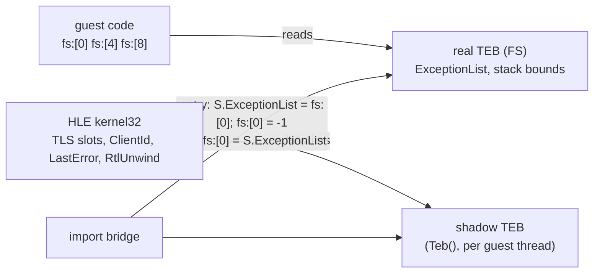

# 작업 448 설계 — Windows x86 in-process backend / Task 448 design — the Windows x86 in-process backend

선행: [작업 446 설계](20261004-446-windows-in-process-loader.md)(3단계), [작업 447 로그](../work-logs/20261004-447-sdl-hosts-shared.md)

## 배경 / Background

작업 446 설계는 Windows에서 "host 스레드의 실제 TEB를 그대로 게스트 TEB로" 쓰기로 했다. 구현 전에 공용 HLE를 확인하니 HLE는 TEB를 **자기 것으로** 다룬다.

- `TlsAlloc`·`TlsSetValue`는 TEB+0xE10의 TLS 슬롯에 직접 쓴다. 인덱스는 HLE의 `GuestProcess`가 나눠 준다(0번부터 64개).
- 스레드를 만들 때 TEB+0x20(ClientId)에 HLE의 가짜 프로세스·스레드 ID를 쓴다.
- `SetLastError`는 TEB+0x34에 쓴다.
- `RtlUnwind`는 TEB+0의 SEH 체인을 읽고 고친다.

실제 TEB를 공유하면 이 쓰기가 host를 망가뜨린다. SDL은 `TlsAlloc` 슬롯을 쓰므로 게스트가 같은 번호를 받으면 SDL 상태가 깨지고, ClientId를 덮으면 host의 `GetCurrentThreadId`가 틀린다. 또 import를 처리하는 host 코드(MSVC x86)는 자기 SEH 프레임을 fs:0에 쌓으므로, 그 사이 `RtlUnwind`가 TEB+0을 보면 게스트 체인이 아니라 host 프레임을 본다.

64비트 Windows의 WOW64는 LDT를 주지 않으므로 게스트용 FS를 따로 만들 수도 없다.

*Task 446's design had Windows use the host thread's real TEB as the guest's. Checking the shared HLE before implementing shows it treats the TEB as **its own**: `TlsAlloc`/`TlsSetValue` write TLS slots at TEB+0xE10 with indexes from the HLE's `GuestProcess` (64 from 0), thread creation writes the HLE's made-up process and thread IDs into TEB+0x20 (ClientId), `SetLastError` writes TEB+0x34, and `RtlUnwind` reads and edits the SEH chain at TEB+0. Sharing the real TEB lets these writes break the host: SDL holds `TlsAlloc` slots a guest could be given again, an overwritten ClientId makes the host's `GetCurrentThreadId` wrong, and host code handling an import (MSVC x86) stacks its own SEH frames on fs:0, so an `RtlUnwind` reading TEB+0 meanwhile sees host frames instead of the guest chain. WOW64 offers no LDT, so a separate guest FS is not possible either.*

## 결정 / Decisions

### 1. 그림자 TEB와 fs:0 동기화 / A shadow TEB with fs:0 kept in step

- FS는 실제 TEB 그대로다. 게스트가 FS로 직접 읽는 필드는 실제 값이다: ExceptionList(fs:0), 스택 범위(fs:4, fs:8), self(fs:0x18).
- HLE가 보는 TEB(`NativeProcessBootstrap::Teb()`, `NativeGuestThread::teb`)는 게스트 스레드마다 둔 **그림자 TEB** 한 페이지다. Linux가 만드는 TEB와 같은 모양(0x00, 0x04, 0x08, 0x18, 0x30, 그림자 PEB의 0x08 = 이미지 base)이다. TLS 슬롯·ClientId·LastError는 여기에만 쓰이므로 host와 겹치지 않는다.
- import bridge는 게스트에서 host로 넘어올 때 실제 fs:0(게스트 체인 머리)을 그림자 TEB+0에 옮기고 실제 fs:0을 -1로 둔다. host 코드의 SEH 프레임은 -1에서 끝나는 별도 체인에 쌓이고, host 예외가 게스트 핸들러로 흘러가지 않는다. 돌아갈 때는 그림자 TEB+0(그사이 `RtlUnwind`가 고쳤을 수 있는 값)을 실제 fs:0에 되돌린다.
- host가 게스트를 부를 때(`CallNativeGuestStdcall`, 창 프로시저 등)는 반대로 바꾼다: 실제 fs:0 = 그림자 TEB+0, 돌아오면 그림자 TEB+0 = 실제 fs:0, 실제 fs:0 = host 체인.
- 게스트 fault는 게스트 코드에서 나므로 그때 실제 fs:0은 게스트 체인이다. 공용 `native_guest_seh` dispatcher가 실제 fs:0·fs:4·fs:8로 배달한다.
- **미확정**: 게스트가 FS로 TLS 슬롯(fs:[0xE10+]), `ThreadLocalStoragePointer`(fs:[0x2C]), LastError(fs:[0x34]), PEB(fs:[0x30])를 직접 읽으면 실제 TEB 값을 본다. VC6 시대 CRT는 이것들을 import로 읽고, Linux TEB도 0x2C를 두지 않는데 다섯 타깃이 Linux에서 돌므로 직접 읽지 않는 것으로 **추정**한다. 449의 실게임 실행으로 확인한다.

*FS stays the real TEB, so the fields guest code reads through FS are real: ExceptionList (fs:0), the stack bounds (fs:4, fs:8) and self (fs:0x18). The TEB the HLE sees (`NativeProcessBootstrap::Teb()`, `NativeGuestThread::teb`) is a one-page **shadow TEB** per guest thread, shaped like the TEB Linux builds (0x00, 0x04, 0x08, 0x18, 0x30, and the shadow PEB's 0x08 holding the image base); TLS slots, ClientId and LastError are written there alone and never collide with the host. On entry from the guest the import bridge moves the real fs:0 (the guest chain's head) to shadow TEB+0 and sets the real fs:0 to -1, so host SEH frames stack on a separate chain ending at -1 and host exceptions never reach guest handlers; on the way back the shadow TEB+0, which `RtlUnwind` may have changed meanwhile, goes back to the real fs:0. A host call into the guest (`CallNativeGuestStdcall`, window procedures) swaps the other way. A guest fault arises in guest code, when the real fs:0 is the guest chain, so the shared `native_guest_seh` dispatcher delivers through the real fs:0, fs:4 and fs:8. **Unresolved**: guest code reading TLS slots (fs:[0xE10+]), `ThreadLocalStoragePointer` (fs:[0x2C]), LastError (fs:[0x34]) or the PEB (fs:[0x30]) through FS would see the real TEB; the VC6-era CRT reads them through imports, and the Linux TEB leaves 0x2C unset while all five targets run on Linux, so they are **inferred** not to; 449's real runs check it.*

### 2. 게스트 스택은 host 스레드의 스택 / The guest stack is the host thread's stack

FS의 스택 범위가 실제 값이므로 게스트는 자기를 실행하는 host 스레드의 스택에서 돈다. 진입 trampoline은 Linux처럼 스택을 바꾸지 않고 그 자리에서 entry를 부른다. 스택 범위는 TEB의 StackBase(0x04)와 DeallocationStack(0xE0C)이다(StackLimit은 커밋되며 움직인다). 주 게스트 스레드는 `re2dj.exe`를 실행한 스레드이므로 링크 옵션 `/STACK:0x1000000`(16 MiB 예약)을 준다. 다른 게스트 스레드는 `CreateThread`(1 MiB 예약)로 만든다.

*The stack bounds in FS are real, so the guest runs on the stack of the host thread executing it: the entry trampoline calls the entry in place instead of switching stacks as Linux does, and the bounds are the TEB's StackBase (0x04) and DeallocationStack (0xE0C), StackLimit moving as pages commit. The main guest thread is the one running `re2dj.exe`, linked with `/STACK:0x1000000` (16 MiB reserved); other guest threads come from `CreateThread` with 1 MiB reserved.*

### 3. fault는 VEH, 탈출은 저장한 레지스터로 / Faults through a VEH, escapes through saved registers

- `AddVectoredExceptionHandler(1, ...)`. 현재 스레드가 게스트 run 중이 아니면, 또는 host 코드가 import를 처리 중이면(`NativeHostCodeRunning()`) `EXCEPTION_CONTINUE_SEARCH`로 넘긴다. host 코드의 예외(C++ 예외, 드라이버가 스스로 잡는 SEH)는 Windows의 보통 경로로 처리된다.
- 게스트 코드의 예외는 NTSTATUS를 x86 trap으로 바꿔 Linux 시그널 핸들러와 같은 순서로 공용 처리에 넘긴다: instruction trace(`STATUS_SINGLE_STEP` → trap 1, `STATUS_BREAKPOINT` → trap 3), legacy I/O(`STATUS_PRIVILEGED_INSTRUCTION` → trap 13), 게스트 SEH 배달. `STATUS_ACCESS_VIOLATION`은 trap 14, error code는 `ExceptionInformation[0]`(0 읽기, 1 쓰기, 8 실행)에서 만든다. `STATUS_ILLEGAL_INSTRUCTION` 6, `STATUS_INTEGER_DIVIDE_BY_ZERO` 0.
- Windows는 INT3의 Eip를 그 바이트에 두고 Linux는 다음 바이트에 둔다. 공용 코드는 Linux 의미(다음 바이트)를 가정하므로, `STATUS_BREAKPOINT`는 Eip+1로 넘기고 돌려받은 값을 그대로 쓴다.
- 처리할 수 없는 fault와 `ExitNativeGuestProcess`는 run을 끝낸다. `EnterGuestRun`(naked asm)이 진입 때 EBX·ESI·EDI·EBP·ESP·복귀 주소·fs:0을 스레드별 탈출 프레임에 저장하고, `EscapeGuestRun`이 그 값으로 돌아간다. VEH는 CONTEXT의 Eip를 `EscapeGuestRun`으로, Ecx를 탈출 프레임으로 바꿔 돌아간다. 그 사이의 host 프레임 소멸자는 Linux의 `siglongjmp`처럼 실행되지 않는다. `longjmp`는 MSVC x86에서 fs:0 체인을 풀며 target 프레임을 찾는데, fs:0을 바꿔 두므로 쓰지 않는다.

*`AddVectoredExceptionHandler(1, ...)`. When the current thread is not in a guest run, or host code is handling an import (`NativeHostCodeRunning()`), the handler returns `EXCEPTION_CONTINUE_SEARCH`, leaving host exceptions (C++ exceptions, SEH a driver catches itself) to Windows' usual path. Guest exceptions turn their NTSTATUS into an x86 trap and go through the shared handling in the Linux signal handler's order: the instruction trace (`STATUS_SINGLE_STEP` → trap 1, `STATUS_BREAKPOINT` → trap 3), legacy I/O (`STATUS_PRIVILEGED_INSTRUCTION` → trap 13), and guest SEH delivery; `STATUS_ACCESS_VIOLATION` is trap 14 with an error code built from `ExceptionInformation[0]` (0 read, 1 write, 8 execute), `STATUS_ILLEGAL_INSTRUCTION` 6, `STATUS_INTEGER_DIVIDE_BY_ZERO` 0. Windows leaves an INT3's Eip on the byte and Linux after it; the shared code assumes Linux's meaning, so `STATUS_BREAKPOINT` passes Eip+1 and takes back whatever it returns. An unhandled fault and `ExitNativeGuestProcess` end the run: `EnterGuestRun` (naked asm) saves EBX, ESI, EDI, EBP, ESP, the return address and fs:0 in a per-thread escape frame, and `EscapeGuestRun` returns through them; the VEH points the CONTEXT's Eip at `EscapeGuestRun` and Ecx at the escape frame. Host frame destructors in between are skipped, as with Linux's `siglongjmp`; `longjmp` is not used because MSVC x86's unwinds the fs:0 chain looking for its target frame, which the fs:0 swaps hide.*

### 4. asm은 MSVC x86 인라인 / asm as MSVC x86 inline assembly

설계 446의 MASM 대신 `__declspec(naked)` 함수와 MSVC x86 인라인 `__asm`을 쓴다. Windows 제품은 x86만 빌드하고, 인라인 asm이 CMake 언어 추가 없이 같은 파일 안에서 C++ 심볼을 바로 부른다. 대상: import bridge, `CallGuestStdcallWords`, `EnterGuestRun`·`EscapeGuestRun`, entry·ThreadProc·TLS callback 호출.

*Instead of 446's MASM, `__declspec(naked)` functions with MSVC x86 inline `__asm`: the Windows product builds x86 only, and inline asm calls C++ symbols directly in the same file without another CMake language. They cover the import bridge, `CallGuestStdcallWords`, `EnterGuestRun`/`EscapeGuestRun`, and calling an entry, a ThreadProc and a TLS callback.*

### 5. 주소 공간 / Address space

- `re2dj.exe`(와 Windows probe)는 `/BASE:0x60000000 /DYNAMICBASE:NO /LARGEADDRESSAWARE`로 링크해 게스트 이미지가 쓰는 0x400000 근처를 비운다.
- `HostMapAt`은 `VirtualAlloc(address, MEM_RESERVE | MEM_COMMIT)`이고 돌려준 주소가 요청과 다르면 실패다. 할당 단위가 64 KiB이므로 facade 후보 간격(0x10000)과 맞는다. WOW64 시스템 DLL과 겹치면 facade는 공용 코드대로 다음 후보로 내려간다.
- `MapNativeLowMemory`는 아무 주소의 `VirtualAlloc`이다(32비트 프로세스는 전부 4 GiB 아래).

*`re2dj.exe` (and the Windows probe) link with `/BASE:0x60000000 /DYNAMICBASE:NO /LARGEADDRESSAWARE` to keep 0x400000, where guest images go, free. `HostMapAt` is `VirtualAlloc(address, MEM_RESERVE | MEM_COMMIT)`, failing when the address returned differs; the 64 KiB allocation granularity matches the facade candidate stride (0x10000), and a facade colliding with a WOW64 system DLL moves to the next candidate as the shared code does. `MapNativeLowMemory` is `VirtualAlloc` anywhere, everything in a 32-bit process being below 4 GiB.*

## 파일 / Files

`src/platform/windows/x86/`: `native_host_services.cpp`, `native_low_memory.cpp`, `native_guest_transition.{h,cpp}`(naked asm: bridge·호출·탈출), `native_import_bridge.cpp`, `native_process_bootstrap.cpp`(VEH, 그림자 TEB, 게스트 스레드), `native_in_process_probe.cpp`(합성 PE32 probe). CMake: Windows x86에서 `re2dj_windows_native_backend`(공용 `src/platform/native/` + 위 파일)와 probe, CTest 등록.

## 검증 / Verification

- `re2dj_windows_native_in_process_probe`(CTest): Linux i386 probe와 같은 항목. 합성 PE32의 import 두 개와 TLS callback(FS·스택 범위 검사), 동적 thunk(cdecl·stdcall 7인자, ESP 보존), instruction trace와 `ud2` fault, import에서 ExitProcess, 게스트 스레드 probe와 게스트 스레드 fault probe.
- 그림자 TEB 확인을 probe에 더한다: run이 끝난 뒤 host의 `GetCurrentThreadId()`와 `TlsGetValue`가 그대로인지.
- Windows x86 build(경고를 오류로), Linux x64 build·CTest(공용 코드가 바뀌면).

*`re2dj_windows_native_in_process_probe` (CTest) checks what the Linux i386 probe does: the synthetic PE32's two imports and TLS callback (FS and stack-bound checks), dynamic thunks (cdecl, and stdcall with seven arguments and ESP preserved), the instruction trace and a `ud2` fault, ExitProcess from an import, and the guest thread and guest thread fault probes; it also checks the shadow TEB, the host's `GetCurrentThreadId()` and `TlsGetValue` being intact after the run. The Windows x86 build (warnings as errors), and the Linux x64 build and CTest when shared code changes.*
