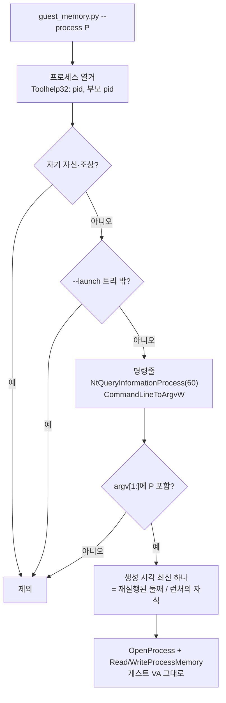

# 작업 451 설계 — `guest_memory.py`의 Windows in-process 대응 / Task 451 design — `guest_memory.py` on the Windows in-process runner

선행: [작업 446 설계](20261004-446-windows-in-process-loader.md), [작업 449 설계](20261004-449-windows-cli-in-process.md) · 남은 항목의 출처: [작업 450 로그](../work-logs/20261004-450-remove-windows-injection.md)

## 배경 / Background

`game-state-hunt` 스킬의 `guest_memory.py`는 실행 중인 게스트의 32비트 값을 읽고·폴링하고·쓴다. Windows 쪽은 주입 경로 시절의 가정대로 `tasklist`에서 **이미지 이름**(`EZ2DJ.EXE`)으로 원본 프로세스를 찾는다. 작업 449부터 Windows도 게스트가 `re2dj.exe` 안에서 돌므로 그런 프로세스는 없다. 대신 다음과 같은 프로세스가 생긴다.

- `re2dj.exe`는 시작하자마자 자기 자신을 **같은 명령줄**로 일시 정지 상태로 다시 띄우고(게스트 범위 예약), 처음 것은 기다리기만 한다. 게스트는 **둘째**(나중에 생긴 쪽)에 있다.
- 런처가 있는 대상(6th 등)은 런처 게스트가 자식 run을 `--guest-executable <EXE>`가 붙은 `re2dj.exe`로 띄우고, 그 자식도 같은 재실행을 거친다. 그래서 자식 게임 하나에 `re2dj.exe`가 둘 더 생긴다.

Linux 쪽은 이미 "명령줄 인자의 부분 문자열, 가장 나중에 생긴 프로세스"로 찾는다. 이 규칙은 Windows의 두 경우에도 그대로 맞다. 재실행된 둘째와 런처의 자식은 모두 짝보다 나중에 생기기 때문이다.

*The skill's `guest_memory.py` reads, polls and writes a running guest's 32-bit values. Its Windows side still finds the original process by **image name** (`EZ2DJ.EXE`) through `tasklist`, as under injection; from task 449 the guest runs inside `re2dj.exe`, so no such process exists. Instead `re2dj.exe` starts itself again suspended with the **same command line** to reserve the guest range, the first only waiting and the guest living in the **second**, newer one; and a launcher target such as 6th starts its child run as another `re2dj.exe` with `--guest-executable <EXE>`, which goes through the same relaunch, so one child game adds two more `re2dj.exe`. Linux already matches "a substring of a command-line argument, newest process wins", and that rule fits both Windows cases, since the relaunched second and a launcher's child are each created after their counterpart.*

## 결정 / Decisions

1. **`--process`의 뜻을 두 OS에서 같게**: 명령줄 인자(실행 파일 경로인 첫 인자 제외)의 부분 문자열이며, 대소문자를 구분한다. 직접 실행은 프로파일 ID(`ez2dj4th`), 런처의 자식은 실행 파일 이름(`EZ2DJ6TH.EXE`, `--guest-executable` 인자에 있음)으로 맞춘다. 기본값 `EZ2DJ.EXE`는 두고 도움말만 고친다.
2. **Windows 열거는 표준 라이브러리 `ctypes`만으로**: `CreateToolhelp32Snapshot`으로 pid와 부모 pid를, `OpenProcess(PROCESS_QUERY_LIMITED_INFORMATION)` 뒤 `NtQueryInformationProcess`의 `ProcessCommandLineInformation`(60, Windows 8.1부터)으로 명령줄을, `CommandLineToArgvW`로 인자를, `GetProcessTimes`로 생성 시각을 얻는다. `wmic`(Windows 11에서 제거 중)과 PowerShell 호출(느림)은 쓰지 않는다. psutil 같은 외부 패키지도 들이지 않는다.
3. **선택 규칙**: Linux와 같다. 자기 자신과 조상은 빼고(`powershell -c "python ..."`처럼 셸 명령줄에도 패턴이 있으므로), `--launch`면 띄운 프로세스와 그 자손만 본다. 남은 일치 중 **가장 나중에 생긴 것**을 고른다. Linux는 pid 크기로, Windows는 pid가 단조 증가하지 않으므로 생성 시각으로 비교한다. 부모 pid 체인은 pid 재사용으로 고리가 생길 수 있어 방문 집합으로 끊는다.
4. **`--launch`**: Windows는 명령 문자열을 `shlex`로 나누지 않고 그대로 `CreateProcess`에 넘긴다(POSIX 규칙이 `\` 경로를 망가뜨린다). 끝낼 때는 `taskkill /T /F /PID`로 트리 전체를 끝낸다. re2dj.exe의 Job 객체(`KILL_ON_JOB_CLOSE`)도 처음 것이 끝나면 둘째를 끝내지만, 런처의 자식까지 확실히 정리하려고 트리 단위로 끝낸다.
5. **읽기 대기**: 재실행된 둘째는 게스트 범위를 `MEM_RESERVE`로 쥔 채 시작하므로 이미지가 매핑되기 전 읽기는 실패한다. 기존 "첫 주소가 읽힐 때까지 `--wait` 동안 다시 시도"가 그대로 이 구간을 넘긴다.
6. 접근 권한·쓰기 확인(`--yes`)·다시 읽기 등 나머지 동작은 바꾸지 않는다. 64비트 Python에서 WOW64 프로세스(`re2dj.exe`)의 낮은 주소를 `ReadProcessMemory`로 읽는 것은 정상 동작이다.

*1. `--process` means the same on both OSes: a case-sensitive substring of a command-line argument other than the first (the executable path). A direct run is matched by its profile ID (`ez2dj4th`), a launcher's child by its executable name (`EZ2DJ6TH.EXE`, in its `--guest-executable` argument); the default `EZ2DJ.EXE` stays and only the help text changes. 2. Windows enumeration uses only the standard library's `ctypes`: `CreateToolhelp32Snapshot` for pids and parent pids; after `OpenProcess(PROCESS_QUERY_LIMITED_INFORMATION)`, `NtQueryInformationProcess` with `ProcessCommandLineInformation` (60, Windows 8.1 and later) for the command line, `CommandLineToArgvW` for the arguments and `GetProcessTimes` for the creation time; not `wmic`, being removed from Windows 11, nor a slow PowerShell call, nor an external package such as psutil. 3. Selection follows Linux: the script and its ancestors are skipped, since a shell's command line such as `powershell -c "python ..."` carries the pattern too; with `--launch` only the started process and its descendants count; and of the remaining matches the **newest** wins, by pid on Linux and by creation time on Windows, whose pids are not monotonic; a parent chain is cut with a visited set, as pid reuse can make it loop. 4. On Windows `--launch` passes the command string to `CreateProcess` unsplit, since POSIX `shlex` rules would mangle `\` paths, and ends the whole tree with `taskkill /T /F /PID`; re2dj.exe's job object (`KILL_ON_JOB_CLOSE`) already ends the second when the first ends, but the tree is ended as a whole to catch a launcher's child for sure. 5. The relaunched second starts holding the guest range as `MEM_RESERVE`, so reads fail until the image is mapped; the existing retry of the first address for `--wait` seconds covers that span. 6. Access rights, the write confirmation (`--yes`) and the read-back are unchanged; a 64-bit Python reading a WOW64 process's (`re2dj.exe`'s) low addresses with `ReadProcessMemory` is normal.*

참고 / References:
[CreateToolhelp32Snapshot](https://learn.microsoft.com/windows/win32/api/tlhelp32/nf-tlhelp32-createtoolhelp32snapshot),
[NtQueryInformationProcess](https://learn.microsoft.com/windows/win32/api/winternl/nf-winternl-ntqueryinformationprocess),
[CommandLineToArgvW](https://learn.microsoft.com/windows/win32/api/shellapi/nf-shellapi-commandlinetoargvw),
[GetProcessTimes](https://learn.microsoft.com/windows/win32/api/processthreadsapi/nf-processthreadsapi-getprocesstimes).

## 검증 / Verification

- WSL Linux: `python3 -m py_compile`, Linux 쪽 동작이 바뀌지 않았는지 `--help`와 합성 대상(아래 스크립트의 Linux 실행).
- Windows: 재실행 구조를 흉내 내는 합성 대상(같은 명령줄로 자신을 다시 띄우고 둘째만 알려진 주소에 값을 둠)으로 `read`·`poll`·`write --yes`가 둘째를 고르는지, `--launch`가 트리를 끝내는지. 합성 대상은 작업 로그에 절차로만 남기고 저장소에 넣지 않는다.
- Windows x86 Debug build와 CTest, 실게임이 있으면 `re2dj.exe` 실행에 대한 `read`.

*WSL Linux: `python3 -m py_compile`, and `--help` plus a synthetic target to show the Linux side is unchanged. Windows: a synthetic target imitating the relaunch (it starts itself again with the same command line and only the second holds a value at a known address), checking that `read`, `poll` and `write --yes` pick the second and that `--launch` ends the tree; the synthetic target is recorded as a procedure in the work log, not added to the repository. The Windows x86 Debug build with CTest, and a `read` against a real `re2dj.exe` run when the game files are present.*
