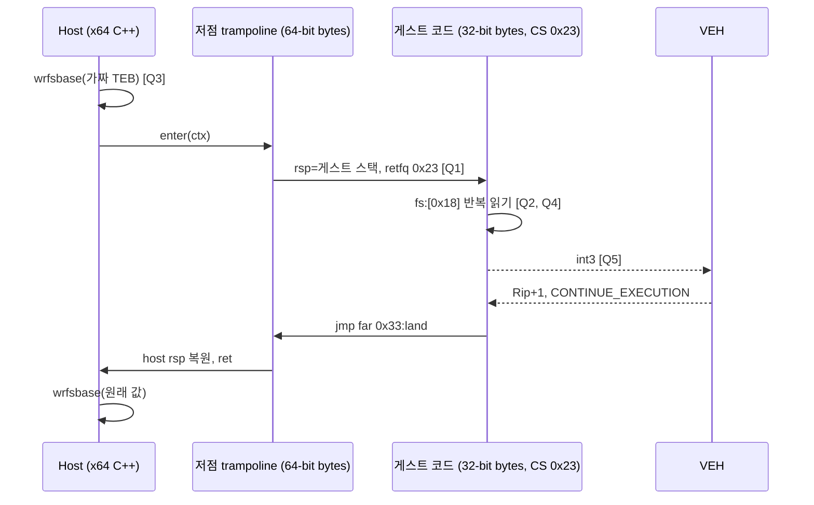

# 작업 452 설계 — Windows x64 호환 모드 조사 / Task 452 design — probing compatibility mode on Windows x64

선행: [작업 446 설계](20261004-446-windows-in-process-loader.md)(공용 러너, Windows는 x86만), [작업 448 설계](20261004-448-windows-x86-backend.md)(Windows x86 backend), [Linux x86-64 compatibility mode](../kb/linux-x86-64-compatibility-mode.md)

## 목적 / Goal

작업 446~450으로 PE 로더·HLE·게스트 SEH·스레드는 OS 중립 러너(`src/platform/native/`)가 되었다. 64비트 Windows용 `re2dj.exe`(x64)를 만들려면 backend 계약만 Windows x64로 구현하면 된다. 그 backend가 **가능한지와 얼마나 큰지**를 구현 전에 정한다. 이 작업은 조사이며 제품 코드를 바꾸지 않는다.

*Tasks 446 to 450 made the PE loader, HLE, guest SEH and threads an OS-neutral runner (`src/platform/native/`), so a 64-bit Windows `re2dj.exe` needs only the backend contracts implemented for Windows x64. This task settles, before any implementation, **whether that backend is possible and how large it is**. It is research and changes no product code.*

## 질문 / Questions

Linux x64 backend는 64비트 프로세스 안에서 CS `0x23`(호환 모드)으로 게스트를 직접 실행하고, 게스트 FS는 `modify_ldt`로 만든 LDT descriptor로 TEB를 가리킨다. Windows x64에는 사용자 프로세스용 LDT API가 없는 것으로 알려져 있다(**추정**). 따라서 다음을 실제 실행으로 확인한다.

*The Linux x64 backend runs the guest directly in CS `0x23` (compatibility mode) inside a 64-bit process, pointing the guest FS at a TEB through an LDT descriptor made with `modify_ldt`. Windows x64 is understood to offer no LDT API to user processes (**inferred**), so the following are checked by running them.*

| # | 질문 / Question | 왜 필요한가 / Why it matters |
| --- | --- | --- |
| Q1 | 일반 x64 프로세스(WOW64 아님)에서 `retfq`로 CS `0x23`에 들어가 32비트 코드를 실행하고 `jmp far 0x33`으로 돌아올 수 있는가 | 직접 실행의 전제 |
| Q2 | 그때 FS selector와 FS base는 무엇이며, 호환 모드에서 `fs:[0]`·`fs:[0x18]`을 읽을 수 있는가 | 게스트 SEH·TEB 접근 |
| Q3 | 사용자 모드 `rdfsbase`/`wrfsbase`가 허용되는가(CPUID FSGSBASE + OS의 CR4 설정) | LDT 없이 FS base를 4 GiB 아래 가짜 TEB로 바꾸는 유일한 사용자 모드 수단 |
| Q4 | `wrfsbase`로 바꾼 FS base가 호환 모드에서 쓰이고, 선점(문맥 전환)·다른 코어 부하 동안 유지되는가 | 게스트가 수 초 이상 달릴 때 TEB가 사라지면 안 됨 |
| Q5 | 호환 모드에서 난 예외(`int3`, 접근 위반)가 VEH에 `SegCs = 0x23`로 전달되고, `EXCEPTION_CONTINUE_EXECUTION`으로 호환 모드에 재개되는가. 그 왕복 뒤 FS base가 유지되는가 | 게스트 SEH, legacy I/O 트랩, import 경계의 예외 경로 |
| Q6 | `0x53` selector를 64비트 모드에서 적재하면 FS base가 무엇이 되는가 | `wrfsbase`가 유지되지 않을 때의 대안 후보 |

## 방법 / Method

- 새 probe `re2dj_windows_x64_compat_mode_probe`(`src/platform/windows/x64/native_compat_mode_probe.cpp`). Windows x64 MSVC 빌드에서만 만든다. 제품 대상과 CTest에는 넣지 않는다.
- MSVC x64는 inline asm이 없고, 전환 코드와 착지점은 어차피 4 GiB 아래에 있어야 한다(호환 모드의 EIP와 far 포인터 offset은 32비트). 그래서 64비트 진입·착지 코드와 32비트 게스트 코드를 **기계어 바이트**로 4 GiB 아래 페이지에 복사해 실행한다. 바이트는 WSL `as`로 어셈블한 결과를 옮기고 소스에 어셈블리를 주석으로 남긴다.
- 게스트 스택과 가짜 TEB도 4 GiB 아래에 `VirtualAlloc`으로 둔다. `rdfsbase`/`wrfsbase`는 MSVC intrinsic(`_readfsbase_u64`, `_writefsbase_u64`)을 SEH(`__try`)로 감싸 `#UD`를 잡는다.
- Q4는 게스트 코드가 약 3초 동안 `fs:[0x18]`을 반복해 읽고 기대값과 다른 횟수를 센다. 같은 시간 동안 코어 수만큼 바쁜 스레드를 돌려 선점을 일으킨다.
- 링크는 `/CETCOMPAT:NO`로 둔다. 하드웨어 shadow stack이 켜진 프로세스에서 호환 모드로 가는 far return은 실패할 수 있다(**추정**). 이 영향은 제품 설계 때 따로 다룬다.

*A new probe, `re2dj_windows_x64_compat_mode_probe` (`src/platform/windows/x64/native_compat_mode_probe.cpp`), is built only by a Windows x64 MSVC build and joins neither the product targets nor CTest. MSVC x64 has no inline asm, and the transition and landing code must sit below 4 GiB anyway (compatibility mode's EIP and far-pointer offsets are 32-bit), so the 64-bit entry and landing code and the 32-bit guest code are **machine-code bytes** copied to a page below 4 GiB, assembled with WSL `as` and kept as assembly in comments. The guest stack and a fake TEB are also `VirtualAlloc`ed below 4 GiB; `rdfsbase`/`wrfsbase` use MSVC's intrinsics inside SEH (`__try`) to catch `#UD`. For Q4 the guest reads `fs:[0x18]` for about 3 seconds counting mismatches while one busy thread per core forces preemption. The probe links with `/CETCOMPAT:NO`, since a far return to compatibility mode may fail under hardware shadow stacks (**inferred**); that is left for a product design.*

## 규모 판단 기준 / Sizing criteria

| 결과 / Outcome | 의미 / Meaning |
| --- | --- |
| Q1·Q3·Q4·Q5 모두 통과 | Linux x64 backend 구조(전환·import bridge·bootstrap·low memory, 약 1,800줄)를 Windows로 옮기는 중간 규모. FS는 LDT 대신 `wrfsbase`로, 시그널 대신 VEH로 |
| Q4 또는 Q5에서 FS base가 사라짐 | 모든 진입·재개 지점에서 FS를 다시 쓰는 추가 장치가 필요. Q6 결과에 따라 규모가 커짐 |
| Q1 또는 Q3 실패 | 같은 프로세스 직접 실행 불가. 현재의 x86(WOW64) 제품 유지가 결론 |

*All of Q1, Q3, Q4 and Q5 passing means a medium-sized port of the Linux x64 backend's structure (transitions, import bridge, bootstrap, low memory, about 1,800 lines), with `wrfsbase` instead of the LDT and VEH instead of signals. FS base lost in Q4 or Q5 means extra machinery rewriting FS at every entry and resumption, growing with Q6's result. Q1 or Q3 failing rules out same-process direct execution and leaves the current x86 (WOW64) product as the answer.*

## 검증 / Verification

- Windows x64 Debug(MSVC, 경고를 오류로)에서 probe만 빌드해 이 PC에서 실행하고, 각 질문의 결과를 작업 로그와 새 kb 문서 `docs/kb/windows-x64-compatibility-mode.md`에 **확인됨/추정/미확정**으로 남긴다.
- Windows x86 Debug build가 그대로인지 확인한다(probe는 x64에서만 추가된다).

*The probe alone is built in a Windows x64 Debug configuration (MSVC, warnings as errors) and run on this PC; each question's result goes into the work log and a new kb topic, `docs/kb/windows-x64-compatibility-mode.md`, marked confirmed, inferred or unresolved. The Windows x86 Debug build must stay intact, the probe being added for x64 only.*

참고 / References: [Intel SDM](https://www.intel.com/content/www/us/en/developer/articles/technical/intel-sdm.html) (Vol. 1 §3.4.1.1, Vol. 2 RDFSBASE/WRFSBASE, Vol. 3A §5.8 far transfers), [WOW64 implementation details](https://learn.microsoft.com/windows/win32/winprog64/wow64-implementation-details), [_readfsbase_u64 / _writefsbase_u64](https://learn.microsoft.com/cpp/intrinsics/readfsbase-readgsbase-writefsbase-writegsbase), [AddVectoredExceptionHandler](https://learn.microsoft.com/windows/win32/api/errhandlingapi/nf-errhandlingapi-addvectoredexceptionhandler).
