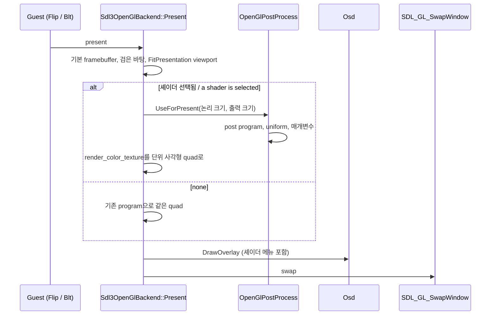
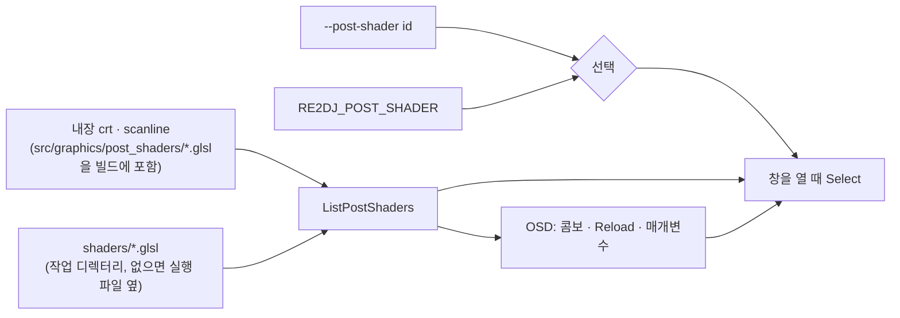

# 작업 455 설계 — 화면 후처리 셰이더 / Task 455 design — post-processing shaders

참조: rePIU 작업 768([rePIU v0.0.200](https://github.com/nworkers/rePIU/releases/tag/v0.0.200), 설계 `docs/design/20261004-768-post-process-shaders.md`). 사용자가 같은 방식으로 re2DJ에 넣기로 했다(2026-10-05). 전체 화면 토글(rePIU 작업 769)은 범위 밖으로 정했다.

*Reference: rePIU task 768 ([rePIU v0.0.200](https://github.com/nworkers/rePIU/releases/tag/v0.0.200), design `docs/design/20261004-768-post-process-shaders.md`), which the user asked to bring to re2DJ the same way (2026-10-05); the fullscreen toggle (rePIU task 769) was left out of scope.*

## 1. 요구사항 / Requirements

1. 게임이 완성한 화면에 후처리 셰이더를 적용한다.
2. 셰이더는 별도 파일로 추가할 수 있다.
3. 적용할 셰이더를 메뉴에서 고를 수 있다.
4. 기본으로 `crt`와 `scanline` 두 셰이더를 내장한다.

*Apply a post-processing shader to the finished frame; shaders can be added as separate files; the shader is chosen from a menu; `crt` and `scanline` are built in.*

## 2. 원칙과 범위 / Principle and scope

후처리는 **표시 단계에서만** 일어난다. 게스트가 볼 수 있는 상태(render target, `ReadRenderTarget`, Lock으로 읽는 표면)는 바뀌지 않는다. 기본값은 `none`이며, 이때 Present는 지금과 GL 호출이 같다.

범위 밖: 다단계 preset(`.glslp`), 이전 프레임(`PrevTexture`), LUT, 매개변수 저장, 전체 화면 토글.

*Post-processing happens **at presentation only**; guest-visible state (the render target, `ReadRenderTarget`, surfaces read through Lock) does not change. The default is `none`, under which Present issues the same GL calls as today. Out of scope: multi-pass presets (`.glslp`), previous frames (`PrevTexture`), LUTs, persisted parameters, and the fullscreen toggle.*

## 3. 표시 경로 — rePIU와 다른 점 / Presentation path — where it differs from rePIU

rePIU는 게임이 기본 framebuffer의 back buffer에 drawable 해상도로 직접 그리므로, swap 직전에 back buffer를 텍스처로 복사(`glCopyTexSubImage2D`)한 뒤 셰이더로 다시 그린다. re2DJ는 게임이 **논리 해상도(640x480)의 FBO 텍스처**(`render_color_texture`)에 그리고, `Sdl3OpenGlBackend::Present`가 그 텍스처를 창 안의 비율 유지 사각형(`FitPresentation`)에 quad 하나로 그린다. 그래서 re2DJ는 **복사 없이** 그 마지막 quad를 후처리 program으로 그리면 된다.

*rePIU's game draws straight into the default framebuffer's back buffer at the drawable resolution, so it copies the back buffer into a texture before the swap and draws it back through the shader. re2DJ's game draws into an **FBO texture at the logical resolution (640x480)** (`render_color_texture`), which `Sdl3OpenGlBackend::Present` draws as one quad into the aspect-kept rectangle of the window (`FitPresentation`). re2DJ therefore needs **no copy**: that final quad is drawn through the post program instead.*

- **입력 텍스처**: `render_color_texture` 그대로(unit 0). 필터는 `none`과 같은 `SelectPresentationFilter`(정수 배율이면 nearest)라 화소 모양이 같다.
- **크기 값**: `InputSize`와 `TextureSize`는 render target 크기(논리 해상도), `OutputSize`는 비율 유지 사각형의 픽셀 크기. rePIU는 텍스처가 drawable 크기라서 일부러 논리 해상도를 알렸지만, re2DJ는 텍스처 자체가 논리 해상도라 libretro의 원래 의미와 그대로 맞는다.
- **꼭짓점**: 기존 Present와 같은 client-side 배열(attribute 0·1·2가 늘 켜져 있음)에 단위 사각형 좌표를 넣는다. 링크 전에 `VertexCoord`=0, `COLOR`=1, `TexCoord`=2로 묶어 기존 배열 배치와 맞춘다. `MVPMatrix`는 단위 사각형을 clip 공간으로 보내는 직교 행렬이다.
- **상태**: Present는 매 프레임 자기 상태(blend·depth·cull 끔, viewport)를 다시 정하고, `Draw`는 그릴 때마다 자기 program을 다시 쓴다. 후처리 뒤 기본 program으로 되돌리기만 한다. OSD(ImGui GL3 backend)는 자기 상태를 저장·복원한다.
- **실패**: 컴파일·링크 실패는 `none`으로 남기고 이유를 로그와 OSD에 보인다. 화면이 검게 되는 실패를 만들지 않는다.

*Input texture: `render_color_texture` itself on unit 0, filtered by the same `SelectPresentationFilter` as `none` (nearest at integer scales), so pixels look the same. Sizes: `InputSize` and `TextureSize` are the render target's size (the logical resolution) and `OutputSize` the pixel size of the aspect-kept rectangle; rePIU reports the logical size on purpose because its texture is drawable-sized, while re2DJ's texture is the logical size, matching libretro's original meaning. Vertices: the same client-side arrays Present uses (attributes 0, 1 and 2 stay enabled) carry unit-square coordinates, with `VertexCoord`=0, `COLOR`=1 and `TexCoord`=2 bound before linking to fit that layout; `MVPMatrix` maps the unit square to clip space. State: Present sets its own state every frame (blend, depth and cull off, the viewport) and `Draw` sets its program on every draw, so the pass only restores the default program afterwards; the OSD (ImGui's GL3 backend) saves and restores its own. Failure: a compile or link failure stays `none` with the reason in the log and the OSD, never a black screen.*

## 4. 셰이더 파일 형식 / Shader file format

rePIU와 같은 **libretro 단일 pass GLSL(`.glsl`)의 부분집합**이다. 한 파일에 vertex와 fragment가 있고, 두 번 컴파일하며 각각 `#define VERTEX`·`#define FRAGMENT`와 `#define PARAMETER_UNIFORM`을 넣는다(첫 줄이 `#version`이면 그 뒤에). 컨텍스트가 OpenGL 2.1 compatibility이므로 GLSL 1.20 문법(`attribute`·`varying`·`texture2D`·`gl_FragColor`)이 기준이다.

| 이름 | 종류 | 값 |
| --- | --- | --- |
| `VertexCoord` | attribute vec4 | 단위 사각형 꼭짓점 `0..1` |
| `COLOR` | attribute vec4 | `(1,1,1,1)` |
| `TexCoord` | attribute vec4 | 텍스처 좌표 `0..1`(아래가 0) |
| `MVPMatrix` | uniform mat4 | 단위 사각형 → clip 공간 |
| `Texture` | uniform sampler2D | 게임 화면, unit 0 |
| `InputSize`, `TextureSize` | uniform vec2 | 논리 해상도(예: 640x480) |
| `OutputSize` | uniform vec2 | 창 안 그림 사각형의 픽셀 크기 |
| `FrameCount`, `FrameDirection` | uniform int | 후처리 프레임 수, 항상 1 |
| `#pragma parameter NAME "설명" 기본 최소 최대 [단계]` | uniform float | OSD 슬라이더 |

*A subset of **libretro single-pass GLSL (`.glsl`)**, as in rePIU: both stages in one file, compiled twice with `#define VERTEX` or `#define FRAGMENT` plus `#define PARAMETER_UNIFORM` (after the first line when it is `#version`). The context is OpenGL 2.1 compatibility, so GLSL 1.20 (`attribute`, `varying`, `texture2D`, `gl_FragColor`) is the baseline. The interface is the table above.*

## 5. 목록과 선택 / Catalog and selection

- **id**: `none`, 내장 `crt`·`scanline`, 사용자 파일은 파일 이름(`my_crt.glsl`). 확장자가 있어 내장과 겹치지 않는다.
- **디렉터리**: `shaders/`. 작업 디렉터리를 먼저, 없으면 실행 파일 디렉터리(`SDL_GetBasePath`)를 본다. `.glsl`만 이름순.
- **내장 셰이더**: rePIU 작업 768의 `crt.glsl`·`scanline.glsl`을 가져와 머리 주석만 re2DJ로 고친다(같은 저작자의 BSD 3-Clause 코드). CMake가 configure 때 생성 헤더로 넣어 배포물에 파일이 없어도 늘 있다.
- **우선순위**: `--post-shader` → `RE2DJ_POST_SHADER` → `none`. rePIU에는 런처 ini가 있지만 re2DJ는 명령행이 설정 경로다. 알 수 없는 id는 경고를 남기고 `none`으로 실행한다(fail-closed). 런처가 띄우는 자식(6th의 자식)은 부모 명령행과 환경을 물려받으므로 같은 셰이더를 쓴다.
- **OSD(백틱)**: 같은 목록의 콤보로 실행 중 바꾸고(그 실행만), Reload로 목록을 다시 읽고 현재 셰이더를 다시 컴파일하며, `#pragma parameter` 슬라이더를 보인다.

*Ids: `none`, the built-ins `crt` and `scanline`, and user files by file name (`my_crt.glsl`). Directory: `shaders/` under the working directory, otherwise beside the executable (`SDL_GetBasePath`), `.glsl` only, by name. Built-ins: rePIU task 768's `crt.glsl` and `scanline.glsl` with only their header comments changed to re2DJ (BSD 3-Clause code by the same author), embedded by CMake at configure time so they exist without any file shipped. Precedence: `--post-shader`, then `RE2DJ_POST_SHADER`, then `none`; rePIU has a launcher ini, while re2DJ's settings path is the command line. An unknown id warns and runs `none` (fail-closed). Child runs a launcher starts (6th's child) inherit the parent's command line and environment, so they use the same shader. OSD (backtick): the same list as a combo switching for the run, Reload rescanning and recompiling, and `#pragma parameter` sliders.*

## 6. 코드 구조 / Code structure

| 파일 | 책임 | GL |
| --- | --- | --- |
| `include/re2dj/graphics/post_shader_source.h`, `src/graphics/post_shader_source.cpp` | `#pragma parameter` 해석, 두 단계 소스 조립 | 없음 |
| `include/re2dj/graphics/post_shader_catalog.h`, `src/graphics/post_shader_catalog.cpp` | 내장 + 디렉터리 목록, id 조회, 텍스트 읽기 | 없음 |
| `include/re2dj/graphics/post_shader_control.h` | OSD가 쓰는 GL 없는 인터페이스(목록·선택·Reload·매개변수) | 없음 |
| `src/graphics/post_shaders/*.glsl`, `post_shader_builtins.inc.in` | 내장 셰이더 원본과 생성 헤더 틀 | — |
| `include/re2dj/graphics/opengl_post_process.h`, `src/graphics/opengl_post_process.cpp` | GL 함수 해석, 컴파일·링크, `UseForPresent` | 있음 |
| `sdl3_opengl_backend.cpp` | 생성·초기 선택·Present 분기·해제 | — |
| `ui/osd.cpp` | 셰이더 메뉴 | — |
| `platform/sdl/host_presentation.cpp`, `host/cli/main.cpp` | 선택 전달, 로그, `--post-shader` | — |

GL 없는 두 모듈은 `re2dj_legacy_graphics`(단위 테스트 대상), GL 모듈은 `re2dj_sdl3_opengl_backend`에 둔다. OSD는 `PostShaderControl` 인터페이스만 알아서 backend 라이브러리에 의존하지 않는다. OS 분기는 없다.

*The two GL-free modules go into `re2dj_legacy_graphics` (covered by the unit tests) and the GL module into `re2dj_sdl3_opengl_backend`; the OSD knows only the `PostShaderControl` interface and does not depend on the backend library. There is no OS branch.*

## 7. 위험 / Risks

| 위험 | 완화 |
| --- | --- |
| 드라이버가 2.1 compatibility 요청에 GLSL 1.20만 주면 `#version 130` 이상을 쓰는 셰이더가 컴파일되지 않음 | 실패는 `none`과 OSD 오류로 끝난다. 내장 두 개는 1.20 문법 |
| 프레임당 비용 | 선택했을 때만 program 전환과 fragment 계산. 복사는 없다. `none`이면 분기 하나 |
| 셰이더가 게스트 화면을 바꾼다는 오해 | render target과 readback은 그대로라고 문서에 적는다 |

*A driver granting only GLSL 1.20 for the 2.1 compatibility request will not compile shaders needing `#version 130` or later; that ends as `none` with an OSD error, and both built-ins use 1.20. Per-frame cost: a program switch and the fragment work only when selected, no copy, one branch under `none`. The documents state that the render target and readbacks are untouched.*

## 8. 검증 / Verification

1. 단위 테스트: `#pragma parameter` 해석, `#version` 뒤 삽입, 형식 오류 거부, 내장 두 개 존재·해석, 임시 디렉터리 목록(정렬, `.glsl`만), id 조회와 `none`, 선택 우선순위.
2. GL probe `re2dj_opengl_post_shader_probe`(데스크톱에서 직접 실행): 실제 backend로 흰 화면을 2배 창에 그려 `scanline`(강도 1)이 밝은 행과 어두운 행을 번갈아 내는지, `crt`가 그려지고 모서리가 검은지, 없는 셰이더가 `none`으로 남는지, `none`이 기존과 같은 결과인지.
3. Windows x86 Debug·Release와 WSL Linux x64(gcc·clang)·x86 빌드, CTest.
4. 실제 실행: `--post-shader crt`·`scanline`과 `RE2DJ_POST_SHADER`로 실행, OSD로 전환·Reload, `shaders/`에 파일을 넣어 목록 확인. 절차는 [후처리 셰이더 가이드](../guides/post-process-shaders.md).

*Unit tests for parsing, insertion after `#version`, malformed input, the built-ins, a temporary directory listing, id lookup and `none`, and the selection precedence; the GL probe `re2dj_opengl_post_shader_probe` (run by hand on a desktop) drawing a white frame into a 2x window through the real backend, checking alternating rows under `scanline` at full strength, a drawn `crt` with black corners, a missing shader staying `none`, and `none` matching today's output; Windows x86 Debug and Release and WSL Linux x64 (gcc and clang) and x86 builds with CTest; real runs with `--post-shader crt` and `scanline` and `RE2DJ_POST_SHADER`, switching and Reload in the OSD, and a file dropped into `shaders/`, following the [post-processing shaders guide](../guides/post-process-shaders.md).*
