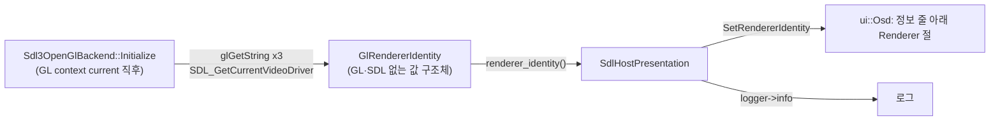

# #6 설계: OSD에 OpenGL renderer 표시

이슈: [#6](https://github.com/reexec/re2DJ/issues/6)

## 배경

rePIU는 `Tab` OSD에 GL renderer·vendor·version과 SDL 비디오 드라이버를 보여 줍니다(rePIU #5). re2DJ의 OSD는 프로세스 정보 세 줄(버전·Target Profile·Executable)만 보여 주므로, 소프트웨어 렌더러(WSL Mesa의 llvmpipe, 드라이버 없는 Windows의 GDI Generic)로 떨어진 실행을 화면에서 구분할 수 없습니다. 지금은 로그에도 renderer 문자열이 남지 않습니다.

## 목표

* OSD의 프로세스 정보 줄 바로 아래에 "Renderer" 구분선과 다음 줄을 표시합니다.
  * renderer(`GL_RENDERER`) — 소프트웨어 렌더러면 경고 색과 "Software rendering: no 3D acceleration" 문구
  * `Vendor: …`(`GL_VENDOR`), `OpenGL: …`(`GL_VERSION`), `Video driver: …`(`SDL_GetCurrentVideoDriver()`: `windows`, `x11`, `wayland`)
* 같은 값을 로그에 한 줄 남깁니다.
* Windows·Linux x86·x64 모두 같은 코드입니다. OSD(`src/ui/`), GL backend(`src/graphics/`), SDL host(`src/platform/sdl/`)는 이미 공용입니다.

## 구조

* `GlRendererIdentity`(`include/re2dj/graphics/gl_renderer_identity.h`, `src/graphics/gl_renderer_identity.cpp`, `re2dj_legacy_graphics`): renderer, vendor, version, video driver 문자열과 `software` 플래그. GL·SDL 헤더를 쓰지 않아 단위 테스트가 그대로 검사합니다.
* `IsSoftwareGlRenderer(renderer)`: 대소문자를 무시한 부분 문자열 판정. 목록은 rePIU와 같습니다: `llvmpipe`, `softpipe`, `swrast`, `software rasterizer`, `gdi generic`, `microsoft basic render`, `swiftshader`. GPU 이름은 끝없이 다양하므로 소프트웨어 쪽을 나열합니다.
* `MakeGlRendererIdentity`: 빈 값·null을 `unknown`으로 바꿔 OSD에 빈 줄이 나오지 않게 합니다.
* backend는 context를 만든 뒤 구조체를 채우고 `renderer_identity()`로 내줍니다. 창을 다시 만드는 일이 없으므로 한 번이면 됩니다.
* host는 OSD를 붙일 때 `Osd::SetRendererIdentity`로 넘기고 로그를 남깁니다. OSD는 값을 보관만 하고 매 프레임 그리며 GL 호출을 더하지 않습니다.
* rePIU의 `wsl_d3d12` 플래그는 re2DJ에 해당 선택 로직이 없으므로 넣지 않습니다.

## 하지 않는 것

* 렌더러 선택 기능은 넣지 않습니다. 표시만 합니다.

## 검증

1. 단위 테스트: 소프트웨어 이름(llvmpipe, softpipe, GDI Generic, `D3D12 (Microsoft Basic Render Driver)`, 대문자 변형)은 true, GPU 이름(NVIDIA, Intel Arc, AMD, `D3D12 (NVIDIA …)`)·빈 문자열·`unknown`은 false. `MakeGlRendererIdentity`의 `unknown` 대체.
2. Windows x86 빌드와 단위 테스트. Linux 타깃은 push 뒤 CI.
3. Windows 실행: 로그 줄과 OSD의 Renderer 절을 확인합니다(원본 HDD가 있을 때).

---

# #6 Design: The OpenGL Renderer in the OSD

Issue: [#6](https://github.com/reexec/re2DJ/issues/6)

## Background

rePIU shows the GL renderer, vendor and version and the SDL video driver in its `Tab` OSD (rePIU #5). re2DJ's OSD shows only three process-information lines (version, Target Profile, Executable), so a run that fell back to a software renderer (llvmpipe on WSL's Mesa, GDI Generic on a driverless Windows) cannot be told apart on screen; nor does the log record the renderer string today.

## Goals

* Right below the OSD's process-information lines, show a "Renderer" separator and:
  * the renderer (`GL_RENDERER`), in a warning colour with "Software rendering: no 3D acceleration" when it is a software rasterizer;
  * `Vendor: …` (`GL_VENDOR`), `OpenGL: …` (`GL_VERSION`) and `Video driver: …` (`SDL_GetCurrentVideoDriver()`: `windows`, `x11`, `wayland`).
* Log the same values in one line.
* The same code on Windows and Linux x86 and x64: the OSD (`src/ui/`), the GL backend (`src/graphics/`) and the SDL host (`src/platform/sdl/`) are already shared.

## Structure

As the diagram above: the backend fills a GL- and SDL-free `GlRendererIdentity` once its context is current, the host hands it to the OSD and logs it, and the OSD draws it below the information lines.

* `GlRendererIdentity` (`include/re2dj/graphics/gl_renderer_identity.h`, `src/graphics/gl_renderer_identity.cpp`, in `re2dj_legacy_graphics`): the renderer, vendor, version and video-driver strings and a `software` flag. No GL or SDL header, so the unit tests check it as is.
* `IsSoftwareGlRenderer(renderer)`: a case-insensitive substring match against rePIU's list — `llvmpipe`, `softpipe`, `swrast`, `software rasterizer`, `gdi generic`, `microsoft basic render`, `swiftshader`. GPU names vary without end, so the software side is listed.
* `MakeGlRendererIdentity` stands in `unknown` for a null or empty string, so the OSD never shows a blank line.
* The backend fills the structure after creating the context and exposes it through `renderer_identity()`; the window is never recreated, so once is enough.
* The host passes it to `Osd::SetRendererIdentity` when it attaches the OSD, and logs it. The OSD only keeps the values and draws them each frame, adding no GL call.
* rePIU's `wsl_d3d12` flag is left out, since re2DJ has no such driver choice.

## Not done

* No renderer selection; display only.

## Verification

1. Unit tests: software names (llvmpipe, softpipe, GDI Generic, `D3D12 (Microsoft Basic Render Driver)`, an upper-case variant) are true; GPU names (NVIDIA, Intel Arc, AMD, `D3D12 (NVIDIA …)`), the empty string and `unknown` are false; `MakeGlRendererIdentity` substitutes `unknown`.
2. Windows x86 build and unit tests; the Linux targets through CI after a push.
3. A Windows run: the log line and the OSD's Renderer section (when the original HDD is at hand).
