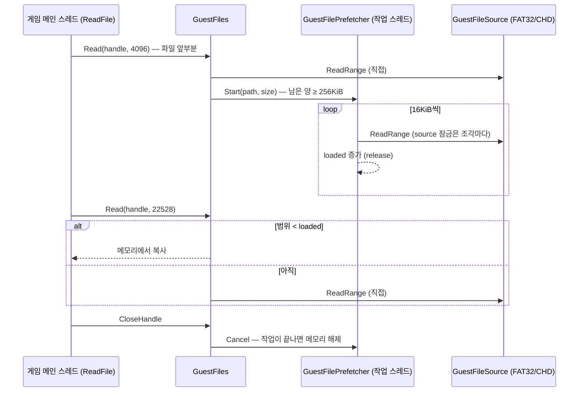

# #9 설계: CHD 파일 백그라운드 미리 읽기

이슈: [#9](https://github.com/nworkers/re2DJ/issues/9)

## 배경

EZ2DJ 6th의 SpaceMix를 HDD에 둔 CHD로 플레이하면 중간에 멈칫거리고 배경음이 끊길 때가 있습니다. 임시 계측으로 확인한 사실은 다음과 같습니다.

* 6th에는 소리 스레드가 없습니다. 메인 스레드가 매 프레임 배경음 버퍼(360,448바이트, 약 2.04초)의 재생 위치를 보고, 약 133ms마다 `bgm.ezw`에서 22,528바이트를 `ReadFile`로 읽어 씁니다. 재생 위치보다 약 1.5초 앞서 채웁니다.
* 한 곡(70초) 동안 연 파일은 모두 곡 시작 전 로딩에서 열렸고, 플레이 중 파일 접근은 `bgm.ezw` 읽기 532번(12.3MB)뿐이었습니다.
* CHD(6th는 4KB hunk, LZMA)에서 처음 읽는 조각은 HDD를 기다립니다. 계측한 느린 `ReadFile`의 시간은 거의 전부 hunk 읽기(`chd_read`)였고, 한 번에 25~30ms, 다른 실행에서는 482ms까지 걸렸습니다. 그동안 메인 스레드가 멈춰 프레임이 밀립니다.
* 같은 구간을 다시 실행하면 느린 읽기가 없습니다(Windows 파일 캐시).

`ReadFile`은 게임의 메인 스레드에서 동기로 불리므로, 디스크 대기를 메인 스레드 밖으로 옮기면 됩니다.

## 목표

* 게임이 CHD(또는 디렉터리 덤프) 파일을 **나눠 읽기 시작하면** 백그라운드 스레드가 그 파일 전체를 순서대로 메모리에 읽어 둡니다.
* 이후 `ReadFile`은 미리 읽은 범위면 메모리에서 바로 돌려주고, 아직이면 지금처럼 직접 읽습니다. 결과는 바이트 단위로 같습니다.
* Windows·Linux 공용입니다(`src/hle/`).

## 구조

* `hle::GuestFilePrefetcher`(`include/re2dj/hle/guest_file_prefetcher.h`, `src/hle/guest_file_prefetcher.cpp`)
  * 작업 스레드 하나와 FIFO 큐. 스레드는 첫 작업 때 띄우고, 소멸자가 멈추고 기다립니다.
  * `Start(path, size)`는 작업(`Job`)을 돌려줍니다. 작업 스레드가 버퍼를 할당하고 16KiB씩 `GuestFileSource::ReadRange`로 채우며, 채운 앞부분 길이(`loaded`)를 atomic으로 공개합니다. 읽는 쪽은 `loaded` 아래만 복사하므로 버퍼에 따로 잠금이 필요 없습니다.
  * `Copy(job, offset, destination, length)`: 범위가 `loaded` 안이면 복사하고 true.
  * `Cancel(job)`: 다음 조각부터 멈춥니다. 버퍼는 작업과 handle 모두 놓을 때 사라집니다(`shared_ptr`).
  * 살아 있는 작업의 버퍼 합이 256MiB를 넘으면 새 작업을 받지 않습니다(그 파일은 지금처럼 직접 읽음).
* `GuestFiles`
  * 이미지 파일(overlay가 아닌 것)을 읽기 전용으로 열었고, 그 파일의 **첫 `Read`가 끝난 뒤 남은 양이 256KiB 이상**이면 미리 읽기를 시작합니다. 한 번에 다 읽는 이미지·채보 파일은 미리 읽지 않아 같은 데이터를 두 번 읽지 않습니다.
  * `Read`는 미리 읽은 범위를 먼저 봅니다. `Close`는 작업을 취소합니다.
  * 미리 읽기 시작과 끝을 로그에 한 줄씩 남깁니다(`files: prefetch …`, `files: prefetched … in N ms`).
* source의 스레드 안전성: CHD source는 `Fat32Volume`과 `MameChdImage`가 각자 잠금을 가지므로 다른 스레드에서 불러도 됩니다. 디렉터리 덤프 source는 읽을 때마다 host 파일을 새로 엽니다. 작업 스레드는 조각을 작게(16KiB, 6th의 클러스터 하나) 읽어, 메인 스레드가 같은 잠금을 기다려도 조각 하나 읽는 시간만 기다리게 합니다.
* CHD handle을 하나 더 열지 않습니다. 6th CHD는 hunk 5,089,770개라 handle마다 hunk map 메모리(약 60MB)가 듭니다.

## 하지 않는 것

* 화면 전환 때의 멈춤(처음 보는 디렉터리 조회, 로딩 때 파일 437개 읽기)은 이 작업으로 줄지 않습니다. 게임이 그 파일들을 바로 다 읽기 때문입니다. 디렉터리·FAT 미리 읽기는 따로 다룹니다.
* overlay(host) 파일은 대상이 아닙니다.
* hunk 캐시 크기(32MB)는 바꾸지 않습니다.

## 검증

1. 단위 테스트(`guest_file_prefetcher_test.cpp`, 메모리 source):
   * 나눠 읽는 큰 파일은 미리 읽기가 시작되고, 끝난 뒤의 `Read`는 source를 부르지 않으며 내용이 같다.
   * 한 번에 다 읽는 파일과 작은 파일은 시작하지 않는다.
   * 미리 읽는 중에도 `Read` 결과가 같다(source를 막아 둔 상태에서 직접 읽기로 떨어짐).
   * `Close`가 작업을 멈추고, 메모리 한도를 넘는 작업은 받지 않는다.
2. Windows x86 Debug·Release 빌드와 CTest, WSL Linux x64·x86 빌드와 CTest.
3. 실제 실행(Windows, CHD가 HDD): 아직 하지 않은 곡으로 SpaceMix를 플레이하며 임시 계측으로 플레이 중 `ReadFile`이 디스크를 기다리지 않는지, 로그에 `bgm.ezw` 미리 읽기가 남는지 확인합니다.

---

# #9 Design: Prefetching CHD Files in the Background

Issue: [#9](https://github.com/nworkers/re2DJ/issues/9)

## Background

Playing EZ2DJ 6th's SpaceMix from a CHD on an HDD stutters now and then and the background music can break up. Temporary instrumentation established:

* 6th has no sound thread. Its main thread checks the play cursor of the music buffer (360,448 bytes, about 2.04 s) every frame and, about every 133 ms, writes 22,528 bytes read from `bgm.ezw` with `ReadFile`, about 1.5 s ahead of the play cursor.
* Every file opened for a song (70 s) was opened in the loading before it; during play the only file access was 532 reads of `bgm.ezw` (12.3 MB).
* Pieces read from the CHD (4 KB hunks, LZMA, for 6th) for the first time wait on the HDD. Nearly all the time of the slow `ReadFile`s measured went to hunk reads (`chd_read`), 25 to 30 ms at a time and up to 482 ms in another run, while the main thread stood still and frames slipped.
* Running the same stretch again shows no slow reads (the Windows file cache).

`ReadFile` is called synchronously on the game's main thread, so the disk wait has to move off that thread.

## Goals

* Once the game **starts reading a CHD (or directory-dump) file in pieces**, a background thread reads the whole file into memory in order.
* Later `ReadFile`s are served from memory when the range is already read, and read directly as today when not. The bytes are the same either way.
* Shared by Windows and Linux (`src/hle/`).

## Structure

The sequence diagram above shows the flow: the first, partial read goes to the source directly and starts the prefetch; the worker fills the buffer 16 KiB at a time and publishes the filled length; later reads copy from memory below that length and fall back to the source above it; closing the handle cancels the job.

* `hle::GuestFilePrefetcher` (`include/re2dj/hle/guest_file_prefetcher.h`, `src/hle/guest_file_prefetcher.cpp`)
  * One worker thread and a FIFO queue; the thread starts with the first job and the destructor stops and joins it.
  * `Start(path, size)` returns a `Job`. The worker allocates the buffer, fills it 16 KiB at a time through `GuestFileSource::ReadRange`, and publishes the length of the filled prefix (`loaded`) atomically. Readers copy only below `loaded`, so the buffer needs no lock of its own.
  * `Copy(job, offset, destination, length)`: copies and returns true when the range lies within `loaded`.
  * `Cancel(job)`: stops at the next piece. The buffer goes when both the worker and the handle let go (`shared_ptr`).
  * No new job is taken while the live jobs' buffers exceed 256 MiB in total (that file is read directly as today).
* `GuestFiles`
  * For an image file (not an overlay one) opened read-only, prefetching starts when **at least 256 KiB remain after its first `Read`**. Image and chart files the game reads in one go are not prefetched, so the same data is not read twice.
  * `Read` looks at the prefetched range first; `Close` cancels the job.
  * The log gets one line when a prefetch starts and one when it ends (`files: prefetch …`, `files: prefetched … in N ms`).
* Source thread safety: the CHD source's `Fat32Volume` and `MameChdImage` each hold a lock, so another thread may call it; the directory-dump source opens the host file per read. The worker reads small pieces (16 KiB, one 6th cluster), so a main thread waiting on the same lock waits for one piece at most.
* No second CHD handle is opened: 6th's CHD has 5,089,770 hunks, so each handle costs about 60 MB of hunk map.

## Out of scope

* The stalls at screen transitions (first lookups in directories, the 437 files read while loading) do not shrink with this, since the game reads those files whole at once; prefetching directories and the FAT is a separate matter.
* Overlay (host) files.
* The hunk cache size (32 MB) stays.

## Verification

1. Unit tests (`guest_file_prefetcher_test.cpp`, a memory source):
   * a large file read in pieces starts a prefetch, `Read`s after it finishes do not call the source, and the bytes match;
   * a file read in one go and a small file start none;
   * `Read` returns the same bytes while a prefetch is under way (with the source held back, falling back to a direct read);
   * `Close` stops the job, and a job over the memory limit is refused.
2. Windows x86 Debug and Release builds with CTest, and WSL Linux x64 and x86 builds with CTest.
3. A real run (Windows, CHD on the HDD): play SpaceMix on a song not played yet, checking with the temporary instrumentation that `ReadFile` no longer waits on the disk during play and that the log records the `bgm.ezw` prefetch.
