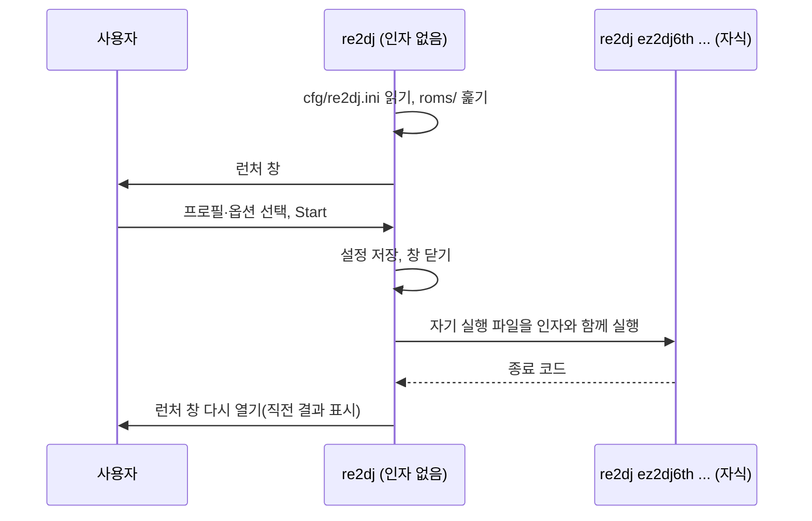

# #12 설계: 인자 없이 실행했을 때 띄우는 런처

이슈: [#12](https://github.com/reexec/re2DJ/issues/12)

## 배경

`re2dj`를 인자 없이 실행하면 사용법을 출력하고 종료 코드 1로 끝납니다(`src/host/cli/main.cpp`의 `RunMain`). 내장 프로필은 8개(`ez2dj1st`, `ez2dj1stse`, `ez2dj2nd`, `ez2dj3rd`, `ez2dj4th`, `ez2dj5th`, `ez2dj6th`, `ez2d2m`)이고, 어떤 것을 실행할 수 있는지는 `roms/`를 직접 봐야 압니다. 창 모드·색 깊이·화면 셰이더·소리 크기는 명령줄 옵션으로만 바꿀 수 있습니다. 그래서 탐색기에서 더블클릭하거나 키보드 없이 패드만 있는 환경에서는 쓸 수 없습니다.

[rePIU](https://github.com/reexec/rePIU)는 같은 문제를 런처로 풀었습니다(rePIU 설계 500·502). 인자 없이 실행하면 SDL3·OpenGL 창 안에 Dear ImGui로 롬셋 목록, 가용 여부와 사유, 운영자용 옵션을 보여 줍니다. 고른 롬셋은 새 프로세스로 실행하고, 게임이 끝나면 목록으로 돌아옵니다. 이 설계는 그 구조를 re2DJ의 프로필·옵션·플랫폼 규칙에 맞춰 옮깁니다.

## 목표

1. 인자 없이 실행하면 내장 프로필을 가용 여부와 사유와 함께 나열하고, 고르면 실행합니다.
2. 자주 바꾸는 옵션(창 모드, 색 깊이, 화면 셰이더, 소리 크기)을 고르고 `cfg/re2dj.ini`에 저장합니다.
3. 게임이 끝나면 런처로 돌아옵니다.
4. 인자를 준 실행은 지금과 똑같이 동작합니다.
5. Linux(x86·x64)와 Windows에서 같은 코드로 동작합니다.

## 결정 1: rePIU처럼 창 안에 ImGui로 그립니다

* re2DJ는 이미 SDL3 창과 OpenGL, Dear ImGui(v1.92.9, MIT)를 씁니다(게임 창과 OSD). 네이티브 GUI 툴킷(Qt·GTK·wxWidgets 등)은 LGPL 계열이라 AGENTS 규칙에 걸리고, OS마다 따로 만들어야 합니다.
* SDL 게임패드 입력을 ImGui 내비게이션으로 받을 수 있어 키보드 없이도 고를 수 있습니다.
* ImGui의 SDL3 platform backend(`imgui_impl_sdl3.cpp`)를 처음 씁니다. OSD는 공용 코어가 창 API에 의존하지 않도록 입력을 직접 넣지만, 런처 창은 SDL host이므로 `src/platform/sdl/`에서 이 backend를 씁니다. 새 정적 라이브러리 하나에만 넣어 OSD와 코어는 그대로 둡니다.

## 결정 2: 고른 프로필은 새 프로세스에서 실행합니다

rePIU는 처음에 같은 프로세스에서 실행하려다 GPU 드라이버가 게스트가 써야 할 저주소 공간을 먼저 차지해 실패했고, 새 프로세스로 바꿨습니다. re2DJ도 같은 이유가 있고, 몇 가지가 더 있습니다.

* Windows x86은 시작하자마자 자기 자신을 다시 띄워 게스트 이미지 범위(`0x400000`부터 64MiB)를 예약합니다(`native_guest_reservation.cpp`). 런처가 드라이버를 올린 뒤에는 이 보장이 깨집니다.
* in-process 러너는 프로세스 하나에 게임 하나를 전제로 합니다. 전역 상태가 있고, 게스트의 `ExitProcess`가 실행을 끝냅니다.
* 실행마다 로그 파일이 따로 생겨 진단이 쉽습니다.

그래서 런처는 **자기 실행 파일**을 `<profile-id> [옵션...]` 인자로 실행하고 끝날 때까지 기다립니다. 자식은 인자가 있으므로 런처를 열지 않고 지금의 명령줄 경로를 그대로 탑니다. 게임 중에는 런처 창과 GL 컨텍스트를 닫고, 자식이 끝나면 다시 엽니다. 창이 두 개 뜨지 않고, 게임 프로세스와 GPU 자원을 나눠 쓰지도 않습니다.

자기 실행 파일 실행은 OS별 구현입니다. 기존 `HostProcessLauncher`는 게스트의 `CreateProcessA`를 위한 것(게스트 경로·종료 코드 pipe 등)이라 따로 둡니다.

* Linux: `posix_spawn("/proc/self/exe", …)` 후 `waitpid`. 작업 443처럼 다시 빌드돼도 같은 실행 파일을 씁니다.
* Windows: `GetModuleFileNameA`로 얻은 경로와 인용한 명령줄로 `CreateProcessA`, `WaitForSingleObject`, `GetExitCodeProcess`. 인용은 `host_process_launcher.h`에 이미 공개된 `QuoteCommandLineArgument`를 씁니다.

## 결정 3: 진입 규칙은 기존 동작을 깨지 않습니다

| 실행 | 동작 |
|---|---|
| `re2dj` | **런처를 띄웁니다**(새 동작). 게임이 끝나면 런처로 돌아옵니다. |
| `re2dj <profile-id> [옵션]`, `re2dj --hdd …` 등 인자가 있는 실행 | 지금과 같습니다. 게임이 끝나면 프로세스가 끝납니다. |
| `RE2DJ_LAUNCHER=0` + 인자 없음 | 지금처럼 사용법을 출력하고 종료 코드 1. 인자 없이 부르는 자동화용입니다. |
| 런처 창을 열 수 없음(디스플레이 없음, GL 실패) | 경고를 남기고 지금처럼 사용법 출력, 종료 코드 1. |

Windows x86의 예약용 재실행은 인자를 그대로 넘기므로, 인자 없는 실행은 재실행된 프로세스에서 런처가 됩니다.

## 결정 4: 가용 여부는 싸게 판정하고 사유를 보여 줍니다

명령줄 shortcut과 **같은 규칙**을 쓰되, CHD를 열거나 디렉터리를 훑지는 않습니다. 실제 판단은 실행할 때 지금 경로가 합니다.

* CHD 프로필(`hdd_input_kind == kMameChd`): 현재 디렉터리 기준 `default_hdd_image_relative_path`에 `.chd`가 정확히 하나 있어야 합니다. 이 규칙은 `main.cpp`의 `FindChdImage`이므로 `re2dj/hdd/chd_image_locator.h`로 꺼내 명령줄과 런처가 함께 씁니다.
* 디렉터리 프로필: `default_hdd_directory_relative_path` 디렉터리가 있어야 합니다.

상태는 `Ready` / `No CHD` / `Several CHDs` / `No directory`로 나누고, 목록에 사유(찾은 경로)를 함께 보여 줍니다. 실행할 수 없는 프로필은 고를 수 없습니다. 원본 자산은 지금처럼 사용자가 `roms/` 아래에 둔 것만 읽습니다.

## 결정 5: 옵션은 명령줄 옵션으로 넘기고 `cfg/re2dj.ini`에 저장합니다

rePIU는 설정을 환경 변수로 넘기지만, re2DJ의 옵션은 모두 명령줄 옵션이므로 자식에게 옵션으로 넘깁니다. 저장하지 않은 값은 넘기지 않아 각 옵션의 기본값과 우선순위가 그대로 유지됩니다.

| 항목 | 저장 키 | 자식 옵션 | 저장 안 됨 |
|---|---|---|---|
| 마지막 프로필 | `[Launcher] last_profile` | — | 첫 번째 실행 가능 프로필에 커서 |
| 전체 화면 | `[Video] fullscreen` (0/1) | `--fullscreen` / `--windowed` | 넘기지 않음(프로필 기본값) |
| 색 깊이 | `[Video] color_depth` (16/32) | `--color-depth 16\|32` | 넘기지 않음(16) |
| 화면 셰이더 | `[Video] post_shader` | `--post-shader=<id>` | 넘기지 않음(`RE2DJ_POST_SHADER` 또는 `none`) |
| 소리 크기 | `[Audio] gain_db` (−24~+18) | `--audio-gain-db <dB>` | 넘기지 않음(프로필 기본값 또는 0) |

* 파일은 현재 디렉터리의 `cfg/re2dj.ini`입니다. `cfg/`는 이미 Git ignore 대상이고 `hardlock.ini`가 있는 곳입니다. 읽기는 기존 `FindPrivateProfileValue`를 쓰고, 쓰기는 이 다섯 키를 정해진 순서로 씁니다.
* 잘못된 값(범위 밖, 숫자가 아님)은 경고만 남기고 저장되지 않은 것으로 봅니다. 설정 파일의 오타로 런처가 안 뜨면 안 됩니다.
* 셰이더 목록은 OSD와 같은 `ListPostShaders(ResolvePostShaderDirectory(…))`입니다.
* 화면에 보이는 초깃값은 저장된 값, 없으면 그 옵션의 기본값입니다(셰이더는 `RE2DJ_POST_SHADER`를 반영). 사용자가 바꾼 항목만 저장됩니다.
* hardlock 설정, I/O 매핑(`--io-config`), 진단 옵션은 첫 버전에서 다루지 않습니다.

## 결정 6: 코드 배치

공용 정책과 플랫폼 코드를 나눕니다.

* `include/re2dj/hdd/chd_image_locator.h`, `src/hdd/chd_image_locator.cpp` — `FindChdImage`를 `main.cpp`에서 옮깁니다(동작 그대로).
* `include/re2dj/launcher/launcher_catalog.h`, `src/launcher/launcher_catalog.cpp` — 내장 프로필 → 가용 여부·사유. `std::filesystem`만 씁니다.
* `include/re2dj/launcher/launcher_settings.h`, `src/launcher/launcher_settings.cpp` — `cfg/re2dj.ini` 읽기·쓰기, 설정 → 자식 인자 목록.
* `include/re2dj/ui/launcher_screen.h`, `src/ui/launcher_screen.cpp` — ImGui 화면(목록, 옵션, Start/Quit). SDL·OS 헤더 없음.
* `include/re2dj/platform/sdl/launcher_window.h`, `src/platform/sdl/launcher_window.cpp` — SDL3 창, GL 컨텍스트, ImGui SDL3·OpenGL3 backend, 이벤트 루프. OS 헤더 없음.
* `include/re2dj/platform/self_process.h` + `src/platform/linux/self_process.cpp`, `src/platform/windows/self_process.cpp` — 자기 실행 파일을 인자와 함께 실행하고 종료 코드를 기다립니다.
* `src/host/cli/launcher_session.{h,cpp}` — 흐름(설정 읽기 → 목록 → 창 → 저장 → 자식 실행 → 반복). `main.cpp`에는 "인자가 없으면 런처" 배선만 둡니다.

## 결정 7: 입력

키보드(방향키·Enter·Esc), 마우스, SDL이 인식한 게임패드로 조작합니다(`ImGuiConfigFlags_NavEnableKeyboard | NavEnableGamepad`). 컨트롤러를 게임 I/O 매핑(`--io-config`)으로 조작하는 것은 범위 밖입니다. 목록에서 Enter나 더블클릭은 Start와 같고, Esc는 Quit입니다.

## 범위 밖

* 게임 I/O 매핑으로 런처 조작, 매핑 편집 UI
* 테마, 글꼴, 한국어 표시(프로필 이름은 영어)
* `--hdd`로 임의 디렉터리 고르기(파일 선택창), 탐지된(내장 아닌) 프로필
* hardlock 설정과 진단 옵션

## 검증

* 단위 테스트
  * `chd_image_locator`: 파일 직접 지정, `.chd` 없음, 하나, 둘 이상, 디렉터리 없음.
  * `launcher_catalog`: 합성 `roms/` 디렉터리로 각 상태와 사유.
  * `launcher_settings`: 없는 파일, 왕복(쓰고 다시 읽기), 잘못된 값의 경고, 저장한 항목만 자식 인자가 되는지, 인자 순서.
* 실제 실행(Linux x64·x86): 인자 없이 실행 → 목록과 상태 확인 → 6th 실행 → 게임 종료 뒤 런처 복귀 → 옵션 변경이 다음 실행에 반영되고 `cfg/re2dj.ini`에 남는지. `RE2DJ_LAUNCHER=0`과 디스플레이 없음(`SDL_VIDEO_DRIVER=dummy` 등)에서 기존 동작.
* 인자를 준 실행이 지금과 같은 경로를 타는지(기존 CTest와 6th 실행).
* Windows x86: CI 빌드·테스트. 이 기계에서는 실행할 수 없으므로 실제 실행은 사용자 확인으로 남깁니다.

---

# #12 Design: a launcher shown when run without arguments

Issue: [#12](https://github.com/reexec/re2DJ/issues/12)

## Background

Run without arguments, `re2dj` prints its usage and exits with code 1 (`RunMain` in `src/host/cli/main.cpp`). There are eight built-in profiles (`ez2dj1st`, `ez2dj1stse`, `ez2dj2nd`, `ez2dj3rd`, `ez2dj4th`, `ez2dj5th`, `ez2dj6th`, `ez2d2m`), and knowing which can run means looking through `roms/`. Window mode, colour depth, screen shader and sound gain change only through command-line options, so `re2dj` cannot be used by double-clicking it or from a gamepad without a keyboard.

[rePIU](https://github.com/reexec/rePIU) solved the same problem with a launcher (rePIU designs 500 and 502): run bare, it shows the ROM sets, their availability and reasons, and a few operator options, drawn with Dear ImGui in an SDL3/OpenGL window; it starts the chosen set in a new process and comes back to the list when the game ends. This design carries that structure over to re2DJ's profiles, options and platform rules.

## Goals

1. Run bare, list the built-in profiles with their availability and reasons, and run the one chosen.
2. Choose the commonly changed options (window mode, colour depth, screen shader, sound gain) and keep them in `cfg/re2dj.ini`.
3. Return to the launcher when the game ends.
4. Leave every run with arguments exactly as it is.
5. Work from the same code on Linux (x86 and x64) and Windows.

## Decision 1: draw with ImGui inside a window, as rePIU does

* re2DJ already uses an SDL3 window, OpenGL and Dear ImGui (v1.92.9, MIT) for the game window and the OSD. Native GUI toolkits (Qt, GTK, wxWidgets) are LGPL-family, which AGENTS rules out, and would have to be built per OS.
* SDL gamepad input can drive ImGui navigation, so a choice can be made without a keyboard.
* This is the first use of ImGui's SDL3 platform backend (`imgui_impl_sdl3.cpp`). The OSD feeds its input itself so the shared core never depends on a windowing API; the launcher window is an SDL host, so it uses that backend under `src/platform/sdl/`, compiled into one new static library and leaving the OSD and the core as they are.

## Decision 2: run the chosen profile in a new process

rePIU first tried to run in the same process and failed because the GPU driver had taken low address space the guest needs, so it moved to a new process. re2DJ has that reason and a few more:

* On Windows x86 the program restarts itself at once to reserve the guest image range (64 MiB from `0x400000`, `native_guest_reservation.cpp`); after the launcher has loaded a driver that guarantee is gone.
* The in-process runner assumes one game per process: it has global state, and the guest's `ExitProcess` ends the run.
* Each run gets its own log file, which keeps diagnosis simple.

So the launcher starts **its own executable** with `<profile-id> [options...]` and waits for it. Having arguments, the child never opens the launcher and takes today's command-line path unchanged. While the game runs, the launcher's window and GL context are closed and reopened when the child ends, so there are never two windows and the game process has the GPU to itself.

Starting its own executable is per-OS code, kept apart from the existing `HostProcessLauncher`, which serves the guest's `CreateProcessA` (guest paths, an exit-code pipe and so on):

* Linux: `posix_spawn("/proc/self/exe", …)` and `waitpid`, the same executable even after a rebuild, as in task 443.
* Windows: `CreateProcessA` with the path from `GetModuleFileNameA` and a quoted command line, then `WaitForSingleObject` and `GetExitCodeProcess`, quoting with `QuoteCommandLineArgument`, already public in `host_process_launcher.h`.

## Decision 3: entry rules keep the existing behaviour

| Run | Behaviour |
|---|---|
| `re2dj` | **Opens the launcher** (new); a finished game returns to it. |
| Any run with arguments (`re2dj <profile-id> [options]`, `re2dj --hdd …`) | As now; the process ends with the game. |
| `RE2DJ_LAUNCHER=0` with no arguments | Usage and exit code 1, as now, for automation that runs the binary bare. |
| The launcher window cannot open (no display, GL failure) | A warning, then usage and exit code 1, as now. |

The Windows x86 reservation restart passes the arguments on unchanged, so a bare run becomes the launcher in the restarted process.

## Decision 4: judge availability cheaply and show the reason

The rules are the command-line shortcut's, without opening a CHD or scanning a directory; the real judgement still happens at launch along today's path.

* CHD profiles (`hdd_input_kind == kMameChd`): exactly one `.chd` in `default_hdd_image_relative_path` under the current directory. That rule is `FindChdImage` in `main.cpp`, which moves to `re2dj/hdd/chd_image_locator.h` for the command line and the launcher to share.
* Directory profiles: the `default_hdd_directory_relative_path` directory exists.

The states are `Ready`, `No CHD`, `Several CHDs` and `No directory`, and the list shows the reason with the path looked at. A profile that cannot run cannot be chosen. Original assets are read, as now, only from what the user placed under `roms/`.

## Decision 5: pass options as command-line options and keep them in `cfg/re2dj.ini`

rePIU hands its settings over as environment variables; every re2DJ option is a command-line option, so the child gets options. A value never stored is never passed, keeping each option's default and precedence intact.

| Item | Stored key | Child option | When not stored |
|---|---|---|---|
| Last profile | `[Launcher] last_profile` | — | cursor on the first runnable profile |
| Fullscreen | `[Video] fullscreen` (0/1) | `--fullscreen` / `--windowed` | not passed (profile default) |
| Colour depth | `[Video] color_depth` (16/32) | `--color-depth 16\|32` | not passed (16) |
| Screen shader | `[Video] post_shader` | `--post-shader=<id>` | not passed (`RE2DJ_POST_SHADER` or `none`) |
| Sound gain | `[Audio] gain_db` (−24 to +18) | `--audio-gain-db <dB>` | not passed (profile default or 0) |

* The file is `cfg/re2dj.ini` in the current directory; `cfg/` is already Git-ignored and holds `hardlock.ini`. Reading uses the existing `FindPrivateProfileValue`; writing writes these five keys in a fixed order.
* A bad value (out of range, not a number) is reported as a warning and treated as not stored: a typo in the file must not keep the launcher from opening.
* The shader list is the OSD's, `ListPostShaders(ResolvePostShaderDirectory(…))`.
* The value shown first is the stored one, otherwise the option's default (the shader reflecting `RE2DJ_POST_SHADER`). Only items the user changes are stored.
* Hardlock settings, I/O mapping (`--io-config`) and diagnostic options are left out of the first version.

## Decision 6: code layout

Shared policy and platform code stay apart.

* `include/re2dj/hdd/chd_image_locator.h`, `src/hdd/chd_image_locator.cpp` — `FindChdImage`, moved from `main.cpp` unchanged.
* `include/re2dj/launcher/launcher_catalog.h`, `src/launcher/launcher_catalog.cpp` — built-in profiles to availability and reason, `std::filesystem` only.
* `include/re2dj/launcher/launcher_settings.h`, `src/launcher/launcher_settings.cpp` — reading and writing `cfg/re2dj.ini`, and settings to the child's arguments.
* `include/re2dj/ui/launcher_screen.h`, `src/ui/launcher_screen.cpp` — the ImGui screen (list, options, Start/Quit), no SDL or OS header.
* `include/re2dj/platform/sdl/launcher_window.h`, `src/platform/sdl/launcher_window.cpp` — the SDL3 window, GL context, ImGui SDL3 and OpenGL3 backends and event loop, no OS header.
* `include/re2dj/platform/self_process.h` with `src/platform/linux/self_process.cpp` and `src/platform/windows/self_process.cpp` — start the program's own executable with arguments and wait for its exit code.
* `src/host/cli/launcher_session.{h,cpp}` — the flow (read settings, list, window, save, run the child, repeat); `main.cpp` keeps only the "no arguments means launcher" wiring.

## Decision 7: input

Keyboard (arrows, Enter, Esc), mouse, and gamepads SDL recognises (`ImGuiConfigFlags_NavEnableKeyboard | NavEnableGamepad`). Driving the launcher through the game's I/O mapping (`--io-config`) is out of scope. Enter or a double click on the list is Start; Esc is Quit.

## Out of scope

* Driving the launcher through the game I/O mapping, a mapping editor
* Themes, fonts, Korean text (profile names are English)
* Picking an arbitrary `--hdd` directory (a file dialog), detected (non-built-in) profiles
* Hardlock settings and diagnostic options

## Verification

* Unit tests
  * `chd_image_locator`: a file named directly, no `.chd`, one, more than one, a missing directory.
  * `launcher_catalog`: each state and reason over a synthetic `roms/` directory.
  * `launcher_settings`: a missing file, a round trip (write and read back), warnings for bad values, only stored items becoming child arguments, and their order.
* Real runs (Linux x64 and x86): run bare, check the list and states, run 6th, return to the launcher when the game ends, and check that changed options apply to the next run and stay in `cfg/re2dj.ini`; with `RE2DJ_LAUNCHER=0` and with no display (`SDL_VIDEO_DRIVER=dummy` or the like), the existing behaviour.
* Runs with arguments take the same path as now (the existing CTest and a 6th run).
* Windows x86: CI build and tests. It cannot run on this machine, so the real run is left to the user to check.
