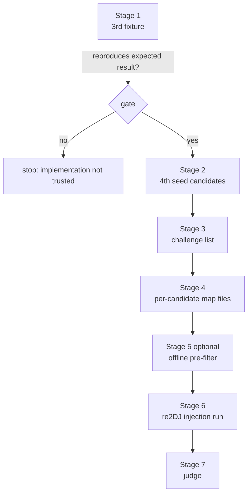

# Hardlock seed 복구 워크스루

근거: [reSoftlock 인터페이스 계약](../design/20260902-136-resoftlock-interface-contract.md), [Task 107 작업 로그](../work-logs/20260831-107-ez2dj3rd-hardlock-seed-smt.md), [Task 135 작업 로그](../work-logs/20260902-135-hardlock-transform-response-map.md), [Task 137 작업 로그](../work-logs/20260902-137-decrypted-region-judge.md)

*Basis: the [reSoftlock interface contract](../design/20260902-136-resoftlock-interface-contract.md), the [Task 107 work log](../work-logs/20260831-107-ez2dj3rd-hardlock-seed-smt.md), the [Task 135 work log](../work-logs/20260902-135-hardlock-transform-response-map.md), and the [Task 137 work log](../work-logs/20260902-137-decrypted-region-judge.md).*

이 문서는 seed 복구부터 후보 판별까지의 전체 절차를 예시로 보입니다. 명령 이름은 계약이 요구하는 기능에 붙인 제안이며 reSoftlock이 최종 결정합니다. 변환 알고리즘의 내부는 다루지 않습니다.

*This walkthrough shows the whole procedure from seed recovery to candidate judgement. Command names are suggestions attached to the capabilities the contract requires and reSoftlock decides them; the transform algorithm's internals are not covered here.*

## 전체 흐름



---

## Stage 1 — 3rd로 구현을 검증한다

**먼저 해야 합니다.** 4th는 정답을 모르므로 결과가 맞는지 알 수 없지만, 3rd는 기대 결과가 이미 있습니다.

*Do this first. 4th's answer is unknown so its result cannot be checked, while 3rd already has an expected result.*

```
resoftlock seeds \
  --module-address 0x4c51 \
  --id-ref    478c8b793f201f8a \
  --id-verify cc22ae2da344b2a2 \
  --output    out/3rd-candidates.txt
```

기대 결과는 두 가지입니다.

| 항목 | 기대값 |
| --- | --- |
| 중간 control 값 | `74 6c 2c 1c f0` (유일해. 배제 제약이 `unsat`이어야 함) |
| seed 후보 수 | **11개 이상**. Task 107이 전수 열거 전에 중단했으므로 하한입니다 |

두 값이 재현되지 않으면 **여기서 멈춥니다.** 4th 결과를 신뢰할 근거가 없습니다.

내부 불변식도 함께 확인하십시오. 후보마다 그 seed로 `ID_Ref`에서 `ID_Verify`를 다시 계산해 관찰값과 같은지 assert합니다. 이 왕복 검사는 탐색 버그를 즉시 드러냅니다.

*Two expectations must hold: the intermediate control value `74 6c 2c 1c f0` as a unique solution, with the exclusion query returning `unsat`, and at least eleven seed candidates — a lower bound, since Task 107 stopped before exhaustive enumeration. If either is not reproduced, **stop here**: there is no basis for trusting a 4th result. Also assert the internal invariant that recomputing `ID_Verify` from `ID_Ref` with each candidate's seeds equals the observed value; this round trip exposes search bugs immediately.*

---

## Stage 2 — 4th 후보를 복구한다

```
resoftlock seeds \
  --module-address 0x4c53 \
  --id-ref    a755931881fd81ea \
  --id-verify ceed1a5e4f27078f \
  --output    out/4th-candidates.txt
```

후보가 여럿인 것은 정상입니다. 3rd에서 11개, 공개 보고로는 55개 사례가 있습니다. 이 단계의 목적은 답을 하나로 줄이는 것이 아니라 **판별 가능한 크기로 줄이는 것**입니다.

*Multiple candidates are normal — eleven for 3rd and a public report of 55. The goal of this stage is not to reduce the answer to one but to reduce it to **a judgeable number**.*

```
# out/4th-candidates.txt
# search completed: full enumeration
# index  seed1   seed2   seed3
0        0x....  0x....  0x....
1        0x....  0x....  0x....
```

탐색을 중간에 끊었다면 그 사실을 주석으로 남기십시오. 목록이 하한임을 나중에 알 수 있어야 합니다.

*If the search was interrupted, record that as a comment so the list is later known to be a lower bound.*

---

## Stage 3 — challenge 목록을 만든다

원본 실행 파일만으로 만들 수 있습니다. re2DJ를 실행할 필요가 없습니다.

*This can be built from the original executable alone, with no re2DJ run required.*

```
resoftlock challenges --pe EZ2DJ.EXE --output out/4th-challenges.txt
```

규칙은 각 PE section의 raw 시작에서 `0x8000` 간격으로 걷고 각 지점의 8바이트를 취하며, 다음 지점이 section raw 범위를 벗어나면 그 section을 끝내고, `.idata`와 `.protect`를 제외하는 것입니다.

4th에서 기대되는 결과입니다.

| section | raw 시작 | 청크 |
| --- | --- | --- |
| `.text` | `0x001000` | 28 |
| `.rdata` | `0x0dd000` | 2 |
| `.data` | `0x0ea000` | 4 |
| `.reloc` | `0x108000` | 2 |
| 합계 | | **36** (고유 32) |

첫 세 개는 `62eaaf2b89f004aa`, `f11007c2771cc1ff`, `2235163992c976df`입니다. 이 규칙은 re2DJ가 관찰한 목록을 값과 순서까지 재현했습니다.

*The rule walks each PE section from its raw start at `0x8000` intervals, taking eight bytes at each point and stopping when the next point leaves the section's raw range, skipping `.idata` and `.protect`. For 4th this yields 36 challenges with 32 unique, beginning `62eaaf2b89f004aa`, `f11007c2771cc1ff`, `2235163992c976df`; the rule reproduced re2DJ's observed list in both value and order.*

3rd도 **같은 규칙**입니다. 2026-09-02 실제 실행에서 확정했습니다.

| section | raw 시작 | 청크 |
| --- | --- | --- |
| `.text` | `0x001000` | 25 |
| `.rdata` | `0x0c2000` | 2 |
| `.data` | `0x0cd000` | 3 |
| `.reloc` | `0x0e4000` | 2 |
| 합계 | | **32** (고유 28) |

첫 세 개는 `987b20a357ccd4da`, `72d0d80ae8a6f27e`, `2cba42cbe47776f3`입니다. 이전에 기록된 18개는 `.text` 도중에 끊긴 관찰의 하한이었으며, 새 목록의 앞 18개와 정확히 같습니다.

*3rd uses the **same rule**, confirmed by a real run on 2026-09-02: 25 chunks in `.text`, 2 in `.rdata`, 3 in `.data`, and 2 in `.reloc` for 32 challenges with 28 unique, beginning `987b20a357ccd4da`, `72d0d80ae8a6f27e`, `2cba42cbe47776f3`. The previously recorded 18 was the lower bound of an observation cut short partway through `.text` and is identical to the first 18 entries of the new list.*

---

## Stage 4 — 후보별 매핑 파일을 만든다

```
resoftlock map-batch \
  --module-address 0x4c53 \
  --candidates out/4th-candidates.txt \
  --challenges out/4th-challenges.txt \
  --output-dir out/maps
```

```
out/maps/cand-000.map
out/maps/cand-001.map
...
```

각 파일은 고유 challenge 수만큼의 줄이어야 합니다. 4th는 32줄, 3rd는 28줄입니다. 중복 challenge는 접어서 한 번만 넣습니다. re2DJ가 중복 항목을 거절하기 때문입니다.

*Each file holds one line per unique challenge — 32 for 4th and 28 for 3rd — with duplicates folded to a single entry because re2DJ rejects duplicates.*

---

## Stage 5 — 오프라인 사전 선별 (선택, 근거 미확정)

게임을 실행하기 전에 후보를 걸러낼 수 있다면 판별 루프가 크게 줄어듭니다. 공개 분석은 Function `0x0e` 결과 8바이트가 청크 데이터에 **순환 적용되는 복호화 재료**라고 설명합니다. 이 모델은 **추정**이며 확인되지 않았습니다. 1st SE 평문을 기준으로 한 단순 반복 XOR 통계 복원은 일관된 결과를 내지 못했습니다.

그래도 시도할 가치가 있습니다. 검사 자체가 자기 검증이기 때문입니다.

1. 후보의 응답 `R`을 `.text` 첫 청크 challenge(파일 offset `0x1000`)에 대해 계산합니다.
2. 그 청크 32 KiB를 `R`을 순환 적용해 복호화해 파일로 씁니다.
3. 결과를 판별기에 넣습니다.

```
build/windows-x86/bin/Debug/re2dj_code_score.exe out/cand-000-chunk0.bin --raw --require-code
```

`--require-code`는 `code-like` 구간이 하나도 없으면 종료 코드 `3`을 돌려주므로, 후보 수십 개를 shell loop로 걸러 통과한 것만 남길 수 있습니다. 비교 기준이 필요하면 같은 도구를 원본에 그대로 돌립니다.

```
build/windows-x86/bin/Debug/re2dj_code_score.exe \
  --chd roms/ez2dj4th/4thTrax.chd --guest-path EZ2DJ/EZ2DJ.EXE --section .text
```

암호문 상태의 엔트로피는 `7.997`입니다. 모델이 맞고 후보가 옳으면 **엔트로피가 6점대로 떨어지고 prologue가 나타납니다.** 어떤 후보도 그렇지 않으면 모델이 틀린 것이므로 이 단계를 버리고 Stage 6으로 갑니다. 정확히 한 후보만 통과하면 그 자체가 답이자 모델의 확인입니다.

*If candidates can be screened before running the game, the judgement loop shrinks dramatically. Public analysis describes the eight-byte Function `0x0e` result as decryption material cycled over chunk data; this model is **inferred and unconfirmed**, and a simple repeating-XOR statistical recovery against 1st SE plaintext did not produce a consistent result. It is still worth attempting, because the test is self-validating: compute a candidate's response `R` for the first `.text` chunk challenge at file offset `0x1000`, decrypt that 32 KiB chunk by cycling `R` over it into a file, and score the result with `re2dj_code_score`, whose `--require-code` exits `3` when no region reads as code so dozens of candidates can be filtered from a shell loop, with the same tool run against the original as the reference. Ciphertext reads `7.997`; if the model and the candidate are both right, entropy should fall into the sixes and prologues should appear. If no candidate does that, the model is wrong — drop this stage and go to Stage 6. If exactly one candidate passes, that is both the answer and confirmation of the model.*

---

## Stage 6 — re2DJ가 후보를 주입해 실행한다

```powershell
foreach ($m in Get-ChildItem out/maps/*.map) {
  build/windows-x86/bin/Debug/re2dj_windows_x86_launcher_probe.exe `
    --hdd <staged CHD root> `
    --chd roms/ez2dj4th/4thTrax.chd `
    --target ez2dj4th --target-executable EZ2DJ/EZ2DJ.EXE `
    --device-mock-wts-console-session `
    --device-mock-hardlock-450-response 0100fafa0010 `
    --device-mock-hardlock-44c-tail 0001 `
    --hardlock-transform-map $m `
    --slot-writer-trace
}
```

3rd는 HDD 디렉터리에서 실행하며 `--hle-dynamic-vfs`가 **필요합니다.** 이 flag가 없으면 `GetProcAddress`로 해석된 `CreateFileA`가 실제 Win32로 가서 device mock이 보호의 device open을 보지 못하고, 보호가 `Hardlock` 대화상자를 띄운 뒤 종료 코드 `0x00000009`로 끝납니다.

```powershell
build/windows-x86/bin/Debug/re2dj_windows_x86_launcher_probe.exe `
  --hdd roms/ez2dj3rd `
  --target ez2dj3rd --target-executable ez2dj/EZ2DJ.EXE `
  --run-detached --hle-directsound --hle-dynamic-vfs `
  --device-mock-lptdi-ioctl-full-success `
  --device-mock-wts-console-session `
  --device-mock-hardlock-450-response 0100fafa0010 `
  --device-mock-hardlock-44c-tail 0001 `
  --hardlock-transform-map <map>
```

*3rd runs from an HDD directory and **requires** `--hle-dynamic-vfs`. Without it the `CreateFileA` resolved through `GetProcAddress` reaches the real Win32 entry, the device mock never sees the protection's device open, and the protection ends with a `Hardlock` dialog and exit code `0x00000009`.*

각 실행에서 먼저 확인할 것은 주입이 완전했는지입니다. `.vfs.log`의 transform 줄이 4th는 36개, 3rd는 32개 모두 `mapped=1:unmapped=0`이어야 합니다. `unmapped`가 하나라도 있으면 매핑 파일이 challenge를 다 덮지 못한 것이므로 그 실행의 결과는 무의미합니다.

*In each run, first confirm the injection was complete: all transform lines in the `.vfs.log` — 36 for 4th, 32 for 3rd — must read `mapped=1:unmapped=0`. Any `unmapped` means the map file did not cover every challenge, so that run's result is meaningless.*

---

## Stage 7 — 판별한다

**fault 주소를 판별 기준으로 쓰지 마십시오.** 실행마다 달라지는 할당 주소입니다. 같은 매핑을 두 번 주입해도 `eip`가 `0x0024d000`과 `0x00313000`으로 달랐습니다.

*Never judge by the fault address: it is a per-run allocation address, and injecting the same map twice produced `eip` values of `0x0024d000` and `0x00313000`.*

> **실제로 통한 기준 — 2026-09-02.** 3rd 105개, 4th 93개를 모두 주입한 결과, 제품마다 정확히 하나가 다음 형태로 갈렸습니다. 이 표가 가장 먼저 볼 기준입니다.
>
> | 관찰 | 틀린 후보 | 옳은 후보 |
> | --- | --- | --- |
> | 종료 | fault (`0xc0000005` / `0xc0000096` / `0xc000001d`) | `0x00000000` |
> | vfs trace | 3rd 365줄 / 4th 451줄 | 3rd 377줄 / 4th 468줄 |
> | `0x450` handshake | 4회 | 8회 |
> | 장치 재오픈 | 없음 | `\\.\FEnteDev` 다시 열림 |
> | `EZ2DJ.ini` 열기 | 없음 | 있음 |
>
> 가장 강한 신호는 마지막 두 줄입니다. transform loop 이후 게스트가 장치를 다시 열고 자신의 설정 파일을 읽는 것은 복호화된 게임 코드의 동작입니다. 근거는 [Task 139 작업 로그](../work-logs/20260902-139-hardlock-candidate-judgement.md)입니다.
>
> *The criteria that actually worked — 2026-09-02. Injecting all 105 3rd and 93 4th candidates left exactly one per product separated by the table above; the strongest signals are the last two rows, since a guest that reopens the device and reads its own configuration file after the transform loop is running decrypted game code. The evidence is the [Task 139 work log](../work-logs/20260902-139-hardlock-candidate-judgement.md).*

쓸 수 있는 기준은 다음과 같습니다.

| 기준 | 틀린 후보 | 옳은 후보에 기대되는 것 |
| --- | --- | --- |
| fault 위치의 질적 구분 | 이미지 밖 주소, 또는 `.text` 안이지만 손상된 stack | 더 진행하거나 fault가 사라짐 |
| 복호화 영역 엔트로피 | `7.99` 부근 유지 | `6`점대로 하락 |
| `55 8b ec` prologue | 0회 | 다수 출현 |
| 실행 지속 시간과 도달 경계 | transform loop 직후 종료 | 이후 API 경계 도달 |

엔트로피와 prologue 판정은 `re2dj_code_score`가 수행합니다. 바이트 열이 있으면 무엇이든 넣을 수 있습니다.

```
build/windows-x86/bin/Debug/re2dj_code_score.exe out/dump.bin --raw --chunk 0x8000
```

| 판정 | 의미 |
| --- | --- |
| `ciphertext-like` | 엔트로피 `>= 7.9`, prologue 0회. 복호화가 일어나지 않음 |
| `code-like` | 엔트로피 `<= 7.0`, prologue `>= 1`. 사람이 확인할 후보 |
| `indeterminate` | 어느 쪽도 아님. 판정을 유보함 |

임계값은 확인된 측정치 사이에 둔 휴리스틱이며 원본에서 확인된 사실이 아닙니다. 판정기가 실제 평문 코드를 집어내는지는 원본 자체로 확인되어 있습니다. 4th `.protect`의 첫 1 KiB는 `code-like`(엔트로피 `2.85`, prologue 3회)로 나오고, 같은 실행 파일의 나머지 섹션은 모두 `ciphertext-like`이거나 `indeterminate`입니다.

다만 **실행 중 게스트 메모리를 자동으로 뜨는 경로는 아직 없습니다.** Stage 6 실행에서 나온 dump가 있어야 이 도구에 넣을 수 있습니다. 그때까지는 질적 구분과 도달 경계로 후보를 좁히십시오.

*Usable criteria: the qualitative fault location, the entropy of the decrypted region, `55 8b ec` prologue frequency, and how far execution reaches. A wrong candidate keeps entropy near `7.99` with no prologues and stops right after the transform loop; a right candidate should drop entropy into the sixes, show prologues, and reach later API boundaries. `re2dj_code_score` performs the entropy and prologue judgement on any byte sequence, reporting `ciphertext-like` for entropy at or above `7.9` with no prologue, `code-like` for entropy at or below `7.0` with at least one, and `indeterminate` otherwise. The thresholds are a heuristic placed between confirmed measurements rather than a fact from the original, but the judge is known to find real plaintext code in this very executable: the first 1 KiB of 4th's `.protect` reads `code-like` at entropy `2.85` with three prologues while every other section reads `ciphertext-like` or `indeterminate`. There is, however, **no automatic guest-memory capture during a run yet**, so the tool needs a dump taken from a Stage 6 run; until that exists, narrow candidates by the qualitative distinctions and reached boundaries.*

---

## 참고 — 확인된 파라미터

| | 3rd | 4th |
| --- | --- | --- |
| module address | `0x4c51` | `0x4c53` |
| `ID_Ref` | `478c8b793f201f8a` | `a755931881fd81ea` |
| `ID_Verify` | `cc22ae2da344b2a2` | `ceed1a5e4f27078f` |
| challenge 수 | 32 (고유 28) | 36 (고유 32) |
| seed 3개 | 미확정 (후보 11개 이상) | 미확정 |

*Confirmed parameters for reference. Both seed sets remain unresolved.*

## 비밀값 취급

산출한 후보 목록과 매핑 파일은 어느 저장소에도 커밋하지 않습니다. re2DJ 쪽에서는 `/cfg/` 같은 ignore 경로에 둡니다. 진행 로그에 seed 값과 응답 바이트를 출력하지 않고 개수와 성공 여부만 남깁니다.

*Never commit produced candidate lists or map files to either repository; on the re2DJ side they live under an ignored path such as `/cfg/`. Progress logs carry counts and success flags, never seed values or response bytes.*
