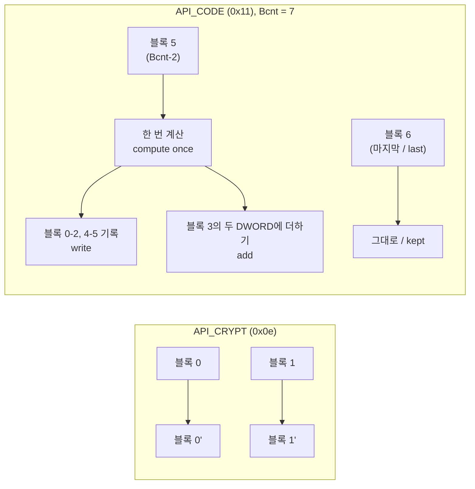

# Hardlock API function 코드와 transform 형태 / Hardlock API function codes and transform shapes

## 한국어

### 범위

EZ2DJ·EZ2Dancer의 보호 계층은 256바이트 `HL_API` descriptor를 장치 IOCTL로 보냅니다. descriptor의 `Function` 값이 요청 종류를 정하고, transform 요청(`0x9c402458`)은 descriptor 뒤에 `Bcnt`개의 8바이트 블록을 붙입니다. 이 문서는 그 function 코드와 두 transform의 **모양**을 정리합니다. 응답 **값**을 계산하는 방법은 다루지 않습니다.

### 출처와 라이선스

아래 표와 transform 형태는 [2EZConfig-V2](https://github.com/ben-rnd/2EZConfig-V2) commit `a7346e066bb569643e0cb25f41cfdc079126fbc6`의 `src/libs/hardlock/fastapi.h`와 `src/libs/hardlock/io.hardlock.emulator.c`에서 읽은 **사실**입니다. 그 저장소는 [GPL-3.0-or-later](https://github.com/ben-rnd/2EZConfig-V2/blob/master/LICENSE)이므로 re2DJ는 코드를 복사·번역·링크하지 않고 사실 대조에만 씁니다. 같은 원칙은 [작업 130 설계](../design/20260901-130-ez2dj4th-hardlock-bypass-path.md)에 있습니다. 공개된 벤더 사양 문서는 찾지 못했습니다.

### descriptor 필드 위치

re2DJ가 원본 실행에서 확인해 쓰는 위치입니다([`api_descriptor.h`](../../include/re2dj/hle/hardlock/api_descriptor.h)).

| 오프셋 | 필드 |
| --- | --- |
| `0x16` | `Bcnt` (블록 수) |
| `0x18` | `Function` |
| `0x1a` | `Status` |
| `0x100` | transform payload 시작 |

### function 코드

| 이름 | 값 | re2DJ에서 관찰된 곳 |
| --- | --- | --- |
| `API_INIT` | 0 (`0x0000`) | descriptor, 모든 `.protect` 제품 |
| `API_DOWN` | 1 (`0x0001`) | descriptor, `ez2d2m` 종료 경로, 6th |
| `API_AVAIL` | 6 (`0x0006`) | descriptor, `ez2d2m` 1라운드 |
| `API_LOGIN` | 7 | — |
| `API_LOGOUT` | 8 | — |
| `API_KEYE` | 11 | — |
| `API_CRYPT` | 14 (`0x000e`) | transform, 3rd·4th·`ez2d2m` |
| `API_CODE` | 17 (`0x0011`) | transform, 6th·`ez2d2m` |
| `API_READ` | 20 | — |
| `API_WRITE` | 21 | — |
| `API_READ_BLOCK` | 23 | — |
| `API_WRITE_BLOCK` | 24 | — |
| `API_FORCE_DOWN` | 31 | — |

`Status`의 `STATUS_OK`는 0입니다.

### 두 transform의 모양

- **`API_CRYPT`**: 각 블록을 **독립적으로** 제자리 변환합니다. 같은 입력 블록은 위치와 무관하게 같은 출력을 받습니다. 그래서 re2DJ의 **블록 행**(8바이트 → 8바이트)으로 표현됩니다.
- **`API_CODE`**: 끝에서 두 번째 블록을 입력으로 **한 번** 계산하고, 결과를 payload의 여러 위치에 씁니다. 블록 3의 두 DWORD에는 더하고, 마지막 블록은 건드리지 않습니다. 응답이 요청 전체의 함수이므로 re2DJ의 **요청 행**으로만 표현됩니다([설계 247](../design/20260911-247-hardlock-payload-response-rows.md)).

### re2DJ와의 관계

re2DJ는 두 transform 중 어느 것도 계산하지 않습니다. 외부 도구가 만든 행을 적용할 뿐입니다. 이 문서의 모양은 행의 **형식**을 정하는 근거이며, 응답 값의 근거가 아닙니다.

## English

### Scope

The EZ2DJ and EZ2Dancer protection sends a 256-byte `HL_API` descriptor through device IOCTLs. The descriptor's `Function` value selects the request kind, and a transform request (`0x9c402458`) appends `Bcnt` eight-byte blocks after the descriptor. This note records those function codes and the **shape** of the two transforms. It does not cover how response **values** are computed.

### Source and license

The table and shapes below are **facts** read from `src/libs/hardlock/fastapi.h` and `src/libs/hardlock/io.hardlock.emulator.c` in [2EZConfig-V2](https://github.com/ben-rnd/2EZConfig-V2) at commit `a7346e066bb569643e0cb25f41cfdc079126fbc6`. That repository is [GPL-3.0-or-later](https://github.com/ben-rnd/2EZConfig-V2/blob/master/LICENSE), so re2DJ does not copy, translate or link its code and uses it for fact comparison only — the principle already set out in [the task 130 design](../design/20260901-130-ez2dj4th-hardlock-bypass-path.md). No published vendor specification was found.

### Descriptor field positions

These are the positions re2DJ confirmed from original runs and uses ([`api_descriptor.h`](../../include/re2dj/hle/hardlock/api_descriptor.h)): `Bcnt` at `0x16`, `Function` at `0x18`, `Status` at `0x1a`, and the transform payload from `0x100`.

### Function codes

`API_INIT` is 0, seen as a descriptor on every `.protect` product. `API_DOWN` is 1, seen on `ez2d2m`'s exit path and on 6th. `API_AVAIL` is 6, seen in `ez2d2m`'s first round. `API_CRYPT` is 14 (`0x000e`), the transform on 3rd, 4th and `ez2d2m`. `API_CODE` is 17 (`0x0011`), the transform on 6th and `ez2d2m`. The header also defines `API_LOGIN` 7, `API_LOGOUT` 8, `API_KEYE` 11, `API_READ` 20, `API_WRITE` 21, `API_READ_BLOCK` 23, `API_WRITE_BLOCK` 24 and `API_FORCE_DOWN` 31, none observed here yet. `STATUS_OK` is 0.

### The shapes of the two transforms

**`API_CRYPT`** transforms each block **independently** and in place: an identical input block gets an identical output wherever it sits, which is why re2DJ expresses it with **block rows** of eight bytes to eight bytes.

**`API_CODE`** computes **once** from the second-to-last block and writes the result to several places in the payload: it adds into the two DWORDs of block 3 and leaves the last block untouched. Its answer is a function of the whole request, so re2DJ can express it only with **request rows** ([design 247](../design/20260911-247-hardlock-payload-response-rows.md)).

### Relation to re2DJ

re2DJ computes neither transform; it only applies rows an external tool produced. The shapes here justify the rows' **format**, never their values.
