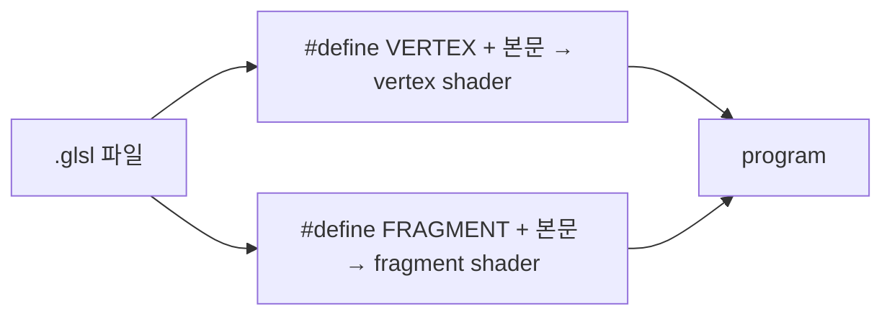

# libretro GLSL 후처리 셰이더 형식 / The libretro GLSL post-processing shader format

관련: [작업 455 설계](../design/20261005-455-post-process-shaders.md) · [후처리 셰이더 가이드](../guides/post-process-shaders.md)

*Related: [task 455 design](../design/20261005-455-post-process-shaders.md) · [post-processing shaders guide](../guides/post-process-shaders.md)*

## 1. 무엇인가 / What it is

libretro(RetroArch)의 GL 드라이버가 쓰는 셰이더 형식으로, 에뮬레이터 화면 후처리 자료가 가장 많이 쌓인 형식입니다. 공식 설명은 [libretro docs: GLSL shaders](https://docs.libretro.com/development/shader/glsl-shaders/)에 있습니다. re2DJ는 그중 **단일 pass `.glsl`** 부분집합을 읽습니다. 같은 저작자의 rePIU(작업 768)와 같은 규칙입니다.

*The shader format of libretro's (RetroArch's) GL driver, the format with the largest body of emulator post-processing material; the official description is [libretro docs: GLSL shaders](https://docs.libretro.com/development/shader/glsl-shaders/). re2DJ reads its **single-pass `.glsl`** subset, by the same rules as rePIU (task 768) by the same author.*

## 2. 한 파일, 두 단계 / One file, two stages

한 파일이 vertex와 fragment를 모두 담고, 호스트가 같은 텍스트를 두 번 컴파일하면서 맨 앞에 `#define VERTEX` 또는 `#define FRAGMENT`를 넣습니다. GLSL은 `#version`이 첫 문장이어야 하므로, 파일이 `#version`으로 시작하면 그 줄 뒤에 넣습니다.

*One file holds both stages; the host compiles the same text twice, prefixing `#define VERTEX` or `#define FRAGMENT`, after the first line when the file starts with `#version`, which GLSL requires to come first.*



## 3. 호스트가 주는 값 / What the host supplies

| 이름 | 의미 |
| --- | --- |
| `VertexCoord`, `TexCoord`, `COLOR` | 꼭짓점 위치, 텍스처 좌표, 색 attribute |
| `MVPMatrix` | 위치를 clip 공간으로 보내는 행렬 |
| `Texture` | 입력 이미지 sampler |
| `InputSize` | 입력 이미지 중 실제 내용의 크기 |
| `TextureSize` | 입력 텍스처의 크기(2의 거듭제곱으로 키운 텍스처를 쓰는 드라이버에서는 `InputSize`와 다를 수 있음) |
| `OutputSize` | 출력 viewport 크기 |
| `FrameCount`, `FrameDirection` | 프레임 번호, 되감기 방향 |

`InputSize`·`TextureSize`는 원래 **에뮬레이터 코어의 원래 해상도**입니다. 그래서 주사선 셰이더는 `TexCoord.y * TextureSize.y`의 소수부로 "원래 화면의 몇 번째 줄 안의 어디인가"를 구합니다. re2DJ는 게임이 논리 해상도(640x480)의 render target에 그리고 그 텍스처를 그대로 셰이더에 주므로, 두 값 모두 실제 텍스처 크기이자 논리 해상도입니다. rePIU는 게임이 창 배율대로 고해상도로 그려서, 같은 의미를 지키려고 실제 텍스처 크기 대신 논리 해상도를 알립니다.

*`InputSize` and `TextureSize` are meant to be **the emulated core's native resolution**, which is why a scanline shader takes the fraction of `TexCoord.y * TextureSize.y` as "where inside which original line". re2DJ's game draws into a render target at its logical resolution (640x480) and that texture goes to the shader as it is, so both values are the real texture size and the logical resolution at once; rePIU's game draws at the window's scale, so rePIU reports the logical resolution instead of the real texture size to keep the same meaning.*

## 4. `#pragma parameter`

```glsl
#pragma parameter NAME "설명" 기본값 최소 최대 [단계]
#ifdef PARAMETER_UNIFORM
uniform float NAME;
#else
#define NAME 기본값
#endif
```

호스트가 `PARAMETER_UNIFORM`을 정의하면 매개변수는 uniform이 되어 UI에서 조절되고, 정의하지 않으면 상수가 됩니다. GLSL 컴파일러는 모르는 `#pragma`를 무시합니다.

*A host that defines `PARAMETER_UNIFORM` gets UI-adjustable uniforms, otherwise constants; GLSL compilers ignore unknown pragmas.*

## 5. 정수 배율에서의 주사선 함정 / The scanline trap at integer scales

창 배율이 정수 n이면 원래 한 줄이 출력 n줄이 되고, 출력 픽셀 중심은 그 줄 안의 `(i + 0.5) / n` 위치에 놓입니다. **n = 2이면 두 중심(0.25, 0.75)이 줄 가운데(0.5)를 기준으로 대칭**이므로, 줄 가운데에 대칭인 밝기 곡선(사인, 가우시안)은 두 행에 같은 값을 주어 주사선이 보이지 않습니다. 해결은 곡선을 비대칭으로 두거나(줄의 뒤쪽 절반을 틈으로) 빔 중심을 출력 반 픽셀만큼 옮기는 것입니다. 내장 `scanline`은 앞의 방법을, `crt`는 뒤의 방법을 씁니다. rePIU 작업 768에서 발견했고, re2DJ의 GL probe도 2배 창에서 밝은 행 48개와 어두운 행 48개로 확인합니다([작업 455 로그](../work-logs/20261005-455-post-process-shaders.md)).

*At an integer scale n one original line becomes n output rows whose centres sit at `(i + 0.5) / n` within the line. **At n = 2 the centres (0.25, 0.75) are symmetric about the middle**, so a profile symmetric about it (sine, Gaussian) gives both rows the same value and no scanline shows. The fixes are an asymmetric profile (the back half of the line as the gap) or shifting the beam centre by half an output pixel; the built-in `scanline` uses the first and `crt` the second. Found in rePIU task 768, and re2DJ's GL probe confirms 48 bright and 48 dark rows in a 2x window ([task 455 log](../work-logs/20261005-455-post-process-shaders.md)).*

## 6. 컨텍스트와 GLSL 버전 / Context and GLSL version

re2DJ의 backend는 OpenGL 2.1 compatibility 컨텍스트를 요청합니다. 2.1의 GLSL은 1.20이므로 `attribute`·`varying`·`texture2D`·`gl_FragColor` 문법이 기준이고, 내장 두 셰이더도 이 문법입니다. 드라이버가 더 높은 compatibility 버전을 주면 `#version 130` 이상을 쓰는 셰이더도 컴파일될 수 있지만 보장되지 않습니다. 컴파일에 실패하면 re2DJ는 `none`으로 그리고 이유를 OSD와 로그에 보입니다. 사양: [OpenGL 2.1](https://registry.khronos.org/OpenGL/specs/gl/glspec21.pdf), [GLSL 1.20](https://registry.khronos.org/OpenGL/specs/gl/GLSLangSpec.1.20.pdf).

*re2DJ's backend requests an OpenGL 2.1 compatibility context, whose GLSL is 1.20, so `attribute`, `varying`, `texture2D` and `gl_FragColor` are the baseline, which both built-ins use. A driver granting a higher compatibility version may compile shaders using `#version 130` or later, but that is not guaranteed; a failed compile draws `none` with the reason in the OSD and the log. Specifications: [OpenGL 2.1](https://registry.khronos.org/OpenGL/specs/gl/glspec21.pdf), [GLSL 1.20](https://registry.khronos.org/OpenGL/specs/gl/GLSLangSpec.1.20.pdf).*

## 7. re2DJ가 지원하지 않는 것 / What re2DJ does not support

다단계 preset(`.glslp`), `PrevTexture`·`PassPrev` 같은 이전 프레임·이전 pass 입력, LUT 텍스처, Slang(`.slang`, Vulkan 계열) 형식.

*Multi-pass presets (`.glslp`), previous-frame and previous-pass inputs such as `PrevTexture` and `PassPrev`, LUT textures, and the Slang (`.slang`, Vulkan-family) format.*
