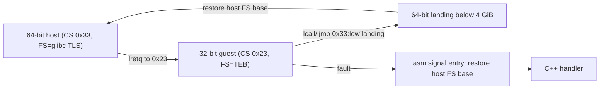

# Linux x86-64 프로세스 안의 compatibility mode / Compatibility mode inside a Linux x86-64 process

x86-64 CPU는 long mode 안에서 64비트 mode와 32비트 **compatibility mode**를 code segment 단위로 전환한다. Linux x86-64는 사용자 공간에 두 code selector를 모두 제공하므로, 64비트 프로세스가 far transfer만으로 32비트 코드를 직접 실행할 수 있다. 이 문서는 그 동작과 함정을 정리한다. re2DJ에서의 적용은 [작업 353 설계](../design/20260924-353-linux-x64-compat-mode-adapter.md)에 있다.

*Inside long mode an x86-64 CPU switches between 64-bit mode and 32-bit **compatibility mode** per code segment. Linux x86-64 exposes both code selectors to user space, so a 64-bit process can run 32-bit code directly with nothing more than far transfers. This document records that behavior and its pitfalls; re2DJ's use of it is in the [Task 353 design](../design/20260924-353-linux-x64-compat-mode-adapter.md).*

## 1. selector / Selectors

| 이름 / Name | 값 / Value | 의미 / Meaning |
| --- | --- | --- |
| `__USER32_CS` | `0x23` | 32비트 사용자 code (compatibility mode) / 32-bit user code |
| `__USER_DS` | `0x2B` | 사용자 data·stack / user data and stack |
| `__USER_CS` | `0x33` | 64비트 사용자 code / 64-bit user code |

값은 Linux의 `arch/x86/include/asm/segment.h`에 정의된 GDT 배치다. 64비트 프로세스에서 `%cs`를 읽으면 `0x33`이다. 작업 353에서 WSL2 커널 5.15의 probe로 두 방향 전환을 모두 확인했다. 커널이 32비트 지원을 끈 경우(`CONFIG_IA32_EMULATION=n`, 6.7 이후의 `ia32_emulation=0` boot parameter)에는 `0x23`이 동작하지 않을 수 있다. 이 경우는 **실행으로 확인하지 않았다**.

*The values are the GDT layout defined in Linux's `arch/x86/include/asm/segment.h`; `%cs` reads `0x33` in a 64-bit process. Task 353 confirmed both transition directions with a probe on WSL2 kernel 5.15. With 32-bit support disabled in the kernel (`CONFIG_IA32_EMULATION=n`, or the `ia32_emulation=0` boot parameter since 6.7), `0x23` may not work; that case has **not been exercised**.*

## 2. far transfer / Far transfers

- 64→32: 64비트 mode에는 직접 far `JMP ptr16:32`가 없다. 그래서 stack에 selector와 offset을 넣고 `lretq`(REX.W far return)로 전환한다.
  *64→32: 64-bit mode has no direct far `JMP ptr16:32`, so push the selector and offset and switch with `lretq` (a REX.W far return).*
- 32→64: compatibility mode에서는 `JMP ptr16:32`(`EA`)와 `CALL ptr16:32`(`9A`)가 유효하다. offset은 **32비트**이므로 64비트 쪽 착지점은 4 GiB 미만에 있어야 한다. 그 착지점에서 `movabs`와 간접 `jmp`로 임의의 64비트 주소로 넘어간다.
  *32→64: compatibility mode accepts `JMP ptr16:32` (`EA`) and `CALL ptr16:32` (`9A`). The offset is **32 bits**, so the 64-bit landing must sit below 4 GiB; from there `movabs` plus an indirect `jmp` reaches any 64-bit address.*
- 64비트 mode의 far `RET`는 기본 operand 크기가 32비트다(`lretl`, `CB`). 그래서 compatibility mode의 `lcall`이 넣은 4바이트 EIP와 4바이트 CS를 그대로 되돌린다.
  *A far `RET` in 64-bit mode defaults to a 32-bit operand size (`lretl`, `CB`), so it unwinds exactly the 4-byte EIP and 4-byte CS pushed by a compatibility-mode `lcall`.*
- compatibility mode에서 64비트 mode로 돌아오면 범용 레지스터의 상위 32비트와 `r8`–`r15`는 **정의되지 않는다**(Intel SDM Vol. 1 §3.4.1.1). 착지 코드는 `movl %esp, %esp`처럼 필요한 값을 zero-extend하고, 보존해야 하는 host 레지스터는 메모리에서 복원한다.
  *Returning from compatibility mode to 64-bit mode leaves the upper 32 bits of general-purpose registers and `r8`–`r15` **undefined** (Intel SDM Vol. 1 §3.4.1.1). Landing code zero-extends what it needs, as with `movl %esp, %esp`, and restores host registers it must preserve from memory.*
- compatibility mode의 data 접근은 segment register를 쓴다. 64비트 사용자 공간의 `DS`/`ES`는 null selector일 수 있으므로, 진입 전에 `0x2B`를 적재한다.
  *Compatibility-mode data accesses use the segment registers; `DS`/`ES` may be null in 64-bit user space, so load `0x2B` before entering.*

## 3. FS와 TEB / FS and the TEB

Win32 게스트는 `FS`가 TEB를 가리킨다고 가정한다. 64비트 glibc도 FS base를 TLS와 stack-protector canary(`%fs:0x28`)에 쓴다. 따라서 두 값을 전환 때마다 바꿔야 한다.

*Win32 guests assume `FS` addresses the TEB, while 64-bit glibc uses the FS base for TLS and the stack-protector canary (`%fs:0x28`), so the two must be swapped at every transition.*

- 게스트 FS: `modify_ldt(0x11, ...)`로 base가 TEB인 32비트 data descriptor를 LDT에 만든다. selector는 `(index << 3) | 4 (TI=LDT) | 3 (RPL)`이다. 64비트 mode에서 FS에 selector를 적재해도 descriptor의 32비트 base가 FS base로 들어간다.
  *Guest FS: create an LDT 32-bit data descriptor whose base is the TEB with `modify_ldt(0x11, ...)`; the selector is `(index << 3) | 4 (TI=LDT) | 3 (RPL)`. Loading that selector into FS even in 64-bit mode sets the FS base to the descriptor's 32-bit base.*
- host FS 복원: selector를 0으로 적재한 뒤, `HWCAP2_FSGSBASE`가 있으면 `wrfsbase`, 없으면 `arch_prctl(ARCH_SET_FS)`로 저장해 둔 base를 쓴다. Linux 5.9 이후 커널은 FSGSBASE를 사용자 공간에 켜고 `AT_HWCAP2`로 알린다.
  *Host FS restore: load a null selector, then write the saved base with `wrfsbase` when `HWCAP2_FSGSBASE` is present, otherwise with `arch_prctl(ARCH_SET_FS)`. Kernels since Linux 5.9 enable FSGSBASE for user space and advertise it in `AT_HWCAP2`.*
- FS를 게스트 값으로 바꾼 동안에는 host의 `thread_local`, `errno`, stack protector가 동작하지 않는다. 전환 코드가 쓰는 상태는 FS 없이 접근할 수 있는 메모리에 두어야 한다.
  *While FS holds the guest value, host `thread_local`, `errno`, and the stack protector do not work, so state used by transition code must be reachable without FS.*

## 4. signal / Signals

- 64비트 프로세스가 `SA_SIGINFO`로 설치한 handler는 게스트가 compatibility mode에 있어도 64비트 rt frame으로 호출된다. `uc_mcontext.gregs[REG_CSGSFS]`의 하위 16비트가 중단된 CS(`0x23`)다.
  *A handler installed with `SA_SIGINFO` by a 64-bit process is invoked with a 64-bit rt frame even when the guest was in compatibility mode; the low 16 bits of `uc_mcontext.gregs[REG_CSGSFS]` give the interrupted CS (`0x23`).*
- kernel은 signal 전달 때 FS를 바꾸지 않는다. 그래서 handler의 첫 명령은 C 코드가 아닌 asm entry여야 하고, 그 entry가 host FS base를 먼저 복원해야 한다.
  *The kernel does not change FS on signal delivery, so the handler's first instructions must be an asm entry, not C code, and that entry must restore the host FS base first.*
- 작업 353 probe에서 `ud2`(SIGILL)와 `int3`(SIGTRAP)가 32비트 EIP·ESP·범용 레지스터와 함께 전달되는 것을 확인했다. 이후 `siglongjmp`로 host에 복귀한 뒤 다시 게스트를 실행해도 정상 동작했다.
  *The Task 353 probe confirmed that `ud2` (SIGILL) and `int3` (SIGTRAP) arrive with the 32-bit EIP, ESP, and general-purpose registers, and that the guest runs normally again after `siglongjmp` back to the host.*

- 게스트로 복귀할 때: handler가 `ucontext`의 RIP·RSP·범용 레지스터·EFLAGS(TF 포함)를 고친 뒤 반환하면, kernel의 `rt_sigreturn`이 CS `0x23`과 SS를 복원해 compatibility mode로 재개한다. `rt_sigreturn`은 FS를 복원하지 않는다. 그래서 asm entry가 handler 반환 뒤 게스트 FS selector를 다시 적재하고 glibc `__restore_rt`로 돌아간다. `__restore_rt`는 syscall만 하고 TLS를 쓰지 않는다. 작업 356에서 SEH 재개와 TF single-step 모두 이 경로로 확인했다.
  *Returning into the guest: when the handler edits RIP, RSP, the general-purpose registers, and EFLAGS (including TF) in `ucontext` and returns, the kernel's `rt_sigreturn` restores CS `0x23` and SS and resumes in compatibility mode. `rt_sigreturn` does not restore FS, so the asm entry reloads the guest FS selector after the handler returns and then returns to glibc's `__restore_rt`, which only issues the syscall without touching TLS. Task 356 confirmed both SEH resumption and TF single-stepping through this path.*
- signal handler 안에서 게스트 코드를 다시 실행하려면(예: SEH handler 호출) far transition을 중첩해서 쓴다. 이때 바깥 실행의 host `rsp` 저장 슬롯이 덮이므로 호출 전후로 저장·복원한다. 중첩 실행 중에는 처리 중인 signal이 mask되어 있다.
  *Running guest code again inside a signal handler (for example, calling an SEH handler) nests the far transition; the outer run's saved host `rsp` slot is overwritten, so it is saved and restored around the call. The signal being handled stays masked during the nested run.*

## 출처 / Sources

- [Intel 64 and IA-32 Architectures Software Developer's Manuals](https://www.intel.com/content/www/us/en/developer/articles/technical/intel-sdm.html) — Vol. 1 §3.4.1.1, Vol. 2 `CALL`/`JMP`/`RET`, Vol. 3 IA-32e mode segmentation
- [Linux `arch/x86/include/asm/segment.h`](https://github.com/torvalds/linux/blob/master/arch/x86/include/asm/segment.h)
- [modify_ldt(2)](https://man7.org/linux/man-pages/man2/modify_ldt.2.html)
- [arch_prctl(2)](https://man7.org/linux/man-pages/man2/arch_prctl.2.html)
- [Linux kernel: Using FS and GS segments in user space applications](https://docs.kernel.org/arch/x86/x86_64/fsgs.html)
