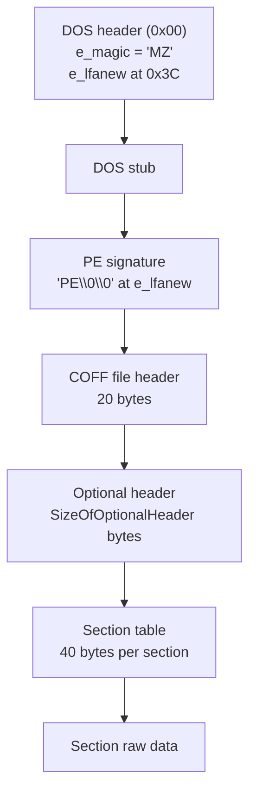
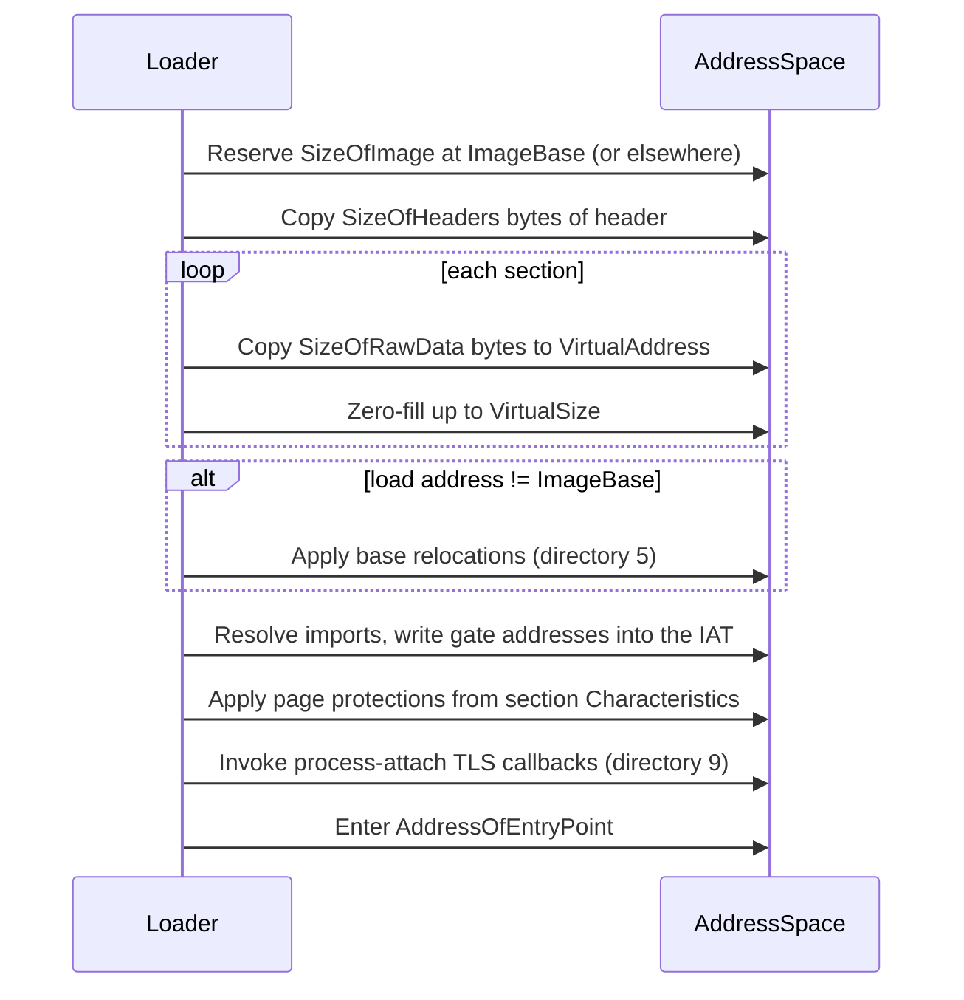

# PE32 실행 형식 / PE32 Executable Format

원본 EZ2DJ 실행 파일은 Windows용 32비트 PE 이미지다. 이 문서는 로더가 다뤄야 할 PE32 구조를 정리한다. 프로젝트 고유 관찰이 아니라 형식 자체의 배경 지식이다.

*The original EZ2DJ executable is a 32-bit PE image for Windows. This document records the PE32 structures the loader must handle. It is background on the format itself, not a project-specific observation.*

출처: [PE Format — Microsoft Learn](https://learn.microsoft.com/windows/win32/debug/pe-format)

---

## 1. 헤더 배치 / Header layout

`e_lfanew`는 파일 오프셋이므로 그대로 신뢰하지 말고 파일 크기와 대조해야 한다. 잘못된 값이 들어 있으면 헤더 밖을 읽게 된다.

*`e_lfanew` is a file offset, so it must be checked against the file size rather than trusted; a bad value reads outside the header.*

---

## 2. COFF 파일 헤더 / COFF file header

| 오프셋 | 크기 | 필드 | 비고 |
| --- | --- | --- | --- |
| 0 | 2 | `Machine` | i386은 `0x014C` |
| 2 | 2 | `NumberOfSections` | 섹션 테이블 항목 수 |
| 4 | 4 | `TimeDateStamp` | 빌드 시각 |
| 8 | 4 | `PointerToSymbolTable` | 보통 0 |
| 12 | 4 | `NumberOfSymbols` | 보통 0 |
| 16 | 2 | `SizeOfOptionalHeader` | 0이면 오브젝트 파일 |
| 18 | 2 | `Characteristics` | `IMAGE_FILE_DLL`은 `0x2000` |

---

## 3. Optional header

PE32(`0x10B`)와 PE32+(`0x20B`)는 **`BaseOfCode`까지 같고 그 뒤가 갈린다.** PE32+는 `ImageBase`를 8바이트로 넓히면서 `BaseOfData`를 없앤다. 이 한 필드 때문에 이후 모든 오프셋이 4바이트씩 어긋난다.

*PE32 (`0x10B`) and PE32+ (`0x20B`) **agree through `BaseOfCode` and diverge after it.** PE32+ widens `ImageBase` to eight bytes and drops `BaseOfData`, and that one field shifts every later offset by four.*

| 필드 | PE32 오프셋 | PE32+ 오프셋 |
| --- | --- | --- |
| `Magic` | 0 | 0 |
| `AddressOfEntryPoint` | 16 | 16 |
| `BaseOfCode` | 20 | 20 |
| `BaseOfData` | 24 | _(없음)_ |
| `ImageBase` | 28 (4바이트) | 24 (8바이트) |
| `SectionAlignment` | 32 | 32 |
| `FileAlignment` | 36 | 36 |
| `MajorSubsystemVersion` | 48 | 48 |
| `SizeOfImage` | 56 | 56 |
| `SizeOfHeaders` | 60 | 60 |
| `Subsystem` | 68 | 68 |
| `DllCharacteristics` | 70 | 70 |
| `NumberOfRvaAndSizes` | 92 | 108 |
| `DataDirectory[0]` | 96 | 112 |

따라서 데이터 디렉터리를 뺀 최소 크기는 PE32가 96바이트, PE32+가 112바이트다.

*The minimum size excluding data directories is therefore 96 bytes for PE32 and 112 for PE32+.*

`NumberOfRvaAndSizes`는 보통 16이지만 **파일이 주장하는 값일 뿐**이므로, 실제로 읽을 항목 수는 `SizeOfOptionalHeader`가 허용하는 범위로 잘라야 한다.

*`NumberOfRvaAndSizes` is usually 16 but is **only what the file claims**, so the number actually read must be clamped to what `SizeOfOptionalHeader` allows.*

---

## 4. 데이터 디렉터리 / Data directories

| 색인 | 이름 | 로더에서의 역할 |
| --- | --- | --- |
| 0 | Export | 실행 파일에는 보통 없음 |
| 1 | **Import** | HLE 경계를 정하는 항목. 어떤 API를 구현해야 하는지가 여기서 나온다 |
| 2 | Resource | 아이콘, 문자열, 대화 상자 |
| 5 | **Base relocation** | `ImageBase`와 다른 주소에 놓을 때 필요 |
| 9 | **TLS** | 스레드 지역 저장소 초기화와 콜백 |
| 12 | IAT | import 주소 테이블의 위치와 크기 |
| 13 | Delay import | 첫 호출 시점에 해석되는 import |

각 항목은 `{VirtualAddress(RVA), Size}` 8바이트다.

*Each entry is eight bytes: `{VirtualAddress (RVA), Size}`.*

---

## 5. 섹션 테이블 / Section table

항목 하나는 40바이트다.

| 오프셋 | 크기 | 필드 |
| --- | --- | --- |
| 0 | 8 | `Name` — NUL로 **패딩**되며 8바이트를 다 쓰면 종료 문자가 없다 |
| 8 | 4 | `VirtualSize` |
| 12 | 4 | `VirtualAddress` (RVA) |
| 16 | 4 | `SizeOfRawData` |
| 20 | 4 | `PointerToRawData` (파일 오프셋) |
| 36 | 4 | `Characteristics` |

`VirtualSize`가 `SizeOfRawData`보다 크면 그 차이만큼은 0으로 채운다. `.bss` 성격의 영역이 이렇게 표현된다. 반대로 `SizeOfRawData`가 더 큰 경우도 있는데, 이는 `FileAlignment` 정렬 패딩이므로 `VirtualSize`까지만 쓴다.

*When `VirtualSize` exceeds `SizeOfRawData`, the difference is zero-filled — that is how `.bss`-like regions are expressed. The reverse also happens, as `FileAlignment` padding, and then only `VirtualSize` bytes are used.*

---

## 6. 적재 절차 / Loading sequence

기준 재배치 블록은 `{PageRVA, BlockSize}` 헤더 뒤에 16비트 항목이 이어지는 구조다. 항목의 상위 4비트가 유형이고 하위 12비트가 페이지 내 오프셋이다. 32비트 이미지에서 실제로 쓰이는 유형은 `IMAGE_REL_BASED_HIGHLOW`(3)와 패딩용 `ABSOLUTE`(0)다.

*A base relocation block is a `{PageRVA, BlockSize}` header followed by 16-bit entries whose top four bits are the type and whose low twelve are the offset within the page. In 32-bit images the types that actually appear are `IMAGE_REL_BASED_HIGHLOW` (3) and the padding `ABSOLUTE` (0).*

PE32 TLS directory의 주소 필드와 callback 배열 항목은 RVA가 아니라 VA다. image가 재배치되면 relocation directory가 이 값도 보정해야 한다. process 시작에서는 import가 해석된 뒤 entry point보다 먼저 null-terminated callback 배열을 순서대로 호출한다. callback 인자는 module base, `DLL_PROCESS_ATTACH`, reserved null이다. callback 실행과 별개로 완전한 TLS 지원에는 raw template, loader가 쓰는 TLS index와 thread별 block이 필요하다.

*PE32 TLS directory address fields and callback-array entries are VAs rather than RVAs, so the relocation directory must adjust them when the image is rebased. During process startup, the loader calls the null-terminated callback array in order after import resolution and before the entry point, passing module base, `DLL_PROCESS_ATTACH`, and null reserved data. Full TLS support additionally requires the raw template, loader-written TLS index, and per-thread blocks.*

---

## 7. import 해석 / Import resolution

import 디렉터리는 `IMAGE_IMPORT_DESCRIPTOR` 배열이고 전부 0인 항목으로 끝난다. 각 항목은 DLL 이름과 두 개의 thunk 배열을 가리킨다.

* **OriginalFirstThunk (ILT)** — 무엇을 import하는지. 원본 그대로 남는다.
* **FirstThunk (IAT)** — 로더가 실제 주소를 써 넣는 곳.

thunk 값의 최상위 비트가 1이면 하위 16비트가 **ordinal**이고, 0이면 그 값이 `{Hint, Name}` 구조를 가리키는 RVA다.

*The import directory is an array of `IMAGE_IMPORT_DESCRIPTOR` terminated by an all-zero entry. Each names a DLL and points at two thunk arrays: the ILT records what is imported and stays intact, while the loader writes real addresses into the IAT. A thunk with its top bit set carries an **ordinal** in its low 16 bits; otherwise the value is an RVA to a `{Hint, Name}` structure.*

re2DJ는 실제 DLL을 적재하지 않는다. 대신 각 import에 합성 gate 주소를 배정해 IAT에 써 넣고, 실행 backend가 그 주소로의 제어 이동을 HLE dispatcher로 돌린다. 이것이 프로젝트의 HLE 경계다.

*re2DJ loads no real DLL. It assigns each import a synthetic gate address, writes that into the IAT, and has the execution backend route a transfer to that address into the HLE dispatcher. That is the project's HLE boundary.*
