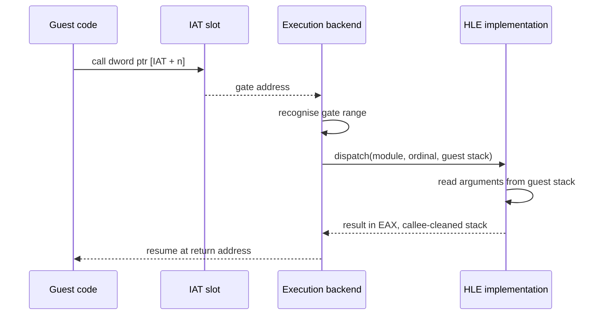

# Win32 HLE 경계 / Win32 HLE Boundary

이 문서는 Win32 API를 HLE 경계로 삼을 때 필요한 배경 지식을 정리한다. 어떤 API를 실제로 구현할지는 원본 실행 파일의 import 목록이 정하며, 그 결과는 [`docs/analysis/`](../analysis/README.md)에 기록한다.

*This document records the background needed to treat the Win32 API as an HLE boundary. Which APIs actually get implemented is decided by the original executable's import list, and that result is recorded in [`docs/analysis/`](../analysis/README.md).*

---

## 1. 왜 import thunk가 경계인가 / Why the import thunk is the boundary

게스트가 운영체제와 만나는 지점은 명령어가 아니라 **함수 호출**이다. `INT 21h` 같은 DOS 인터럽트를 다루던 rePIU와 달리, Win32 프로그램은 DLL의 export 함수를 호출한다. 로더가 IAT에 무엇을 써 넣을지 정하므로, 경계를 IAT에 두면 다음이 따라온다.

* 게스트 코드를 한 바이트도 고치지 않는다.
* 어떤 API가 필요한지 로더 단계에서 **목록으로** 확정된다.
* 미구현 API도 gate를 갖고, 호출되는 순간 이름과 함께 기록된다. 필요한 것만 구현하면 된다.
* 명령어 단위 트랩이 필요 없으므로 세 호스트에서 같은 방식으로 동작한다.

*A Win32 program meets the operating system at a **function call**, not at an instruction. Because the loader decides what goes into the IAT, putting the boundary there means guest code is never modified, the required API set is fixed as a list at load time, unimplemented entries still get a gate and log their name when called, and no instruction-level trap is needed — so all three hosts behave identically.*

---

## 2. 호출 규약 / Calling conventions

32비트 Windows API는 거의 전부 `__stdcall`이다. HLE 구현이 스택을 잘못 정리하면 게스트 스택이 어긋나 훨씬 뒤에서 엉뚱하게 죽으므로, 항목마다 규약과 인자 개수를 테이블에 명시해야 한다.

*Nearly every 32-bit Windows API is `__stdcall`. If an HLE implementation cleans the stack wrongly the guest stack drifts and the crash surfaces much later somewhere else, so each table entry must state its convention and argument count.*

| 규약 | 인자 전달 | 스택 정리 | 비고 |
| --- | --- | --- | --- |
| `__stdcall` | 스택, 오른쪽에서 왼쪽 | **피호출자** (`ret n`) | Win32 API 기본값 |
| `__cdecl` | 스택, 오른쪽에서 왼쪽 | 호출자 | C 런타임 함수 |
| `__thiscall` | 스택 + `ECX`에 `this` | 피호출자 | MSVC 멤버 함수 |
| `__fastcall` | `ECX`, `EDX` + 스택 | 피호출자 | 드물게 사용 |

반환값은 32비트가 `EAX`, 64비트가 `EDX:EAX`, 부동소수점이 x87 스택 최상단(`ST0`)이다.

*Return values arrive in `EAX` for 32 bits, `EDX:EAX` for 64, and the top of the x87 stack (`ST0`) for floating point.*

COM 인터페이스(DirectDraw, Direct3D, DirectSound 등)는 vtable 기반이며 메서드는 `__stdcall`이고 첫 인자가 인터페이스 포인터다. 따라서 COM 객체를 HLE로 제공하려면 **게스트 메모리 안에 vtable을 만들어** 각 슬롯에 gate 주소를 채워야 한다. import 함수 하나를 바꿔 끼우는 것보다 한 단계 더 들어간다.

*COM interfaces — DirectDraw, Direct3D, DirectSound — are vtable-based, their methods are `__stdcall`, and the first argument is the interface pointer. Providing a COM object through HLE therefore means **building a vtable inside guest memory** and filling each slot with a gate address, which is one step deeper than swapping a single imported function.*

---

## 3. 모듈 테이블 형태 / Module table shape

한 모듈은 다음 항목의 테이블이다.

| 필드 | 용도 |
| --- | --- |
| `name` | import 이름 대조용 |
| `ordinal` | ordinal import 대조용. 없으면 0 |
| `argument_bytes` | `__stdcall` 스택 정리량 |
| `convention` | 위 표의 규약 |
| `implementation` | 구현 함수. `nullptr`이면 미구현 |

미구현 항목을 테이블에서 빼지 않고 `implementation == nullptr`로 남기는 이유는, 호출되는 순간 **어떤 API가 왜 필요한지** 이름과 호출 지점이 함께 기록되기 때문이다. 테이블에 없으면 그냥 알 수 없는 주소로의 점프가 된다.

*Unimplemented entries stay in the table with `implementation == nullptr` rather than being omitted, because then a call records **which API was needed and from where**. An absent entry would instead become a jump to an unknown address.*

---

## 4. 문자열과 코드 페이지 / Strings and code pages

원본은 한국어 Windows에서 동작했다. ANSI(`...A`) API에 넘어오는 문자열은 유니코드가 아니라 **CP949(EUC-KR 확장)** 바이트열일 가능성이 높다. 미확정이며 실행 중 관찰로 확인한다.

파일 이름 대조에서 0x80 이상 바이트를 대소문자 변환하면 서로 다른 한글 음절이 같은 것으로 취급될 수 있다. 그래서 `re2dj::storage::EqualsIgnoreAsciiCase`는 ASCII 범위만 접고 나머지는 바이트 그대로 비교한다.

*The original ran on Korean Windows, so strings reaching ANSI (`...A`) APIs are likely **CP949** byte sequences rather than Unicode. That is unresolved and will be confirmed by observation during a run. Folding bytes at or above 0x80 while comparing file names could make two different Hangul syllables compare equal, which is why `re2dj::storage::EqualsIgnoreAsciiCase` folds only the ASCII range and compares the rest byte-for-byte.*

---

## 5. Wine을 코드로 쓰지 않는 이유 / Why Wine is not used as code

Wine은 같은 문제를 해결한 성숙한 구현이지만 **LGPL**이다. 프로젝트 라이선스 정책이 전염성 라이선스를 배제하므로 코드 재사용 대상이 아니다. 공개 문서와 API 동작 설명은 참고 자료로 인용할 수 있다.

*Wine is a mature implementation of the same problem but is **LGPL**, and the project license policy excludes copyleft licenses, so it is not a code-reuse source. Its public documentation and API behavior notes may still be cited as reference.*

출처 / Sources:

* [Calling conventions — Microsoft Learn](https://learn.microsoft.com/cpp/cpp/calling-conventions)
* [`__stdcall` — Microsoft Learn](https://learn.microsoft.com/cpp/cpp/stdcall)
* [Component Object Model — Microsoft Learn](https://learn.microsoft.com/windows/win32/com/component-object-model--com--portal)
