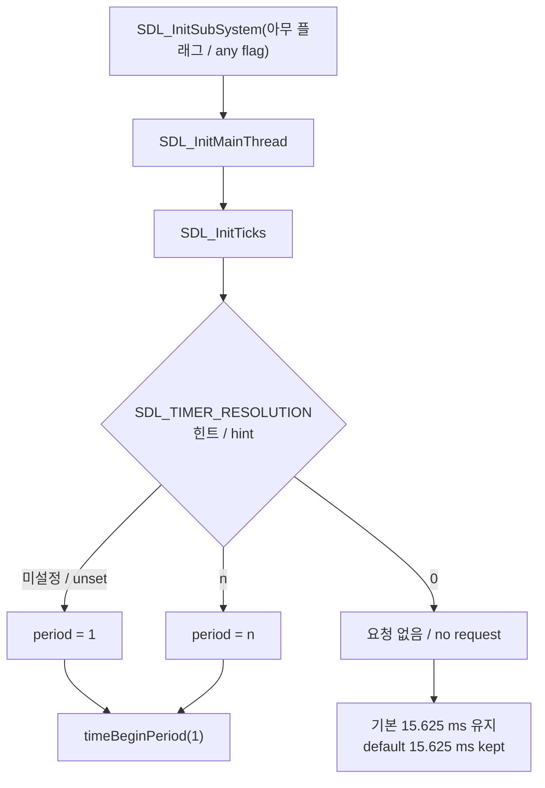

# Windows 타이머 해상도와 `Sleep`·`timeGetTime` / Windows timer resolution and `Sleep` / `timeGetTime`

## 한국어

### 요약

Windows에서 `Sleep`이 실제로 자는 시간은 요청값이 아니라 **시스템 타이머 틱**이 결정한다. Windows 9x와 NT 계열의 기본 틱이 다르기 때문에, 9x용으로 작성된 코드가 NT 계열에서 같은 속도로 돌지 않는다.

| 계열 | 기본 타이머 해상도 |
| --- | --- |
| Windows 9x | 약 1 ms |
| Windows NT 계열 (2000/XP/7/10/11) | 시스템 타이머 틱. 일반적으로 **15.625 ms** |

`Sleep(n)`은 최소 `n` ms를 보장할 뿐 정확히 `n` ms를 보장하지 않는다. 대기는 다음 타이머 틱 경계에서 끝나므로, 15.625 ms 해상도에서 `Sleep(15)`는 15.6 ms에서 31.25 ms 사이가 된다.

* [`Sleep` function](https://learn.microsoft.com/en-us/windows/win32/api/synchapi/nf-synchapi-sleep)
* [`timeBeginPeriod` function](https://learn.microsoft.com/en-us/windows/win32/api/timeapi/nf-timeapi-timebeginperiod)

### `timeGetTime`의 해상도

`timeGetTime`은 시스템 시작 이후 경과 시간을 ms로 돌려준다. 기본 해상도는 5 ms 이상일 수 있으며, `timeBeginPeriod`로 올릴 수 있다. `timeBeginPeriod`는 `timeGetTime`의 해상도와 `Sleep`·대기 함수·주기 타이머의 해상도를 **함께** 바꾼다.

* [`timeGetTime` function](https://learn.microsoft.com/en-us/windows/win32/api/timeapi/nf-timeapi-timegettime)

### 해상도를 올리는 주체

해상도는 프로세스가 **명시적으로 요청**해야 올라간다.

| API | 성격 |
| --- | --- |
| `timeBeginPeriod` / `timeEndPeriod` | 문서화된 winmm API. 요청과 해제가 짝을 이룬다 |
| `NtSetTimerResolution` | ntdll의 비문서 API. 같은 일을 100 ns 단위로 한다 |
| `NtQueryTimerResolution` | ntdll의 비문서 API. **시스템 전역** 현재 해상도를 100 ns 단위로 읽는다 |

`NtQueryTimerResolution`의 인자 이름은 직관과 반대다.

| 인자 | 의미 | 일반적인 값 |
| --- | --- | --- |
| `MinimumResolution` | 가장 **거친** 간격 | 156250 (15.625 ms) |
| `MaximumResolution` | 가장 **고운** 간격 | 5000 (0.5 ms) |
| `CurrentResolution` | 현재 시스템 전역 해상도 | 그 사이의 값 |

### Windows 10 2004의 규칙 변경 — 확인됨 (2026-09-15, 로컬 측정)

Windows 10 버전 2004부터 `timeBeginPeriod`의 효과는 **호출한 프로세스에만** 적용된다. 그 전에는 시스템 전역이었다.

이 변경에는 진단상 중요한 결과가 따른다.

> **`NtQueryTimerResolution`만으로는 "이 프로세스가 어떤 해상도를 받는가"에 답할 수 없다.**

이 API는 시스템 전역 값을 돌려주므로, 다른 프로세스 하나가 1 ms를 요청해 두면 아무것도 요청하지 않은 프로세스에서도 1 ms로 읽힌다. 그러나 그 프로세스의 `Sleep`은 여전히 15.625 ms 단위로 동작한다.

Windows 11 Pro 26200에서 측정한 결과다. 시스템 전역 값은 세 경우 모두 1.0 ms로 읽혔다.

| 프로세스 | 요청 | `Sleep(15)` p50 | `Sleep(1)` p50 |
| --- | --- | --- | --- |
| 아무것도 요청하지 않음 | 없음 | 29.96 ms | 15.01 ms |
| `PROCESS_POWER_THROTTLING_IGNORE_TIMER_RESOLUTION` 적용 | 명시적 거부 | 29.99 ms | 15.04 ms |
| `timeBeginPeriod(1)` 상당을 받은 프로세스 | 있음 | 약 16 ms | — |

따라서 프로세스의 실효 해상도를 알려면 **`Sleep` 자체를 재야 한다.** 전역 값 읽기는 보조 증거일 뿐이다.

* [Windows 10 2004의 timeBeginPeriod 동작 변경](https://learn.microsoft.com/en-us/windows/win32/api/timeapi/nf-timeapi-timebeginperiod) — Remarks의 "Starting with Windows 10, version 2004" 문단
* [`PROCESS_POWER_THROTTLING_STATE`](https://learn.microsoft.com/en-us/windows/win32/api/processthreadsapi/ns-processthreadsapi-process_power_throttling_state) — `PROCESS_POWER_THROTTLING_IGNORE_TIMER_RESOLUTION`

### `timeGetTime`과 `Sleep`은 함께 움직이지 않는다 — 확인됨 (2026-09-16, 로컬 측정)

`timeBeginPeriod` 문서는 한 번의 호출이 `timeGetTime`과 `Sleep`의 해상도를 함께 바꾼다고 적는다. 그러나 Windows 10 2004 이후의 프로세스 단위 규칙과 겹치면 두 값이 갈라진다.

해상도를 요청하지 않은 프로세스 하나에서 두 값을 측정했다. 전역 값은 무관한 다른 프로세스가 1 ms로 유지하고 있었다.

| 측정 | 값 |
| --- | --- |
| `timeGetTime` 관측 step | **1 ms** (200 표본 중 197) |
| 같은 프로세스의 `Sleep(15)` p50 | **25.87 ms** |

**같은 프로세스 안에서 시계는 고해상도, 수면은 기본 해상도다.** 추정되는 이유는 `timeGetTime`이 전역 틱 카운터를 읽는 반면 프로세스 단위 규칙은 **타이머 만료**(`Sleep`과 대기 함수)에만 적용되기 때문이다.

실무상 결론은 두 가지다.

* `Sleep` 정밀도를 잃었다고 해서 `timeGetTime` 정밀도까지 잃은 것은 아니다. 둘을 따로 확인해야 한다.
* 반대로 `timeGetTime`의 고해상도는 **전역 틱**에 의존하므로, 자기 프로세스가 아니라 머신 전체 상태에 좌우된다. 자기 코드로 `timeBeginPeriod`를 부르면 두 값을 모두 자기 통제 아래로 가져온다.

### SDL3의 기본 동작 — 확인됨 (2026-09-15, SDL3 소스)

SDL3는 초기화 시 **아무 서브시스템이든** 하나만 켜도 1 ms 해상도를 요청한다.

`SDL_InitSubSystem` → `SDL_InitMainThread` → `SDL_InitTicks`가 `SDL_HINT_TIMER_RESOLUTION` 힌트 콜백을 등록하고, 힌트가 비어 있으면 기본 period 1로 `timeBeginPeriod(1)`을 부른다. `src/timer/SDL_timer.c`의 해당 주석은 이렇게 적혀 있다.

> Unless the hint says otherwise, let's have good sleep precision

힌트 이름은 `SDL_TIMER_RESOLUTION`이며 같은 이름의 환경 변수로 지정할 수 있다. `0`을 주면 SDL은 해상도를 요청하지 않는다. `SDL_QuitTicks`는 종료 시 요청을 해제한다.

따라서 **SDL을 정적 링크한 프로그램은 코드에 `timeBeginPeriod`가 한 줄도 없어도 1 ms 해상도에서 돈다.** 그 프로그램이 sleep 기반 프레임 리미터를 쓴다면, 프레임률이 SDL의 기본 힌트에 의존하게 된다.

### 실무상 함의

* sleep 기반 프레임 리미터를 가진 9x 시대 프로그램을 NT 계열에서 돌리면, **누가 해상도를 올려 주는가**가 프레임률을 결정한다.
* 그 공급자가 라이브러리의 기본값이면 의존은 암묵적이다. 라이브러리 구성이 바뀌면 프레임률이 조용히 떨어진다.
* 의존을 명시하려면 힌트나 `timeBeginPeriod`를 직접 호출해 요청 주체를 자기 코드로 옮긴다.

## English

### Summary

On Windows, what `Sleep` actually waits is decided by the **system timer tick**, not by the requested value. The 9x and NT families default to different ticks, so code written for 9x does not run at the same rate on the NT family.

| Family | Default timer resolution |
| --- | --- |
| Windows 9x | About 1 ms |
| Windows NT family (2000/XP/7/10/11) | The system timer tick, typically **15.625 ms** |

`Sleep(n)` guarantees at least `n` ms, never exactly `n`. The wait ends on the next timer tick boundary, so at 15.625 ms resolution `Sleep(15)` lands anywhere between 15.6 ms and 31.25 ms.

* [`Sleep` function](https://learn.microsoft.com/en-us/windows/win32/api/synchapi/nf-synchapi-sleep)
* [`timeBeginPeriod` function](https://learn.microsoft.com/en-us/windows/win32/api/timeapi/nf-timeapi-timebeginperiod)

### `timeGetTime` resolution

`timeGetTime` returns milliseconds since system start. Its default resolution can be 5 ms or coarser, and `timeBeginPeriod` raises it. That one call changes the resolution of `timeGetTime` **and** of `Sleep`, the wait functions, and periodic timers together.

* [`timeGetTime` function](https://learn.microsoft.com/en-us/windows/win32/api/timeapi/nf-timeapi-timegettime)

### Who raises the resolution

The resolution rises only when a process **explicitly asks**.

| API | Nature |
| --- | --- |
| `timeBeginPeriod` / `timeEndPeriod` | Documented winmm API; request and release are paired |
| `NtSetTimerResolution` | Undocumented ntdll API doing the same in 100 ns units |
| `NtQueryTimerResolution` | Undocumented ntdll API reading the **system-wide** current resolution in 100 ns units |

Its parameter names run counter to intuition.

| Parameter | Meaning | Typical value |
| --- | --- | --- |
| `MinimumResolution` | The **coarsest** interval | 156250 (15.625 ms) |
| `MaximumResolution` | The **finest** interval | 5000 (0.5 ms) |
| `CurrentResolution` | The current system-wide resolution | Somewhere between |

### The Windows 10 2004 rule change — confirmed (2026-09-15, measured locally)

Since Windows 10 version 2004, a `timeBeginPeriod` request applies **only to the calling process**. Before that it was system-wide.

The change has a consequence that matters for diagnostics.

> **`NtQueryTimerResolution` alone cannot answer "what resolution does this process get?"**

It returns the system-wide value, so one other process holding 1 ms makes it read 1 ms inside a process that asked for nothing — while that process's `Sleep` still moves in 15.625 ms steps.

Measured on Windows 11 Pro 26200. The system-wide value read 1.0 ms in all three cases.

| Process | Request | `Sleep(15)` p50 | `Sleep(1)` p50 |
| --- | --- | --- | --- |
| Asks for nothing | None | 29.96 ms | 15.01 ms |
| `PROCESS_POWER_THROTTLING_IGNORE_TIMER_RESOLUTION` applied | Explicit opt-out | 29.99 ms | 15.04 ms |
| A process that received the equivalent of `timeBeginPeriod(1)` | Yes | About 16 ms | — |

So the effective resolution of a process is found by **measuring `Sleep` itself**. Reading the global value is corroboration only.

* [timeBeginPeriod behavior change in Windows 10 2004](https://learn.microsoft.com/en-us/windows/win32/api/timeapi/nf-timeapi-timebeginperiod) — the "Starting with Windows 10, version 2004" paragraph under Remarks
* [`PROCESS_POWER_THROTTLING_STATE`](https://learn.microsoft.com/en-us/windows/win32/api/processthreadsapi/ns-processthreadsapi-process_power_throttling_state) — `PROCESS_POWER_THROTTLING_IGNORE_TIMER_RESOLUTION`

### `timeGetTime` and `Sleep` do not move together — confirmed (2026-09-16, measured locally)

The `timeBeginPeriod` documentation says one call changes the resolution of `timeGetTime` and `Sleep` together. Combined with the post-2004 per-process rule, the two come apart.

Both were measured inside one process that requested no resolution, while an unrelated process held the global value at 1 ms.

| Measurement | Value |
| --- | --- |
| `timeGetTime` observed step | **1 ms** (197 of 200 samples) |
| `Sleep(15)` p50 in the same process | **25.87 ms** |

**Within one process the clock is fine-grained while sleeps run at the default resolution.** The inferred reason is that `timeGetTime` reads the global tick counter, while the per-process rule governs only **timer expiry** — `Sleep` and the wait functions.

Two practical conclusions follow.

* Losing `Sleep` precision does not mean losing `timeGetTime` precision. Check them separately.
* Conversely, a fine `timeGetTime` depends on the **global tick**, so it is a property of the machine rather than of your process. Calling `timeBeginPeriod` from your own code brings both under your control.

### SDL3's default behavior — confirmed (2026-09-15, from SDL3 sources)

SDL3 requests 1 ms resolution when **any** subsystem initializes.

`SDL_InitSubSystem` → `SDL_InitMainThread` → `SDL_InitTicks` registers the `SDL_HINT_TIMER_RESOLUTION` callback, and with the hint unset it calls `timeBeginPeriod(1)` at a default period of 1. The comment in `src/timer/SDL_timer.c` says so directly.

> Unless the hint says otherwise, let's have good sleep precision

The hint is named `SDL_TIMER_RESOLUTION` and can be supplied as an environment variable of the same name; `0` makes SDL request nothing. `SDL_QuitTicks` releases the request on shutdown.

So **a program that links SDL statically runs at 1 ms resolution without a single `timeBeginPeriod` in its own code.** If that program uses a sleep-based frame limiter, its frame rate depends on SDL's default hint.

### Practical implications

* Running a 9x-era program with a sleep-based frame limiter on the NT family makes **who supplies the resolution** decide the frame rate.
* When the supplier is a library default, the dependency is implicit, and the frame rate drops quietly when that library's configuration changes.
* To make the dependency explicit, set the hint or call `timeBeginPeriod` directly, moving the request into your own code.
