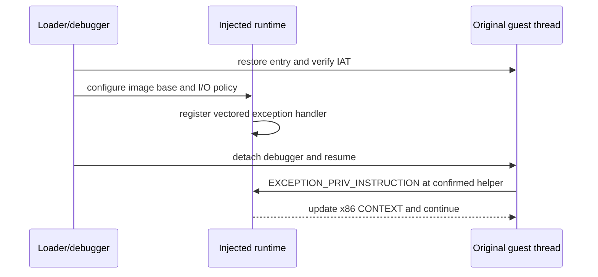

# Windows vectored exception과 debugger 분리

Windows vectored exception handler는 stack frame과 무관하게 process exception을 관찰하거나 처리한다. 다만 debugger가 붙어 있으면 debugger의 first-chance notification이 vectored handler보다 먼저다. 따라서 privileged x86 `IN`/`OUT`을 handler에서 처리하더라도 debugger를 계속 붙여 두면 매 명령의 process 간 왕복 비용은 없어지지 않는다.

실제 실행 경로는 다음 순서를 사용할 수 있다.

handler는 exception code만 보고 모든 명령을 받아들이면 안 된다. image identity/base, 확인된 helper RVA, opcode, port와 operand width를 모두 검증하고 일치하지 않는 exception은 `EXCEPTION_CONTINUE_SEARCH`로 넘겨야 한다. debugger를 끝낼 때 debuggee까지 종료하지 않으려면 kill-on-exit 정책과 detach 결과도 확인해야 한다.

근거: [Vectored Exception Handling](https://learn.microsoft.com/en-us/windows/win32/debug/vectored-exception-handling), [DebugActiveProcess](https://learn.microsoft.com/en-us/windows/win32/api/debugapi/nf-debugapi-debugactiveprocess)

---

# Windows Vectored Exceptions and Debugger Detachment

A Windows vectored exception handler can inspect or handle process exceptions independently of stack frames. A debugger, however, receives the first-chance notification before vectored handlers. Keeping the debugger attached therefore preserves a cross-process round trip for every privileged x86 `IN`/`OUT`, even if an in-process handler could handle it afterward.

A runtime path can restore and verify the guest under the debugger, configure a narrowly scoped injected handler, detach the debugger, and resume the original thread. The handler must validate image base, confirmed helper RVA, opcode, port, and operand width, returning `EXCEPTION_CONTINUE_SEARCH` for everything outside that contract. The debugger must also configure kill-on-exit and verify detachment so its own exit does not terminate the guest.

Sources: [Vectored Exception Handling](https://learn.microsoft.com/en-us/windows/win32/debug/vectored-exception-handling), [DebugActiveProcess](https://learn.microsoft.com/en-us/windows/win32/api/debugapi/nf-debugapi-debugactiveprocess)
